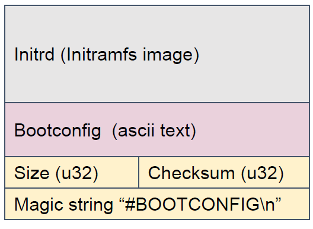

## Bootconfig文件

Linux在启动过程中可以通过cmdline设置内核参数。cmdline来自于U-BOOT传递给内核启动程序的tag结构体，为一字符串，包含多种选项，如console、video等。其中具有“=”的变量用于设置init()进程的环境变量，而没有“=”的变量为传递给init()进程的命令行变量，跟随“--"的变量为传递给init()进程的变量。

如果cmdline中包含字符串“bootconfig“，则表示Linux系统通过bootconfig文件提供了额外的内核参数。bootconfig文件附着在initrd的后面（见下图）

<center>
<figure>

<figcaption><p>图 9‑1 bootconfig文件的存储位置</p></figcaption>
</figure>
</center>

bootconfig为ascii文件，紧随initrd。bootconfig文件之后为该文件的字节数，然后为校验码字节数和校验码，分别占用4个字节，最后为用于标志bootconfig文件的魔术字符串“#BOOTCONFIG\n”，占12个字节。

bootconfig文件的每一项内容的格式为：KEY\[.WORD\[...\]\] = VALUE\[,
VALUE2\[...\]\]\[;\]，其中关键字（KEY）为要配置的变量，如video、console等。WORD又称作子关键字（subkey），用以对关键字进一步细分。关键字只能由字母、数字、“-”或“\_”构成。关键字变量的取值（VALUE）只能由不包含“,”、“;”、换行符、“#”及“}”等分隔符的可打印字符或空格符组成。如果想在变量的取值中包含这些分隔符，必须以””或’’把分隔符包围。在书写时，可以把子关键字相同的部分合并，如变量foo.bar.baz和变量foo.bar.qux.quux既可以表示为：

```
foo.bar.baz = value1

foo.bar.qux.quux = value2
```

也可以合并为表示为：

```
foo.bar {

baz = value1

qux.quux = value2

}
```

或：

```
foo.bar { baz = value1; qux.quux = value2 }
```

这里，foo为bar的parent
key（父关键字），而bar为foo的subkey（子关键字）。同样，fool.bar为baz和qux.quux的subkey。

Bootconfig文件的语法规定，不能够给同一个关键字重复赋值。同时，一个关键字不能同时具有值和subkey。下面两种情况：

```
foo = bar, baz

foo = qux
```

或

```
foo = value1

foo.bar = value2
```

是不允许的。

第一种情况为变量foo重复赋值，第二种情况为foo同时具有值value1和subkey
bar。

Bootconfig文件允许通过“+=”符号给变量添加额外的值，如：

```
foo = bar, baz

foo += qux。
```
