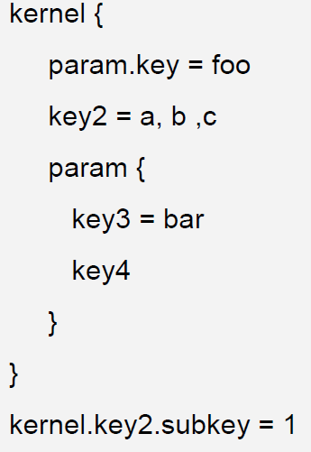
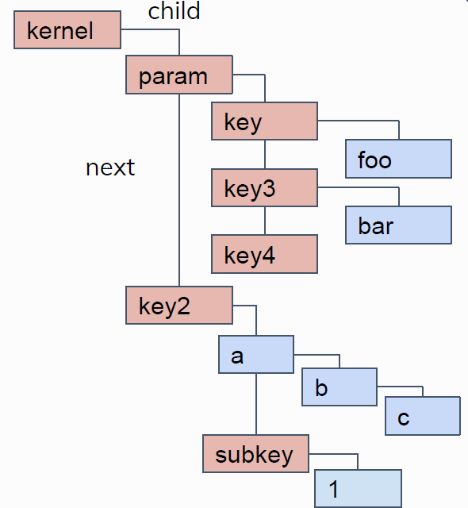

## Bootconfig文件解析

Linux的内核启动进程start_kernel()在完成基于框架的硬件设置后，调用setup_boot_config()函数为配置额外的内核参数进行准备。函数setup_boot_config()定义在文件git/lib/bootconfig.c中，其定义为：

```
static void __init setup_boot_config(const char *cmdline)
{
	static char tmp_cmdline[COMMAND_LINE_SIZE] __initdata;
	const char *msg;
	int pos;
	u32 size, csum;
	char *data, *copy, *err;
	int ret;
	data = get_boot_config_from_initrd(&size, &csum);
	strlcpy(tmp_cmdline, boot_command_line, COMMAND_LINE_SIZE);
	err = parse_args("bootconfig", tmp_cmdline, NULL, 0, 0, 0, NULL, bootconfig_params);	
	if (IS_ERR(err) || !bootconfig_found)
		return;
	if (err)
		initargs_found = true;
	if (!data) {
		pr_err("'bootconfig' found on command line, but no bootconfig found\n");
		return;
	}
	if (size >= XBC_DATA_MAX) {
		pr_err("bootconfig size %d greater than max size %d\n", size, XBC_DATA_MAX);
		return;
	}
	if (boot_config_checksum((unsigned char *)data, size) != csum) {
		pr_err("bootconfig checksum failed\n");
		return;
	}
	copy = memblock_alloc(size + 1, SMP_CACHE_BYTES);
	if (!copy) {
		pr_err("Failed to allocate memory for bootconfig\n");
		return;
	}
	memcpy(copy, data, size);
	copy[size] = '\0';
	ret = xbc_init(copy, &msg, &pos);
	if (ret < 0) {
		if (pos < 0)
			pr_err("Failed to init bootconfig: %s.\n", msg);
		else
			pr_err("Failed to parse bootconfig: %s at %d.\n",
				msg, pos);
	} else {
		pr_info("Load bootconfig: %d bytes %d nodes\n", size, ret);
		extra_command_line = xbc_make_cmdline("kernel");
		extra_init_args = xbc_make_cmdline("init");
	}
	return;
}
```

start_kernal()传递给该函数的变量为command_line。该函数首先通过函数get_boot_config_from_initrd()获取initrd的末端地址，从内核镜像程序中对应于魔术字符串的位置读取12个字节的内容。如果读取的内容为字符串“#BOOTCONFIG\n”，则表示initrd后面存储的是bootconfig文件，否则，后面存储的不是bootconfig文件。在发现bootconfig文件后，函数get_boot_config_from_initrd()从镜像文件读取校验码及文件大小值，从而确定bootconfig文件的开始位置。如果该位置小于initrd的末端位置，说明bootconfig文件出现问题。如果一切正常，函数get_boot_config_from_initrd()把文件大小和校验码分别存储到变量size和csum，并返回bootconfig文件的起始位置。如果出错，则函数返回空值。

在获取bootconfig文件的起始位置后，把boot_command_line的内容拷贝到tmp_cmdline，并利用函数parse_args遍历tmp_cmdline中字符串的内容。对arm系统而言，boot_command_line保存了来自于U-BOOT
tag结构体的cmdline字段的内容。boot_command_line用于引导期间参数配置，通常为默认的配置参数，在解析tag期间由函数setup_machine_tags()设置。

parse_args通过把函数bootconfig_params()的入口地址传递给parse_one()，运行函数bootconfig_params，从而确定boot_command_line中是否包含字符串“bootconfig”。这里需要指出的是，由于parse_args调用parse_one时，传递的num值为0，parse_one并不执行确定tmp_cmdline包含的参数是否安全的部分代码，而只是执行bootconfig_params部分代码，因此，在parse_args调用parse_one时，parse_one()的作用就是简单地确定是否包含“bootconfig”字符串，以确定是否需要进行额外的参数配置。

当确定需要进行额外的参数配置，而且镜像文件中包含有bootconfig文件后，函数setup_boot_config()通过boot_config_checksum()确定bootconfig文件内容是否无误。

在把bootconfig文件复制一份后，通过函数xbc_init()解析bootconfig文件，并依据文件内容建立一个称之为xbc树的树状结构，用于描述各个变量间的关系。树状结构的节点由key和value组成，由结构体：

```
struct xbc_node {

u16 next;

u16 child;

u16 parent;

u16 data;

} __attribute__ ((__packed__));
```

进行描述。字段next存储下一个节点索引值，child存储其子节点的索引值，parent存储其父节点的索引值，data的低15位存储key或value的索引值，最高位用以区分key和value。当最高位为1时，表明data对应的地址存储的是value，当最高位为0时，表示data对应的地址存储的是key。

在解析bootconfig文件过程中，如果发现文件有语法错误，则把错误信息保存在emsg，发生错误的位置保存在epos。在完成bootconfig文件的语法解析后，调用函数xbc_verify_tree()确定所建立的树状结构没有问题，然后返回0值。

<center>
<figure>


<figcaption><p>图 9‑2 bootconfig文件及相应的树状结构</p></figcaption>
</figure>
</center>

对于图 9-2左边所示的bootconfig文件，xdb_init()生成图右边所示的树状结构。

在解析bootconfig文件时，xdb_init()程序首先查找“{”、“}”、“=”、“=+”、“;”“:+”、“\n”和“#”等具有特殊意义的符号，以确定变量的书写格式。如果找到符号“=”、“=+”或“:+”，说明变量书写格式为给变量赋值的格式，即符号左边为变量名，右边为变量取值，需调用函数xbc_parse_kv()解析key-value对。如果找到的符号为“#”，说明该部分为注释，这时要忽略始于#到行尾的所有字符。如果找到的符号为“;”或“\n”，后面跟随的必然是key，这时调用xbc_parse_key()解析key。如果找到的字符为“{”或“}”，说明key相同部分的项包含在“{”与“}”之间，此时需调用xbc_open_brace()和xbc_close_brace()解析其间的内容。

由于key可以包含由“.”分隔的subkey，xbs_parse_kv()、xbc_parse_key()及xbc_open_brace()均调用\_\_xbc_parse_keys()函数，依次查找符号“.”，以确定各个subkey。在找到包括key本身的各个subkey或确定value后，\_\_xbc_parse_keys()调用\_\_xbc_add_key()函数。如果在当前的变量树结构中没有包含该key或value，则把该key或value作为其上一级key的子节点。如果已经在xbc树上，则不会再把它们添加到xbc树上，只是记录该key或value的上一级节点。

在建立参数的树状结构后，setup_boot_config()通过调用函数xbc_make_cmdline()遍历xbc树，查找bootconfig文件是否包含“kernel”和“init”key。如果包含“kernel”，则把“kernel：”及相应的变量值值赋给全局变量extra_command_line。如果kernel有subkey，则也要把“kernel.subkey1…subkey*n*:”及其变量值赋给extra_command_line。同样，把“init：”及其值赋给extra_init_args，供内核及init()进程使用。

