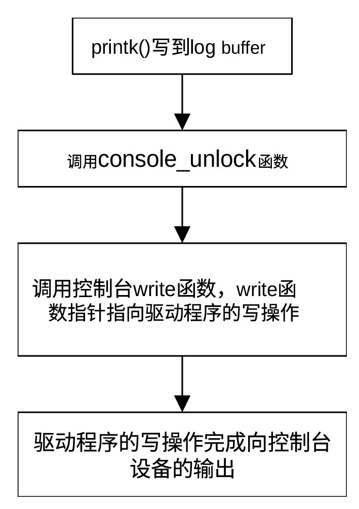

## Linux控制台

在 Linux 内核中，控制台（console）是内核与外界沟通的第一道窗口。不同于在
Ubuntu 里看到的
gnome-terminal（那是终端模拟器），它是直接挂载在内核日志（ log）
系统上的物理输出抽象，用于
系统启动信息输出、内核日志输出以及用户输入输出。在 Linux
启动和调试中，控制台的作用非常关键。

Linux控制台指的是内核用于输出信息和接收输入的设备接口。主要功能包括：

- 输出内核启动信息 (boot log)

- 输出 printk 日志

- 提供用户登录终端

- 系统调试

例如系统启动时屏幕上显示的信息都是通过控制台输出的。

控制台可以使用tty、串口、图形设备以及网络等输出日志信息，因此才会有虚拟控制台（Virtual
Console）、串口控制台（Serial
Console）、图形控制台、网络控制台、早期控制台等概念，用以表示这些类型的设备可供控制台输出信息。

虚拟控制台常见于PC。tty0、tty1、tty2、…、tty6等均属于虚拟控制台。tty0通常指正在运行的tty设备，而图形界面通常用tty7。通过列表命令看到的/dev/tty1、/dev/tty2等为tty设备对应的设备文件。

串口控制台常见于嵌入式系统最常见。ttyS0、ttyS1等为串口控制台，可通过串口工具（如
minicom、picocom）与之连接。Linux在启动时可以通过遍历console指定控制台所用输出设备及参数，如：

console=ttyS0,115200

选择ttyS0作为控制台，串口波特率为115200。串口控制台可用于嵌入式开发的内核调试。

传统的Linux利用tty7作为图形控制台，而现代的Linux（利用systemd系统和服务管理器）采用tty1作为图形控制台，而
X.Org Server通常会占用 tty7。

网络控制台用于通过网络接收内核日志，常见的控制台为netconsole。

早期控制台（Early
Console）主要有earlycon和earlyprintk两种，只存在于内核启动期间。一旦启动完成，就会被正式控制台取代。早期控制台用于内核启动最早期调试，可通过启动参数配置，如：

earlycon=uart,mmio,0x9000000

控制台利用结构体console保存元数据。结构体struct
console定义在include/linux/console.h，关键成员有write（输出函数）、read（输入函数）、setup（初始化）、flags（控制台类型）等。在通过register_console()注册特定的控制台后，就可以利用该控制台提供的写函数向该控制台打印日志。

Linux 内核日志通过printk()输出的流程如图 24‑1所示。

<figure>

<figcaption>
图 24‑1 通过控制台输出日志流程
</figcaption>
</figure>

可以把Linux 的控制台架构分为底层、中层和上层。底层为硬件驱动（如
8250_uart.c），直接操作硬件寄存器，把字符通过电平发出去。中层为控制台框架（struct
console），是内核定义的统一接口，核心成员是 .write 函数指针。上层为打印
API（printk），是用户调用的接口，它不关心发给谁，只管丢给控制台框架。

控制台和终端是两个比较容易混淆的概念。传统意义上，控制台是系统管理员控制计算机的平台，终端是普通用户与计算机交互的地方。Linux语境下，控制台是内核输出启动信息、日志、错误信息、提供登录平台的地方，而终端是普通用户与计算机交互的窗口。
