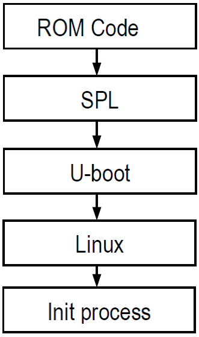
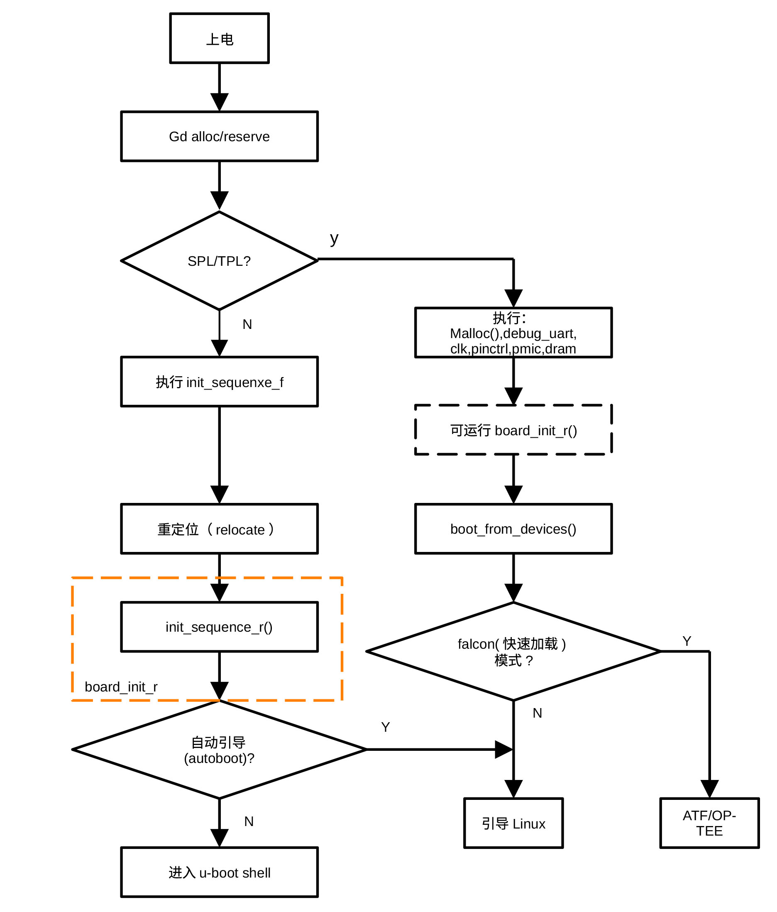

## U-BOOT引导流程

U-BOOT是真正把操作系统导入内存的引导程序，它既是一级引导程序也是二级引导程序，由存于片上ROM（如NXP公司基于ARM内核的iMX6系列多媒体应用处理芯片里的ROM）的引导程序调入内存。片上ROM在把镜像程序调入内存后，跳转到由IVT内入口项指定的地址开始执行U-BOOT引导程序。当系统采用spl引导方式时，整个系统引导过程如下图所示：

<figure>

<figcaption>
图 5‑1 Linux启动流程
</figcaption>
</figure>

U-BOOT可以存在SD卡、SATA盘、NOR FLASH或NAND
FLASH等各种媒体上。对嵌入式系统而言，引导器件通常有四个分区。第一个分区用以存储上面介绍的引导程序，即镜像程序，第二个分区用以存储引导参数，这些参数由引导程序传递给内核，第三个分区存储Linux内核，第四个分区存储Linux根文件系统。

<figure>

<figcaption>
图 5‑2 引导介质分区
</figcaption>
</figure>

U-BOOT的引导过程可分为如下几个阶段：

<figure>

<figcaption>
图 5‑3 U-BOOT不同引导方式的引导流程
</figcaption>
</figure>

从上面的流程图可以看出，U-BOOT启动可以有几种不同的引导方式，
分别为spl（Secondary Programmer Loader），tpl（Tiny Programmer
Loader）或proper启动方式。它们是 U-BOOT
源码根据不同的编译配置生成的“变体”，可以根据硬件的限制像“搭积木”一样自由组合。

它们是相互独立又按需组合的关系。如果 SoC 内部 SRAM
巨大，或者固化在芯片里的 BootROM
已经初始化好了DDR，可以直接运行Proper（单级引导），一些高性能 SoC
或仿真器采用单级引导。在片上RAM很小而片上ROM还没有初始化DDR的情况下，只能加载很小的代码，Proper +
SPL（二级引导）是最合适的组合，片上ROM先加载 SPL 做初始化，SPL 再去加载
Proper。当然不需要Proper，SPL也可以直接加载Linux内核（Falcon模式）。在极其苛刻的情况下（比如
SRAM 只有 4KB，连 SPL 都塞不下），可以采用Proper + SPL +
TPL方式（三级引导），先用TPL初始化DDR。

Proper是完整版的U-BOOT，带有复杂的命令行（CLI）、环境变量、网络协议栈、完善的驱动模型。负责把内核导入内存。SPL是U-BOOT的精简版。去掉了命令行和不必要的驱动，只保留导入程序的核心功能。它的唯一目标是初始化基础硬件，寻找并加载程序。TPL是极致精简版的U-BOOT，通常只包含最起码的
DDR 初始化代码。

U-BOOT引导方式的选择是通过编译开关（CONFIG_SPL=y，CONFIG_TPL=y）在编译过程中、而不是在U-BOOT运行过程中进行的。编译开关的设置可以利用配置工具或直接修改相应的配置（如defconfig或.config）完成。

CONFIG_SPL和CONFIG_TPL用于决定是否需要生成SPL和TPL镜像，即它们是功能选择开关。由于在一个函数或文件中，部分代码可能属于Proper，另一部分可能属于SPL或TPL，为了区分某一部分代码属于哪种引导方式，还定义了CONFIG_SPL_BUILD和CONFIG_TPL_BUILD宏。如果使用\#if !defined(CONFIG_SPL_BUILD)，表示这部分代码用于主 U-BOOT(Proper)，如果使用\#if defined(CONFIG_SPL_BUILD) ，同时使用\#if !defined(CONFIG_TPL_BUILD)，表示该部分代码用于SPL，如果使用\#if
 defined(CONFIG_SPL_BUILD)，同时使用\#if defined(CONFIG_TPL_BUILD)，表示这部分代码用于TPL。如果没有使用这些宏，表示这段代码用于三者。 

若采用Yocto构建环境，NXP Linux采用的U-BOOT引导程序代码位于build/tmp/work/板名/U-BOOT-imx/版本/git目录下。后续指明文件出处时，我们总是从git开始。

