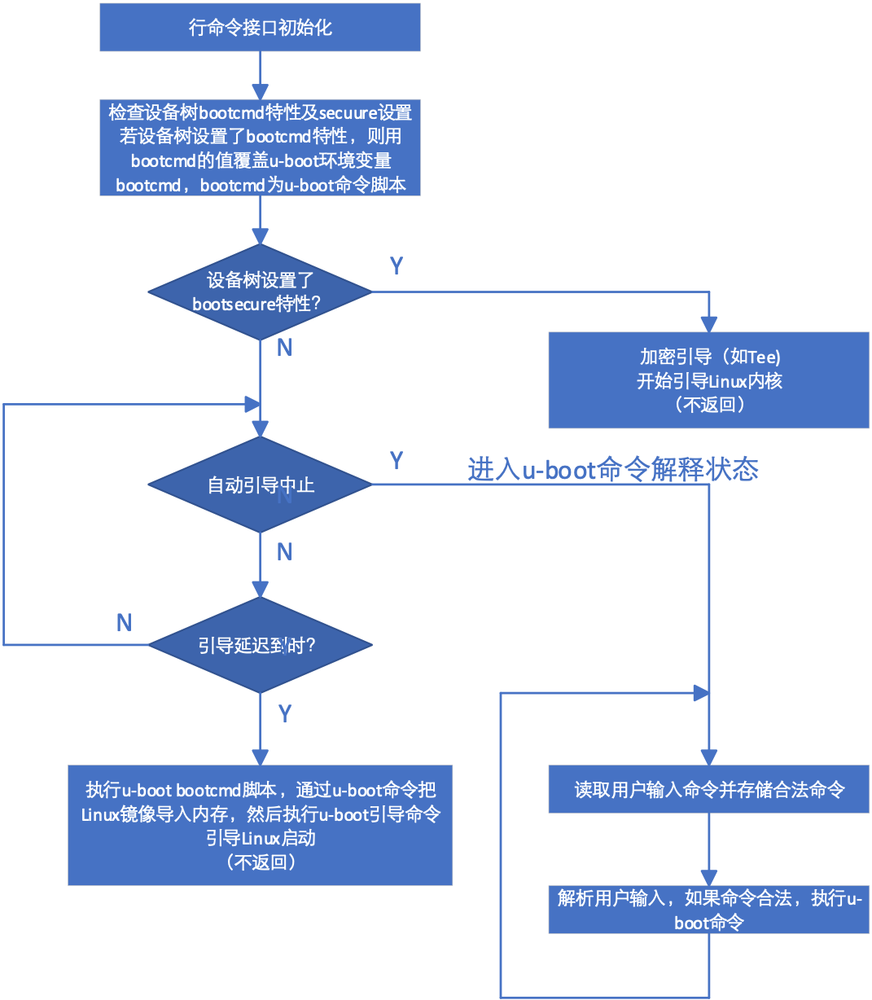
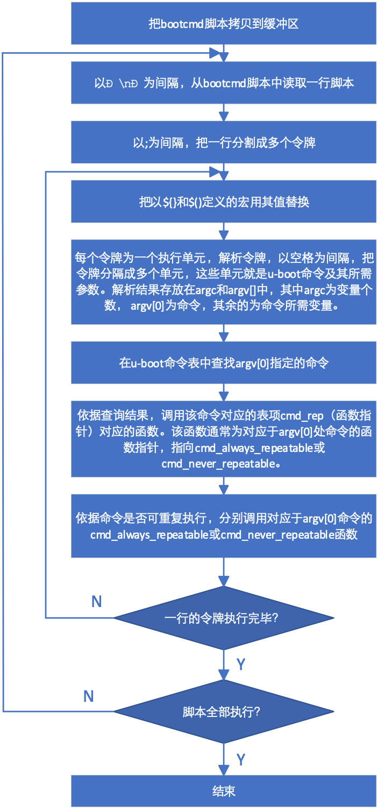

## U-BOOT运行

### U-BOOT顶层循环

init_sequence_r数组的最后一个指针必须指向run_main_loop函数，使系统进入循环等待用户命令输入过程。run_main_loop()定义在board_init_r.c文件中，该函数为如下给出的一个for死循环，调用main_loop()函数。

```
static int run_main_loop(void)
{
#ifdef CONFIG_SANDBOX
	sandbox_main_loop_init();
#endif
	for (;;)
		main_loop();
	return 0;
}
main_loop()定义在git/common/main.c文件中，其代码为：
void main_loop(void)
{
	const char *s;
	bootstage_mark_name(BOOTSTAGE_ID_MAIN_LOOP, "main_loop");
	if (IS_ENABLED(CONFIG_VERSION_VARIABLE))
		env_set("ver", version_string); /* set version variable */
	cli_init();
	if (IS_ENABLED(CONFIG_USE_PREBOOT))
		run_preboot_environment_command();
  if (IS_ENABLED(CONFIG_UPDATE_TFTP))
		update_tftp(0UL, NULL, NULL);
	  s = bootdelay_process();
	  if (cli_process_fdt(&s))
		cli_secure_boot_cmd(s);
	  autoboot_command(s);
	  cli_loop();
	  panic("No CLI available");
}
```

其功能是初始化行命令接口，通过bootdelay_process()获取延迟时间并读取环境变量中的bootcmd变量，bootcmd变量存储的是由U-BOOT命令组成的脚本，控制U-BOOT引导Linux的过程(延迟时间可通过环境变量autodelay，或利用设备树的bootdelay属性等不同方式设置)，下面给出了main_loop()函数的运行流程和经过适当简化后的bootcmd脚本。

<center>
<figure>

<figcaption><p>图 5‑11 main_loop()函数流程</p></figcaption>
</figure>
</center>

```
bootcmd=run findfdt;
run findtee;
mmc dev ${mmcdev};
if mmc rescan; 
    then if run loadbootscript; 
            then run bootscript; 
         else if run loadimage; 
             then run mmcboot; 
           else run netboot; 
           fi; 
         fi; 
else run netboot; 
fi
loadfdt=fatload mmc ${mmcdev}:${mmcpart} ${fdt_addr} ${fdt_file}
loadimage=fatload mmc ${mmcdev}:${mmcpart} ${loadaddr} ${image}
loadtee=fatload mmc ${mmcdev}:${mmcpart} ${tee_addr} ${tee_file}
mmcboot=echo Booting from mmc ...; 
run mmcargs; 
if test ${tee} = yes; 
    then run loadfdt; 
         run loadtee; 
         bootm ${tee_addr} - ${fdt_addr}; 
else if test ${boot_fdt} = yes || test ${boot_fdt} = try; 
	then if run loadfdt; 
             	then bootz ${loadaddr} - ${fdt_addr}; 
          else if test ${boot_fdt} = try; 
            		then bootz; 
          		else echo WARN: Cannot load the DT;
            	fi; 
            fi; 
	else bootz; 
	fi;
fi;
```

U-BOOT首先通过run
findfdt执行findfdt脚本。findfdt脚本是一系列测试，依据主板配置，最终得到环境变量fdt_file的值。限于篇幅，这里我们忽略了findfdt的细节。fdt_file保存了相应主板的设备树文件名，对imx6qp_sabreauto开发板，`fdt_file = imx6qp-sabreauto.dtb`。bootcmd还通过`run findtee`执行findtee脚本，查找相应于主板的引导加密程序文件名tee_file。imx6qp_sabreauto开发板使用uTee-6qpauto加密程序，因此，`tee_file = uTee-6qpauto`。

`mmc dev ${mmcdev}`指令用于把\${mmcdev}卡设为引导用卡槽。

当使用SD卡引导Linux时，U-BOOT运行run
mmcboot。mmcboot脚本通过运行loadimage脚本，利用U-BOOT fatload命令
把\${image}从SD卡的引导扇区（由mmc
\${mmcdev}:\${mmcpart}指定）读入到地址为\${loadaddr}的内存。通过同样方式，bootcmd脚本还把fdt文件和tee文件读入相应内存。这里，\$image
= zImage。\$fdt_addr，
\$loadaddr和\$tee_addr可以在配置文件设置。最后，bootmmc中的bootm
\${tee_addr} - \${fdt_addr}或bootz \${loadaddr} -
\${fdt_addr}引导命令执行Linux的引导。

bootcmd存储在U-BOOT的环境变量当中，该变量的默认值在git/include/configs/xx_common.h中设置。用户可以通过中断自动引导进入U-BOOT命令行模式对bootcmd进行修改，然后通过savenv命令永久保存。

若设备树中设置了bootcmd属性，则在main_loop()中检查设备树中是否设置了bootsecure属性。如果设置了bootsecure属性，则执行加密引导命令（该命令不返回），若不是加密引导，则执行autoboot_command()函数。
autoboot_command函数先检查延迟时间及用户是否敲击键盘，若延迟到期且用户没有敲击键盘，则通过run_command_list函数执行由bootdelay_process函数获得的bootcmd脚本。若在延迟期间用户敲击了键盘，则执行cli_loop()函数，进入等待并处理用户输入命令循环。

### U-BOOT命令解释

run_command_list函数解析U-BOOT脚本。U-BOOT可以采用简单方式或hush方式（见后续部分）对脚本或命令进行解释。当采用简单解释方式时，调用cli_simple_run_command_list执行脚本。采用简单解释模式的run_command_list的代码为：

```
int run_command_list(const char *cmd, int len, int flag)
{
    int need_buff = 1;
    char *buff = (char *)cmd; /* cast away const */
    int rcode = 0;
    if (len == -1) {
        len = strlen(cmd);
       need_buff = strchr(cmd, '\n') != NULL;
    }
    if (need_buff) {
        buff = malloc(len + 1);
        if (!buff)
            return 1;
        memcpy(buff, cmd, len);
        buff[len] = '\0';
    }
    rcode = cli_simple_run_command_list(buff, flag);
    if (need_buff)
        free(buff);
    return rcode;
}
```

该段代码先计算cmd字符串的长度（main_loop通过bootcmd把变量传递给cmd），如果cmd字符串包含有'\n'，则分配缓存区，把'\n'用'\0'替换，然后把命令字符串拷贝到分配的缓存区，最后调用cli_simple_run_command_list执行cmd指向的脚本。

### U-BOOT命令执行

cli_simple_run_command_list（）的作用是把cmd指向的脚本分隔成以'\n'为间隔的多个单元，然后依次调用cli_simple_run_command（）执行每个单元的命令。cli_simple_run_command（）解析cli_simple_run_command_list提供的字符串，把其划分为以;作为分隔的多个令牌。如果令牌中存在由\${}或\$()定义的宏，则通过调用cli_simple_procee_marco()把宏用其值替换，然后利用cli_simple_parse_line()把令牌分解成多个以空格为间隔的变量。解析后的各个变量存储在argv中，其中argv\[0\]存放命令本身，argv\[1\]等存放传递给命令的参数，参数个数存储在argc中。最后cli_simple_run_command（）调用cmd_process()执行由argv\[0\]指定的命令。

cmd_process()首先利用find_cmd(argv\[0\])在命令表中查找argv\[0\]指定的命令。如果查找到该命令，则把该命令的变量个数及变量数组传递给cmd_call()函数，执行该命令。在git/cmd/bootm.c中，有一条宏定义：

```
U_BOOT_CMD(bootm, CONFIG_SYS_MAXARGS, 1, do_bootm,"boot application image from memory", bootm_help_text);
```

该宏定义在git/include/command.h中，其中bootm为命令名称，CONFIG_SYS_MAXARGS为该命令支持的最大参数个数，1
表示按下回车键会重复执行上一条命令，do_bootm为核心回调函数。输入 bootm
时，U-BOOT 实际上就是在调用 do_bootm 这个 C 函数。"boot application
image from memory"为简短帮助信息。bootm_help_text为详细帮助信息。

通过宏替换可知，该宏定义等价于：

```
ll_entry_declare(cmd_table_t, bootm, do_bootm) = {
    “bootm”, CONFIG_SYS_MAXARGS, cmd_always_repeatable, do_bootm, "boot application im-age from memory", Bootm_help_text, NULL}
```

最终的结果是定义一个类型为结构体cmd_tbl_s的变_u_boot_list_2_cmd_2_bootm，放在段 .u_boot_list_2_cmd_2_bootm。生成的变量声明为：

```
struct cmd_tbl _u_boot_list_2_cmd_2_bootm = {
    .name       = "bootm",                                   			// 命令字符串
    .maxargs    = CONFIG_SYS_MAXARGS,                        // 最大参数个数
    .repeatable = 1,                                         			// 是否支持回车重复执行
    .cmd        = do_bootm,                                  		// 函数指针：核心逻辑
    .usage      = "boot application image from memory",     	// 短帮助（help命令显示）
    .help       = bootm_help_text,                          		// 长帮助（help bootm显示）
    .complete   = NULL                                       		// 自动补全函数（此处传NULL）
};
```

其作用是把命令表中名为"bootm"的表项定义为do_bootm。下面给出的是run_command_list函数的流程图：

<center>
<figure>

<figcaption><p>图 5‑12 run_command_list()函数流程</p></figcaption>
</figure>
</center>

当用SD卡启动Linux时，cmd_call()函数调用函数cmd_always_repeatable()，cmd_always_repeatable()函数调用do_bootm()函数。由此可知，cmd_call调用do_bootm()函数引导Linux。

如果采用预先引导模式，则main_loop先处理预先引导环境命令，如果启用了网络引导命令，则main_loop先利用tftp协议更新U-BOOT及Linux系统。

### 命令处理及执行

main_loop函数在最后进入行命令接口循序（cli_loop）,等待用户输入命令或等待自动引导延迟到时后启动自动引导过程。

cli_loop()定义在git/common/cli.c文件里，该函数的定义为：

    void cli_loop(void)

    {

        bootstage_mark(BOOTSTAGE_ID_ENTER_CLI_LOOP);

    #ifdef CONFIG_HUSH_PARSER

        parse_file_outer();

    \* This point is never reached */

        for (;;);

    #elif defined(CONFIG_CMDLINE)

        cli_simple_loop();

    #else

        printf("## U-BOOT command line is disabled. Please enable CONFIG_CMDLINE\n");

    #endif /*CONFIG_HUSH_PARSER*/

}

系统可以采用hush或简单方式解析用户命令，解析方式通过编译开关在编译时设定。解析命令只是一个繁琐的读取和解析的过程，代码并不复杂，这里不作详细分析，有兴趣的读者可以阅读git/common/cli_hust.c或git/common/cli_simple.c中的代码。这里只简单地以cli_simple_loop为例简单介绍一下命令处理过程。

cli_simple_loop()是一个for(;;)结构的死循环。在该死循环内，读取用户输入，对用户输入进行解析。如果输入合法，则执行用户输入的命令，且把用户输入命令存储起来，以便用户可以利用上下移动箭头重复执行该命令，之后重新等待用户输入。

U-BOOT提供了非常丰富的命令，主要包括信息获取类命令、内存操作类命令、闪存类命令、执行控制类命令、网络类命令、环境变量类命令、其它各种硬件操作及调试命令，同时U-BOOT还支持常见的Linux文件系统。利用这些命令及环境变量，U-BOOT可以控制Linux内核的引导过程及引导方式，用户还可以利用它们控制系统设备。在U-BOOT处于命令解释状态时，利用printenv命令，用户可以列出所有环境变量，通过这些环境变量，用户可以了解U-BOOT的引导方式。

U-BOOT命令定义在git/cmd、git/lib及git/common目录下的各个c文件当中。一个文件可能定义一条命令，也可能定义多条命令，想了解细节的读者可以阅读该目录下的c文件。

