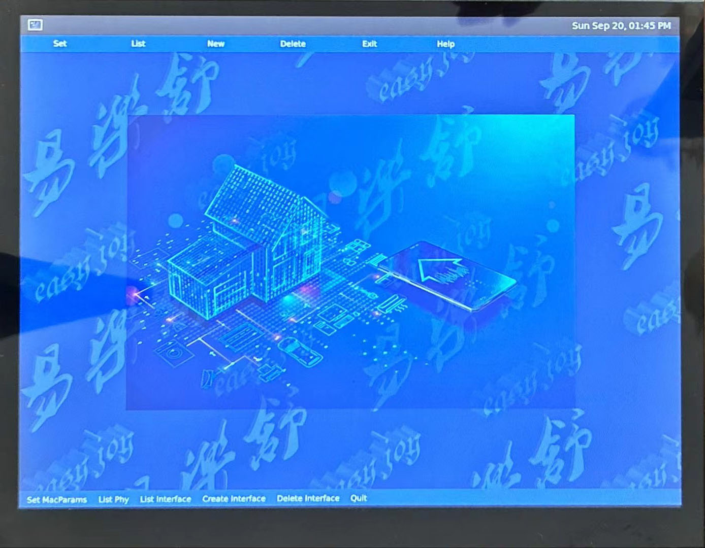
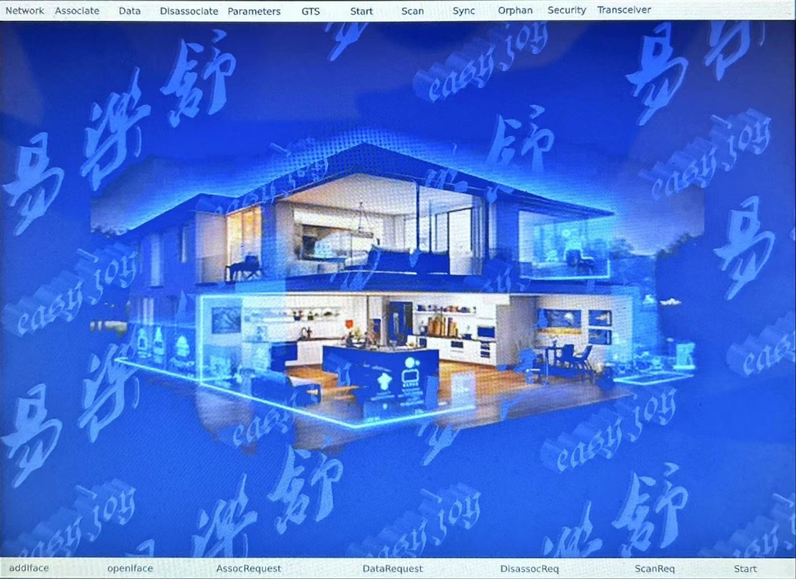

# 基于NXP i.Mx 6 solo的多功能Linux开发系统

ESmart-6 （[图
32‑1](#_Ref232168549)）是一款集智能、便捷、安全于一体的智慧产品多功能产品开发平台。它集成了WIFI、ieee802.15.4、蓝牙、以太网络等通信模块，配置了
8G DDR3 RAM 和 8G 固态硬盘，支持 emmc4.5 高速 SD 卡，具有一个 USB
主机口和一个 USB OTG 从属接口，采用 1024x768 LED
彩色显示器和电容式触摸屏。系统集成了高性能音频处理芯片，能够进行各种音响特效处理，并提供高保真立体声输出接口，语音输入采用数字式麦克风，还提供一个麦克风输入接口。此外，板上还安装了一块晴雨表芯片，客户可以利用该芯片预测天气情况。

![[]{#_Ref232168549 .anchor}图 32‑1 eSmart
智慧产品平台](./media/image189.jpg){width="5.331218285214348in"
height="6.910728346456693in"}

系统采用恩智浦公司的、基于 ARM v7 的 iMx6solo
多媒体芯片。该处理器是一款功能强大的多媒体应用处理芯片，具有强大的二维和三维图形加速引擎，支持
H.264、BP/MP/HP、

VC-1SP/MP/AP、除 GMC 外的 MPEG-4 SP/ASP、 DivX (Xvid)、 MPEG-1/2、 VP8、
AVS 和 MJPEG 。解码支持 H.264、 MPEG-4、 H.263 及 MJPG 编码， 兼容 HD
1920x1080 60i 或 30p 解码及 1920x1088 编码。片上集成了 MIPI、LVDS，HDMI
等各种图形图像输入和输出接口，还集成了 SPDIF、EASI 等各种语音接口和 ASRC
语音处理模块，此外，该芯片还包含 UART、SPI、CAN、DMA、I2C
等各种外设接口。芯片集成了安全加密引擎和可信执行环境
(TEE)，提供硬件级的安全保障，保护用户数据和系统安全。该芯片具有动态电源管理功能，能够极大地降低系统功耗。

系统实现了低功耗万物互联协议 IEEE802.15.4 的 Mac 层协议，提供了 C、C++和
qml 语言接口。通过调用系统提供的 API
接口，可以轻松实现组网、信道扫描、参数设置、用户管理等各种系统管理功能。用户只需简单地调用系统提供的
API，就可以实现自己的物联网。该系统非常适合智能家居、智慧医疗、智慧城市等各种万物互联产品的开发，实现多平台、多品牌的互联，打破品牌壁垒，实现跨平台统一控制。

{width="4.639396325459318in"
height="3.610071084864392in"}

{width="4.65386811023622in"
height="3.38463145231846in"}

通过 Mac
层测试图形界面及源代码，系统不仅提供了系统测试功能，还展示了如何通过 qml
语言及调用 ieee802.15.4Mac
层接口函数实现自己的万物互联应用程序图形界面。包括系统配置和Mac层原语测试两个图形界面供用户使用。

{width="4.706746500437445in"
height="3.584818460192476in"}

{width="4.456778215223097in"
height="3.2048818897637794in"}
<video src="./media/产品视频.mp4" controls width="100%" height="auto">
  您的浏览器不支持 video 标签。
</video>
除了提供 C、C++和 qml
接口外，系统还预留有网络套接字端口，通过该预留套接字，用户还可以利用系统上的
ieee802.15.4 物理层硬件驱动程序，实现自己的 Mac 层协议。

系统支持 Qt6。Qt6 提供了大量不同用处、不同风格的图形用户界面控件，利用
qml 语言，用户可以方便快捷地开发适合自己产品的图形界面。

系统运行开源 Linux 操作系统，它提供了 x Windows 和 wayland
等图形界面，同时也提供 frame buffer、DRM 和 gstreamer
流媒体应用程序开发框架。该嵌入式 Linux 操作系统提供
EGL、OGL、openCL、openGL、openVG
等各种图形开发工具，可实现流畅的高清视频播放，为多媒体软件、3D
游戏及各种多媒体应用的开发及用户接口界面的编写提供了极大的便利。

该系统适应于车载信息娱乐系统
(IVI)、数字仪表盘、高级驾驶辅助系统，尤其适用于智能家居控制系统、便携式医疗设备、智慧仪表等万物互联设备开发，是一款适合于智慧产品开发商、车载娱乐系统开发商、多媒体应用开发人员、高校实验室及
ARM 编程学习人员的多功能开发系统。有兴趣的读者可通过电话或电子邮件联系。