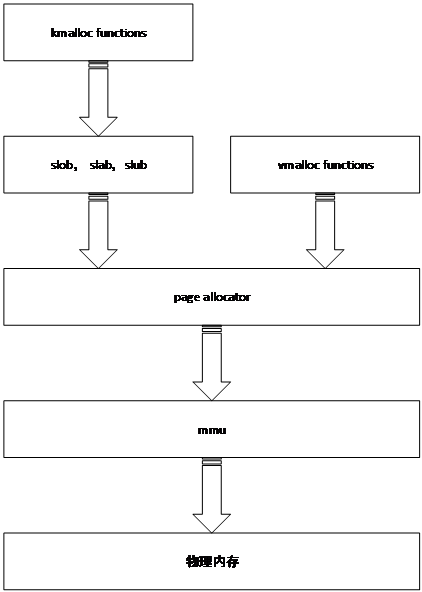
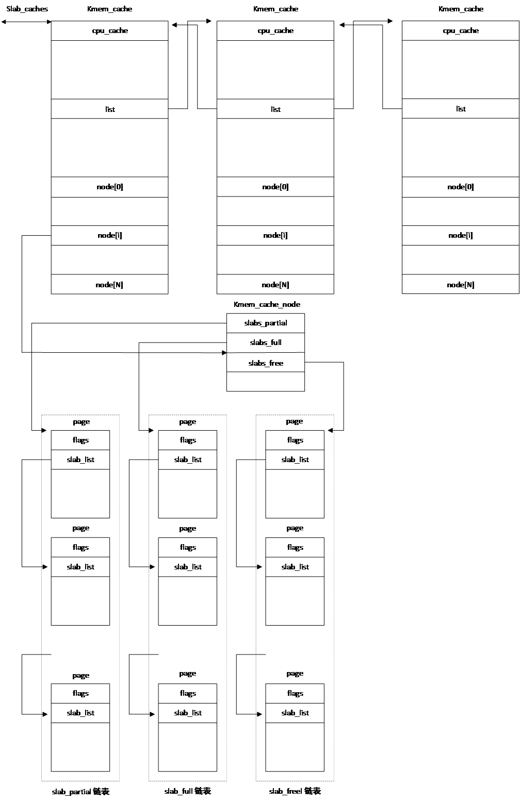
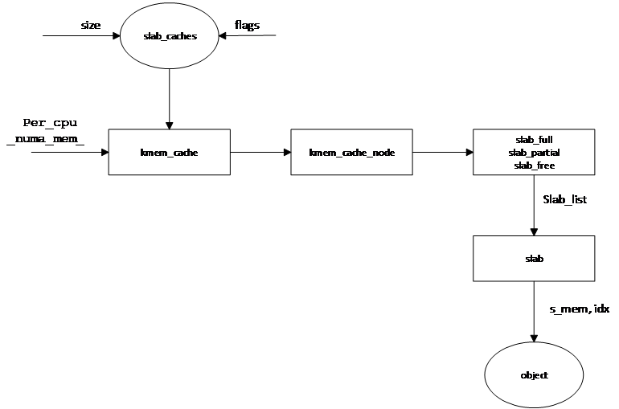
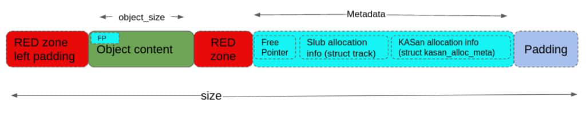
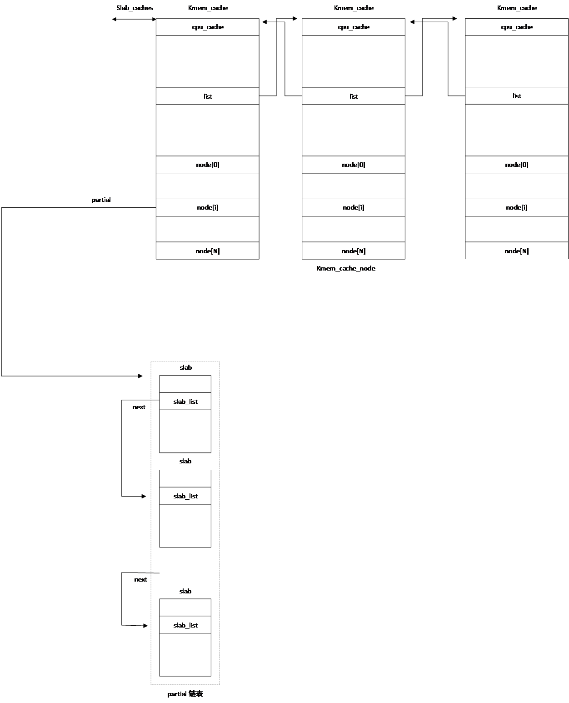
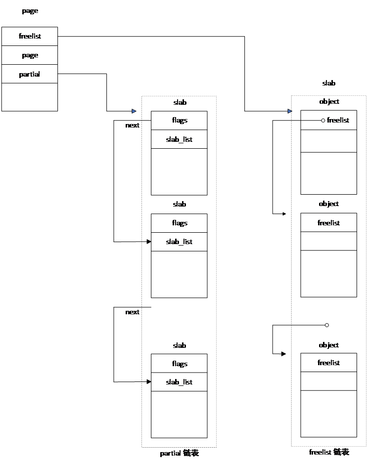
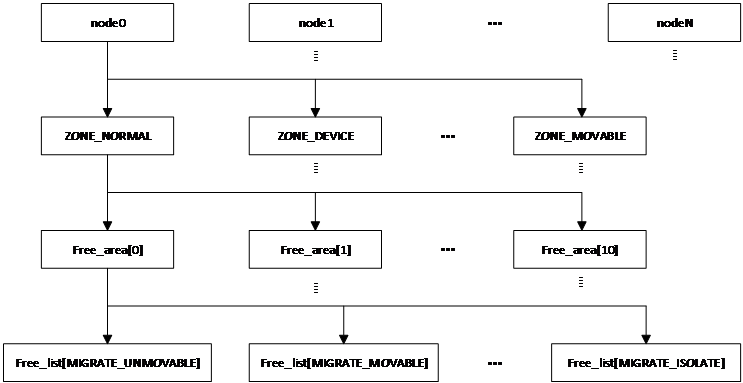
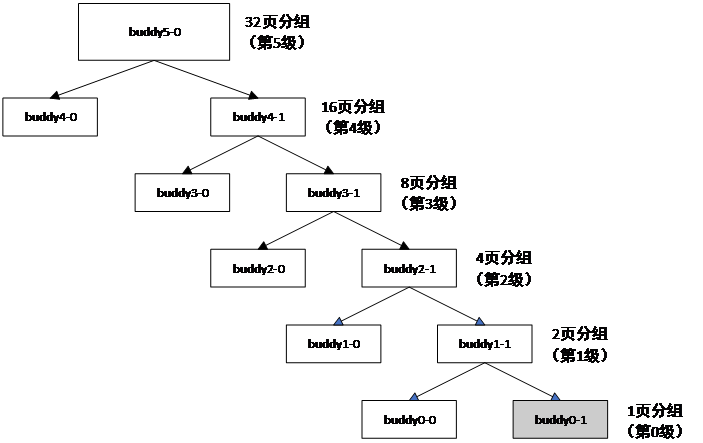
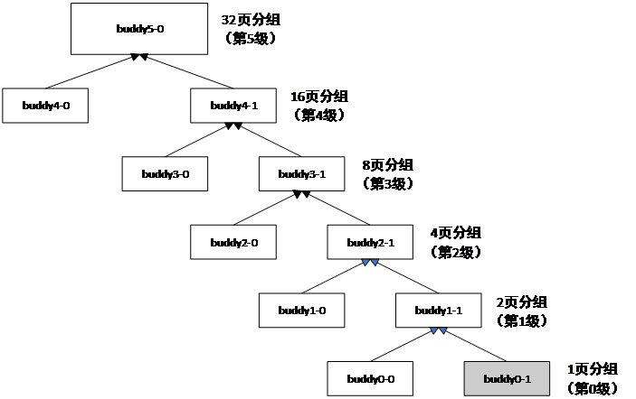

## 内存分配算法

前面我们介绍了引导初期采用的块内存分配策略。这种方法比较简单，不是高效的内存管理办法。引导完成后，Linux会采用高效的内存管理办法。Linux分配内存分级进行。vmalloc内存分配函数利用页面内存分配器（page
allocator），用于分配空间大于一个内存页、虚拟地址连续而物理地址可以不连续的内存。页内存分配器采用伙伴内存分配器（buddy），把地址连续的物理内存划分为4096个字节的页，以页为单位进行内存分配。各类kmalloc函数基于页面内存分配器分配的内存页，利用slob，slab、slub内存分配器，分别空间小于单页的内存。kmalloc内存分配函数主要供内核自身的内存分配。slob（simple list of block）在早期版本中采用，桌面系统已弃用，目前主要用于嵌入式操作系统。slab算法相对比较复杂，其优点为内存碎片化情况轻，缺点为需要保存大量的管理数据（metadata）。从版本6.8开始，桌面系统已完全弃用slab算法。slub算法改进了slab算法需要存储大量管理数据的缺点。

Buddy用于函数page_allocator()，主要用来分配空间大于一页的物理内存。slab和slub均请求buddy分配器分配slab。各种内存管理模块之间的关系可用图
15‑1表示。

<center>
<figure>

<figcaption><p>图 15‑1 内存管理模块间的层次关系</p></figcaption>
</figure>
</center>

### slob分配算法

slob是Linux最早采用的内存管理算法，主要用于从slob堆中分配空间小于单页的内存。其最小分配单位可达2字节，通常为4字节。当需求的内存空间小于一页时，kmallo()类函数利用slob分配器从slob堆中分配内存。当需求的空间达到一页时，kmalloc就会直接调用alloc_pages()获取内存。

Slob堆由三个链表构成，每个链表由多个内存页组成。一个链表用于分配需求小于256个字节的内存，一个用于分配需求小于1024字节的内存，最后一个用于其它情况。

三个链表对应的各页均有一个由各自页中的自由空间模块组成的链表。链表按各个模块起始地址由小到大的次序排列。在释放一个内存模块时，会依模块的地址把该模块插入链表中合适的位置，而不是放在链表的末尾。

分配内存空间时，首先在合适的页面链表中找到第一个有足够自由空间的页面，然后在该页面的链表中找到第一个满足空间要求的自由内存模块，分配给申请内存的用户。slob算法的优点是简单，需要保存的管理数据少。该算法的缺点也很明显，内存碎片化现象非常严重，内存利用率不高。

### Slab内存分配算法

内存分配和释放是内核最普遍的操作，快速有效的内存分配和释放方法对操作系统的性能至关重要。为了高效地分配和释放内存，从版本2.1.23开始，Linux开始采用slab内存分配器。Slab最早是在Solaris
操作系统上实现的。

slab分配器的最大特点是把分配器管理内存需要的数据作为对象缓存在高速缓存区。在分配内存时，如果数据对象不存在，则创建对象。如果对象已经在缓存区，则从缓存区获取内存并把数据对象的引用数（reference）加1。这时如果内存空间不足，可以申请扩展内存，不需要重新创建对象。在释放内存时，如果对象的引用数大于1，把内存放回缓存区并把对象的引用数减1。如果引用数等于1，则释放内存的同时把数据对象消除。

内存回收是指释放缓存区拥有的内存并把分配器用到的数据对象从缓存区消除。由于只有在回收内存时才要消除对象，在进行不断的内存分配和释放时，不需要重复创建和初始化读写，因此可以有效地降低无效操作，从而提高内存分配和释放速度。

Linux系统的slab分配器是一组类型为struct
kmem_cache对象的缓存区集合，每个对象服务不同大小和类型的内存。内存大小介于0-1、1-2<sup>2</sup>-1，2<sup>2</sup>-2<sup>3</sup>-1，…，2<sup>25</sup>-2<sup>26</sup>-1字节之间，类型有*KMALLOC_NORMAL、KMALLOC_RECLAIM和KMALLOC_DMA。*这些缓存区通过kmem_cache的list字段形成一个名为slab_caches双向环形链表。缓存区内的各个缓存区之间相互独立，每一个缓存区服务一类同样用处的内存。各个缓存区包含一组指向类型为缓存节点（struct
kmem_cache_node）的指针数组，每个数组元素对应一个内存节点（numa node）。

<center>
<figure>

<figcaption><p>图 15‑2 slab分配器数据结构</p></figcaption>
</figure>
</center>

缓存节点类结构体包含三个名为slab_full、slab_partial和slab_free的指针，分别指向缓存区中由全部被占用的slab、部分被占用的slab和全部空闲的slab构成的链表。每个链表都是由struct
page结构体的slab_list字段连在一起。page结构体为slab分配器使用的、用于描述物理内存的数据结构。

每个kmem_cache对象服务于多个slab，每个slab由2<sup>n</sup>页物理地址连续的内存构成。当slab包含内存页多于一页时，用复合页（compound
page）表示。每个slab被划分为大小相同的对象（object）。为了不产生歧义，我们在这里把这种对象称作内存块，块的大小由kmem_cache的size字段指定。slab划分的块数由kmem_cache的num字段的值决定。

用于内存分配的page结构体有一个s_mem指针，该指针指向该slab的第一个模块的地址。由于每个slab都是由地址连续的内存页组成，因此通过该指针可以访问该slab内的所有页的各个内存模块。模块地址为：

$$
p = s\\_mem + size*（idx - 1）
$$

其中p为第idx个块的地址，idx为块的序号。

page结构体包含另一个名为slab_cache的指针，指向服务于该页内存的kmem_cache对象。而kmem_cache_node的slab_full、slab_partial和slab_free链表由kmem_cache服务的内存页中的slab_list链接而成。这样通过kmem_cache可以查找其服务或管理的任意内存页，而通过内存页的s_mem指针也可以访问服务于该slab的kmem_cache。

slab分配器首先利用需要管理的内存空间大小及传递给分配器的标志位（gfp标志位）从slab_caches选择要服务于所管理内存的kmem_cache缓存区，然后通过per_cpu变量_num_mem_确定cpu使用的numa节点，从而确定要使用的meme_cache_node。利用page的slab_list字段，通过遍历链表，在slab_full、slab_partial和slab_free链表上选择一个slab，然后通过page的s_mem和内存块编号idx就可以确定要管理的内存块。图
15‑3说明了确定内存块地址的过程。

<center>
<figure>

<figcaption><p>图 15‑3 slab分配器确定内存模块的过程</p></figcaption>
</figure>
</center>

对象kmem_cache定义在git/include/linux/slab_def.h，其中的第一个字段为cpu_cache指针。该指针变量为cpu专用变量（\_per_cpu），不同CPU该变量的值不同。该变量指向类型为array_cache的结构体，其中的entry指针数组存储了分配给该CPU的块序号。当cpu需要内存时，它首先检查自己的array_cache是否有足够的空闲内存。如果有足够空间，则从array_cache保存的内存区域分配内存。如果空间不够，则检查是否有共享的array_cache。如果共享的array_cache没有足够的空间，则从cpu使用的kmem_cache对象中的slab_partial及slab_free链表中检查是否有足够的空间。如果有，则把所获得的块的序号保存到array_cache的entry数组。如果在这两个链表也找不到足够的空间，则需调用页面内存分配器（alloc_page）从虚拟内存获取一页内存，把其保存到kmem_cache的链表中。如果无法从页面存分配器获取内存，则出现内存不足错误。

slab主要用于分配所需空间小于单页的内存。各类kmalloc函数均基于slab内存分配算法。

### slub内存分配算法

slab使用的kmem_cache对象包含许多数据。其中对应每个numa节点，有一个kmem_cache_node节点，而每个kmem_cache_node包含三个链表。对这些数据的管理比较复杂，会耗费大量cpu时间。为了进一步提高内存分配效率，Christoph
Lameter于2008年在内核v2.6.23版实现了slub内存分配算法。如今，slub已成为Linux的主要内存分配器，使用非常广泛的kmalloc子系统即基于slub算法。

slub分配器改进了slab内存分配器的一些不足，重新定义了结构体kmem_cache和kmem_cache_node，去掉了其中的许多管理数据。实际运行时只使用partial一个链表，而full链表只是在需要调试时才使用。在slub分配器中，各个cpu不再使用数组，而是使用partial链表和freelist指针分别对其所用的slab和slab中的内存模块进行管理。当cpu释放一个slab时，它首先把该slab放在其freelist链表，便于后续使用。

slub仍然以slab作为一个单元进行管理，slab的大小由kmem_cache结构体的size字段决定。每个slab分成多个大小相同的内存模块（object），各个块的大小由结构体的object_size字段定义。与slab分配算法不同，slub中的每个slab可以包含一些调试信息，当然，这些调试信息是可选项。图
15‑4给出了slub中使用的一个模块的结构。RED zone left padding、RED
zone、slub allocation information、KASan allocation
information部分均为可选项，只有内核或驱动器开发人员在调试时才会使用这些字段。每个成分所在位置由kmem_cache结构体的各个字段决定。

<center>
<figure>

<figcaption><p>图 15‑4 slub分配器中slab的构成</p></figcaption>
</figure>
</center>

RED zone Left Padding用于保证当前内存模块的起始地址满足对齐要求。Red
Zone分左区和和右区，用以在特定内存区域填写填充特定魔术数（如
0xbb），进行内存越界检查。左区位于对象内容之前，右区位于对象内容之后。Object
Content是用户/内核申请到的实际可用内存空间。当对象空闲时，Free
Pointer指向下一个空闲对象的指针。SLUB Allocation
Information记录哪个函数/调用栈）分配或释放了这个对象，通常由
CONFIG_SLUB_DEBUG 开启。KASAN Allocation Information是KASAN （Kernel
Address
Sanitizer）专用的元数据，记录更精确的异步释放、分配的调用栈（Call
Stack），用于排查 Use-After-Free (UAF)
等高级漏洞。Padding在所有元数据最后，用于将整个对象的总大小对齐到特定的硬件对齐边界。

slab仍然由page结构体定义，slub分配器所用的page结构体包含slab_list、partial、next、pages和counters等字段。其中slab_list字段的next指针把各个slab连成一个链表。指针next与slab_list的next字段为同一个值，指向链表的下一个slab。pages和pobjects占用slab_list的prev指针位置，用来存储cpu的partial链表包含的slab数和空闲内存模块数目。freelist为一个指针，该指针指向的内存保存有该slab内下一个空闲模块的地址。变量counters与其后的匿名结构体存储于同一位置，也可以理解为counters由inuse、objects和frozen三部分组成。inuse占用高16位，表示已经占用的内存模块数目。objects和frozen占用低16位。objects占用其中的高15位，表示该slab的模块数目。frozen占用最低位，表示该slab的状态。当该位为1时，表示该slab已被冻结。只有冻结该slab的cpu才能够对该slab的链表进行操作。

每个cpu都有一个类型为kmem_cache_cpu的变量，各个字段的含义为：

- 指针freelist指向的内存保留下一个空闲object的地址

- partial指针指向空闲slab的链表

- page指向当前正在使用的slab，cpu利用该结构体进行内存分配

分配内存时，cpu先从freelist获取一个空闲内存模块。如果从当前cpu的freelist中无法找到空闲模块，则从其partial链表中获取一个空闲slab，然后再在该slab获取所需大小的内存。如果从partial链表中也找不到自由空间，会从缓存节点中的partial链表获取一个空闲slab。如果还没有成功，则通过page_allocator，从系统内存重新分配一个slab。

cpu的partial链表和缓存节点的partial链表都有大小限制，定义在kmem_cache结构体中。当链表中slab的个数超出规定数目，就会认为链表已满。cpu在从其partial链表获取slab时，如果链表已满，则会把该链表上的所有slab释放给缓存节点的partial链表。如果这时缓存节点的链表也满，则会把slab释放给系统内存。

在获取一个新的slab后，如果cpu的page字段为空，则把该slab赋给page字段。如果page字段不空，则把该slab添加到partial链表。图
15‑5显示了slub使用的由slab构成的partial链表结构。

<center>
<figure>

<figcaption><p>图 15‑5 partial链表结构</p></figcaption>
</figure>
</center>

图 15‑6为各个cpu使用的链表。

<center>
<figure>

<figcaption><p>图 15‑6 cpu使用的链表结构</p></figcaption>
</figure>
</center>

### buddy内存分配算法

内存在不断地分配和释放大小不同的内存模块的过程中，会形成大小不一、地址分散的内存模块，这样的现象称作内存碎片化。内存物理地址连续不仅有助于减少内存读写时间，而且是某些操作如DMA的硬性要求。当碎片化现象严重时，不仅内存读写时间增加，而且在有足够的自由空间时也可能会导致内存分配失败。解决内存碎片化是对分配器的基本要求。buddy（伙伴）分配器最关注的就是内存碎片化。它位于内存管理体系的最底层，最小分配单位为页，用于一页或多页物理内存的分配。其核心思想是最大化地址连续的自由内存空间。

在前面章节已经提到，Linux
buddy分配器把每个numa节点的物理内存划分为11个组，每个组由相同大小的内存模块组成，每个模块的物理地址连续。内存模块大小分别为1页、2页、4页、8页、16页、32页等，最后一个组内存块的大小为1024页，这些组的内存分别用于分配1页、2页、4页…、1024页的内存空间。每个numa节点的zone结构体有一个类型为free_area结构体、包含12个元素、名称为free_area的数组，分别用于保存这12组的内存分配信息。free_area结构体包含一个类型为链表头、大小为MIGRATE_TYPES的free_list数组，还包含一个记录组中空闲内存模块个数的nr字段。每个free_list元素对应一种迁移类型，用以记录迁移类型所对应的空闲内存模块。Linux支持的迁移类型定义在文件git/include/linux/mmzone.h里。图
15‑7为page_allocator为buddy分配器使用的内存分组结构。

<center>
<figure>

<figcaption><p>图 15‑7 buddy的内存分组</p></figcaption>
</figure>
</center>

Buddy内存管理程序定义在git/mm/page_alloc.c文件中。整页内存分配由函数alloc_pages()完成，定义在git/include/linux/gfp.h。当系统开启NUMA支持时，alloc_pages()调用alloc_pages_current()。该函数会首先去读取当前进程的内存分配策略
struct task_struct-\>mempolicy。如果进程设置了诸如
MPOL_BIND（强制绑定特定节点）、MPOL_INTERLEAVE（交错轮询分配）或
MPOL_PREFERRED（优先本地分配），alloc_pages_current
会严格按照这些策略去计算出目标 NUMA
节点的候选链表（Zonelist），然后再向伙伴系统伸手。依据内存分配策略，alloc_pages_current()会调用alloc_page_interleave()或\_\_alloc_pages_nodemask()，而alloc_page_interleave()最终也会调用函数\_\_alloc_pages_nodemask()。

如果关闭了NUMA支持，alloc_pages()调用alloc_pages_node()。因为没有多个节点的概念，numa_node_id()
永远返回唯一的那个本地节点（通常是 Node
0）。内核跳过了所有的内存策略检查代码，直接拿着全局唯一的物理节点备用链表去进行伙伴系统无锁/有锁分配。alloc_pages_node()调用\_\_alloc_pages_node()，最终同样会调用\_\_alloc_pages_nodemask()。

\_\_alloc_pages_nodemask()时内存分配工作的核心函数。它会调用函数get_page_from_freelist()或\_\_alloc_pages_slowpath()。针对不同的情况，\_\_alloc_pages_slowpath()会调用get_page_from_freelist()、\_\_alloc_pages_direct_compact()、\_\_alloc_pages_direct_reclaim()或\_\_alloc_pages_may_oom()，或者直接分配内存，或进行内存规整、回收，然后分配内存等。其中get_page_from_freelist()的主要任务为内存分配，其余各个函数均需调用该函数完成内存分配，也据说是get_page_from_freelist()真正完成内存分配。在分配内存时，get_page_from_freelist()通过函数node_reclaim()分配内存，通过函数rmqueue()进行内存回收。

在分配内存时，rmqueue()利用伙伴关系，首先从最小能够满足内存空间需求的组中进行分配。如果在当前组里无法找到自由空间，则在分配空间更大的组里进行分配。分配成功后，在保持连续地址空间最大的前提下，把剩余空间移动到合适的、分配空间较小的组里。

释放一页内存的主要工作由函数_free_one_page()完成。在释放内存的过程中，如果发现两个地址连续的模块，则把这两个模块合并，移动到上一个分配空间较大的组里。这样大小相同、地址连续的内存模块称之为伙伴（buddy）。图
15‑8为buddy内存分配过程示例。我们假设用户需要一页内存，而系统只有在第5级（即32页的分组）才有足够的空间。

<center>
<figure>

<figcaption><p>图 15‑8 buddy内存分配过程</p></figcaption>
</figure>
</center>

首先通过free_list找到具有足够空间的页buddy5-0。把buddy5-0一分为二，产生两个在第4级上的伙伴buddy4-0和buddy4-1。把buddy4-0插入到第4级的某个free_list链表，而把buddy4-1再进一步拆分为第3级上的两个伙伴buddy3-0和buddy3-1。如此重复，直到拆分为第0级上的两个伙伴buddy0-0和buddy0-1。最后把buddy0-0插入第0级上的某一free_list链表，而把伙伴buddy0-1分配给用户。

内存合并过程与分配过程相反，图
15‑8为一个内存合并过程示例。在分配内存时，首先检查其伙伴是否为空闲且可以合并的模块。如果可以合并，则把释放的内存模块与其伙伴合并，形成一个更大的模块。如此往复，直到其伙伴无法合并为止。图
15‑9显示了一个内存页的合并过程。同样，我们假设用户释放了一个大小为4096字节的内存页。到第5级后，模块与其伙伴无法再进一步合并。

<center>
<figure>

<figcaption><p>图 15‑9 buddy释放内存过程</p></figcaption>
</figure>
</center>
在分配内存时，备用节点区域列表

```
static int fallbacks[MIGRATE_TYPES][3] = { /* fallback list */
	[MIGRATE_UNMOVABLE]   = { MIGRATE_RECLAIMABLE, MIGRATE_MOVABLE,   MIGRATE_TYPES },
	[MIGRATE_MOVABLE]     = { MIGRATE_RECLAIMABLE, MIGRATE_UNMOVABLE, MIGRATE_TYPES },
	[MIGRATE_RECLAIMABLE] = { MIGRATE_UNMOVABLE,   MIGRATE_MOVABLE,   MIGRATE_TYPES },
#ifdef CONFIG_CMA
	[MIGRATE_CMA]         = { MIGRATE_TYPES }, /* Never used */
#endif
#ifdef CONFIG_MEMORY_ISOLATION
	[MIGRATE_ISOLATE]     = { MIGRATE_TYPES }, /* Never used */
#endif
};
```

的每一行给出一个代表当本类型内存不足时的降级查找链（Fallback List）。数组的值代表借调的优先级顺序，直到遇到 MIGRATE_TYPES 终止 。

分配内存时要选择合适的节点，与cpu绑定且其上的内存不允许分配的节点、脏页数量超出其允许范围的节点、内存使用量超出警戒线的节点，均为不合适的节点。如果节点的内存分配数量超出警戒线，首先检查是否通过利用初始化延迟的页面增加该节点内存，最后检查在该节点是否可以通过回收内存（包括从其它节点回收）及内存规整增加节点的空闲内存数量，找到合适的节点后在这个节点分配内存。
