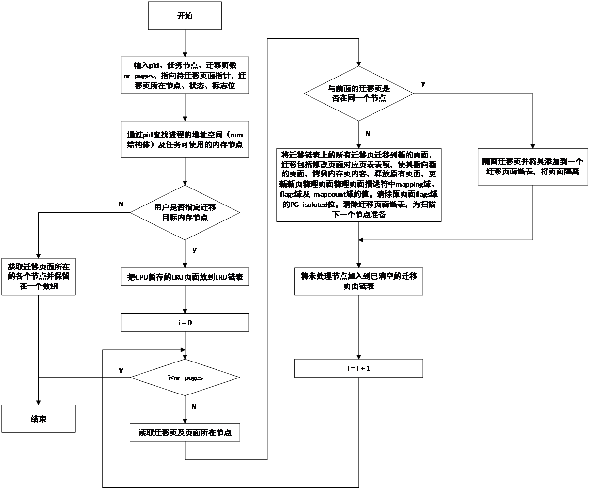

## 内存迁移

内存迁移是Linux改善程序运行效率的一种技术。通过内存迁移，可以在保证进程虚拟地址不变的情况下改变虚拟地址映射的物理内存位置，从而增大物理地址连续的内存模块，或者使进程占据的物理内存尽可能靠近运行进程的CPU。内存迁移允许把虚拟地址映射的物理内存从一个节点移到另一个节点，也允许在进程间移到物理内存。比如当系统采用cpusets进行进程及资源管理时，通常会把CPU与一定的内存节点绑定。当系统把进程从一个cpusets切换到另一个cpusets时，需要同时把相应的内存迁移到绑定节点。

在确定内存适合迁移后，内存迁移的基本操作就是通过正向和逆向映射找到映射到某一物理内存页面的所有页表项，修改这些表项的内容，使其指向新的物理内存，同时修改描述该物理内存页面的页面描述符，修改与映射相关的字段值。当然，内存迁移并不会如此简单，迁移过程中首先要确定内存页是否适合迁移，隔离要迁移的内存以免在进行迁移的过程中其它CPU对所要迁移的页面进行释放或其它操作。

Linux提供了migrate_pages()、sys_move_pages()、handle_pte_fault()及handle_mm_fault()等函数。migrate_pages()供内核进行页面迁移。sys_move_pages()为系统调用函数，供用户手动迁移页面。handle_pte_fault()和handle_mm_fault()为页表出错及进程地址空间出错处理函数，二者均要调用内核提供的一些内存迁移函数迁移内存。

前面我们讲到，为了内存交换，Linux维护了几个LRU链表。为了集中处理LRU链表，每个CPU均用一个pageVec向量表临时保存要放到LRU链表的内存页，在进行链表更新时才会把各个CPU单独保存的页面放到LRU链表。在进行页面迁移之前需要把各个CPU临时保存的页表放到合适的LRU链表上。下面我们以kernel_move_pages()函数为例说明页面迁移的大体工作步骤。

在调用页面迁移函数之前，需要首先通过isolate_movable_page()将需要迁移的页面隔离，这些页面必须是可移动页面。页面迁移包含如下步骤：

- 在进入页面隔离进程后，首先把暂存在各个CPU中pageVec的所有页面放到LRU链表

- 扫描在调用页面迁移进程时指定的所有页面，确定各个页面所在的节点

- 通过进程标识符（pid），确定进程地址空间mm结构体及任务可用内存节点

- 将同一内存节点上的所有迁移页面添加到迁移页面链表，并利用isolate_lru_page()函数隔离待迁移页面

- 在收集完一个节点上的所有页面后，集中把该节点上的所有待迁移页面迁移到新的位置，具体迁移工作由migrate_pages()函数完成，主要工作包括：

1)  根据具体情况，清除原页面描述符flags字段的某些标志位

2)  如果迁移页为脏页，把脏页内容写入到外部存储器，依据迁移模式，系统可能不需要等待写入过程结束

3)  依据原迁移页flags的值，设置新页面描述符flags字段的值，把原页面描述符的index字段和mapping字段拷贝到新页面的页面描述符

4)  把原内存页内容拷贝到新的内存页

5)  修改当前页面对应的所有表项内容，使表项内容指向新的页面

6)  设置页面迁移理由

7)  把原页面从LRU链表删除

8)  把新页面添加到LRU链表

9)  清除原页面描述符flags字段的值，释放原迁移页面

在迁移完所有内存节点的迁移面后，工作结束，图
15‑26给出了一个简单的页面迁移流程图，为了直观、清晰，这里忽略了出错处理及不同类型页面（如不可移动页面、缓存页面、大页等）的差别处理等许多细节。

<figure>

<figcaption>
图 15‑26页面迁移流程
</figcaption>
</figure>

