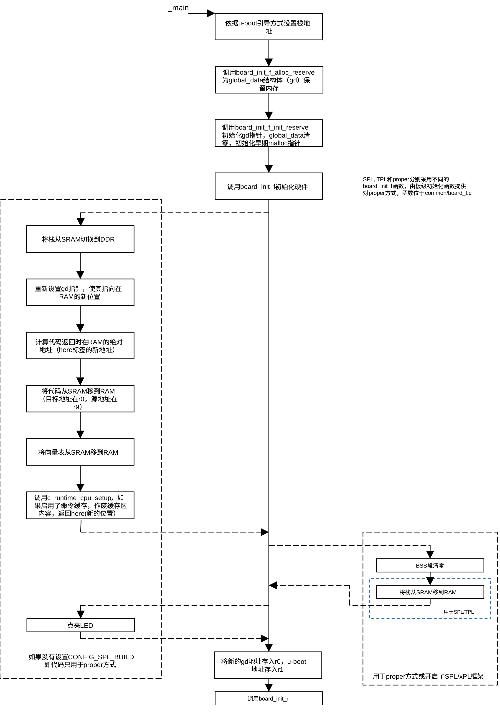
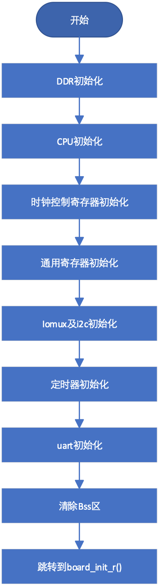
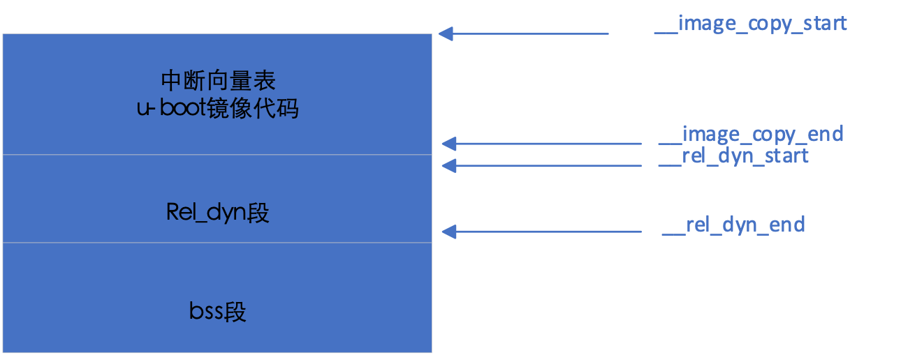
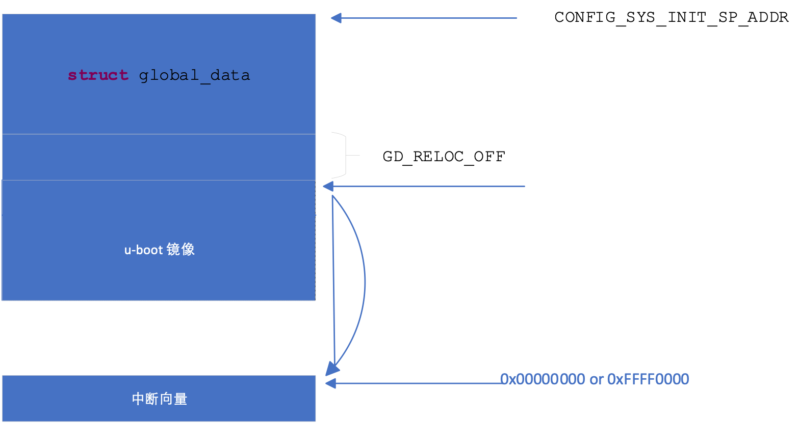

## 初始化c语言运行环境

start.S程序的最后一条语句为跳转到_main的无条件跳转指令，使CPU跳转到定义在crt0.S
的_main处执行后续代码。

在进入 C 语言环境之前，汇编代码 crt0.S
负责最基础的“资源预留”。它首先将global_data结构体的起始地址加载到专用寄存器中（如
ARM 32的 r9 ），设置好 C 语言运行所需的堆栈指针，使得后续的 C
代码可以通过 gd-\>xxx 直接访问。通过调用 board_init_f_alloc_reserve
计算并预留出 gd 结构体和初期栈所需的内存空间，接着调用
board_init_f_init_reserve 将预留的 gd
区域内存清零，以确保所有成员初始值为
0，然后调用board_init_f为gd结构体成员赋值。

proper使用的栈地址为CONFIG_SYS_INIT_SP_ADDR，SPL使用的栈地址为CONFIG_SPL_STACK，TPL使用的栈地址为CONFIG_TPL_STACK。这些宏常量定义在目录git/include/configs下的某个文件里。对i.MX6处理器而言，CONFIG_SPL_STACK定义在imx6_spl.h文件里。

在 U-BOOT 中，结构体struct global_data（通常缩写为
gd）是一个贯穿系统启动全生命周期的全局核心数据结构，
其主定义位于源码的git/ include/asm-generic/global_data.h 文件中。由于
U-BOOT 在重定位（Relocation）之前没有可用的全局变量区（BSS
段未初始化），它通过在堆栈或特定寄存器中维护该结构体的指针来跨函数传递状态。

该结构体包含大量字段，用于记录硬件参数、内存分布及重定位信息，是从
board_init_f()（重定位前）向
board_init_r()（重定位后）传递参数的主要桥梁。该结构体成员主要有：

- bd_t \*bd

> 指向板级信息结构体（board
> info），包含内存起始地址、大小等基础硬件参数。

- unsigned long flags

> 指示当前运行状态的标志位（如：已初始化、已重定位、安静模式等）。

- unsigned int baudrate

> 记录控制台的串口波特率。

- unsigned long relocaddr

> U-BOOT 重定位后的目标起始地址。

- unsigned long reloc_off

> 实际运行地址与链接地址之间的偏移量。

- const void \*fdt_blob

> 存储设备树（DTB）的内存地址。

- struct udevice \*cur_serial_dev

> 指向当前正在使用的串口设备。

crt0.S位于git/arch/arm/lib目录内。crt0.S代码的程序流程如下图所示：

<figure>

<figcaption>
图 5‑5 crt0.s 程序流程
</figcaption>
</figure>

board_init_f()位于git/common/board_f.c，它是Linux通用的board_init_f()函数，用于proper引导方式。它通过initcall_run_list()函数执行一系列由init_sequence_f定义的初始化操作，定义位于board_f.c。通过编译开关，init_sequence_f定义了大量针对不同架构、不同功能选择的硬件初始化函数。开发者依据自己的需求，通过编译开关选择适合自己的硬件初始化序列。

该序列函数可分为基础环境搭建、硬件核心初始化、内存布局规划
和为最后的重定位或加载并运行做准备四个阶段。

基础环境搭建阶段主要包括的函数为：

- setup_mon_len

> 计算 U-BOOT 代码的总长度，为后续的内存分配和重定位做准备。

- fdtdec_setup

> 准备 DTB（设备树）。让 U-BOOT
> 知道当前硬件有哪些外设（如串口基地址是多少）。

- initf_malloc

> 设置简易的堆空间（Early
> Malloc）。因为此时正式内存还没好，需要一小块空间存放临时对象。

- initf_dm

> 初始化 Driver Model (DM)。这是 U-BOOT
> 的设备驱动架构，运行后才能通过“名字”找到驱动。

硬件核心初始化阶段包括的主要函数为：

- arch_cpu_init / mach_cpu_init

> SoC
> 级别的寄存器操作。比如设置内部总线频率、关闭一些会干扰启动的硬件模块。

- timer_init

> 初始化硬件定时器。有了它，代码里的 udelay() 和超时检测才能生效。

- env_init

> 查找环境变量（Environment）存储在哪个位置（SD卡、Flash
> 还是默认内存中）。

- serial_init / console_init_f:

> 最关键的一步。初始化串口驱动。这步之后，才能在串口终端看到打印信息。

- dram_init

> 初始化DRAM，分水岭函数。在 TPL/SPL 中，它是重头戏，负责配置 DDR
> 控制器，让外部 RAM 真正可用。在 Proper 中，它通常只是通过读取寄存器或
> DTB 来确认内存大小。

内存布局规划阶段包括的函数主要有：

- reserve_mmu

> 留出页表空间，准备开启缓存（Cache）提速。

- reserve_u-boot

> 给 U-BOOT 移动留空间。

- reserve_global_data

> 存放全局变量结构体（GD）。

- reserve_stacks

> 设置 C 语言运行需要的栈（Stack）。

最后的准备阶段包含的主要函数有：

- setup_reloc

> 确定U-BOOT移动的最终目标地址。

- clear_bss

> 清空未初始化全局变量区（BSS
> 段）。到此为止，已具备运行用c语言编写的程序所需要的环境（堆栈准备就绪，BSS段清零）。

- jump_to_copy (或后续的汇编动作)

> 在 Proper 中，把代码从 Flash 拷贝到 DDR，然后跳过去运行重定位操作。
>
> 在 SPL/TPL 中，虽然也走这个序列，但通常在 board_init_r
> 中就会直接去寻找并加载下一阶段镜像了。

对i.MX6系列处理器，为了节省内存，当采用spl引导方式时，在git/board/freescale/mx6sabresd.c文件里对函数board_init_f()进行了简化，其初始化函数为：

<figure>

<figcaption>
图 5‑6 board_init_f函数流程
</figcaption>
</figure>

针对不同的引导方式，
crt0.S提供了不同的初始化程序。proper方式要移动U-BOOT代码在DDR的位置，调用的relocate_code和relocate_vectors子程序定义在relocate.S文件中。spl方式要移动堆栈的位置，调用的堆栈移动程序位于git/common/spl.c文件中。

relocate_code的功能是把位于\_\_image_copy_start和\_\_image_copy_end间的代码移动到寄存器r0指向的RAM，这段代码就是U-BOOT目录下的built.o代码，也就是当前正在执行的已调入内存的代码。relocate_vectors用于把中断向量移动到指定位置。

U-BOOT的内存分配如下图所示：

<figure>

<figcaption>
图 5‑7 U-BOOT内存分配
</figcaption>
</figure>

链接程序把U-BOOT启动过程中需要的程序代码放在\_\_image_copy_start段，而把通过U-BOOT命令行调用的代码作为动态调用模块，调用这些模块所需的信息放在rel_dyn段。在执行relocate_code代码后，U-BOOT镜像在内存的位置为：

<figure>

<figcaption>
图 5‑8 代码移动后U-BOOT内存分配
</figcaption>
</figure>

根据CPU的设置，relocate_vectors再次把中断向量移动到0x00000000或0xFFFF0000。ARM
V7允许把中断向量放在低地址(0x00000000)或高地址（0xFFFF0000），放在低端或高端由cp15
c1的v位控制。下图为移动后的内存分布。

<figure>

<figcaption>
图 5‑9 ARM中断向量位置
</figcaption>
</figure>

如果U-BOOT引导方式为proper，调用c_runtime_cpu_setup作废命令缓存（如果启用了命令缓存）。

c_runtime_cpu_setup调用之后的代码用于proper方式以及开启了
CONFIG_SPL_FRAMEWORK的SPL 。如果SPL足够复杂、必须开启
CONFIG_SPL_FRAMEWORK。这段代码的核心作用是清理环境、可选地重定向栈和
GD，然后正式跳转到 board_init_r。