## 初始化地址转换页表

在修改地址转换程序后，head.S代码接下来的工作是初始化地址转换页表，为使用地址管理模块做准备。初始化页表的子程序为\_\_create_page_table，这里需要指出的是，这个页面页表只在初始引导阶段使用。在进入该子程序之前，r8保存有地址偏差量，r9保存cpuid，r10保存cpu信息。要了解初始化页表的工作流程，有必要介绍一下arm页表的结构。

初始使用的页面页表的起始地址为标号swapper_pg_dir的地址，该标号等于：

KERNEL_RAM_VADDR-PG_DIR_SIZE，

而:

KERNEL_RAM_VADDR = PAGE_OFFSET+TEXT_OFFSET

其中TEXT_OFFSET为内核代码中.text段的起始地址，因而KERNEL_RAM_VADDR为内核代码的起始虚拟地址（见[图
39](#Ref139036749)），也就是说内核空间的起始地址与内核的起始地址之间有TEXT_OFFSET字节的空间。这一空间除了用作页面页表外，还用于存储从U-BOOT传递给内核的引导参数。通常，TEXT_OFFSET等于0x8000，PG_DIR_SIZE等于0x4000。当然，不同的系统，这些值可以不同，但要足够大，以免与内核代码重叠。

通过简单迭代可知， 页面页表的起始地址为：

swapper_pg_dir = PAGE_OFFSET+TEXT_OFFSET-PG_DIR_SIZE

其物理地址可以利用公式：

PHYS_OFFSET+TEXT_OFFSET-PG_DIR_SIZE

获得（见图6-5）。这一页面页表的内容仅在初始化的初期使用。在使用地址管理模块后，要重新设置页表的内容，供Linux系统正常内存管理使用。

<center>
<figure>

<figcaption><p>图 6‑4
页面页表在虚拟地址和物理地址的位置实例</p></figcaption>
</figure>

<figure>
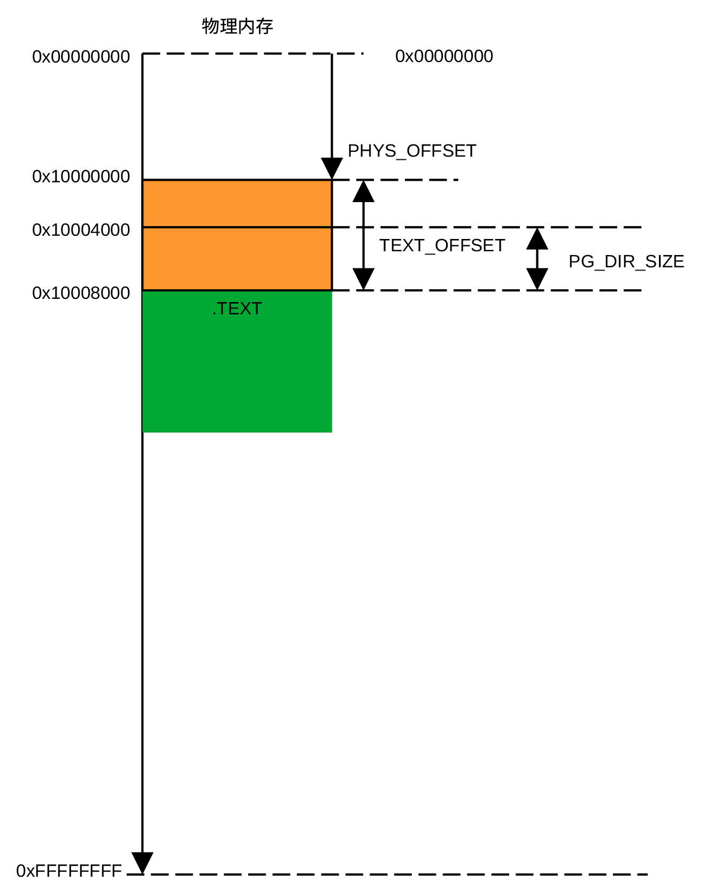
<figcaption><p>图 6‑5 页面页表的起始物理地址</p></figcaption>
</figure>
</center>

### ARM页表

内存管理模块（MMU）利用页表进行地址转换。页表是表项字长为32位或64位的表格，表项字长为32位的表格为短格式表格，表项字长为64位的表格为长格式表格。每个表项用以确定虚拟地址转换到物理地址的地址范围，指定区域的大小，规定该地址范围的内存属性以及访问权限。内存管理模块在地址转换中使用哪种格式由寄存器TTBCR的EAE位决定，当EAE位为0时，页表为短格式，为1时，页表为长格式。

ARM32内存管理模块支持两级和三级地址转换。短格式页表可用于一级和两级地址转换，长格式页表只用于三级地址转换，长短格式均支持40位地址空间。通过这些页表，内存管理模块能够以段（1MB）、超段（16MB）、页（4KB）和大页（64KB）为单位进行地址转换。在Linux系统中，初始阶段以段为单位进行内存地址转换，初始化结束后，转换的基本单位为页。

采用不同的转换单位，页表格式不同，第一级地址转换与第二级地址转换的表项格式也不同。用于第一级转换的短表格式有页、段和超段等4种格式。当ARM支持40位扩充地址空间时，短表格式包含图6-6所示的4种格式，其中第一种为非法格式。

<center>
<figure>
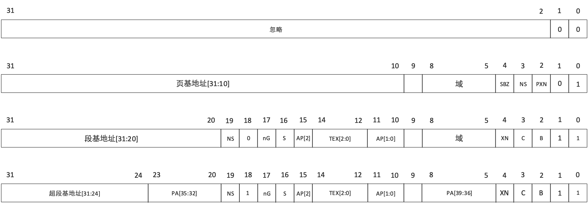
<figcaption><p>图 6‑6 支持40位地址空间ARM的短表格式</p></figcaption>
</figure>
</center>

而当ARM不支持40位扩充地址空间时，页表格式包含图6-7所示的4种格式，其中第一种为非法格式。

<center>
<figure>

<figcaption><p>图 6‑7 仅支持32位地址空间ARM的短表格式</p></figcaption>
</figure>
</center>

当位1的值为1时，对应的格式为段或超段格式，这时位18用来区分段和超段。NS位用来定义内存的安全属性，NS=0表示表项对应的内存区域为安全区域，NS=1表示表项对应的区域为非安全区域。SBZ表示所在的位置零，PXN表示具有优先级的程序可在对应区域运行，XN表示对应区域永远不允许运行程序。TEX、C、B位的组合表示内存是否共享，是否可缓存等各种内存属性。AP表示对应区域的允许访问方式，包括是否可读、是否可写，以及具有哪一优先级的用户才能够读或写等。这些位控制程序的读写，与地址转换本身关系不大。与地址转换本身有关的是各种基地址位及PA\[39:32\]位。

当表项对应的转换区域为段或超段时，只有一级转换，而当表项对应的转换区域为页或大页时，需要两级地址转换。图6-8给出了二级页表使用的短格式，其中第一种格式非法。大页格式表项内容给出高16位地址，其转换的最小单位为2<sup>32-16</sup>
= 64KB，页格式表项内容给出高20位地址，其最小转换单位为2<sup>32-20</sup>
= 4KB。

<center>
<figure>
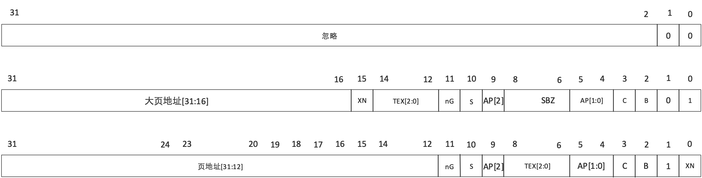
<figcaption><p>图 6‑8 第二级转换所用页表格式</p></figcaption>
</figure>
</center>

### 地址转换

在介绍了页表格式后，接下来介绍从虚拟地址转换为物理地址的过程。由于Linux只使用段格式和页格式两种页表格式，下面以段格式和页格式页表为例，介绍ARM如何把虚拟地址转换为物理地址。

<center>
<figure>
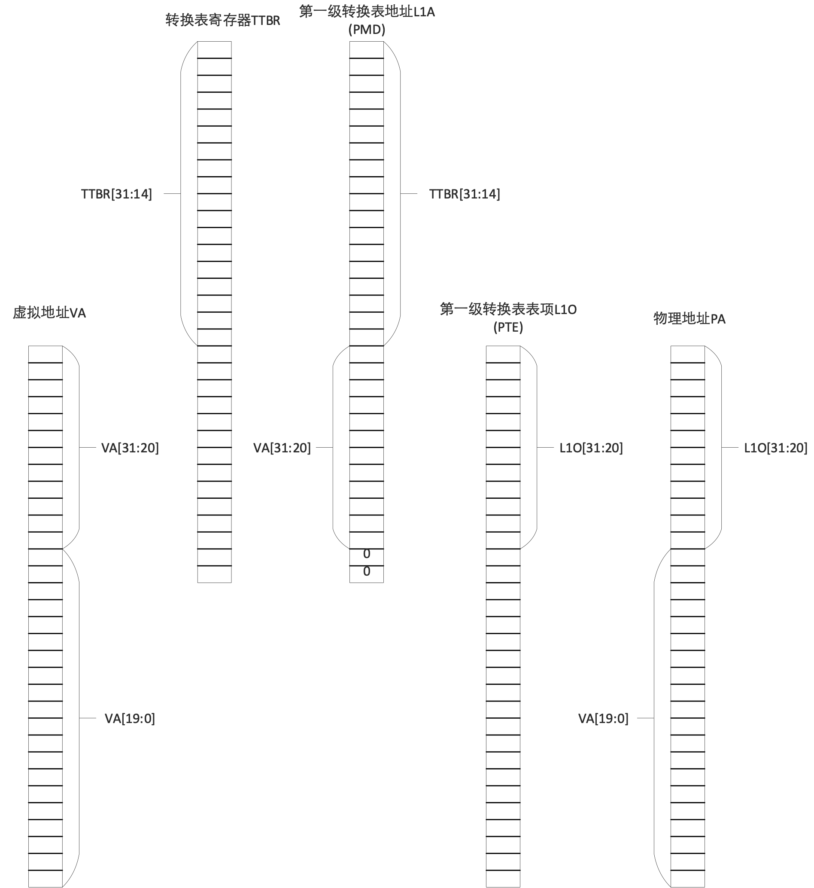
<figcaption><p>图 6‑9
采用段进行虚拟地址到物理地址的转换过程</p></figcaption>
</figure>
</center>

当采用段进行地址转换时，虚拟地址（输入地址）的高12位(VA\[31:20\])与页表基地址寄存器的高18位（TTBRx\[31:14\]）组成表项物理地址L1A的高30位，其中VA\[31:20\]构成L1A\[13:2\]，页表基地址寄存器的高18位构成访L1A\[31:14\]，L1A\[1:0\]
= 00，这样，每个虚拟地址可以访问页表的32位（4个字节）内容。

利用L1A\[31:0\]作为内存物理地址访问一级页表，获得表项数据L1O\[31:0\]。读取的表项数据中的L1O\[31:20\]位与虚拟地址中的VA\[19:0\]位构成内存物理地址，而L1O\[19:0\]位则定义该内存单元的各种属性。

如果地址转换单位为页或大页，需要将地址空间进一步划分，这时需要采用两级地址转换，转换过程示于图6-10。

<center>
<figure>
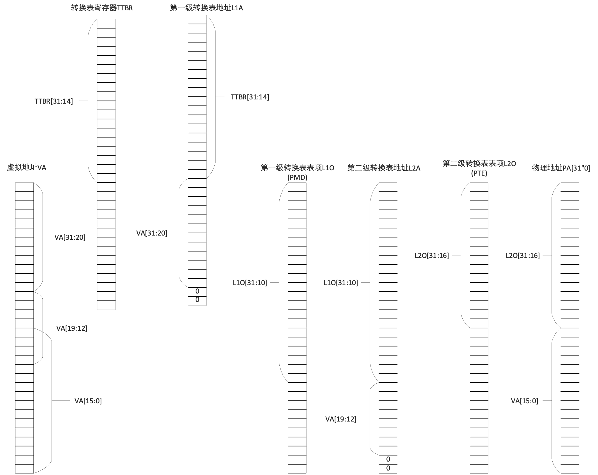
<figcaption><p>图 6‑10
采用页进行虚拟地址到物理地址的转换过程</p></figcaption>
</figure>
</center>

首先利用虚拟地址的VA\[31:20\]与页表寄存器的TTBRx\[31:14\]组成访问一级页表地址L1A的L1A\[31:2\]部分，把L1A\[1:0\]置零，然后把L1A作为访问一级页表的物理地址，读取一级页表的表项内容L1O\[31:0\]，把L1O\[31:10\]与虚拟地址VA\[19:12\]组合，形成访问二级页表地址L2A的L2A\[31:2\]，把L2A\[1:0\]置零后形成访问二级页表表项的地址，读取该表项的内容L2O\[31:0\]，最终物理地址的PA\[31:12\]由L2O\[31:12\]构成，PA\[11:0\]由虚拟地址VA\[11:0\]构成，这样就完成了一次从虚拟地址到物理地址的二次转换。

事实上并不是每一次转换都要通过读取页表进行地址转换。ARM有一个TLB（Table
Lookaside
Buffer）缓存区，在进行地址查询之前，先从TLB中查询是否保存有与VA相应的PA。如果TLB保存有相应的物理地址，则直接利用该物理地址，如果没有保存，则利用页表查询相应的物理地址。

### Linux初始化页表

Linux在地址转换过程中使用多级地址转换，分别为PGD，P4D，
PUD，PMD及PTE。PGD（Page Global
Directory)为最上层的页表，用以对整个物理地址空间进行管理，P4D（Page
4<sup>th</sup> level Directory）、PUD（Page Upper Directory）、PMD（Page
Middle
Directory）用于中间过程地址转换。PMD为PTE的上一级页表，通过它可以得到PTE的地址。PTE（Page
Table
Entry）为最后一级地址转换，Linux通过PTE获取虚拟地址最终对应的物理地址。它们之间的关系可用下图表示：

<center>
<figure>
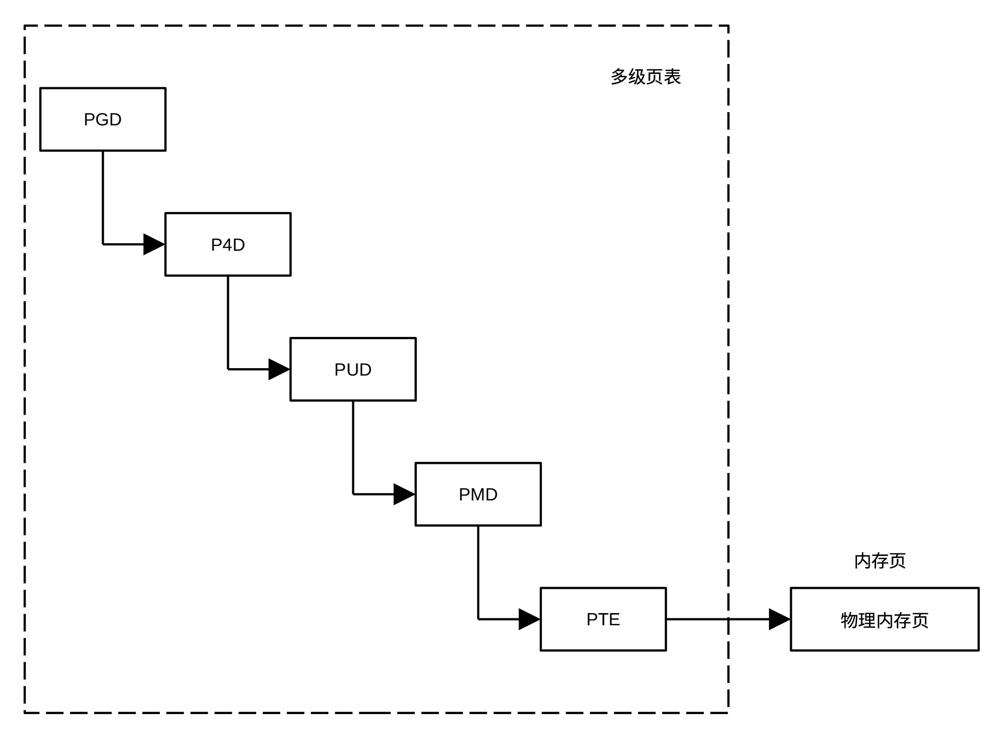
<figcaption><p>图 6‑11 Linux多级页表</p></figcaption>
</figure>
</center>

### 利用ARM页表实现三级Linux地址转换

ARM版Linux使用了三级地址转换，分别为
PGD、PMD和PTE，其中PGD对应于ARM的页表基地址寄存器TTBR0和TTBR1，通过它获取访问PMD页表的地址。当ARM仅支持32位地址空间时，使用两级地址转换，而Linux使用三级地址转换。这时，只要将PGD表项与PMD表项一一对应，比如将PGD表项内容与PMD表项内容设为同样的值，Linux就可以利用arm的两级地址转换硬件实现名义上的三级地址转换。在实际代码中，通过把P4D、PUD与PMD等三个页表的内容设置为相同值实现两级地址转换。下面给出了三级Linux地址转换使用两级arm地址转换硬件的示意图。

<center>
<figure>
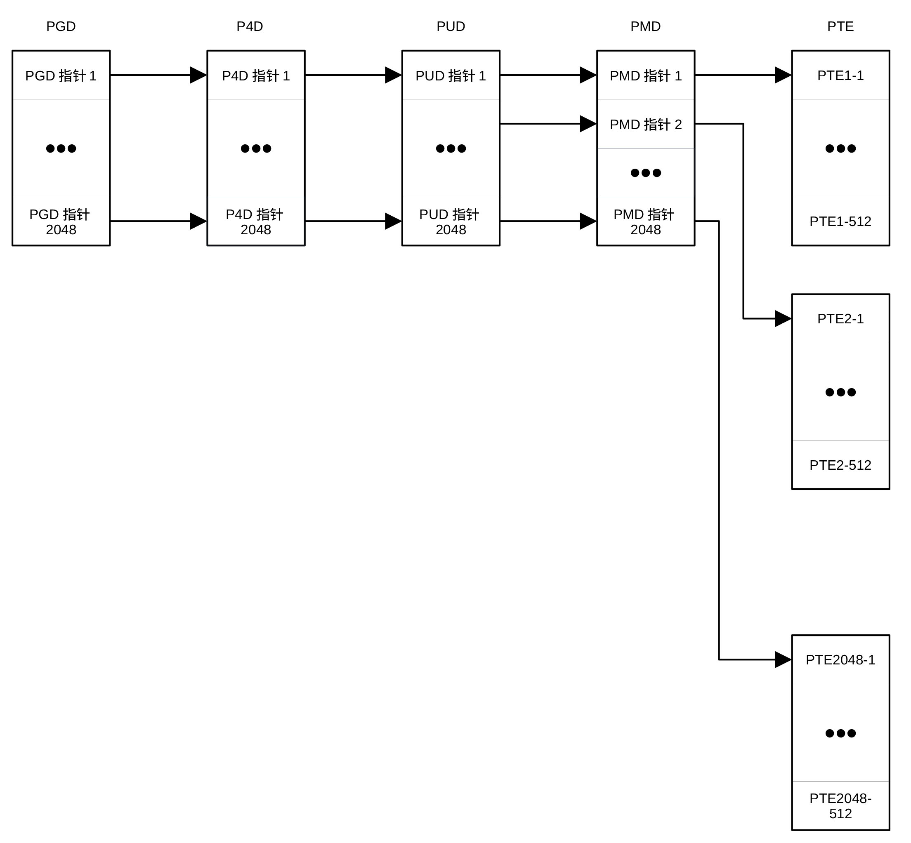
<figcaption><p>图 6‑12 Linux使用两级ARM地址转换示意图</p></figcaption>
</figure>
</center>

在Linux内存管理模块中，PMD定义PTE以外各级页表的格式，相当于arm中一级页表（即段、超段页表），PTE定义页页表，相当于arm的二级页表。

以段为单位进行地址转换只需要一级地址转换。在初始引导阶段，对内存的利用率没有很高的要求，为了简单，Linux在初始化阶段采用段进行地址转换，因此，在初始化页表时，表项格式采用段格式。下面介绍Linux初始化采用段格式的页表的过程。

Linux初始化页表的代码示于下面，采用汇编语言编写，代码段以标号\_\_create_page_tables:开始。

```
__create_page_tables:

 pgtbl r4, r8 @ page table address

 mov r0, r4

 mov r3, #0

add r6, r0, #PG_DIR_SIZE

1: str r3, [r0], #4

str r3, [r0], #4

str r3, [r0], #4

str r3, [r0], #4

teq r0, r6

bne 1b

str r3, [r0], #4 @ set bottom PGD entry bits

str r7, [r0], #4 @ set top PGD entry bits

add r3, r3, #0x1000 @ next PMD table

subs r6, r6, #1

bne 1b

add r4, r4, #0x1000 @ point to the PMD tables

ldr r7, [r10, #PROCINFO_MM_MMUFLAGS] @ mm_mmuflags

adr r0, __turn_mmu_on_loc

ldmia r0, {r3, r5, r6}

sub r0, r0, r3 @ virt->phys offset

add r5, r5, r0 @ phys __turn_mmu_on

add r6, r6, r0 @ phys __turn_mmu_on_end

mov r5, r5, lsr #SECTION_SHIFT

mov r6, r6, lsr #SECTION_SHIFT

1: orr r3, r7, r5, lsl #SECTION_SHIFT @ flags + kernel base

str r3, [r4, r5, lsl #PMD_ORDER] @ identity mapping

cmp r5, r6

addlo r5, r5, #1 @ next section

blo 1b

add r0, r4, #PAGE_OFFSET >> (SECTION_SHIFT - PMD_ORDER) @r0--page
table index

ldr r6, =(_end - 1) @ the end, r4--page table base

orr r3, r8, r7 @r8--phys_offsec, r7--memory attribute

add r6, r4, r6, lsr #(SECTION_SHIFT - PMD_ORDER) @r6--index
corresponding _end

1: str r3, [r0], #1 \<\< PMD_ORDER @update 32-bit entry index

add r3, r3, #1 << SECTION_SHIFT

cmp r0, r6

bls 1b

mov r0, r2, lsr #SECTION_SHIFT

movs r0, r0, lsl #SECTION_SHIFT @if r0=0, then Z=1, EQ

subne r3, r0, r8 @ r0!=0, the distance from phys_offset

addne r3, r3, #PAGE_OFFSET @ the virtual address of r2

addne r3, r4, r3, lsr #(SECTION_SHIFT - PMD_ORDER) @index into page
table

orrne r6, r7, r0 @item of page table

strne r6, [r3], #1 << PMD_ORDER

addne r6, r6, #1 \<\< SECTION_SHIFT

strne r6, [r3]

ret lr

ENDPROC(__create_page_tables)

.ltorg

.align

__turn_mmu_on_loc:

.long .

.long __turn_mmu_on

.long __turn_mmu_on_end
```

在进入该段代码之前，寄存器r8保存内存物理地址偏移(phys_offset)，r9保存有cpu
id，r10保存有用来存储cpu信息的内存地址。初始化页表代码的第一条指令为宏pgtbl
r4, r8，其作用是计算PHYS_OFFSET +
TEXT_OFFST-PG_DIR_SIZE，结果保存在r4寄存器。从[图
40](#Ref139037287)可以看出，该值为页表的起始地址。

紧随计算页表起始地址代码的是代码段：

```
mov r0, r4

mov r3,#0

add r6, r0, #PG_DIR_SIZE

1: str r3, [r0], #4

str r3, [r0], #4

str r3, [r0], #4

str r3, [r0], #4

teq r0, r6

bne 1b
```

其作用是把整个页表占用的内存空间清零。

同一个虚拟地址，启用MMU前后访问的物理地址可能不同。启用MMU的代码本身的地址，在MMU启用过程中必须保持一致，否则，启用MMU代码的程序无法正常运行，MMU启用会失败。为此，需先为MMU启用代码建立页表表项，使这一段代码的地址在启用前后的地址一致，也就是把这一段代码的实际物理地址的高12位存储在页表表项的段基地址域。代码段：

```
adr r0, __turn_mmu_on_loc

ldmia r0, {r3, r5, r6}

sub r0, r0, r3 @ virt->phys offset

add r5, r5, r0 @ phys __turn_mmu_on

add r6, r6, r0 @ phys __turn_mmu_on_end

mov r5, r5, lsr #SECTION_SHIFT

mov r6, r6, lsr #SECTION_SHIFT

1: orr r3, r7, r5, lsl #SECTION_SHIFT @ flags + kernel base

str r3, [r4, r5, lsl \#PMD_ORDER] @ identity mapping

cmp r5, r6

addlo r5, r5, #1 @ next section

blo 1b

.align

__turn_mmu_on_loc:

.long .

.long __turn_mmu_on

.long __turn_mmu_on_end
```

的作用是为\_\_turn_mmu_on到\_\_turn_mmu_on_end间的内存建立1：1（即identity转换）的页表表项。利用这样的页表表项进行地址转换时，输入地址和输出地址相同。下面详细说明一下这段代码的工作原理。

指令`adr r0,__turn_mmu_on_loc`计算标号\_\_turn_mmu_on_loc的物理地址，指令`ldmia r0,{r3, r5,r6}`把.（即标号\_\_turn_mmu_on_loc）、\_\_turn_mmu_on、\_\_turn_mmu_on_end的虚拟地址（地址偏移量）分别读入r3、r5和r6寄存器，指令`subr0, r0, r3`计算出内存的起始物理地址（PHYS_OFFSET），指令：

```
add r5, r5, r0

add r6, r6, r0
```

分别计算\_\_turn_mmu_on、\_\_turn_mmu_on_end的物理地址。移动指令：

```
mov r5, r5, lsr \#SECTION_SHIFT

mov r6, r6, lsr \#SECTION_SHIFT
```

使寄存器r5和r6只保留地址对应的段的部分。为了使支持40位地址空间的arm内核与支持32位地址空间的arm内核尽量使用同样的代码。当使用两级转换时，SECTION_SHIFT定义为20，当使用三级转换时，SECTION_SHIFT为21。由于初始阶段采用二级转换，因此SECTION_SHIFT的值为20。指令：

```
orr r3, r7, r5, lsl #SECTION_SHIFT

str r3, [r4, r5, lsl \#PMD_ORDER]
```

把段与内存属性组合在一起，构成一个页表表项，然后存储在由r4指定的页表里。由于页表表项占用32位，因此PMD_ORDER等于2。这段代码的工作流程为：

<center>
<figure>
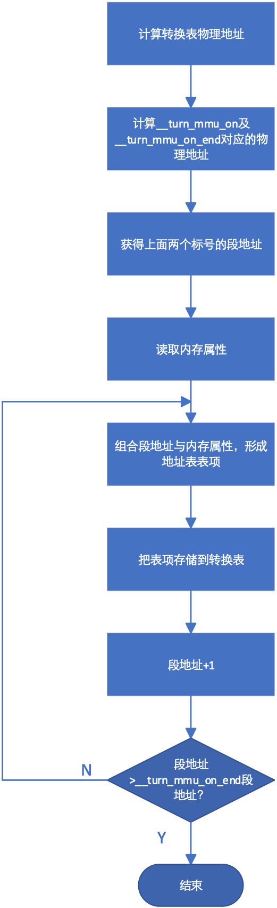
<figcaption><p>图 6‑13 页表初始化流程</p></figcaption>
</figure>
</center>

在建立1:1的页表后，下面的代码为始于PAGE_OFFSET、终于_end的内核.bss段建立页表。方法与建立1:1页表的类似，只是不要求转换前后的地址相同，下面的这段代码用于完成这一工作。

```
add r0, r4, #PAGE_OFFSET >> (SECTION_SHIFT - PMD_ORDER)

ldr r6, =(_end - 1)

orr r3, r8, r7

add r6, r4, r6, lsr #(SECTION_SHIFT - PMD_ORDER)

1: str r3, [r0], #1 \<\< PMD_ORDER

add r3, r3, #1 \<\< SECTION_SHIFT

cmp r0, r6

bls 1b
```

在执行该段代码前，r4保存有页表的首地址，r7保存内存属性信息，r8保存PHYS_OFFSET。第一行代码计算对应虚拟地址PAGE_OFFSET的表项在页表中的位置。由于每一个页表表项占用4个字节，所以要把PAGE_OFSET右移18位而不是20位。指令

```
orrr3, r8,r7
```
获得表项内容，PHYS_OFFSET的低20位必须为零，对ARM而言，这个条件是成立的。从代码中很容易看出，r6的值是_end对应的表项在页表的位置，代码

```
str r3, [r0], #1 <<PMD_ORDER
```

把表项存储在页表相应位置，并更新r0的值，使r0指向下一个表项位置。指令

```
addr3, r3, #1 << SECTION_SHIFT
```
在表项的段域加1，使表项的段域对应下一个物理地址。该段代码的工作流程如下所示：

<center>
<figure>
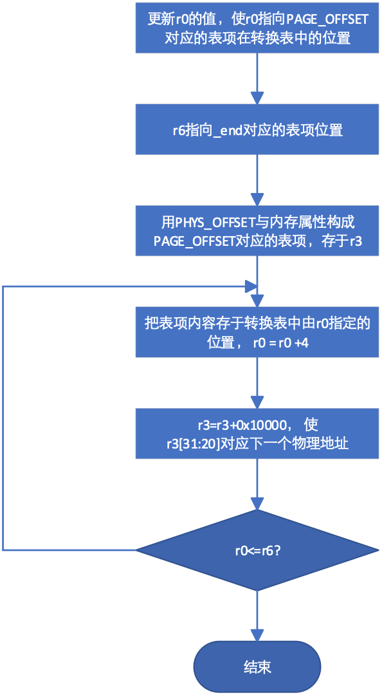
<figcaption><p>图 6‑14 内核.bss段页表设置</p></figcaption>
</figure>
</center>

在U-BOOT引导Linux内核过程中，除了把Linux内核导入内存之外，还把设备树/引导参数导入内存。在整个运行过程都要使用这些参数或设备树，因此需要为这个区域建立页表。U-BOOT在把设备树或引导参数导入内存后，把这些数据所在区域的起始位置保存在寄存器r2中。这些数据所占内存小于一个段，但由于它们所处位置可能接近段的边缘，数据可能会横跨两个段，因此，这段内存需要两个表项。下面这段代码负责为这些数据所处区域建立页表。

```
mov r0, r2, lsr #SECTION_SHIFT

movs r0, r0, lsl #SECTION_SHIFT

subne r3, r0, r8

addne r3, r3, #PAGE_OFFSET

addne r3, r4, r3, lsr #(SECTION_SHIFT - PMD_ORDER)

orrne r6, r7, r0

strne r6, [r3], #1 << PMD_ORDER

addne r6, r6, #1 << SECTION_SHIFT

strne r6, [r3]

ret lr
```

指令：

```
mov r0, r2, lsr #SECTION_SHIFT

movs r0, r0, lsl #SECTION_SHIFT
```

用于获取设备树/引导参数所在区域的段地址（b\[31:20\]），指令：

```
subne r3, r0, r8

addne r3, r3, #PAGE_OFFSET
```

计算出这些区域的虚拟地址(phys_addr-PHYS_OFFSET+PAGE_OFFSET)，指令：

```
addne r3, r4, r3, lsr #(SECTION_SHIFT - PMD_ORDER)
```

计算该虚拟地址对应的表项在页表的位置，指令:

```
orrne r6, r7,r0
```

用于获取对应于设备树/引导参数内存地址的表项内容。最后两条指令把表项存入到页表中的相应的位置，任务完成后返回调用程序。

通过前述页表建立的物理地址与虚拟地址之间的关系示于下图。

<center>
<figure>
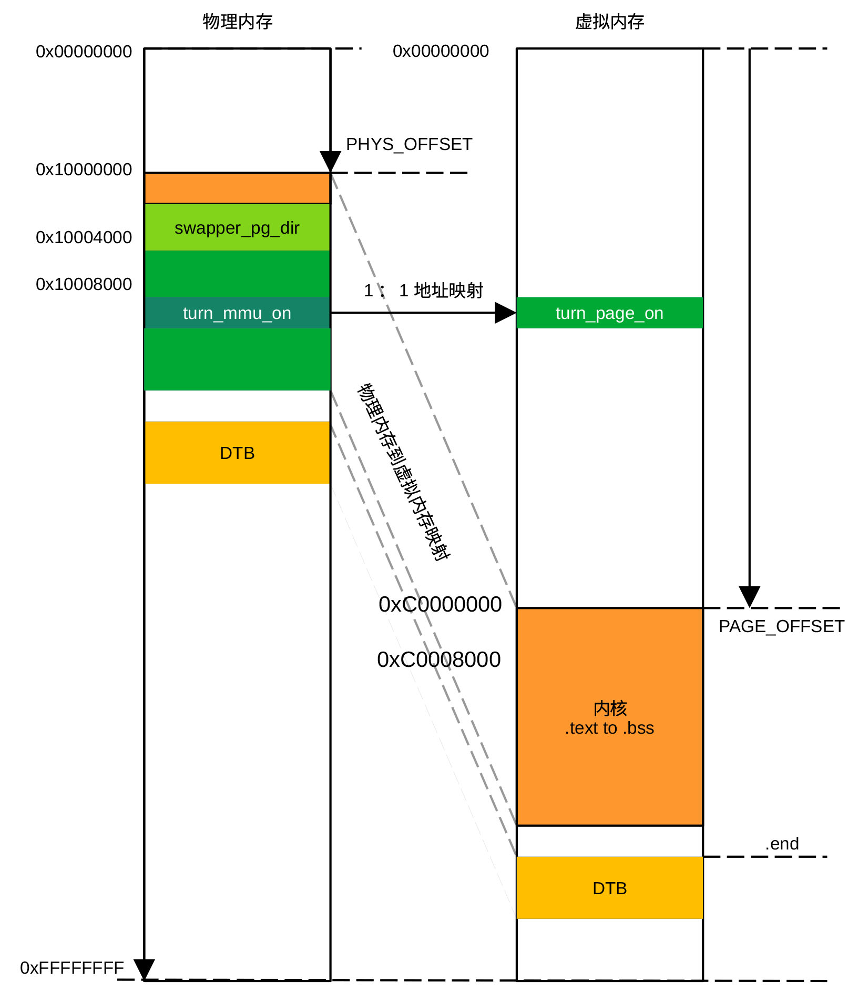
<figcaption><p>图 6‑15
通过页表建立的虚拟地址与物理地址的对应关系</p></figcaption>
</figure>
</center>

### 启用内存管理模块

在初始化页表后，接下来要做的工作是为启用MMU做准备。首先把启用MMU后要跳转到的地址\_\_mmap_switched存入r13寄存器（SP），程序调用后的返回地址（标号1）保存到lr寄存器。下面的代码是支持32位地址空间时启动mmu的代码。在执行下面的代码之前，r4保存页表基地址，r10保存对应于所用ARM型号的proc_info_list的地址。

```
ldr r13, =__mmap_switched

badr lr, 1f

mov r8, r4

ldr r12, [r10, \#PROCINFO_INITFUNC]

add r12, r12, r10

ret r12

1: b __enable_mmu
```

代码

```
ldr r13, = __mmap_switched
```

把\_\_mmap_switched的值(标号地址)存入r13，

```
badr lr, 1f
```
把标号1的物理地址存入lr（返回地址），

```
mov r8, r4
```

把页表基地址存于r8，指令

```
ldr r12, [r10, #PROCINFO_INITFUNC]
```

用于获取\_\_cpu_flush
相对proc_info_list的偏移，指令

```
add r12, r12, r10
```

把程序\_\_cpu_flush的地址存于r12，而指令

```
ret r12
```

执行\_\_cpu_flush子程序。

对arm v7
cortex-A9处理器而言，\_\_cpu_flush程序定义在文件git/arch/arm/mm/proc-v7.S文件中，代码为：

```
__v7_ca9mp_setup:

mov r10, #(1 \<\< 0) @ Cache/TLB ops broadcasting

adr r0, __v7_setup_stack_ptr

ldr r12, [r0]

add r12, r12, r0 @ the local stack

stmia r12, {r1-r6, lr} @ save r0-r6,lr to __v7_setup_stack

bl v7_invalidate_l1

ldmia r12, {r1-r6, lr}

b __v7_setup_cont
```

这段程序的功能是把寄存器r1-r6和lr保存到堆栈\_\_v7_setup_stack，然后调用v7_invalidate_l1作废缓存内容。在把r1-r6及lr寄存器的值恢复到调用作废缓存子程序之前的值后，调用\_\_v7_setup_count设置BBTR1及BBTCR寄存器。

下面为作废第一级缓存的子程序代码，该段代码通过读取协处理器CP15寄存器获取高速缓存拥有的组数和路数，然后通过写CP15寄存器c7依次作废各组中各路缓存。

```
ENTRY(v7_invalidate_l1)

mov r0, #0

mcr p15, 2, r0, c0, c0, 0 @写 缓存选择寄存器（CSSELR）, 选择 L1

mrc p15, 1, r0, c0, c0, 0 @读缓存大小寄存器（ CSSIDR）

movw r1, #0x7fff

and r2, r1, r0, lsr #13 @读取缓存分组数目(实际数值=组数-1)

movw r1, #0x3ff

and r3, r1, r0, lsr #3 @ 读取每一组的路数（实际数值=路数-1）

add r2, r2, #1 @ 组数

and r0, r0, #0x7 @每一行的字数（实际值=log<sub>2</sub>(字数)-2）

add r0, r0, #4 @ 组值在DCISW寄存器所处位置

clz r1, r3 @ 路数在DCISW寄存器所处位置

add r4, r3, #1 @ NumWays

1: sub r2, r2, #1 @ NumSets--

mov r3, r4 @ Temp = NumWays

2: subs r3, r3, #1 @ Temp--

mov r5, r3, lsl r1

mov r6, r2, lsl r0

orr r5, r5, r6 @ DCISW寄存器的值

mcr p15, 0, r5, c7, c6, 2 @写DCISW, 作废缓存当前所在的路

bgt 2b @作废当前组的所有路

cmp r2, #0

bgt 1b @作废所有组

dsb st

isb

ret lr

ENDPROC(v7_invalidate_l1)
```

上面代码的流程图为：

<center>
<figure>
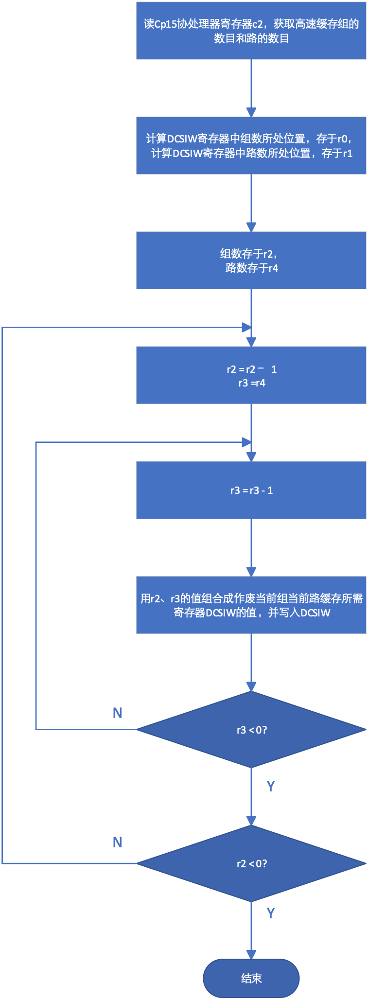
<figcaption><p>图 6‑16 高速缓存作废流程</p></figcaption>
</figure>
</center>

之后程序跳转到\_\_v7_setup_cont执行后续操作。\_\_v7_setup_cont代码段先打补丁，修复一些硬件缺陷。由于NXP芯片不使用这些补丁，这里去掉了补丁程序部分。在打补丁之后，程序分别往协处理器cp15的寄存器c7和c8写入0，作废指令缓存区和TLB的内容，然后利用宏v7_ttb_setup
r10, r4, r5, r8,
r3设置页表基地址控制寄存器(TTBCR)，并把r8的内容写入到页表基地址寄存器TTBR1，最后设置主空间和常规内存空间再映射寄存器。有关再映射寄存器及功能，可以参考arm手册。

```
__v7_setup_cont:

mov r10, #0

mcr p15, 0, r10, c7, c5, 0 @ 作废所有指令缓存

mcr p15, 0, r10, c8, c7, 0 @ 作废TLB

v7_ttb_setup r10, r4, r5, r8, r3 @ 设置TTBCR, TTBRx

ldr r3, =PRRR

ldr r6, =NMRR

mcr p15, 0, r3, c10, c2, 0 @ 设置主内存区域再映射寄存器

mcr p15, 0, r6, c10, c2, 1 @ 设置常规内存区域再映射寄存器

dsb

adr r3, v7_crval

ldmia r3, {r3, r6}

mrc p15, 0, r0, c1, c0, 0 @ 读取系统控制（SCTLR）寄存器

bic r0, r0, r3

orr r0, r0, r6

ret lr
```

指令

```
ldmia r3, {r3, r6}
```

把数值0x0122C302及0x30C03C7D分别读入寄存器r3和r6，在返回调用程序之前，系统控制寄存器设置的值暂时保留在r0寄存器里。

由于在调用作废高速缓存程序时，lr的值为标号1的地址，因此，程序返回后执行b
\_\_enable_mmu，跳转到\_\_enable\_\_mmu程序开始启用MMU。在调用\_\_enable_mmu之前，r0保存用于设置系统控制寄存器的值，
r1保存CPU id的值，r2 = atags 或者设备树的存储地址，r4
保存页表基地址寄存器（TTBR0）的低32位内容，r5
保存页表基地址（TTBR0）的高32位内容（40位地址空间时使用，这时TTBR0和TTBR1均为64位寄存器），r8保存TTBR1的值，r9
保存处理器 ID的值，r13 保存任务完成后跳转的虚拟地址。

启用MMU的代码为：

```
__enable_mmu:

bic r0, r0, #CR_A @设置系统控制寄存器对齐异常中断位

mov r5, #DACR_INIT

mcr p15, 0, r5, c3, c0, 0 @ 设置域访问控制寄存器

mcr p15, 0, r4, c2, c0, 0 @ 写页表基地址寄存器0（TTBR0）

b __turn_mmu_on

ENDPROC(__enable_mmu)

.align 5

.pushsection .idmap.text, "ax"

ENTRY(__turn_mmu_on)

mov r0, r0

instr_sync

mcr p15, 0, r0, c1, c0, 0 @ 写系统控制寄存器，

mrc p15, 0, r3, c0, c0, 0 @ 读高速缓存大小ID寄存器

instr_sync

mov r3, r3

mov r3, r13

ret r3 @返回到__mmap_switched继续下面的工作

__turn_mmu_on_end:

ENDPROC(__turn_mmu_on)

.popsection
```

代码段\_\_turn_mmu_on放在idmap.text段，该段位于1：1地址转换区域，即代码段的物理地址与虚拟地址相同，因此，该段代码不会受到MMU启用的影响。启用MMU本身并不复杂，首先设置各种内存访问权限，然后设置页表基地址寄存器TTBR0，最后写系统控制寄存器启用MMU。这里使用了指令isb
（instr_sync），保证在子程序返回到调用程序之前执行完所有指令。

启用MMU之后，程序返回到\_\_mmap_switched处，运行如下代码：

```
__mmap_switched:

mov r7, r1

mov r8, r2

mov r10, r0

adr r4, __mmap_switched_data

mov fp, #0

ldmia r4!, {r0, r1, sp}

sub r2, r1, r0

mov r1, #0

bl memset @ .bss段清零

ldmia r4, {r0, r1, r2, r3}

str r9, [r0] @ 保存处理器 ID

str r7, [r1] @ 保存机器类型

str r8, [r2] @ 保存引导参数指针/设备树地址

cmp r3, \#0

strne r10, [r3] @ 保存系统控制寄存器值

mov lr, \#0

b start_kernel

.align 2

.type __mmap_switched_data, %object

__mmap_switched_data:

.long __bss_start @ r0

.long __bss_stop @ r1

.long . + THREAD_START_SP @ sp

.long processor_id @ r0

.long processor_id @ r1

.long __atags_pointer @ r2

.long 0 @r3

.size __mmap_switched_data, . - __mmap_switched_data
```

代码段\_\_mmap_switched的作用是把位于\_\_bss_start与\_\_bss_end之间的内存清零，然后把处理器ID，机器类型、设备树地址及系统控制寄存器的值分别存于processor_id、processor_id、\_\_atags_pointer及其后的内存单元，然后跳转到start_kernel()函数开始启动Linux内核。