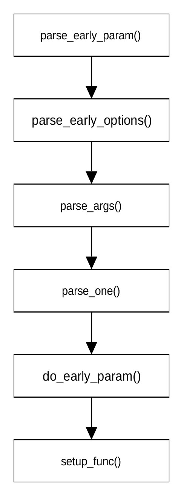

## 前期选项解析

对ARM系统而言，内核参数解析的主要功能是设置earlyconsole的一些参数。完成内核参数解析的函数为\_\_init
parse_early_param()，定义在git/init/main.c文件中。其定义为：

```
void __init parse_early_param(void)
{
	static int done __initdata;
	static char tmp_cmdline[COMMAND_LINE_SIZE] __initdata;
	if (done)
		return;
	strlcpy(tmp_cmdline, boot_command_line, COMMAND_LINE_SIZE);
	parse_early_options(tmp_cmdline);
	done = 1;
}
```


在把命令行参数从boot_command_line拷贝到缓冲区后，parse_early_params()函数通过调用parse_early_options()对命令行参数进行解析。该函数为parse_args()函数的封装，定义在git/init/main.c文件中。其定义为：

```
void __init parse_early_options(char *cmdline)
{
	parse_args("early options", cmdline, NULL, 0, 0, 0, NULL, do_early_param);
}
```

"early options"为要显示的内容，用以打印调试信息。cmdline为要进行解析的命令行参数。do_early_params函数用来解析内核无法识别的变量。

parse_args()函数的定义在文件git/kernel/params.c中，定义为：

```
char *parse_args(const char *doing, char *args, const struct kernel_param *params, unsigned num, 
s16 min_level, s16 max_level, void *arg, 
int (*unknown)(char *param, char *val, const char *doing, void *arg)) 
{
	char *param, *val, *err = NULL;
	args = skip_spaces(args);
	if (*args)
		pr_debug("doing %s, parsing ARGS: '%s'\n", doing, args);
	while (*args) {
		int ret;
		int irq_was_disabled;
		args = next_arg(args, &param, &val);	
		if (!val && strcmp(param, "--") == 0)	
			return err ?: args;
		irq_was_disabled = irqs_disabled();
		ret = parse_one(param, val, doing, params, num, min_level, max_level, arg, unknown);
		if (irq_was_disabled && !irqs_disabled())
			pr_warn("%s: option '%s' enabled irq's!\n", doing, param);
		switch (ret) {
		case 0:
			continue;
		case -ENOENT:
			pr_err("%s: Unknown parameter `%s'\n", doing, param);
			break;
		case -ENOSPC:
			pr_err("%s: `%s' too large for parameter `%s'\n", doing, val ?: "", param);
			break;
		default:
			pr_err("%s: `%s' invalid for parameter `%s'\n", doing, val ?: "", param);
			break;
		}
		err = ERR_PTR(ret);
	}
	return err;
}
```

函数next_arg(args, &param, &val)在args指向的字符串(cmd_line)中查找下一组参数的位置，该函数返回指向下一组参数的指针。param指向待解析变量的位置。val指向当前变量对应的变量值，即等号后面的字符串。如果找不到等号，则变量值为空。next_arg()通过比较cmd_line字符串中的“"”、“-”、“--”、“=”等字符查找当前变量组和下一个变量组的位置，并把当前变量组中的头部和尾部的空格去掉，把“"”和“=”用空字符（“/0”）替换。next_arg()函数定义在文件git/lib/cmdline.c中。

函数parse_one(param, val, doing, params, num, min_level, max_level, arg, unknown)的作用是解析一组变量。param是命令行中的一组变量。val指向该组变量的值。doing为一字符串，标明目前正在进行的工作，主要用于打印调试信息。params是类型为kernel_param的数组，罗列出该函数要处理的变量。不在params指定的范围的变量交由unknown函数（最后一个函数输入）处理。kernel_param结构体的定义为：

```
struct kernel_param {
	const char *name;
	struct module *mod;
	const struct kernel_param_ops *ops;
	const u16 perm;
	s8 level;
	u8 flags;
	union {
		void *arg;
		const struct kparam_string *str;
		const struct kparam_array *arr;
	};
};
```

该结构体定义了参数名称，参数所属模块，设置和读取该参数的函数。perm用于定义模块是否在sysfs文件系统中显示。level定义模块在initcall初始化过程中的优先级别。有关initcall的概念我们会在后面介绍。flags定义参数的安全属性，bit0用于表示该参数是否会污染内核，bit1用于表示在硬件锁定时是允许设置该参数。这两位的定义为：

```
enum {
	KERNEL_PARAM_FL_UNSAFE= (1 << 0),
	KERNEL_PARAM_FL_HWPARAM	= (1 << 1),
};
```

设置和读取参数的函数定义在kernel_param_ops结构体中，其定义为：

```
struct kernel_param_ops {
	unsigned int flags;	
	int (*set)(const char *val, const struct kernel_param *kp);
	int (*get)(char *buffer, const struct kernel_param *kp);
	void (*free)(void *arg);
};
```

其中flags用于表示是否允许该变量的值为空值。flags的取值为：

```
enum {
	KERNEL_PARAM_OPS_FL_NOARG = (1 << 0)
}; 
```

set为用于设置该变量的函数。get为读取该变量的函数。

parse_one()函数的定义为：

```
static int parse_one(char *param, 
    char *val, 
    const char *doing, 
    const struct kernel_param *params, 
    unsigned num_params, 
    s16 min_level, 
    s16 max_level, 
    void *arg, 
    int (*handle_unknown)(char *param, char *val, const char *doing, void *arg))
{
	unsigned int i;
	int err;
	for (i = 0; i < num_params; i++) {
		if (parameq(param, params[i].name)) {
			if (params[i].level < min_level || params[i].level > max_level)
				return 0;	
			if (!val && !(params[i].ops->flags & KERNEL_PARAM_OPS_FL_NOARG))
				return -EINVAL;
			pr_debug("handling %s with %p\n", param, params[i].ops->set);
			kernel_param_lock(params[i].mod);
			if (param_check_unsafe(&params[i]))
				err = params[i].ops->set(val, &params[i]);
			else
				err = -EPERM;
			kernel_param_unlock(params[i].mod);
			return err;
		}
	}
	if (handle_unknown) {
		pr_debug("doing %s: %s='%s'\n", doing, param, val);
		return handle_unknown(param, val, doing, arg);
	}
	pr_debug("Unknown argument '%s'\n", param);
	return -ENOENT;
}
```

定义在git/kernel/params.c文件中。

Parse_one()首先检查由param指定的一组参数是否在由params指定要处理的变量内。如果不在指定的变量范围内，则把param交由handle_unknown函数（即do_early_param函数）处理。如果在指定的变量范围内，parse_one()确定待解析变量的initcall级别是否在最大和最小级别之间。如果在最大和最小级别之间，函数继续确定该参数的flags是否为KERNEL_PARAM_FL_UNSAFE。如果该参数不会影响内核，则进一步检查变量值是否为空值。如果为空值则确定是否允许变量为空值。在通过所有检查之后，parse_one()调用变量自己提供的设置函数set设置变量值。initcall的级别决定一个初始化进程的先后执行顺序。有关初始化进程的执行顺序将在介绍initcall的执行机制时介绍。

对arm系统而言，调用parse_args函数的方式为：

parse_args("early options", cmdline, NULL, 0, 0, 0, NULL, do_early_param)

调用函数时没有罗列要解析的变量，因此，parse_one函数直接调用do_early_param函数对param变量进行处理。do_early_param函数定义在git/init/main.c文件中，其定义为：

```
static int __init do_early_param(char *param, char *val, const char *unused, void *arg)
{
	const struct obs_kernel_param *p;
	for (p = __setup_start; p < __setup_end; p++) {
		if ((p->early && parameq(param, p->str)) || 
(strcmp(param, "console") == 0 && strcmp(p->str, "earlycon") == 0)) {
			if (p->setup_func(val) != 0)
				pr_warn("Malformed early option '%s'\n", param);
		}
	}
	return 0;
}
```

其中：

```
struct obs_kernel_param {
	const char *str;
	int (*setup_func)(char *);
	int early;
};
```

do_early_param函数首先确定内存段\_\_setup_start和\_\_setup_stop之间是否包含param传递的参数，且该参数设置了early标识，或者该参数为“console”且\_\_setup_start和\_\_setup_stop之间包含“earlycon”参数。若包含其中之一，则调用相应的参数设置函数初始化param对应的参数。

从前面的介绍可以发现，对于无法识别的变量，函数parse_early_param()没有进行任何操作，而是留待后面程序进行处理。

如果在解析一组变量时发生错误，parse_args()函数停止解析后面的变量，并将错误代码（介于-1与-4095之间）转换为指向void类型的指针返回。如果没有发生错误，则返回指向命令行中字符“--”的地址。

内核命令行参数解析的函数调用流程可用图 13‑1表示。

<center>
<figure>

<figcaption><p>图 13‑1引导初期参数解析流程</p></figcaption>
</figure>
</center>