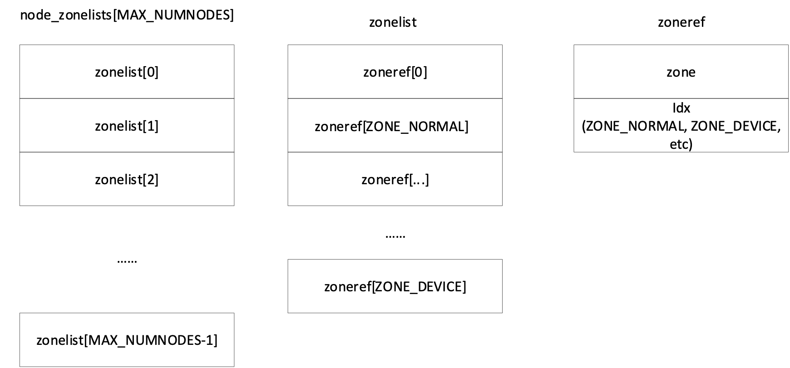

## 区域结构体初始化

区域结构体初始化由函数build_all_zonelists()完成，该函数定义在文件git/mm/page_alloc.c文件中。去掉打印信息后，函数可简化为：

```
void __ref build_all_zonelists(pg_data_t *pgdat)
{
	unsigned long vm_total_pages;
	if (system_state == SYSTEM_BOOTING) {
		build_all_zonelists_init();
	} else {
		__build_all_zonelists(pgdat);
	}
	vm_total_pages = nr_free_zone_pages(gfp_zone(GFP_HIGHUSER_MOVABLE));
	if (vm_total_pages < (pageblock_nr_pages * MIGRATE_TYPES))
		page_group_by_mobility_disabled = 1;
	else
		page_group_by_mobility_disabled = 0;
}
```

从函数名称可知，该函数的主要作用是建立一个区域链表。由于此时系统在引导阶段，所以传递给函数build_all_zonelists()的变量为空值。该函数通过函数build_all_zonelists_init()建立初始区域列表。build_all_zonelists_init()函数同样定义在page_alloc.c文件中，定义为：

```
static noinline void __init build_all_zonelists_init(void)
{
	int cpu;

	__build_all_zonelists(NULL);
	for_each_possible_cpu(cpu)
		setup_pageset(&per_cpu(boot_pageset, cpu), 0);
	mminit_verify_zonelist();
	cpuset_init_current_mems_allowed();
}
```

其中函数\_\_build_all_zonelists(NULL)利用节点pglist_data结构体提供的数据，初始化每一个节点结构体pglist_data的node_zonelist数组，为每个节点建立node_zonelist区域链表。每个节点的node_zonelists数组结构如图
11‑2所示：

<center>
<figure>

<figcaption><p>图 11‑2 node_zonelist结构</p></figcaption>
</figure>
</center>

node_zonelists由zonelist构成，zonelist由结构体zoneref构成，结构体zoneref由结构体zone及一个标识区域类型的idx构成。node_zonelist数组的大小对应NUMA节点个数，zonelist数组个数对应系统支持的区域类型个数。

去掉一些不重要的与不执行的代码后，函数\_\_build_all_zonelists()可简化为：

···
static void __build_all_zonelists(void *data)
{
	int nid;
	int __maybe_unused cpu;
	pg_data_t *self = data;

	static DEFINE_SPINLOCK(lock);
	spin_lock(&lock);
#ifdef CONFIG_NUMA
	memset(node_load, 0, sizeof(node_load));
#endif
	for_each_online_node(nid) {
		pg_data_t *pgdat = NODE_DATA(nid);
		build_zonelists(pgdat);
	}
	spin_unlock(&lock);
}
···

其作用是遍历每一个在线节点，利用函数build_zonelists()为每一个节点建立node_zonelists链表。NODE_DATA宏用于获取节点nid在数组node_data的存储地址，从而获取nid的pglist_data结构体。build_zonelists()函数为：

···
static void build_zonelists(pg_data_t *pgdat)
{
	static int node_order[MAX_NUMNODES];
	int node, load, nr_nodes = 0;
	nodemask_t used_mask = NODE_MASK_NONE;
	int local_node, prev_node;

	local_node = pgdat->node_id;
	load = nr_online_nodes;
	prev_node = local_node;
	memset(node_order, 0, sizeof(node_order));
	while ((node = find_next_best_node(local_node, &used_mask)) >= 0) {
		if (node_distance(local_node, node) != node_distance(local_node, prev_node))
			node_load[node] = load;
		node_order[nr_nodes++] = node;
		prev_node = node;
		load--;
	}
	build_zonelists_in_node_order(pgdat, node_order, nr_nodes);
	build_thisnode_zonelists(pgdat);
}
···

函数build_zonelists()首先依据与当前节点的距离以及一些其它权重，把各个节点排序，形成一个不包含当前节点的有序节点链表node_order\[\]，再通过函数build_zonelists_in_node_order()把包含在node_order数组中各个节点的所有区域添加到当前节点的node_zonelists数组。

函数build_zonelists_in_node_order()调用build_zonerefs_node()。函数build_zonerefs_node()作用是为node_order数组中的一个节点建立zonelist链表。在建立zerolist的过程中，函数遍历各种区域类型。如果node_order中的节点支持遍历到的区域类型，即mannged_pages不为空，则把由该区域及区域类型构成的zeroref结构体添加到zerolist。

build_zonelists_in_node_order()只是把不包含自身的节点的所有区域添加到当前节点的node_zonelists数组，而该数组包含了所有节点的区域，因此在函数末尾，build_zonelists()调用build_thisnode_zonelists()建立自身的zonelist，把其保存到node_zonelists\[0\]。

内存管理需要使用各个cpu的专有变量boot_pageset，因此，在建立了各个节点的node_zonelists数组后，\_\_build_all_zonelists()还需要调用函数setup_pageset()初始化各个cpu的boot_pageset变量中的per_cpu_pages的各个字段。setup_pageset()通过函数pageset_init()添加per_cpu_pages中链表头，通过函数pageset_set_batch()把batch字段的值置为1，把high域的值置为0。

在§7.3中我们曾经提到，系统管理员通过cgroup可以实现对任务使用资源的控制与协调，其中的cpuset结构用于为任务分配cpu和内存。cpuset结构体规定了任务可以使用的cpu与内存结点。在进行任务调度时，任务只能使用其cpuset指定的cpu和内存节点。通过合理的的安排，可以使cpu使用其附近的内存结点，从而可以减少cpu的内存访问次数，降低cpu的访问时间。

在设置了所有节点的node_zonelists数组后，build_all_zonelists_init()函数首先调用函数mminit_verify_zonelist()为各个节点区域建立日志，然后调用函数cpuset_init_current_mems_allowed()。通过函数nodes_setall()把初始化任务init_task的cpuset结构体中的mems_allowed域置为0xFFFFFFFF,FFFFFFFF，表示可以使用任意节点。至此，节点区域初始化任务完成。

