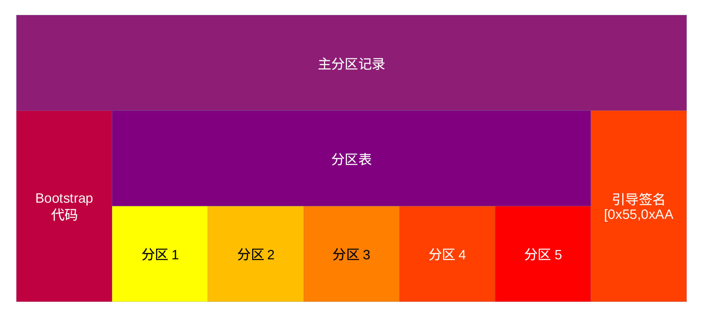
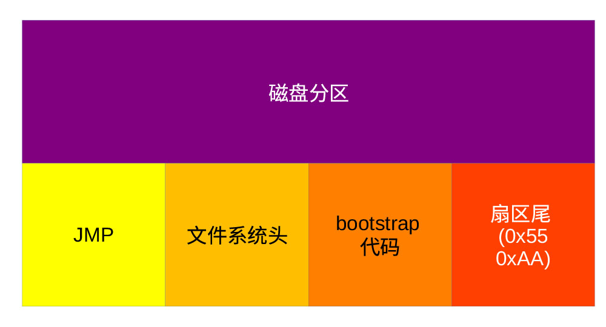

## 台式机与笔记本电脑操作系统与硬件接口

### BIOS接口程序

早期的计算机都有自己的引导程序，如IBM
PC把引导程序固化在BIOS中，在进行必要的自检和系统初始化后，引导程序把操作系统从外部的软盘或硬盘读入内存运行。现代计算机的引导程序是一个独立的个体，它并不是存在计算机的非易失性存储器内，而是存储在引导设备上。在计算机非易失性存储器里存储的BIOS程序对计算机进行必要的初始化，使引导设备正常工作，然后通过读取存储介质上MBR区域（最开始扇区）的一段数据，判别引导设备上的存储介质上是否存有引导程序，并确定引导程序的存储位置及大小。在确定存储介质上存有引导程序后，BIOS负责把引导程序读入内存并执行引导程序。

### UEFI接口

UEFI 是Unified Extensible Firmware Interface
的缩写，它定义了平台固件与操作系统间的接口。UEFI接口规定了与平台有关的系统数据，定义了固件提供给操作系统的、在启动及正常运行时的各种服务。操作系统引导程序（OS
Loader）无需知道平台的各种细节，利用这些数据及固件提供的服务就可以启动操作系统。

兼容于UEFI的操作系统引导过程不再依赖于引导扇区，而是通过存于非易失内存的引导管理器(Boot
Manager)调用固件提供的各种服务，获取引导程序的文件信息，然后利用平台固件提供的UEFI引导服务程序LoadImage()把操作系统引导程序（Boot
Loader)及UEFI驱动程序调人内存，之后跳转到操作系统引导程序的入口点，执行操作系统引导程序，进而启动操作系统。

UEFI支持传统的MBR引导方式，因此，支持UEFI的系统固件可以读取使用MBR格式存储的引导介质上的引导程序。

### 分区表

普通台式机或笔记本电脑采用分区表进行系统引导，分区表用于记录存储介质如硬盘、SD卡、Flash等的分区及介质上数据的结构，以便系统有效地利用这些数据。对台式机而言，目前使用的分区表主要有MBR及GPT两种格式。MBR是目前使用最广的分区表格式，而GPT是一种较新的分区表结构，正逐步取代MBR。

#### MBR格式分区表

MBR是Master Booting
Record的缩写，位于存储介质的第一个扇区，共占用512个字节（见下图），记录着存储空间的分区情况。MBR由引导代码、分区表（Partition
Table）及辨识码（Boot
Signature）三个部分构成。引导待命包括一级引导代码（主引导代码）及二级引导代码。

<figure>

<figcaption>
图 4‑1 MBR结构
</figcaption>
</figure>

0x01B8-0x01BB为四个字节的签名码，用以区分盘上的操作系统是Linux、Windows或其它兼容于UEFI的操作系统。其后的两个字节为0x0000或0x5A5A，
地址为x01BC-0x01BD。0x5A5A表示该操作系统受版权法保护。

签名码之后为分区表，记录四个分区入口，各占16个字节，用以描述各个分区的启始、终止位置、分区所占扇区数、扇区的逻辑块号等信息。位置信息用扇区、磁柱和磁头编号表示。每个分区入口的存放地址分别起始于0x01BE、0x01CE、0x01DE和0x01EE。

MBR最后两个字节为辨识码，用以标识该介质是否保存有能够引导系统的程序。如果能够引导，则在地址0x01FE存放0x55，
在地址0x01FF存放0xAA。系统的BIOS就是通过读取这两个位置的数据判断该介质是否能够引导系统。

主引导程序和二级引导程序由启动介质提供，这为操作系统的引导提供了相当大的灵活性，因此，不同的操作系统可以有不同的引导方式。有些引导程序允许用户在启动时从不同的分区选择不同的操作系统，如可以选择启动Linux还是Windows。

MBR是受格式的限制，最多只能有4个分区，支持的最大容量为2TB。

#### GPT格式

GPT是Guid Partition
Table的缩写。GPT是EFI标准的一部分，用于定义硬盘分区的结构划分。与MBR相比，GPT更加灵活，更容易兼容于新式硬件。它能够用于基于UEFI的操作系统，也可用于与老式的BIOS系统接口。GPT最大可可支持64ZiB的存储空间。

现代计算机操作系统均支持GPT，
包括macOS及运行于x86结构的Windows，但是，只有支持UEFI接口的操作系统才能够在利用GPT格式的存储介质上启动。无论计算机采用BIOS接口还是UEFI接口，freeBSD和Linux都能够在GPT格式的存储介质上启动。

GPT采用64位的逻辑块地址（LBA），允许访问264个扇区。对扇区大小为512字节的存储介质，GPT可支持8ZiB的存储空间，而对于扇区大小为1024字节的存储设备，GPT可支持64ZiB的存储空间。

LBA0（扇区0）存储具有保护功能的MBR，GPT头存于LBA1。GPT头包含一个指针，指向分区表，该分区表一般存在LBA2。分区表至少包含16384个字节，表中每个表项大小均为128字节。

为了向后兼容，GPT仍然保留了MBR，但为了防止基于MBR的磁盘应用程序误把GPT格式的存储介质当作兼容于MBR的存储介质，以至于造成数据丢失，GPT对MBR格式进行了修改。修改后的MBR包含一个类型为0xEE的分区，该分区涵盖整个MBR所能覆盖的空间。这样，无法识别GPT格式的磁盘应用程序就不会对该盘进行操作，除非用户明确表示要进行相应的操作。反过来，支持GPT格式的操作在读取GPT格式的存储介质时，如果类型不是0xEE，则操作系统可以拒绝对该存储介质进行处理。

对于支持GPT格式且利用BIOS而不是UEFI进行引导的操作系统，仍可以把第一阶段的引导程序存在MBR区域，但该引导程序要能够识别GPT格式的分区。

### 主引导程序

对于传统的操作系统，主引导代码是一小段程序，用于确定引导程序所在扇区，把VBR（Volume
Booting
Record）引导程序读入内存。这段代码所占空间为218个字节，起始地址为0
。主引导代码之后是盘时间戳，位于地址0x00DA-0x00DF之间。跟随时间戳的是二级引导代码，
存储于0x00E0-0x01E7之间。一级引导代码把二级引导代码导入内存后，把系统控制权交给二级的引导程序，由它把操作系统采用的最后阶段的引导程序导入内存。

对于Windows等新型的操作系统，主引导程序位于MBR的主引导区域，通常位于第一个扇区的最开始，长度为440个字节。该引导程序的主要任务就是确定引导扇区，从引导扇区把第二级引导程序调入内存并执行第二级引导程序。

### 二级引导程序

<figure>

<figcaption>
图 4‑2 引导盘分区
</figcaption>
</figure>

二级引导程序也称作分区引导程序，它位于引导分区内某个扇区，该扇区称之为引导扇区。不同的操作系统，引导扇区在分区的位置可能不同，通常，引导扇区为引导分区的第一个扇区。

引导扇区的第一个位置通常为一条跳转指令，执行该条指令之后，分区引导程序开始执行。这段引导程序的主要任务是通过查找文件系统头，获得引导程序（最后阶段引导程序）在本扇区的位置，把引导程序读入内存，然后将控制权交与最后阶段的引导程序。
