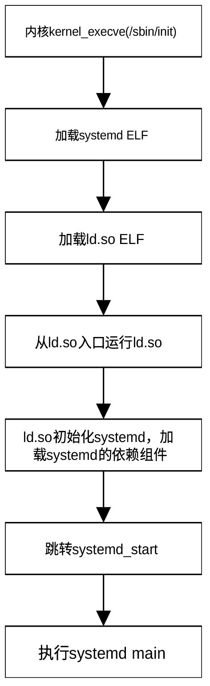
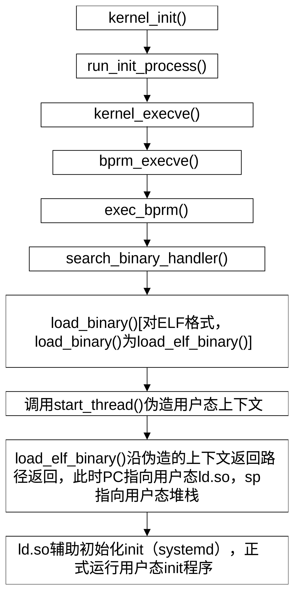

## 启动用户空间 init 程序

用户空间的 init 程序 是 Linux 系统启动后的第一个用户态进程，其 PID
始终为
1。它是所有其他用户进程的祖先，由内核在完成初始化（执行完之前看到的
do_sysctl_args 等逻辑）后直接启动，内核会默认在路径 /sbin/init
寻找并运行它。用户态init进程启动的服务主要包括：

1.基础核心服务

在所有其他服务启动之前，init
必须先建立最基础的系统运行环境，服务程序有：

- udevd / systemd-udevd

> 设备管理器。负责动态识别硬件变化、加载驱动并创建 /dev 下的设备节点。

- systemd-journald / syslogd / rsyslog

> 日志系统。负责捕获内核和所有用户态进程的日志输出。

- systemd-modules-load

> 内核模块加载服务。根据配置文件自动加载所需的内核驱动。

2.存储与文件系统服务

负责管理硬盘分区、挂载以及检查文件系统健康状态，服务程序有：

- systemd-remount-fs

> 将根文件系统从只读（Read-Only）重新挂载为读写（Read-Write）。

- systemd-fsck@

> 文件系统检查工具（Fsck）。在挂载前检查磁盘是否有损坏。

- local-fs.target 关联服务

> 解析 /etc/fstab 文件，自动挂载本地的所有硬盘分区。

- swap.target 关联服务

> 启用系统的虚拟内存（Swap 交换分区）。

3.网络与底层通信服务

让系统具备本地组网和联网能力。服务程序有：

- dbus (Desktop Bus)

> 进程间通信守护进程。这是 Linux
> 极其核心的服务，所有系统服务（如网络、电源、桌面）之间传递消息都依赖它。

- NetworkManager / systemd-networkd

> 网络连接管理器。负责配置 IP 地址、DHCP 获取、Wi-Fi 连接等。

- systemd-resolved / named

> DNS 域名解析服务。

4.系统管理与人机交互服务

为用户登录和日常管理提供接口，服务程序有：

- agetty / getty@

> 文本终端服务。它负责在屏幕上打印 login:
> 提示符，让你可以通过命令行登录。

- sshd

> SSH 远程登录服务（服务器系统的核心服务）。

- cron / crond / systemd-timers

> 定时任务调度器。

- 显示管理器（如 gdm / sddm / lightdm）

> 图形界面系统的入口。它负责显示图形登录界面，登录后唤醒 GNOME 或 KDE
> 等桌面环境。

5.常见应用层与第三方服务

根据服务器或工作站的用途，init 拉起的具体的业务服务程序，有：

- 数据库服务

> 如 mysql、postgresql、redis。

- Web 服务

> 如 nginx、httpd (Apache)。

- 容器与虚拟化

> 如 dockerd (Docker 守护进程)、libvirtd (虚拟机管理)

前面我们已经介绍， kernel_init() 函数会通过init_eaccess()寻找 init
程序，如果找不到，kernel_init()会利用prepare_namespace()把由启动命令行参数root指定的根文件系统挂接到系统，以便系统查找用户态init程序。

用户态init
程序启动系统必要的服务（如网络、日志、桌面环境），并监控它们。如果服务崩溃，init
负责重启它。当一个父进程在子进程之前退出时，子进程会变成孤儿。内核会将这些孤儿进程的父进程重定向为
PID 1。init 负责调用 wait() 来回收这些僵尸进程的资源。

随着 Linux 的发展，用户态init 程序经历了从SysVinit (传统型)
，再到systemd (现代标准)的演变。几乎所有主流发行版（Ubuntu 15+, CentOS
7+, Debian 8+）现在都使用systemd。

kernel_init()选择init程序（查找用户态init的程序，非用户态init）的优先级为：

ramdisk_execute_command指定的init程序；

execute_command指定的init程序；

/sbin/init；

/etc/init；

/bin/init；

/bin/sh。

在嵌入式系统或 initramfs 中，通常使用 BusyBox 提供的简化版
init。它非常小巧，只读取 /etc/inittab 配置文件，适合资源受限的环境。

我们前面已经介绍了ramdisk_execute_command的赋值方式，execute_command由宏\_\_setup("init=",
init_setup)注册，由启动命令行参数通过init=的方式指定，由函数parse_args()在进行引导参数解析时、通过回调函数do_early_param()为其赋值。宏\_\_setup()与宏module_param()的工作机理完全相同，由它指定的参数存在obs_kernel_params段内。

init程序通过调用run_init_process()
和try_to_run_init_process()执行，不是“再创建一个新进程”，而是让当前这个
PID 1 自己 exec 成用户空间 init。也就是说，之前，PID 1 =
kernel_init（内核线程），之后，PID 1 = /sbin/init 或
systemd（用户进程）。所以，PID 没变，执行身份变了。这是 Linux
启动流程里最关键的概念之一。

函数run_init_process()位于git/init/main.c，定义为：

```
static int run_init_process(const char *init_filename)
{
	const char *const *p;
	argv_init[0] = init_filename;
	pr_info("Run %s as init process\n", init_filename);
	pr_debug("  with arguments:\n");
	for (p = argv_init; *p; p++)
		pr_debug("    %s\n", *p);
	pr_debug("  with environment:\n");
	for (p = envp_init; *p; p++)
		pr_debug("    %s\n", *p);
	return kernel_execve(init_filename, argv_init, envp_init);
}
```

该函数负责启动用户空间的第一个进程（即用户态 init
进程）。它首先打印日志，然后通过函数kernel_execve()执行用户态init程序，从内核模式转换为用户模式。将要执行的文件名为命令行参数的第一个，这是
Unix/Linux 的标准惯例。argv_init是参数列表，envp_init是环境变量列表。

如果执行成功，内核将加载并运行该二进制文件，当前的内核线程将演变为用户空间的
PID 1 进程。由于 execve
成功后不会返回，如果该函数返回了值，通常意味着执行失败（例如文件不存在或格式错误）。

它是内核完成自检和设备驱动加载后，移交控制权给操作系统的“接力棒”。如果内核尝试了所有可能的路径（如
/sbin/init, /etc/init, /bin/init, /bin/sh）都失败了，内核将会抛出著名的
"Kernel Panic - not syncing: No working init found." 错误。

函数try_to_run_init_process()同样位于git/init/main.c，定义为：

```
static int try_to_run_init_process(const char *init_filename)
{
	int ret;
	ret = run_init_process(init_filename);
	if (ret && ret != -ENOENT) {
		pr_err("Starting init: %s exists but couldn't execute it (error %d)\n",  init_filename, ret);
	}
	return ret;
}
```

该函数是 run_init_process
的安全封装层，主要负责错误处理和日志过滤。它调用run_init_process()。如果返回
0，说明进程启动成功。如果返回
-ENOENT，表示文件不存在。这种情况下它会保持沉默，因为内核通常会按顺序尝试多个路径（如
/sbin/init -\>
/etc/init），找不到某一个是很正常的。如果返回了其他错误，说明找到了文件但无法运行。此时它会通过
pr_err 打印红字警告。

真正执行用户态init程序的是函数kernel_execve()，位于git/fs/exec.c，定义为：

```
int kernel_execve(const char *kernel_filename, const char *const *argv, const char *const *envp)
{
	struct filename *filename;
	struct linux_binprm *bprm;
	int fd = AT_FDCWD;
	int retval;
	filename = getname_kernel(kernel_filename);
	if (IS_ERR(filename))
		return PTR_ERR(filename);
	bprm = alloc_bprm(fd, filename);
	if (IS_ERR(bprm)) {
		retval = PTR_ERR(bprm);
		goto out_ret;
	}
	retval = count_strings_kernel(argv);
	if (retval < 0)
		goto out_free;
	bprm->argc = retval;
	retval = count_strings_kernel(envp);
	if (retval < 0)
		goto out_free;
	bprm->envc = retval;
	retval = bprm_stack_limits(bprm);
	if (retval < 0)
		goto out_free;
	retval = copy_string_kernel(bprm->filename, bprm);
	if (retval < 0)
		goto out_free;
	bprm->exec = bprm->p;
	retval = copy_strings_kernel(bprm->envc, envp, bprm);
	if (retval < 0)
		goto out_free;
	retval = copy_strings_kernel(bprm->argc, argv, bprm);
	if (retval < 0)
		goto out_free;
	retval = bprm_execve(bprm, fd, filename, 0);
out_free:
	free_bprm(bprm);
out_ret:
	putname(filename);
	return retval;
}
```

该函数是内核加载并执行可执行文件的最底层实现。它将init
文件路径、参数和环境变量，真正转化为一个可以运行的进程。其核心逻辑可以概括为以下四个阶段：

- 通过函数getname_kernel() 将内核空间的字符串路径转换为内核理解的
  filename 结构体

> 利用alloc_bprm()分配一个 linux_binprm
> 结构体，它记录了程序运行所需的所有核心信息（如文件句柄、参数数量、内存页等）。

- 利用函数count_strings_kernel() 分别计算命令行参数 (argv) 和环境变量
  (envp) 的个数，并存入 bprm-\>argc 和 bprm-\>envc

> 通过函数bprm_stack_limits() 确保这些参数不会超过内核允许的栈限制。

- 利用函数copy_strings_kernel()将文件名、命令行参数及环境变量等字符串从内核空间拷贝到
  bprm 维护的临时存储区域中，以便后续映射到新进程的用户态栈空间。

> 函数名中带有 \_kernel 后缀表示参数目前还在内核内存中

- 调用函数bprm_execve()

> bprm_execve()会调用二进制格式处理程序（例如 ELF
> 处理程序），检查文件头，加载代码段和数据段，设置堆栈，并最终让 CPU
> 跳转到该程序的入口点。无论成功还是失败，最后都会通过 free_bprm 和
> putname 释放之前申请的内存。

bprm_execve()函数位于git/fs/exec.c， 主要完成了以下关键动作：

- 调用io_uring_task_cancel()清理当前任务的所有异步 IO 活动

> 防止旧的 IO 操作干扰新的进程镜像。

- 调用unshare_files()确保当前进程的文件描述符表是私有的

> 这是为了处理 CLOEXEC（执行时关闭）标志，防止文件描述符泄露给新程序。

- 调用prepare_bprm_creds() 和
  security_bprm_creds_for_exec()计算新进程的权限（比如设置了 SUID
  位的可执行文件）

- 调用check_unsafe_exec()进行安全扫描调用

> 检查当前进程是否处于“不安全”的状态。检查是否有其他线程正在共享该进程的地址空间，是否开启了某些调试跟踪。这是内核的自我保护机制，防止恶意代码通过
> execve 劫持提权后的进程。

- 调用函数do_open_execat()打开执行文件

> 在文件系统中找到 init
> 文件（或任何可执行文件）并打开它，同时检查文件是否具有可执行权限。

- 调用sched_exec()调度当前任务

- 标记路径不可达（BINPRM_FLAGS_PATH_INACCESSIBLE）

> 防止敏感信息泄露。如果一个文件描述符设置了执行时关闭（O_CLOEXEC），那么在
> exec 成功后，新程序将无法通过该描述符找回原始文件的路径信息。

- 调用security_bprm_creds_for_exec()

> 通过LSM钩子判断是否有权执行该文件。

- 调用exec_binprm()加载与执行

> 如果exec_binprm() 运行成功，则清理 exec 过程的遗留状态，处理
> Restartable Sequences（rseq） 状态，更新进程的 资源统计信息，清理 NUMA
> 相关状态，清理 exec 过程中遗留的文件表资源（释放旧的
> files_struct）。rseq 是一种用户态优化机制（用于 lock-free per-CPU
> 操作）。
>
> 如果程序运行失败，恢复原来的 files_struct。如果到了 “破釜沉舟点”
> (point_of_no_return)
> 之后却发生了错误，内核已经无法恢复原进程了，只能通过 force_sigsegv
> 强行杀死当前进程。只有当旧进程镜像已经被破坏但还没启动新镜像时，才会设置
> bprm-\>point_of_no_return。

函数exec_binprm()执行用户态init程序加载。它调用
search_binary_handler检查文件格式，遍历内核注册的格式处理器，看看谁能处理这个
init 文件。如果是常见的二进制文件，load_elf_binary
处理器就会接手。内核支持多种二进制格式（如 ELF、脚本/Shebang、甚至传统的
a.out）。

exec_binprm()位于git/fs/exec.c，主要工作包括：

- 通过一个 for 循环调用 search_binary_handler

> 在所有已注册的 binary format（ELF / 脚本 /
> misc）中，找到一个能识别并加载当前程序的 handler

- 在 execve 开始时，内核会通过 deny_write_access 锁定二进制文件

> 防止运行过程中文件被修改。当完成这一层加载（例如脚本解析完）切换到解释器时，利用函数allow_write_access(exec)释放对旧文件的写入锁定。

- 利用函数audit_bprm()将当前正在执行的进程及其相关参数记录到操作系统的审计（Audit）日志中

- 利用函数trace_sched_process_exec()触发调度器追踪点

- 利用函数ptrace_event()发送 PTRACE_EVENT_EXEC 停止信号，让调试器介入

- 利用函数proc_exec_connector()向进程连接器（Process
  Connector）发送通知，通常用于监控工具

函数search_binary_handler()是用户态init程序的加载与执行者，位于git/fs/exec.c，其主要功能包括：

- 利用prepare_binprm()读取文件前面的魔术字（magic number），填充
  bprm-\>buf。

> 魔术字用来识别文件格式，如ELF的莫数字为0x7f 'E' 'L'
> 'F'，脚本的魔术字为#!。

- 利用函数security_bprm_check ()进行LSM 安全检查

- 利用宏list_for_each_entry()遍历formats链表

> formats链表存放所有注册的格式解释器（handler）。

- 首先通过函数try_module_get()尝试给它增加引用计数，防止它被卸载

> 如果这个 binary handler 所在模块正在卸载，就不要用它。

- 利用函数load_binary()尝试每个解释器。

> 如果处理器成功执行，则该处理器会销毁旧进程地址空间（flush_old_exec），建立新的
> mm（代码段 / 数据段 / 栈），设置入口地址（entry
> point），构造用户栈（argv/envp），切换寄存器（IP /
> SP），并返回值0，表示成功执行。到这里，由于IP/SP的内容已发生变化，所以这里的返回不会真正返回，而是用户态上下文下的返回，即进入用户态。
>
> 如果返回值为 -ENOEXEC，则尝试下一个解释器；
>
> 如果返回值不是-ENOEXEC，或进入“不可回头点”（bprm-\>point_of_no_return），则直接返回错误代码。

- 如果所有解释器都不认识，返回-ENOENT (初始值)

load_binary()是真正“把当前进程变成新程序”的执行者。load_binary是一个函数指针，不同格式的init程序，load_binary指向不同的函数。下面所列的是不同格式所用的函数。

``` text
格式		对应函数

ELF		load_elf_binary()

#!		load_script()

misc		load_misc_binary()

FDPIC		binfmt_elf_fdpic
```

为了让大家对linux从内核态向用户态切换过程有耿深入的了解，我们以elf格式为例介绍elf解释器的工作过程。函数load_elf_binary()位于git/fs/binfmt_elf.c，函数很长，这里不再列出其定义。

load_elf_binary()主要完成的任务包括：

- 魔术数检查（是不是 ELF）

- 类型检查（ET_EXEC / ET_DYN）

- 架构匹配（x86 / arm 等）

- 判断这个 ELF 是不是 FDPIC ELF（Flexible Dynamic Position Independent
  Code，一种特殊 ELF 格式）

- 检查文件是否支持 mmap。如果不支持 mmap ，无法把 ELF 映射进内存。不能
  mmap 的文件，不可能作为可执行程序加载

- 利用函数load_elf_phdrs()从文件中读取 程序头表格（Program Header
  Table）

- 用for循环遍历ELF段，找PT_INTERP：

<!-- -->

- 通过函数elf_read()读出解释器路径（比如/lib64/ld-linux-x86-64.so.2\0）

- 通过函数open_exec()把解释器文件打开

- 调用would_dump()进行安全处理。如果原程序不可读，则禁止 core
  dump（mm-\>dumpable = 0）

- 通过函数elf_read()读取解释器 ELF 头

> 如果执行到for循环里的break语句，表明已找到解释器ld.so。

- 下一个for循环用于从 ELF 的 Program Header 里提取运行时策略（栈权限 +
  架构特性），为后面建地址空间做准备

- 利用if (interpreter)块内的代码进行基础合法性检查：

<!-- -->

- 检查解释器文件开头是否为 \x7fELF，确保文件格式为ELF

- 检查主程序和解释器架构一致，检查解释器的架构（如 x86_64,
  ARM）是否与当前运行的内核及主程序匹配

- 确认ELF格式不是 FDPIC，确保解释器不包含不支持的 FDPIC（通常用于无 MMU
  的系统）特性

- 加载解释器的程序头，这些表描述了文件应该如何映射到内存中（如代码段、数据段）

- 记录解释器的属性段和架构私有段

- 处理处理器特定段 (PT_LOPROC ... PT_HIPROC)

- 遍历解释器的所有程序头，标记该程序头的位置。它包含了 GNU
  扩展属性（PT_GNU_PROPERTY ）

- 调用 arch_elf_pt_proc()，处理特定于特定处理器的段（PT_LOPROC ...
  PT_HIPROC）

<!-- -->

- 调用parse_elf_properties()

> 扫描 ELF 文件的程序头，查找特定的 PT_GNU_PROPERTY 段，解析 ELF
> 属性。它会根据是加载解释器（如
> ld-linux.so）还是主程序来提取相关状态，并存入 arch_state
> 结构体中。这些属性通常包含处理器特有的特性需求；

- 调用arch_check_elf()进行架构特定检查

> 调用具体 CPU 架构实现的钩子函数，对 ELF
> 文件进行最后的“否决”，确保主程序和动态链接器（解释器）的特性是兼容的。如果硬件强制要求某些特性，而
> ELF 文件未声明支持，内核将在此处拒绝执行该程序；

- 调用函数begin_new_exec()初始环境设置，释放旧进程资源，进入“不归路”

> 它是 Linux 内核中 execve
> 系统调用的核心转折点。一旦进入这个函数并执行到一定阶段，原先的进程上下文（内存、线程、信号等）就会被彻底摧毁。如果此后发生错误，内核无法再返回到用户态报错，只能通过发送致命信号（如
> SIGSEGV）直接终止进程，其工作主要包括：

- 利用bprm_creds_from_file()，根据文件属性（如 SUID/SGID
  位）计算新进程的凭据，将进程标记为不可逆 (point_of_no_return =
  true)，正式宣布进入无法回滚的状态

- 利用函数de_thread()杀死当前线程组中的所有其他线程。exec
  后的进程必须是单线程的

- 利用函数set_mm_exe_file()绑定可执行文件到 mm

- 利用函数would_dump()设置 dump 策略

- 利用函数exec_mmap()销毁原进程的虚拟内存空间（代码段、数据段、堆栈），创建一个全新的地址空间，将准备好的新内存布局（bprm-\>mm）激活

- 利用函数exit_itimers()关闭所有 POSIX 定时器

- 利用函数unshare_sighand()将信号处理器私有化

- 利用函数force_uaccess_begin()允许访问用户空间

- 清理旧进程遗留标志

- 利用函数flush_thread()

- 利用函数do_close_on_exec()关闭所有设置了O_CLOEXEC 标志的文件描述符

- 如果设置安全运行（bprm-\>secureexec），禁止父进程信号，重置栈限制（防攻击）

- 利用函数set_dumpable()设置是否允许 core dump

- 利用函数perf_event_exec()perf 切换统计

- 利用函数\_\_set_task_comm()更新进程名（ps 能看到）

- 更新exec 关键标志（current-\>self_exec_id）

- 利用函数flush_signal_handlers()重置所有信号处理函数为默认行为（除了被忽略的信号）

- 利用函数commit_creds()提交凭证

- 利用函数perf_event_exit_task()调整perf 权限

- 利用函数security_bprm_committed_creds()进行LSM收尾

- 如果设置了bprm-\>have_execfd ，把 executable 变成一个 fd，将
  已打开的文件对象 正式“激活”到新进程（如 ld.so）文件描述符表中

> 它处理的是一种由内核直接传递文件描述符给解释器的特殊执行场景（如当脚本第一行是
> \#! /usr/bin/python3）。

- 调用函数elf_read_implies_exec()确定这个 ELF 是否需要
  将读权限转换为执行权限

> 如果需要，以后 mmap 出来的内存，只要是可读的，就自动也变成可执行的。

- 检查当前进程是否需要开启 PF_RANDOMIZE

> 这会影响后续堆栈和内存映射的起始地址;

- 利用函数setup_new_exec()收尾 begin_new_exec()，最终确认dumpable
  状态，初始化mm 细节

- 调用函数setup_arg_pages()在内存中建立初始堆栈，并将命令行参数（argv）和环境变量（envp）拷贝进去

- 遍历 ELF 文件遍历 Program Header的 PT_LOAD 段（即需要映射到内存的段）

> 处理
> bss段，如果两个加载段之间有空隙，表示文件没存但内存要补0，内核会调用
> set_brk() 建立匿名映射，并调用 clear_user() 将其清零；

- 利用函数make_prot()确定文件权限

- 设置地址映射方式（elf_flags）、映射地址（vaddr）、地址偏移（load_bias）及内存区间大小（total_size）

- 利用函数elf_map()映射ELF段

> 调用 mmap() 把 ELF
> 文件映射进内存，并设置权限（elf_prot），如代码段设为 R+X，数据段设为
> R+W；

- 计算CPU 要跳转的虚拟地址e_entry

- 不断更新 start_code、end_code、start_data、end_data
  等，记录程序的代码和数据范围

> 用于/proc/pid/maps，供内存管理使用；

- 在所有文件段加载完后，利用函数set_brk（）为 BSS
  段（未初始化全局变量）和初始堆空间分配内存

> 如果最后一个数据页没有填满，利用padzero()将剩余部分清零，防止数据泄露；

- 如果程序需要动态链接（解释器interpreter不为空），调用 load_elf_interp
  加载
  ld-linux.so；记录解释器(ld.so)的加载基址（用于后续架构/重定位），并释放对解释器文件的“写保护占用”

- 设置入口点 (elf_entry)

> 如果有解释器，进程的起始执行点设为解释器的入口。如果没有解释器（静态链接），则设为程序本身的入口（e_entry）；

- 利用函数set_binfmt()把当前进程标记为由 ELF 二进制格式管理

- 利用函数arch_setup_additional_pages()加载 vDSO

> ARCH_HAS_SETUP_ADDITIONAL_PAGES启用时。

- 利用函数create_elf_tables()在堆栈上压入 argc、argv、envp 以及 辅助向量
  (Auxiliary Vector)

> 辅助向量告诉程序入口地址，程序头位置，以及是否启用硬件加速功能；

- 将计算好的代码段、数据段、堆栈起始地址正式写入进程的内存管理结构体
  mm_struct

- 利用函数arch_randomize_brk()对堆（brk）的起始地址进行最后的随机化偏移

> 进一步增强安全性。

- 如果定义了MMAP_PAGE_ZERO，利用vm_mmap()把虚拟地址 0
  这一页映射出来（只读 + 可执行）

> 用以兼容老程序。

- 利用函数current_pt_regs()获取当前任务返回用户态时要用的寄存器结构，包括指令地址、栈指针、返回值、参数等

> 用于伪造一个用户态寄存器现场。

- 如果启用了ELF_PLAT_INIT，按照当前 CPU/ABI
  的规则，把用户态启动所需的寄存器补齐/修正好

- 利用函数finalize_exec()清理 bprm 相关状态、确认
  exec状态切换已完成、进行安全模块收尾、以及清理 exec 相关锁 / 标志

- 利用函数start_thread()构造返回用户态时的寄存器现场

> 设置 PC =
> elf_entry（程序入口，如果是动态链接，entry等于ld.so的入口）， SP =
> bmpr-\>p，即用输入参数修改当前返回时使用的栈的内容（regs指向当前进程的栈）；
>
> 由于PC已指向用户态程序的入口地址，SP指向了用户栈，load_elf_binary()返回时不再沿着原调用路径，而是进入用户态开始执行用户态init函数（例如systemd）

systemd（pid 1）的启动过程可用图 30‑2表示。

<center>
<figure>

<figcaption><p>图 30‑3从内核态进入用户态</p></figcaption>
</figure>
</center>

load_elf_binary()的整体流程为：

> ① 校验 ELF
>
> ② 解析 Program Header（含解释器）
>
> ③ 架构 & 安全检查
>
> ④ begin_new_exec（不可回头点）
>
> ⑤ 建立新地址空间（mm + 栈）
>
> ⑥ mmap 各个段（PT_LOAD）
>
> ⑦ 处理 bss / brk
>
> ⑧ 加载动态链接器（如果有）
>
> ⑨ 构造用户栈（argv/envp/auxv）
>
> ⑩ 设置寄存器（start_thread，入口不是systemd程序本身，而是 ld.so）
>
> ⑪ 返回 0

kernel_init()进入用户态systemd的完整流程可用图 30‑3表示。

<center>
<figure>

<figcaption><p>图 30‑4 kernel_init进入systemd的完整流程</p></figcaption>
</figure>
</center>

start_thread()是依赖架构的宏。arm32的start_thread()定义在git/arch/arm/include/asm/processor.h，其定义为：

```
#define start_thread(regs,pc,sp)							\
({											\
	unsigned long r7, r8, r9;								\
												\
	if (IS_ENABLED(CONFIG_BINFMT_ELF_FDPIC)) {			\
		r7 = regs->ARM_r7;							\
		r8 = regs->ARM_r8;							\
		r9 = regs->ARM_r9;							\
	}											\
	memset(regs->uregs, 0, sizeof(regs->uregs));				\
	if (IS_ENABLED(CONFIG_BINFMT_ELF_FDPIC) &&		\
	    current->personality & FDPIC_FUNCPTRS) {				\
		regs->ARM_r7 = r7;							\
		regs->ARM_r8 = r8;							\
		regs->ARM_r9 = r9;							\
		regs->ARM_r10 = current->mm->start_data;			\
	} else if (!IS_ENABLED(CONFIG_MMU))					\
		regs->ARM_r10 = current->mm->start_data;			\
	if (current->personality & ADDR_LIMIT_32BIT)				\
		regs->ARM_cpsr = USR_MODE;					\
	else											\
		regs->ARM_cpsr = USR26_MODE;					\
	if (elf_hwcap & HWCAP_THUMB && pc & 1)				\
		regs->ARM_cpsr |= PSR_T_BIT;					\
	regs->ARM_cpsr |= PSR_ENDSTATE;					\
	regs->ARM_pc = pc & ~1;		/* pc */				\
	regs->ARM_sp = sp;		/* sp */					\
})
```

该函数最关键的是regs-\>ARM_pc = pc & ~1和regs-\>ARM_sp =
sp这两行。它们实际上是修改了函数返回地址及返回后的栈地址，正是这两句改变了程序的流向。

到此为止，我们完整地介绍了PID1从内核态切换到用户态的过程。为了给大家一个完整的印象，我们在图
30‑4给出了1号线程kernel_init()的完整调用链。

<center>
<figure>

<figcaption><p>图 30‑5 Kernel_init()完整调用链</p></figcaption>
</figure>
</center>

