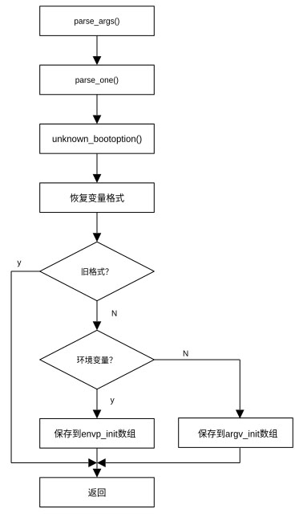

## 命令行选项和环境变量分离

上一节我们介绍了参数解析函数parse_args()。在处理了初期命令行参数后，start_kernel()函数再一次调用parse_args()，通过调用unknown_bootoption()函数处理引导过程的未知选项。在调用parse_args()函数的过程中，start_kernel()调用parse_args()的方式为：

```
after_dashes = parse_args("Booting kernel", static_command_line,
__start___param, __stop___param -__start___param, -1,
-1, NULL, &unknown_bootoption)
```

用于标志调试信息的字符串为"Booting kernel"。指向待解析的变量指针为static_command_line，它包含了extra_command_line和command_line的内容，其中command_line的内容位于extra_command_line的后面。用于罗列该函数可解析的变量由指针\_\_start\_\_\_param指定，罗列的变量个数为\_\_stop\_\_\_param - \_\_start\_\_\_param。由于传递给函数的最小和最大initcall级别均为-1，所有待解析参数均由函数unknown_bootoption()解析。

unknown_bootoptions()函数定义在文件git/init/main.c中，其定义为：

```
static int __init unknown_bootoption(char *param, char *val, const char *unused, void *arg)
{
	size_t len = strlen(param);
	repair_env_string(param, val);
	if (obsolete_checksetup(param))
		return 0;
	if (strnchr(param, len, '.'))
		return 0;
	if (panic_later)
		return 0;
	if (val) {
		unsigned int i;
		for (i = 0; envp_init[i]; i++) {
			if (i == MAX_INIT_ENVS) {
				panic_later = "env";
				panic_param = param;
			}
			if (!strncmp(param, envp_init[i], len+1))
				break;
		}
		envp_init[i] = param;
	} else {
		unsigned int i;
		for (i = 0; argv_init[i]; i++) {
			if (i == MAX_INIT_ARGS) {
				panic_later = "init";
				panic_param = param;
			}
		}
		argv_init[i] = param;
	}
	return 0;
}
```

从上面的介绍我们知道，next_arg()函数把待解析的所有格式为param=val和param="val"中的“=”和“"”替换为空字符。unknown_bootoptions()函数首先利用函数repair_env_string(param, val)把格式为param=val和param="val"的参数统一恢复为param=val格式。如果格式为param="val"，repair_env_string()还去掉多余的空字符。之后，通过函数obsolete_checksetup()确定命令行参数没有使用过时的格式。在确定参数格式符合要求后，unknown_bootoptions()函数对参数及参数值进行解析。如果参数值不为空值，即参数具有param=val格式，则该参数为环境变量。这时如果环境变量数组envp_init还有空间且该参数还没有保存在环境变量数组，则把参数保存在环境变量数组。如果参数没有值，即格式为param，这样的参数为命令行选项。同样，如果命令行选项数组argv_init还有空间且该参数还没有保存在argv_init数组，则把param保存在argv_init数组中。如果无法在数组envp_init和argv_init中找不到保存变量的位置，unknown_bootoptions函数设置panic_later和panic_param，待后面生成panic错误。

在完成变量分离后，如果出错，parse_args返回相应的错误处理程序地址。如果没有发生错误，返回命令行参数static_command_line中字符“--”后面的地址。因此，如果命令行参数格式正确且数组envp_init和argv_init有足够空间，after_dashes
指向“--”后面的内容，即，after_dashes指向要传递给init()进程的变量。变量分离流程示于图 13‑2。

<center>
<figure>

<figcaption><p>图 13‑2 命令选项与环境变量分离流程</p></figcaption>
</figure>
</center>
