## 基于架构的初始化函数

在设置完安全模块以后，start_kernel()函数调用setup_arch()函数设置与硬件架构有关的内容。函数setup_arch()利用引导程序（如U-BOOT）提供的命令行参数command_line，针对不同的硬件架构，设置如uart波特率等有关部件。由于该函数与硬件有关，所以，不同的CPU，函数定义不同。如果是一个全新的CPU，开发者需要自己开发这些程序。对arm架构而言，函数定义在Linux/arch/arm/kernel/setup.c文件中，其定义为:

```
void __init setup_arch(char **cmdline_p)
{
   const struct machine_desc *mdesc;
   setup_processor();
   mdesc = setup_machine_fdt(__atags_pointer);
   if (!mdesc)
       mdesc = setup_machine_tags(__atags_pointer, __machine_arch_type);
   if (!mdesc) {
       early_print("\nError: invalid dtb and unrecognized/unsupported machine ID\n");
       early_print("  r1=0x%08x, r2=0x%08x\n", __machine_arch_type,
           __atags_pointer);
       if (__atags_pointer)
           early_print("  r2[]=%*ph\n", 16, phys_to_virt(__atags_pointer));
       dump_machine_table();
   }
   machine_desc = mdesc;
   machine_name = mdesc->name;
   dump_stack_set_arch_desc("%s", mdesc->name);
   if (mdesc->reboot_mode != REBOOT_HARD)
       reboot_mode = mdesc->reboot_mode;
   init_mm.start_code = (unsigned long) _text;
   init_mm.end_code   = (unsigned long) _etext;
   init_mm.end_data   = (unsigned long) _edata;
   init_mm.brk       = (unsigned long) _end;
   strlcpy(cmd_line, boot_command_line, COMMAND_LINE_SIZE);
        *cmdline_p = cmd_line;
   early_fixmap_init();
   early_ioremap_init();
   parse_early_param();
#ifdef CONFIG_MMU
   early_mm_init(mdesc);
#endif
   setup_dma_zone(mdesc);
   xen_early_init();
   efi_init();
   adjust_lowmem_bounds();
   arm_memblock_init(mdesc);
   adjust_lowmem_bounds();
   early_ioremap_reset();
   paging_init(mdesc);
   request_standard_resources(mdesc);
   if (mdesc->restart)
       arm_pm_restart = mdesc->restart;
   unflatten_device_tree();
   arm_dt_init_cpu_maps();
   psci_dt_init();
#ifdef CONFIG_SMP
   if (is_smp()) {
       if (!mdesc->smp_init || !mdesc->smp_init()) {
           if (psci_smp_available())
               smp_set_ops(&psci_smp_ops);
           else if (mdesc->smp)
               smp_set_ops(mdesc->smp);
       }
      smp_init_cpus();
      smp_build_mpidr_hash();
   }
#endif
   if (!is_smp())
       hyp_mode_check();
   reserve_crashkernel();
#ifdef CONFIG_GENERIC_IRQ_MULTI_HANDLER
   handle_arch_irq = mdesc->handle_irq;
#endif
#ifdef CONFIG_VT
#if defined(CONFIG_VGA_CONSOLE)
   conswitchp = &vga_con;
#endif
#endif
  if (mdesc->init_early)
      mdesc->init_early();
}

```

下面几节分别介绍各个部件的初始化过程。

### 处理器设置

处理器设置通过调用setup_processor()函数进行。setup_processor函数首先利用宏

```
#define read_cpuid(reg) 
    ({ 
        unsigned int __val; 
        asm("mrc    p15, 0, %0, c0, c0, " __stringify(reg) 
            : "=r" (__val) 
            : 
            : "cc"); 
        __val; 
    })

```

从cp15读取cpu
id，然后调用函数lookup_processor()，在内存区域\_\_proc_info_begin与\_\_proc_info_end之间读取对应于处理器的结构体proc_info_list的地址。内存区域\_\_proc_info_begin与\_\_proc_info_end之间的内容由链接程序依据程序内容设定。lookup_processor()通过调用在linux/arch/arm/kernel/head-common.S中定义的lookup_processor_type()函数进行查询。lookup_processor_type函数的定义为：

```
ENTRY(lookup_processor_type)

stmfd sp!, {r4 - r6, r9, lr}

mov r9, r0

bl __lookup_processor_type

mov r0, r5

ldmfd sp!, {r4 - r6, r9, pc}

ENDPROC(lookup_processor_type)
```

其中，__lookup_processor_type在设置cpu模式的过程中曾经被调用过。

查询过程中获得的结构体proc_info_list的定义为：

```
struct proc_info_list {

  unsigned int cpu_val;

  unsigned int cpu_mask;

  unsigned long __cpu_mm_mmu_flags; /* used by head.S */

  unsigned long __cpu_io_mmu_flags; /* used by head.S */

  unsigned long __cpu_flush; /* used by head.S */

  const char *arch_name;

  const char *elf_name;

  unsigned int elf_hwcap;

  const char *cpu_name;

  struct processor *proc;

  struct cpu_tlb_fns *tlb;

  struct cpu_user_fns *user;

  struct cpu_cache_fns *cache;

};
```

结构体proc_info_list包含了内存管理模块标识符、io内存管理模块标识符、系统架构名称、处理器名称等用于初始化CPU的各种信息。proc指向定义各种异常处理、mmu切换、页面设置、高速数据缓存清理、初始化、唤醒、暂停及复位等各种程序的结构体。proc的类型是struct
processor，定义为：

```
struct processor {

  void (*_data_abort)(unsigned long pc);

  unsigned long (*_prefetch_abort)(unsigned long lr);

  void (*_proc_init)(void);

  void (*check_bugs)(void);

  void (*_proc_fin)(void);

  void (*reset)(unsigned long addr, bool hvc)
  __attribute__((noreturn));

  int (*_do_idle)(void);

  void (*dcache_clean_area)(void *addr, int size);

  void (*switch_mm)(phys_addr_t pgd_phys, struct mm_struct *mm);

#ifdef CONFIG_ARM_LPAE

  void (*set_pte_ext)(pte_t *ptep, pte_t pte);

#else

  void (*set_pte_ext)(pte_t *ptep, pte_t pte, unsigned int ext);

#endif

  unsigned int suspend_size;

  void (*do_suspend)(void *);

  void (*do_resume)(void *);

};
```

tlb为指向类型为结构体cpu_tlb_fns的指针。结构体cpu_tlb_fns包含各种控制TLB的函数指针，用于清理用户内存及内核内存。结构体定义为：

```
struct cpu_tlb_fns {

  void (*flush_user_range)(unsigned long, unsigned long, struct
  vm_area_struct *);

  void (*flush_kern_range)(unsigned long, unsigned long);

  unsigned long tlb_flags;

};
```

其中flush_user_range指向清理用户内存的函数，flush_kern_range指向清理内核内存的函数。

处理器通过user指针提供清理用户高端和低端内存的函数，这些函数由结构体struct
cpu_user_fns提供。结构体 struct cpu_user_fns的定义为：

```
struct cpu_user_fns {

  void (*cpu_clear_user_highpage)(struct page *page, unsigned long vaddr);

  void (*cpu_copy_user_highpage)(struct page *to, struct page *from,

  unsigned long vaddr, struct vm_area_struct *vma);

};
```

其中cpu_clear_user_highpage指向清理用户区域高位地址内存的函数，cpu_copy_user_highpage指向拷贝用户空间高位地址内存的函数。

处理器通过cache指针提供高速缓存清理函数，这些函数定义在结构体cpu_cache_fns中。结构体的定义为:

```
struct cpu_cache_fns {

  void (*flush_icache_all)(void);

  void (*flush_kern_all)(void);

  void (*flush_kern_louis)(void);

  void (*flush_user_all)(void);

  void (*flush_user_range)(unsigned long, unsigned long, unsigned int);

  void (*coherent_kern_range)(unsigned long, unsigned long);

  int (*coherent_user_range)(unsigned long, unsigned long);

  void (*flush_kern_dcache_area)(void *, size_t);

  void (*dma_map_area)(const void *, size_t, int);

  void (*dma_unmap_area)(const void *, size_t, int);

  void (*dma_flush_range)(const void *, const void *);

} __no_randomize_layout;
```

通过函数指针名称，读者很容易知道每个函数的作用，这里不再介绍。

对于对称多核中央处理器结构，为了区别不同的核以及减少核之间的资源竞争，系统为每个核保留一些专用区域，用以存储核特有的数据。除了运行引导程序的核外，系统还没有初始化其它的核。然而，由proc提供的函数需要在各个核初始化之前调用，这时各个核还没有自己的专用区域，数据还不能够存放在自己的专用区域。为此，Linux设置了一个公用表格，存储proc结构体的地址。不同的cpuid，表项内容相同。函数`init_proc_vtable(const struct processor \p)`的作用就是建立这样的一个表格。其定义为：

```
static inline void init_proc_vtable(const struct processor *p)
{
   unsigned int cpu = smp_processor_id();
   *cpu_vtable[cpu] = *p;
   WARN_ON_ONCE(cpu_vtable[cpu]->dcache_clean_area !=
      cpu_vtable[0]->dcache_clean_area);
   WARN_ON_ONCE(cpu_vtable[cpu]->set_pte_ext !=
       cpu_vtable[0]->set_pte_ext);
}

```

在完成公用表格vtable的初始化后，setup_processor()函数把由结构体proc_info_list提供的函数结构体指针tlb、user、cache、elf_hwcap等分别存储于cpu_tbl、cpu_user、cpu_cache等变量中，供后续程序使用。

Pro_info_list结构体还包括一个elf_hwcap字段，用以说明处理器硬件所提供的elf功能，供使用elf格式的操作系统使用。由于不同的架构提供的elf功能不同，函数cpuid_init_hwcaps()针对不同的硬件架构，进行了一些额外的设置。

在完成了elf功能初始化后，setup_processor()函数把系统的默认高速缓存使用策略cachepolicy设置为由结构体proc_info_list提供的高速缓存使用策略\_\_cpu_mm_mmu_flags。

不同的arm架构，高速缓存的实现技术不同，setup_processor()通过函数cacheid_init()获取cpu使用的高速缓存类型，用以初始化变量cacheid。

setup_processor()函数的最后工作是利用函数cpu_init()初始化单个cpu。该函数通过往cp15中的寄存器TPIDRPRW写入偏移量值指定各个CPU专属存储区域，然后从公用表格vtable调用由结构体proc_info_list提供的_proc_init()函数对CPU进行初始化。

setup_processor()函数的流程图为：

<center>
<figure>
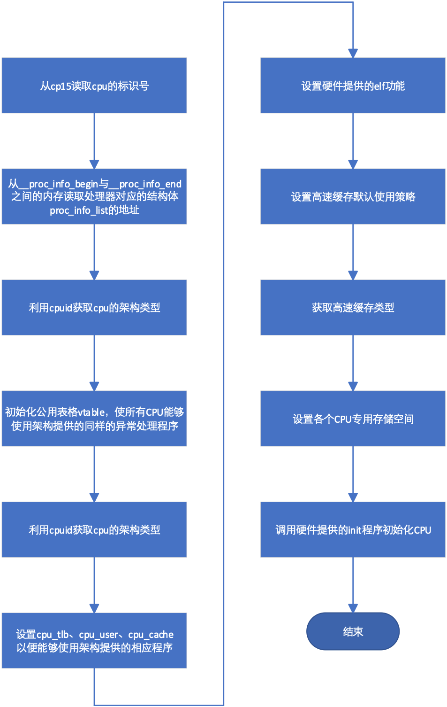
<figcaption><p>图 8‑2 setup_processor()流程图</p></figcaption>
</figure>
</center>

### 扁平化设备树处理

当系统支持设备树时，Linux通过函数setup_machine_fdt()从设备树中查询系统支持的硬件信息，查询结束后返回指向描述系统特征的结构体
machine_desc的指针。结构体
machine_desc定义在arch/arm/include/asm/mach/arch.h文件中，其定义为：

```
struct machine_desc {
   unsigned int nr;                    /* architecture number    */
   const char *name;                   /* architecture name    */
   unsigned long atag_offset;          /* tagged list (relative) */
   const char *const *dt_compat;       /* array of device tree 'compatible' strings */
   unsigned int nr_irqs;                /* number of IRQs */
   phys_addr_t dma_zone_size;           /* size of DMA-able area */
   unsigned int video_start;            /* start of video RAM    */
   unsigned int video_end;              /* end of video RAM    */
   unsigned char reserve_lp0 :1;         /* never has lp0    */
   unsigned char reserve_lp1 :1;         /* never has lp1    */
   unsigned char reserve_lp2 :1;         /* never has lp2    */
   enum reboot_mode reboot_mode;        /* default restart mode    */
   unsigned l2c_aux_val;                /* L2 cache aux value    */
   unsigned l2c_aux_mask;                /* L2 cache aux mask    */
   void (*l2c_write_sec)(unsigned long, unsigned);
   const struct smp_operations *smp;      /* SMP operations    */
   bool (*smp_init)(void);
   void (*fixup)(struct tag *, char **);
   void (*dt_fixup)(void);
   long long (*pv_fixup)(void);
   void (*reserve)(void);                /* reserve mem blocks    */
   void (*map_io)(void);                /* IO mapping function    */
   void (*init_early)(void);
   void (*init_irq)(void);
   void (*init_time)(void);
   void (*init_machine)(void);
   void (*init_late)(void);
   void (*handle_irq)(struct pt_regs *);
   void (*restart)(enum reboot_mode, const char *);
};

```

函数setup_machine_fdt()定义在设备树处理文件arch/arm/kernel/devtree.c文件中。定义为：

```
const struct machine_desc * __init setup_machine_fdt(unsigned int dt_phys)
{
   const struct machine_desc *mdesc, *mdesc_best = NULL;
   if (!dt_phys || !early_init_dt_verify(phys_to_virt(dt_phys)))
      return NULL;
   mdesc = of_flat_dt_match_machine(mdesc_best, arch_get_next_mach);
   if (!mdesc) {
       const char *prop;
       int size;
       unsigned long dt_root;
       early_print("\nError: unrecognized/unsupported "
           "device tree compatible list:\n[ ");
       dt_root = of_get_flat_dt_root();
       prop = of_get_flat_dt_prop(dt_root, "compatible", &size);
      while (size > 0) {
           early_print("'%s' ", prop);
          size -= strlen(prop) + 1;
           prop += strlen(prop) + 1;
       }
       early_print("]\n\n");
       dump_machine_table(); 		/* does not return */
   }
   if (mdesc->dt_fixup)
       mdesc->dt_fixup();
   early_init_dt_scan_nodes();
   __machine_arch_type = mdesc->nr;
   return mdesc;
}

```

在链接脚本vmlinux_lds.S中有一段链接指令：

```
  .init.arch.info : {
       __arch_info_begin = .;
      *(.arch.info.init)
      __arch_info_end = .;
  }

```

它告诉链接程序把所有段名为\*.arch.info.init的代码段按照出现的次序依次放在\_\_arch_info_begin与\_\_arch_info_end之间，其中\*表示任意字符串。\*.arch.info.init代码段通常存放系统支持的硬件型号。函数setup_machine_fdt通过比对位于\_\_arch_info_begin与\_\_arch_info_end的机器型号与设备树中根节点下的compatible特性字符串确定系统是否支持由设备树指定的CPU。匹配的字符串越多，兼容性越好。

setup_machine_fdt()函数在查找系统支持的硬件描述结构体machine_desc过程中，首先通过检查设备树魔术字、结构块长度、内存保留模块长度及字符串块长度确定设备树是否合法，然后通过调用函数of_flat_dt_match_machine()函数（设备树处理函数通常都以of_开头，定义在drivers/of/fdt.c文件中）比对\_\_arch_info_begin与\_\_arch_info_end间的数据与设备树根节点中compatible属性字符串，从而从\_\_arch_info_begin与\_\_arch_info_end间的数据中找到与设备树兼容性最高的设备的machine_desc结构体。文件drivers/of/dev.c提供了大量以of_开头的设备树查询函数，方便利用dtb文件结构查询设备树节点、特性等。有兴趣的读者可以阅读该文件中的函数，了解设备树的查询方法和细节。

在找到与设备树指定型号兼容的设备结构描述体后，setup_machine_fdt()函数调用early_init_dt_scan_nodes()函数，而early_init_dt_scan_nodes()函数通过调用回调函数early_init_dt_scan_chosen()、early_init_dt_scan_root()和early_init_dt_scan_memory分别扫描设备树中的/chosen及/memory节点。如果有/chosen节点并且在该节点发现“bootargs”特性，把“bootarg”特性值添加到boot_command_line当中。如果发现“initrd”特性，表示系统支持initrd，此时需利用initrd特性的特性值初始化变量phys_initrd_start和phys_initrd_size。如果在扫描根节点过程中发现address-cells和size-cells属性，则更新dt_root_size_cells和dt_root_addr_cells的值。如果在扫描/memory的过程中发现/memory节点，而节点memory的device_type属性值为“memory”且该节点包含”linux,usable-memory"属性，则把由该节点中reg属性指明的内存模块添加到结构体struct
memblock的内核可用区域（memblock.memory）。

Memblock是引导初始阶段用于内存管理的数据结构，系统使用它描述系统内存的划分情况。Memblock把内存分为可用内存区域和保留区域。结构体memblock的定义为：

```
struct memblock {
   bool bottom_up;  /* is bottom up direction? */
   phys_addr_t current_limit;
   struct memblock_type memory;	/* 可用内存*/
   struct memblock_type reserved;	/* 保留内存*/
}
```

如果系统不支持设备树，则U-BOOT以atag格式为Linux内核提供引导参数。前面我们已经讲过，以atag格式提供的引导参数的地址同样存储在r2寄存器中。如果在上述过程中没有找到与设备树指定的型号兼容的设备描述结构体或系统不支持设备树，setup_machine_fdt()调用setup_machine_tags()设置设备描述结构体。setup_machine_tags()首先利用架构编号\_\_machine_arch_type与存于\_\_arch_info_begin和\_\_arch_info_end间的所有设备描述结构体中的架构编号域进行比对，当二者相同时，就找到与引导参数兼容的设备描述结构体。在找到设备结构描述体后，setup_machine_tags()初始化指向结构体：

```
struct tag {
   struct tag_header hdr;
   union {
       struct tag_core        core;
       struct tag_mem32    mem;
       struct tag_videotext    videotext;
       struct tag_ramdisk    ramdisk;
       struct tag_initrd    initrd;
       struct tag_serialnr    serialnr;
       struct tag_revision    revision;
       struct tag_videolfb    videolfb;
       struct tag_cmdline    cmdline;
       struct tag_acorn    acorn;
       struct tag_memclk    memclk;
   } u;
};
```

的指针。如果setup_machine_tags()的第一个输入参数不为空，则指针的值为第一个参数的值，如果第一个输入参数的值为空，则从设备描述结构体中获取指针值。在初始化指向tag的指针后，保存一个tag备份，然后利用与tag相应的解析函数解析tag结构体。

### 初始化过程内存模块设置

在完成了设备树解析工作后，setup_arch()函数设置在初始化过程中使用的结构体init_mm，其类型为struct
mm_struct，定义在文件include/linux/mm_types.h文件中。它定义了初始化阶段Linux内存管理的各种参数，其中，init_mm.pgd = swapper_pgd_dir，由mmu初始化程序设置。在初始化CPU架构的过程中，设置了init_mm的4个区域，分别为init_mm.start_code，init_mm.end_code，init_mm.end_data及init_mm.brk。这些域对应于Linux内核镜像程序的_text，\_etext，\_edata和_end，它们定义了text段的开始、text段的结尾、data段的结尾、bss段的结尾。

在设置了init_mm后，setup_arch()函数把变量boot_cmd_line的值拷贝到变量cmd_line，供后续处理。

### 初始化固定映射区域内存

Linux保留了一块名为固定映射区域（fixmap）的内存空间，该内存区间始于FIXADDR_START，止于FIXADDR_END。在没有建立最终的页表之前，这块内存用于i/o或其它一些特殊操作，在建立页表之后，这块内存作为kmap区域，用于临时页表，供内核访问高端内存。对arm系统而言，这块内存位于0xFFFC0000-0xFFF00000之间。fixmap真正开始于0xFFFEF000，在0xFFFEF000-0xFFF00000之间为用于越界保护的保护页（guard
page）。

为了在初始化早期使用这一块内存，需要在页表中为这块区域建立地址映射关系。函数early_fixmap_init()用于为该区域对应的内存设置页表的内容，位于git/arch/arm/mm/mmu.c，定义为：

```
void __init early_fixmap_init(void)
{
	pmd_t *pmd;

	BUILD_BUG_ON((__fix_to_virt(__end_of_early_ioremap_region) >> PMD_SHIFT) != FIXADDR_TOP >> PMD_SHIFT);
	pmd = fixmap_pmd(FIXADDR_TOP);
	pmd_populate_kernel(&init_mm, pmd, bm_pte);
	pte_offset_fixmap = pte_offset_early_fixmap;
}
```

这里需要指出，这些设置的表项内容只用于初始化早期，在初始化页表时，会重新为该区域的内存建立相应的地址转换关系。

当arm Linux支持40位地址空间时，使用三级地址转换，而当arm
Linux只支持32位地址空间时，每个PGD值只对应PMD的一个单元，等同于只使用两级地址转换（见图
3‑1）。在实际实现中，pgd页表与pmd页表使用同一块内存区域。

<center>
<figure>
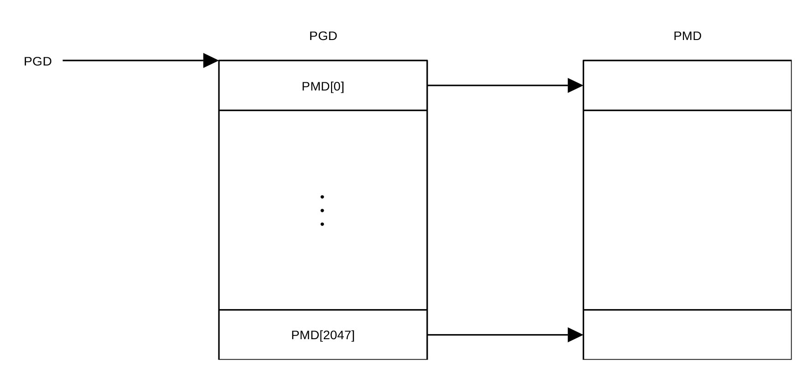
<figcaption><p>图 8‑3 fixmap用两级页表</p></figcaption>
</figure>
</center>

PGD在初始化mmu时已经设定（TTBR0和TTBR1），pmd的值通过fixmap_pmd(FIXADDR_TOP)函数确定，其中FIXADDR_TOP
= 0xFFFEF000。fixmap_pmd函数的定义为：

```
static inline pmd_t * __init fixmap_pmd(unsigned long addr)

{

  return pmd_off_k(addr);

}
```

pmd_off_k()函数的定义为：

```
static inline pmd_t *pmd_off_k(unsigned long va)

{

return pmd_offset(pud_offset(p4d_offset(pgd_offset(&init_mm,va), va), va), va);

}
```

这里，p\*d_offset()函数的作用是计算虚拟地址va在相应级别页表中的索引值。对arm版的Linux而言，没有使用P4D和PUD这两级地址转换，因此

```
p4d_offset(ptr, address) = ptr

pud_offset(ptr, address) = ptr
```

这样，pmd_off_k()函数可简化为：

```
static inline pmd_t *pmd_off_k(unsigned long va)

{

  return pmd_offset(pgd_offset(&init_mm,va), va);

}
```

最后的结果为：

```
pgd_offset(&init_mm,va) = (&init_mm)->pgd + (va>>PGDIR_SHIFT) & (PTRS_PER_PGD - 1)

pmd_offset(pgd_offset(&init_mm, va)) = (&init_mm)->pgd + (va>>PGDIR_SHIFT) & (PTRS_PER_PGD - 1) + (va >> PMD_SHIFT) & (PTRS_PER_PMD - 1)
```

由此我们可以知道，

```
pmd = pmd_off_k(FIXADDR_TOP) = (&init_mm)->pgd + (FIXADDR_TOP >>PGDIR_SHIFT) & (PTRS_PER_PGD - 1) + (FIXADDR_TOP >> PMD_SHIFT) & (PTRS_PER_PMD - 1)
```

arm32采用两级转换，PGDIR_SHIFT等于21，(PTRS_PER_PGD等于2048，PMD_SHIFT等于21，PTRS_PER_PMD等于1，因此：

```
pmd = init.pgd+0x7FF
```

在引导期间，ARM32采用段进行内存管理，每个条目管理 1MB
空间，而采用两级页表时，Linux
的每个PGD表项管理2MB空间。为了让软件逻辑上的 2MB 对应硬件上的条目，Linux
在内存布局上将两个硬件页表表项（2 × 1MB）捆绑对应一个软件 PGD
项，奇数意味着访问后半部1MB空间。

在获得中间级页表(PMD)索引pmd后，early_fixmap_init()调用函数pmd_populate_kernel()设置pmd对应表项的内容。该函数定义在arch/arm/include/asm/pgalloc.h文件中，定义为：

```
static inline void pmd_populate_kernel(struct mm_struct *mm, pmd_t *pmdp, pte_t *ptep)
{
    __pmd_populate(pmdp, __pa(ptep), _PAGE_KERNEL_TABLE);
}

static inline void __pmd_populate(pmd_t *pmdp, phys_addr_t pte,  pmdval_t prot)
{
   pmdval_t pmdval = (pte + PTE_HWTABLE_OFF) | prot;
   pmdp[0] = __pmd(pmdval);
   flush_pmd_entry(pmdp);
}
#define __pmd(x)        (x)

```

函数\_\_pmd_populate()的作用是把pmd对应的表项内容设置为(pte +
PTE_HWTABLE_OFF) \|
prot。在介绍页面设置一节将说明为什么把表项内容设置为(pte +
PTE_HWTABLE_OFF) \| prot， 而不是pte\|prot。

调用函数pmd_populate_kernel(&init_mm, pmd, bm_pte)的结果是：

```
pmd[0] = (bm_pte-PAGE_OFFSET + PTE_HWTABLE_OFF) | _PAGE_KERNEL_TABLE)
```

很显然，函数pmd_populate_kernel()的作用是把bm_pte的物理地址及一些内存特性按照PMD页表的表项格式写入到pmd对应的表项当中，并通过调用函数flush_pmd_entry()把表项内容读入到高速数据缓存区（TLB）。函数运行结果示于图8‑4。

<center>
<figure>
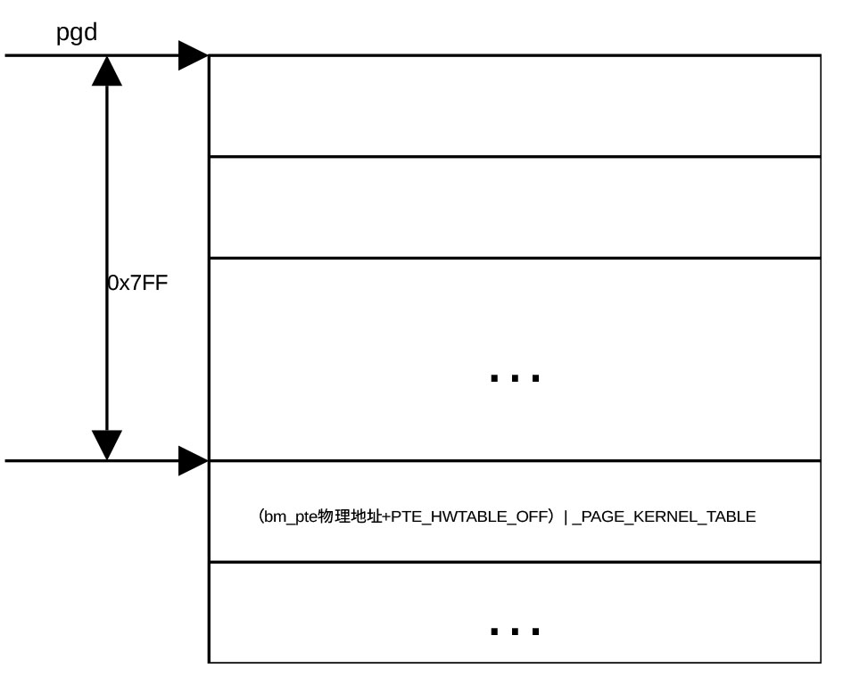
<figcaption><p>图
8‑4固定映射区域FIXADDR_TOP对应的页表表项</p></figcaption>
</figure>
</center>

初始化阶段使用一级mmu，最小管理单位为1M。通过一个名为bm_pte的、包含512个pte表项的数组，可以实现对内存的精细化管理。表中的256个表项用于Linux标识，256个表项用于arm硬件控制。这样，最小管理单位可以达到4096个字节。

如在6.3.1中介绍的，PMD页表表项格式为：

<center>
<figure>
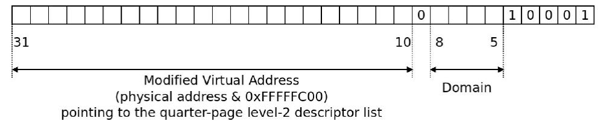
<figcaption><p>图 8‑5 PMD页表表项格式</p></figcaption>
</figure>
</center>

\_PAGE_KERNEL_TABLE（0b000110001）定义了Domain域及bit4和bit0的值。

函数flush_pmd_entry(void
\*pmd)定义在arch/arm/include/asm/asm/tblflush.h文件中，其定义为：

```
static inline void flush_pmd_entry(void *pmd)
{
   const unsigned int __tlb_flag = __cpu_tlb_flags;
   tlb_op(TLB_DCLEAN, "c7, c10, 1        @ flush_pmd", pmd);
   tlb_l2_op(TLB_L2CLEAN_FR, "c15, c9, 1  @ L2 flush_pmd", pmd);
   if (tlb_flag(TLB_WB))
       dsb(ishst);
}

```

对arm系统而言，函数flush_pmd_entry()使用了宏定义并在c语言中嵌入了arm汇编语言。经编译后，

`tlb_op(TLB_DCLEAN, "c7, c10, 1 @ flush_pmd", pmd)`
与
`tlb_l2_op(TLB_L2CLEAN_FR, "c15, c9, 1 @L2 flush_pmd", pmd)`

的可能结果为：

```
mov rx, pmd

mov rt, [rx]

mcr p15, 0, rt, c7, c10,1 @flush_pmd

mcr p15,1, rt, c15, c9, 1 @L2 flush_pmd
```

rx与rt为编译程序选择的寄存器，mcr把寄存器的内容写入协处理器。函数的作用是把pmd指针指向的内容写入高速缓存。

为了更清楚地说明整个函数的功能，下面给出了该函数的工作流程。

<center>
<figure>
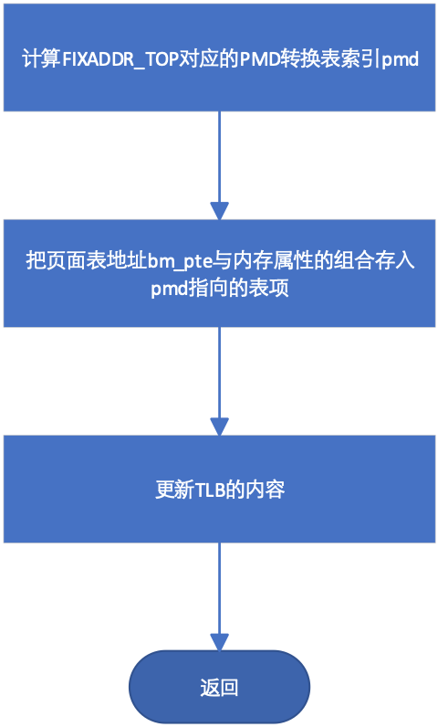
<figcaption><p>图 8‑6 esrly_fixmap_init函数工作流程</p></figcaption>
</figure>
</center>

### 初始化i/o映射

前面我们提到，初期的i/o操作使用固定映射区域。在使用过程中，固定映射区域被划分为编号为0-6的7个连续区域，每个区域称作一个槽位，包含32个表项。这些槽位将被用来存储所用i/o的虚拟地址，利用这些虚拟地址，通过固定映射区域的映射，可获得i/o的物理地址。编号为i的槽位的相对地址为FIX_BTMAP_BEGIN -
NR_FIX_BTMAPS\*i =32(7-i)。

初始化i/o映射函数
early_ioremap_init()的作用是把槽位的相对地址转换为i/o的虚拟地址，并存储在数组slot_virt\[\]中。地址转换采用宏定义\_\_fix_to_virt()，定义为：

\#define \_\_fix_to_virt(x) (FIXADDR_TOP - ((x) \<\< PAGE_SHIFT))

early_ioremap_init()函数不依赖于特定硬件，它只是简单地调用通用的Linux函数early_ioremap_setup()。early_ioremap_init()函数定义在arch/arm/mm/ioremap.c文件中，其定义为：

```
void __init early_ioremap_init(void)

{

  early_ioremap_setup();

}
```

early_ioremap_setup()函数定义在文件mm/early_ioremap.c文件中，定义为：

```
void __init early_ioremap_setup(void)
{
	int i;
	for (i = 0; i < FIX_BTMAPS_SLOTS; i++)
		if (WARN_ON(prev_map[i]))
			break;
	for (i = 0; i < FIX_BTMAPS_SLOTS; i++)
		slot_virt[i] = __fix_to_virt(FIX_BTMAP_BEGIN - NR_FIX_BTMAPS*i);
}


```

i/o映射用到三个全局数组，分别为\*pre_map\[\]、slot_virt\[\]和pre_size\[\]，其中pre_map\[\]存储已使用的内存的虚拟地址，pre_size\[\]存储使用的内存的大小，slot_virt\[\]存储每个槽位的虚拟页面地址。slot_virt\[i\]与槽位i之间的关系为：

```
slot_virt[i]
    = FIXADDR_TOP - ((FIX_BTMAP_BEGIN - NR_FIX_BTMAPS*i) << PAGE_SHIFT)
    = 0xFFFEF000 – (FIX_BTMAP_END + 32 * (7 - i) - 1) << PAGE_SHIFT
    = 0xFFFEF000 – （32 * (7 – i) \<\< 12）
```

这里，FIX_BTMAP_END通常为1，PAGE_SHIFT为12（4096字节）。槽位与内存的关系示于图8‑7。

<center>
<figure>
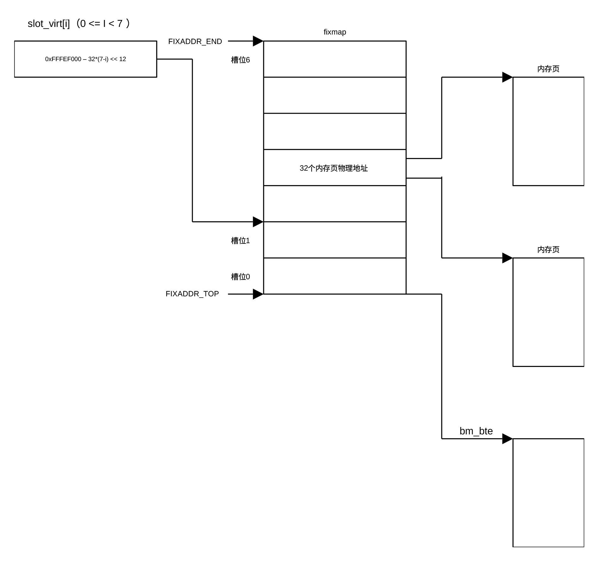
<figcaption><p>图 8‑7 槽位、页表与物理内存页</p></figcaption>
</figure>
</center>

### 引导参数解析

setup_arch()函数把命令行引导参数拷贝到cmd_line指针指向的内存并调用函数parse_early_options()解析命令行引导参数。
parse_early_options()调用函数parse_args()函数解析整个命令行提供的所有参数。parse_args()第一个输入参数为字符串，表明现在干什么，第二个参数为指向待解析参数的指针，第三个参数指向已知参数，第四个参数为待解析参数个数，第五与第六个为待解析参数所在最低和最高层级，最后一个参数指向用于处理未知参数的回调函数。

parse_args()通过`parse_one(param, val, "early options", NULL, 0, 0, 0, NULL, do_early_param)`的方式调用parse_one()函数逐个地解析命令行提供的各个参数。由于parse_args()函数调用parse_one()函数时传递给parse_one()的参数num_params为0，parse_one()并不解析传递给它的命令行参数，只是调用回调函数do_early_options()检查所有位于\_\_setup_start与\_\_setup_end之间用“过时格式”表示的参数。过时格式用结构体obs_kernel_params表示，该结构体定义为：

```
struct obs_kernel_param {

  const char *str;

  int (*setup_func)(char *);

  int early;

}
```

如果某个结构体的str指针指向的字符串与传递给parse_one()的待解析的命令行参数相同而且该结构体的域early的值不为0，或者命令行参数包含“console”，而某个结构体中的str指针指向的字符串为“earlycon”，则调用该结构体提供的setup_func()函数进行相应的操作。如果Linux代码没有.init.setup段，函数parse_early_options()不进行任何操作。

### PMD页表表项中内存属性

对arm系统而言，内存和i/o占用同一地址空间，某些内存空间或i/o设备具有一些特有的访问属性，如某些内存可以共享，而另一些不可以共享，某些能够产生中断的输入设备不可以缓存，而普通内存则可以缓存。依据内存属性，Linux定义了几类不同的内存空间，这样，同一类内存空间具有同样的内存属性，可以采用同样的页表表项。Linux定义的内存空间类型包括：

```
enum {

  MT_DEVICE = 0,

  MT_DEVICE_NONSHARED=1,

  MT_DEVICE_CACHED = 2,

  MT_DEVICE_WC= 3,

  MT_MEMORY_RW_NS= 4,

  MT_UNCACHED = 5,

  MT_CACHECLEAN,

  MT_MINICLEAN,

  MT_LOW_VECTORS,

  MT_HIGH_VECTORS,

  MT_MEMORY_RWX,

  MT_MEMORY_RW,

  MT_ROM,

  MT_MEMORY_RWX_NONCACHED,

  MT_MEMORY_RW_DTCM,

  MT_MEMORY_RWX_ITCM,

  MT_MEMORY_RW_SO,

  MT_MEMORY_DMA_READY,

};
```

这些类型的内存可以通过如下的结构体进行描述

```
struct mem_type {

  pteval_t prot_pte;

  pteval_t prot_pte_s2;

  pmdval_t prot_l1;

  pmdval_t prot_sect;

  unsigned int domain;

};
```

函数early_mm_init()调用函数build_mem_type_table()，依据arm架构及硬件扩充，利用各种内存所对应的mem_type结构体中各个域的值，确定页表表项中表示内存属性的位的值。build_mem_type_table()定义在文件arch/arm/mm/mmu.c文件中。虽然程序比较长，但大部分代码是用来确定arm架构类型及硬件扩充，以及是否支持40位地址空间，理解程序并不困难。这里不作详细解释。

在调用build_mem_type_table()之后，early_mm_init()还调用函数early_paging_init()。该函数为支持40位地址空间时的补丁函数。对于只支持32位地址空间的系统，如果机器描述结构体machine_desc
提供补丁函数pv_fixup()，则early_paging_init()函数调用pv_fixup()，否则，不作任何操作。

### DMA区域设置

在利用Linux内存管理程序分配内存时，有时会用到GFP_DMA标志。setup_dma_zone()函数用以设置使用GFP_DMA标志时允许的最大地址。如果不调用setup_dma_zone()或在编译时没有定义CONFIG_ZONE_DMA编译开关，则对最大地址没有限制。setup_dma_zone()通过设置全局变量arm_dma_zone_size、arm_dma_limit及arm_dma_pfn_limit设定最大地址。

### 虚拟机监视系统(Xen)

Xen是一种虚拟机技术，通过虚拟机监视系统（Virtual Machine
Monitor或Hypervisor），可以在一种硬件系统中安装和运行多种操作系统。硬件系统、hypervisor和寄居操作系统（guest
OS）之间的关系可用下图表示。

<center>
<figure>

<figcaption><p>图 8‑8 Hypervisor和Guest OS</p></figcaption>
</figure>
</center>

其中vm为不同的寄居操作系统，运行在没有特权的DomU域。Dom0域具有特权，其作用是控制Xen控制及启动寄居操作系统等。hypervisor模拟调度、内存管理及x
session管理器等优先级别较高的用户才能够调用的功能。

有多种hypervisor实现方法，第一类hypervisor（Type
1）直接在裸机上上运行，不需要操作系统支持。在具体实现过程中，这类hypervisor需要完成许多操作系统业已实现的功能。第二类hypervisor（Type
2）利用操作系统的许多功能，不需要再重新实现它们。由于要利用已有操作系统的某些功能，这就出现了所谓原生操作系统（即功能被借用的操作系统-host
OS）的概念。hypervisor利用原生操作系统的一些功能实现物理机的虚拟化。下图显示了利用原生操作系统实现Xen的结构框图。

<center>
<figure>

<figcaption><p>图 8‑9 基于原生操作系统的Xen</p></figcaption>
</figure>
</center>

Linux操作系统既可以作为原生操作系统提供hypervisor功能，也可以作为寄居操作系统在虚拟机上运行。arm版Linux操作系统有XEN_NATIVE，XEN_PV_DOMAIN和XEN_HVM_DOMAIN等三种模式。XEN_NATIVE表示Linux运行于裸机模式。在这种模式下，Linux操作系统不支持Xen。XEN_PV_DOMAIN表示Linux运行于PV模式。PV（Paravirtualization）是最早提出的虚拟机技术，它不需要硬件支持，而是通过软件模仿盘与网络驱动程序、中断和定时器，需要利用管理员级的指令及MMU等各种hypercall功能。Linux系统下的PV模式需要内核的支持。要支持PV模式，Linux除了提供hypervisor代码外，还需要提供Dom0及DomU代码。下图给出了采用PV技术实现虚拟机的系统结构。

<center>
<figure>
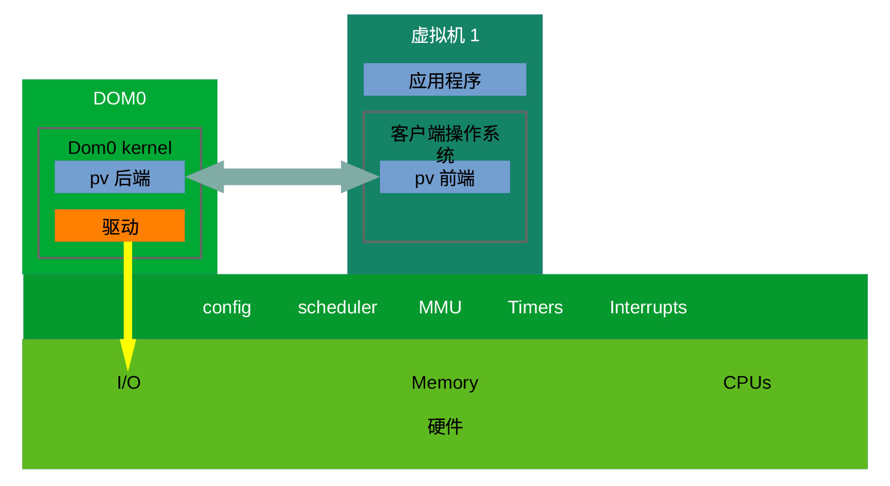
<figcaption><p>图 8‑10 基于PV的Xen</p></figcaption>
</figure>
</center>

XEN_HVM_DOMAIN表示Linux运行于HVM模式。在这种模式下，Linux利用CPU提供的虚拟扩充硬件实现各种hypercall功能。其好处是除了运行速度快外，不需要修改操作系统代码。x86系统提供了丰富的供虚拟机使用的硬件扩充，arm
架构也提供了虚拟硬件扩充模块，供CPU设计人员选择。

Linux利用类型为hyper_node结构体的全局变量记录系统是否支持Xen，结构体hyper_node的定义及其初始值为：

```
static __initdata struct {

  const char *compat;

  const char *prefix;

  const char *version;

  bool found;

} hyper_node = {"xen,xen", "xen,xen-", NULL, false};
```

xen_early_init()函数首先利用设备树扫描函数of_scan_flat_dt()遍历扁平化设备树的各个节点，并利用回调函数fdt_find_hyper_node()检查根节点下是否有名为“hypervisor”的节点。如果设备树上有“hypervisor”节点，则进一步检查hypervisor节点的compatible属性是否包含"xen,xen",
"xen,xen-"，若包含，说明系统支持Xen。如果系统支持Xen，函数回调fdt_find_hyper_node()把hyper_node结构体的found域置为true，并把设置树中compatible属性中"xen,xen-"位于xen-后面的版本号与结构体中prefix域的值进行适当的组合，存储到hyper_node结构体的version域。

在从设备树上找到hypervisor节点后，函数xen_early_init()设置全局变量xen_domain_type为XEN_HVM_DOMAIN，即系统默认采用HVM虚拟化模式。

在前面介绍的head.S文件中，有一条`bl __hyp_stub_install`语句，如果系统支持虚拟机，则会执行该语句，调用\_\_hyp_stub_install函数。\_\_hyp_stub_install设置arm处理器中与虚拟机扩充有关的寄存器，包括HVBAR（hvc异常中断向量基地址寄存器）、HCPTR、HSTR、HSCTLR、HDCR及SCTLR等，其中HVBAR设置虚拟机中断处理程序的入口点位置，其它寄存器控制arm虚拟机的运行。函数\_\_hyp_stub_install定义在文件git/arch/arm/kernel/hyp-stub.S文件中。

在设置全局变量xen_domain_type之后，xen_early_init()调用函数xen_setup_features()确定系统支持哪些虚拟机功能，并把支持的功能存储在全局变量数组xen_features\[\]中。xen_setup_features()调用HYPERVISOR_xen_version()函数把hypercall编号\_\_HYPERVISOR_xen_version（编号17）传递给寄存器r12，然后产生hvc中断，调用hvc中断服务程序，查看系统支持的hypervisor功能。HYPERVISOR_xen_version()函数定义在arch/arm/xen/hypercall.S文件中。

如果系统支持dom0，xen_early_init()还要设置xen_start_flags。如果没有设置dom0的控制终端，则把dom0的控制终端设置为默认的控制终端hvc。

### 初始化efi

在4.1节中曾经指出，efi是存储Linux系统的介质上用于存放efi格式引导程序的一个分区。不论是以GPT格式分区还是以MBR格式分区，如果系统支持UEFI格式引导（不同于U-BOOT引导，在嵌入式系统中很少采用），引导盘必须有一个efi分区，该分区通常挂接到/boot目录下。

UEFI是计算机平台及固件与操作系统及操作系统引导程序间的接口，符合UEFI标准的计算机平台及固件为操作系统提供了大量针对不同引导介质（包括CD-ROM、DVD、USB、SD、SCSI盘、网络等）的分区格式、标准引导服务、实时运行服务及各种支持不同引导介质的协议。平台固件还运行引导管理系统，用以对引导过程进行管理。对于符合UEFI标准的操作系统引导程序与操作系统，可以通过调用平台提供的各种服务直接在兼容UEFI标准的平台上启动，无需更进一步知道平台的硬件信息。UEFI允许依据操作系统引导程序及硬件平台生成一个菜单，从而允许从多个不同的操作系统中选择一个操作系统进行引导。这些操作系统可以存在不同类型的存储介质，因而在不同的分区。

当平台固件的引导服务程序LoadIamge()把操作系统引导程序读入内存后，要把控制权交予操作系统引导程序。平台固件向操作系统引导程序传递两个参数，它们是平台分配的操作系统引导程序句柄和系统表指针。其中操作系统引导程序句柄为平台提供的、服务于操作系统引导程序的程序句柄。系统表指针指向某个系统表，该表包含指向输入输出设备程序的指针、指向引导服务程序表格的指针、指向运行服务程序表格的指针、指向系统配置表格的指针，以及指向其它各种标准表格的指针。符合UEFI标准的表格以UEFI表头开始，表头结构为：

```
struct {

  u64 Signature;

  u32 Revision;

  u32 HeaderSize;

  u32 CRC32;

  u32 Reserved;

}
```

签名（Signature）用以区分表格类型，如系统表格的签名为0x5453595320494249，引导服务程序表格的签名为0x56524553544f4f42，运行服务程序表格的签名为0x56524553544e5552。

系统表格的结构为：

```
struct {

  EFI_TABLE_HEADER Hdr;

  char16 *FirmwareVendor;

  u32 FirmwareRevision;

  EFI_HANDLE ConsoleInHandle;

  EFI_SIMPLE_TEXT_INPUT_PROTOCOL *ConIn;

  EFI_HANDLE ConsoleOutHandle;

  EFI_SIMPLE_TEXT_OUTPUT_PROTOCOL *ConOut;

  EFI_HANDLE StandardErrorHandle;

  EFI_SIMPLE_TEXT_OUTPUT_PROTOCOL *StdErr;

  EFI_RUNTIME_SERVICES *RuntimeServices;

  EFI_BOOT_SERVICES *BootServices;

  UINTN NumberOfTableEntries;

  EFI_CONFIGURATION_TABLE *ConfigurationTable;

}
```

NumberOfTableEntries指明配置表格的表项个数，而配置表的格式为：

```
struct{

  EFI_GUID VendorGuid;

  void *VendorTable;

}
```

函数efi_init()为系统采用UEFI格式引导进行初期初始化工作，定义在文件git/drivers/firmware/efi/efi-init.c中。其定义为：

```
void __init efi_init(void)
{
	struct efi_memory_map_data data;
	u64 efi_system_table;
	efi_system_table = efi_get_fdt_params(&data);
	if (!efi_system_table)
		return;
	if (efi_memmap_init_early(&data) < 0) {
		panic("Unable to map EFI memory map.\n");
	}
	WARN(efi.memmap.desc_version != 1,
	     "Unexpected EFI_MEMORY_DESCRIPTOR version %ld",
	      efi.memmap.desc_version);
	if (uefi_init(efi_system_table) < 0) {
		efi_memmap_unmap();
		return;
	}
	reserve_regions();
	efi_esrt_init();
	efi_mokvar_table_init();
	memblock_reserve(data.phys_map & PAGE_MASK,
			 PAGE_ALIGN(data.size + (data.phys_map & ~PAGE_MASK)));
	init_screen_info();
#ifdef CONFIG_ARM
	efi_memmap_unmap();
	if (cpu_state_table != EFI_INVALID_TABLE_ADDR) {
	  struct efi_arm_entry_state *state;
	  bool dump_state = true;
	  state = early_memremap_ro(cpu_state_table, sizeof(struct efi_arm_entry_state));
	  if (state == NULL) {
	    pr_warn("Unable to map CPU entry state table.\n");
	      return;
	  }
	  if ((state->sctlr_before_ebs & 1) == 0)
           pr_warn(FW_BUG "EFI stub was entered with MMU and Dcache disabled, 
               please fix your firmware!\n");
	  else if ((state->sctlr_after_ebs & 1) == 0)
	    pr_warn(FW_BUG "ExitBootServices() returned with MMU and Dcache disabled, 
              please fix your firmware!\n");
	  else
	    dump_state = false;
	  if (dump_state || efi_enabled(EFI_DBG)) {
	    pr_info("CPSR at EFI stub entry        : 0x%08x\n", state->cpsr_before_ebs);
	    pr_info("SCTLR at EFI stub entry       : 0x%08x\n", state->sctlr_before_ebs);
	    pr_info("CPSR after ExitBootServices() : 0x%08x\n", state->cpsr_after_ebs);
	    pr_info("SCTLR after ExitBootServices(): 0x%08x\n", state->sctlr_after_ebs);
	  }
	  early_memunmap(state, sizeof(struct efi_arm_entry_state));
	}
#endif
```

首先，efi_init()调用efi_get_fdt_params()函数扫描设备树的节点/chosen节点，确定是否包含UEFI系统表特性
"linux,uefi-system-table"、UEFI内存分配表地址特性"linux,uefi-mmap-start"、
内存分配表大小特性"linux,uefi-mmap-size"、内存分配表描述符大小特性"linux,uefi-mmap-desc-size"及内存分配表描述符版本特性"linux,uefi-mmap-desc-ver"。如果系统支持虚拟机，则还要扫描节点/hypervisor/uefi是否包含特性"xen,uefi-system-table"、"xen,uefi-mmap-start"、"xen,uefi-mmap-size",、"xen,uefi-mmap-desc-size"及"xen,uefi-mmap-desc-ver"。如果在设备树上有这些特性，则用指向这些特性的指针初始化全局结构体efi的memmap域，并利用在前面介绍的\_\_early_ioremap()函数（见6.4.8.4）在fixmap区域为内存分配表建立页表表项，以便能够利用该地址访问设备树中相应的特性。结构体efi的定义为：

```
extern struct efi {
   const efi_runtime_services_t        *runtime;            	/* EFI 运行服务表 */
   unsigned int                    runtime_version;        		/* 运行服务版本 */
   unsigned int                    runtime_supported_mask;
   unsigned long                acpi;                	/* ACPI 表  (IA64 ext 0.71) */
   unsigned long                acpi20;            	/* ACPI 表  (ACPI 2.0) */
   unsigned long                smbios;            	/* SMBIOS 表 (32 bit entry point) */
   unsigned long                smbios3;            	/* SMBIOS 表 (64 bit entry point) */
   unsigned long                esrt;                	/* 系统资源表 */
   unsigned long                tpm_log;            	/* TPM2 事件记录表 */
   unsigned long                tpm_final_log;        	/* TPM2 最终事件记录表 */
   unsigned long                mokvar_table;        	/* 机器拥有者密匙配置表 */
   efi_get_time_t                *get_time;
   efi_set_time_t                *set_time;
   efi_get_wakeup_time_t            *get_wakeup_time;
   efi_set_wakeup_time_t            *set_wakeup_time;
   efi_get_variable_t                *get_variable;
   efi_get_next_variable_t            *get_next_variable;
   efi_set_variable_t                *set_variable;
   efi_set_variable_t                *set_variable_nonblocking;
   efi_query_variable_info_t        *query_variable_info;
   efi_query_variable_info_t        *query_variable_info_nonblocking;
   efi_update_capsule_t            *update_capsule;
   efi_query_capsule_caps_t        *query_capsule_caps;
   efi_get_next_high_mono_count_t    *get_next_high_mono_count;
   efi_reset_system_t                *reset_system;
   struct efi_memory_map            memmap;
   unsigned long                flags;
}

```

扫描设备树后，函数efi_get_fdt_params()从设备树中读出内存分配表。内存分配表的格式为：

```
struct efi_memory_map_data {

  phys_addr_t phys_map; /*内存分配表地址*/

  unsigned long size; /*内存分配表大小*/

  unsigned long desc_version; /*内存描述符版本*/

  unsigned long desc_size; /*大小*/

  unsigned long flags; /*内存标识*/

}
```

在读取内存分配表后，efi_init()通过调用函数efi_memmap_init_early()在fixmap区域为内存分配表建立页表表项，实现虚拟地址到物理地址的映射。之后，利用映射结果初始化结构体efi的memmap域。memmap域的格式为：

```
struct efi_memory_map {

  phys_addr_t phys_map; /*内存分配表的物理地址 */

  void *map; /*内存分配表的虚拟地址 */

  void *map_end; /* 内存分配表虚拟地址末尾 */

  int nr_map;

  unsigned long desc_version;

  unsigned long desc_size;

  unsigned long flags;

}
```

上一节提到，通过系统表指针，平台固件向操作系统提供各种参数。通过利用设备树提供的系统表，可以修改一些默认配置。

在为内存分配表设置了页表表项后，efi_init()函数调用uefi_init()函数处理UEFI系统表。uefi_init()函数定义在drivers/firmware/efi/efi-init.c文件中。它首先利用\_\_early_ioremap()函数为系统表在fixmap区域建立页表表项，然后利用函数efi_systab_check_header()检查系统表头签名及版本号，确定系统表是否合法以及系统表是否为当前系统支持的版本，接着利用设备树系统表提供的信息初始化全局结构体efi的runtime域，并设置efi的runtime_version域的值，显示系统表提供的设备制造商、设备版本等信息。

在处理完系统表后，uefi_init()开始处理配置表格数组common_tables。通用系统配置表数组的定义为：

```
static const efi_config_table_type_t common_tables[] __initconst = {

{ACPI_20_TABLE_GUID, &efi.acpi20, "ACPI 2.0" },

{ACPI_TABLE_GUID, &efi.acpi, "ACPI" },

{SMBIOS_TABLE_GUID, &efi.smbios, "SMBIOS" },

{SMBIOS3_TABLE_GUID, &efi.smbios3, "SMBIOS 3.0" },

{EFI_SYSTEM_RESOURCE_TABLE_GUID, &efi.esrt, "ESRT" },

{EFI_MEMORY_ATTRIBUTES_TABLE_GUID, &efi_mem_attr_table, "MEMATTR" },

{LINUX_EFI_RANDOM_SEED_TABLE_GUID, &efi_rng_seed, "RNG" },

{LINUX_EFI_TPM_EVENT_LOG_GUID, &efi.tpm_log, "TPMEventLog" },

{LINUX_EFI_TPM_FINAL_LOG_GUID, &efi.tpm_final_log, "TPMFinalLog" },

{LINUX_EFI_MEMRESERVE_TABLE_GUID, &mem_reserve, "MEMRESERVE" },

{EFI_RT_PROPERTIES_TABLE_GUID, &rt_prop, "RTPROP" },

#ifdef CONFIG_EFI_RCI2_TABLE

{DELLEMC_EFI_RCI2_TABLE_GUID, &rci2_table_phys },

#endif

#ifdef CONFIG_LOAD_UEFI_KEYS

{LINUX_EFI_MOK_VARIABLE_TABLE_GUID, &efi.mokvar_table, "MOKvar" },

#endif

{},

};
```

该数组提供了高级配置及电源接口（acpi）、熵池种子（entropy pool random
seed）等系统参数，每个单元为一个参数指定一个配置表格地址。uefi_init()首先利用\_\_early_ioremap()函数为配置表在fixmap区域建立页表表项，然后调用efi_config_parse_tables()函数解析配置表。如果设备树提供的配置表中的GUID值(VenderGuid)不在通用配置表common_tables（为一个全局结构数组）、而是在一个架构特有的配置表arch_tables（为一全局结构数组）里，则用设备树提供的配置表中相应的VenderTable指针替换arch_tables中的ptr指针，这样就可以通过设备树更新系统配置。在处理完配置表后，如果efi_rng_seed、mem_reserve及rt_prop等配置表格地址不再等于EFI_INVALID_TABLE_ADDR，说明表设备树提供了熵池种子、保留内存及实时特性配置，需要利用设备树提供的表格重新配置相应参数。这时efi_config_parse_tables()通过函数early_memremap()把内存属性修改为FIXMAP_PAGE_NORMAL，并通过函数\_\_early_ioremap()把相应的表格从在设备树上对应的地址重新映射到内核地址。如果需要重新配置保留内存，efi_config_parse_tables()还要通过函数<u>memblock_reserve</u>()把相应的内存标识为保留内存。

如果系统支持UEFI，设备树还要提供内存分配表特性，用以描述系统表格、配置表格等在内存的分配情况等。内存分配描述符格式用如下结构体定义：

```
struct {

  u32 type; /*内存类型，通常为可用内存或保留内存*/

  u32 pad; /*填充*/

  u64 phys_addr; /*物理地址*/

  u64 virt_addr; /*虚拟地址*/

  u64 num_pages; /*页数*/

  u64 attribute; /*内存属性*/

}
```

在运行完uefi_init()函数后，efi_init()函数调用reserve_regions()函数，依据设备树中内存分配表特性提供的内存分配描述符，把内存分配表中的内存区域添加到Linux引导过程中的可用内存区域或保留区域。

从版本2.3开始，UEFI标准开始支持固件更新。为此，UEFI标准定义了一个系统资源表，其格式具有如下的结构：

```
struct efi_system_resource_table {

  u32 fw_resource_count;

  u32 fw_resource_count_max;

  u64 fw_resource_version;

  u8 entries[];

}
```

其中entries为具有下面结构的数组，

```
struct efi_system_resource_entry_v1 {

  efi_guid_t fw_class;

  u32 fw_type;

  u32 fw_version;

  u32 lowest_supported_fw_version;

  u32 capsule_flags;

  u32 last_attempt_version;

  u32 last_attempt_status;

}
```

函数efi_esrt_init()首先确定是否包含系统资源表。如果系统包含系统资源表，则从内存分配表中查找是否有描述系统资源的内存描述符。在确定系统资源表对应的内存描述符合法后，通过函数early_memremap()，在fixmap区域为系统资源表建立页表表项。最后把系统资源表地址赋予全局变量esrt_data，把资源表的大小赋予全局变量esrt_data_size。

UEFI标准定义了加密引导协议。当采用加密引导方式时，只有经机器拥有者授权的操作系统与设备驱动程序才能够在系统上运行。在实现加密引导的过程中，Linux定义了一个名为mokvar_table的用户密钥表格（mok—Machine
Owner Key）。表项内容具有如下结构体定义的格式，

```
struct efi_mokvar_table_entry {

  char name[256]; /*密钥名称*/

  u64 data_size; /*密钥占用字节数*/

  u8 data[]; /*密钥*/

}
```

当系统支持加密引导时，系统通用配置表(common_tables)会包含一个MOKvar表项。在内存分配表会有相应的内存描述符。efi_init()函数首先利用efi_mokvar_table_init()检查系统是否支持加密引导。如果支持加密引导，则检查内存分配表里是否有对应于用户密钥表的内存描述符。在找到内存描述符后，efi_mokvar_table_init()通过检查密匙占用的字节数，验证各个密匙的合法性，然后在fixmap区域为用户密钥表建立页表表项，并把用户密钥表占用区域标志为保留区域。

在为所有uefi表格所占内存设置页表表项后，uefi_init()函数把内存分配表所占内存空间标识为保留区域。

当采用uefi引导方式时，可采用efi模式的显示模式。如果采用efi显示模式，则将线性帧缓存区基地址(lfb_base)对应的内存区域标识为内核非直接映射区域，避免内核对该缓存区进行直接地址映射。线性帧缓存区基地址在显示屏信息（struct
screen_info）结构体中。

运行于arm系统的Linux架构特有配置表中包含了显示屏信息表。efi引导可以利用该表对显示屏进行配置。

efi_config_parse_tables()、efi_systab_check_header()等与efi操作有关的函数定义在/drivers/firmware/efi/efi.c文件里。各种efi初始化函数及内存管理函数定义在/drivers/firmware/efi/efi-init.c文件里。下图给出了efi_init()函数的工作流程。

<center>
<figure>
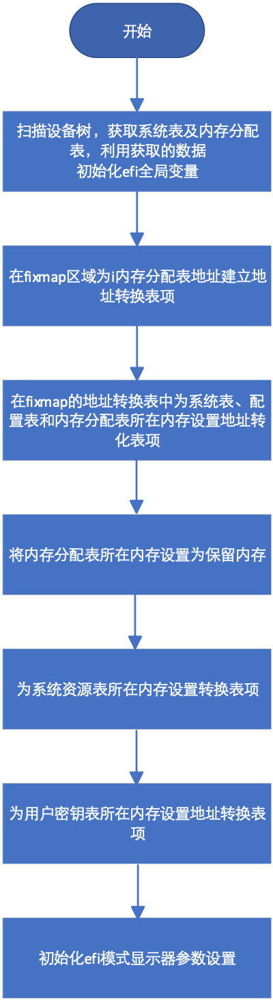
<figcaption><p>图 8‑11 efi_init()初始化流程</p></figcaption>
</figure>
</center>

### 地址转换中的基本概念

#### 引导过程内存分配器

在Linux引导过程中，需要不断地获取或释放内存。但这时还没有建立起完善的页表，也还没有引入功能强大的内存管理功能，只能采用简单的直接地址映射（memoryblock
allocator）进行内存管理。引导过程中通过初始化页表内容，为Linux内存管理建立必要条件。本节介绍Linux初始化页表的过程。

Linux在引导过程中利用memblock对内存进行管理。memblock是类型为memblock结构体的变量，结构体的定义为：

```
struct memblock {

  bool bottom_up; /* is bottom up direction? */

  phys_addr_t current_limit;

  struct memblock_type memory;

  struct memblock_type reserved;

}
```

其中，bottom_up用来定义内存地址的增长方向，current_limit用来设置最大内存地址。Linux内存分为可用内存（由memory域定义）和保留内存（由reserved域定义）。可用内存与保留内存由结构体memblock_type定义，具有如下格式：

```
struct memblock_type {

  unsigned long cnt;

  unsigned long max;

  phys_addr_t total_size;

  struct memblock_region *regions;

  char *name;

}
```

其中cnt表示本类内存包含的内存区域数，max表示本类内存所允许的最大区域数，total_size表示本类内存所占有的字节数，regions为结构体memblock_region数组的首地址。数组包含本类内存所包含的所有区域。区域用结构体memblock_region表示，其定义为：

```
struct memblock_region {

  phys_addr_t base;

  phys_addr_t size;

  enum memblock_flags flags;

  int nid;

}
```

Memblock可用图 8‑12表示。

<center>
<figure>
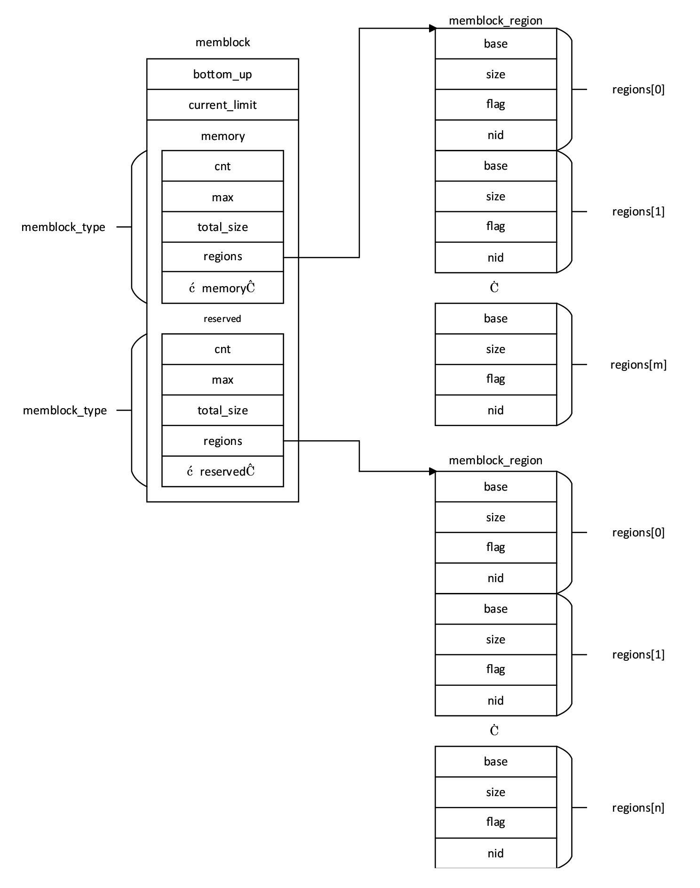
<figcaption><p>图 8‑12 memblock结构</p></figcaption>
</figure>
</center>

Linux提供了多个供初期使用的内存分配函数。在成功分配内存后，使用函数memblock_reserve()把已分配的内存区域标识为保留内存。

从上面的结构体可以看出，区域由基地址、所占空间大小、内存特征及区域所在NUMA节点的标识符表示。区域的内存特征可以为无特殊要求，支持热拔插，镜像内存或非直接映射等，分别由下面符号定义。

```
enum memblock_flags {

  MEMBLOCK_NONE = 0x0, /* 无特殊要求 */

  MEMBLOCK_HOTPLUG = 0x1, /* 热插拔区 */

  MEMBLOCK_MIRROR = 0x2, /* 镜像区 */

  MEMBLOCK_NOMAP = 0x4, /* 不要加到内核直接映射 */

}
```

#### Linux链表

堆、栈、单向链表、双向链表、循环链表以及队列等是在数据结构中非常重要的概念，在程序设计中使用非常广泛。为了方便使用，Linux定义了大量用于链表操作的宏。通用链表操作的宏定义在git/include/linux/list.h文件中，能够进行rcu（read-copy-update）链表操作的宏定义在git/include/linux/rculist.h文件中，还有一些其它类型的操作定义在其它文件中。

Linux只使用链表操作，堆、栈、FIFO均通过add_tail_list()或add_head_list()等链表宏操作实现。

链表由表头及节点构成，表头为list_head类型的结构体。list_head类型的结构体定义为：

```
struct list_head {

  struct list_head *next, *prev;

}
```

链表头的名字即为链表名字，程序通过链表头访问链表。一般利用宏LIST_HEAD(name)创建一个名为name的链表。

链表节点用来保存链表要保留的信息，由一个类型为list_head的域及一个或多个包含不同信息的域构成，如下面的代码所示：

```
struct static_vm {

  struct vm_struct vm;

  struct list_head list;

}
```

为虚拟内存链表的一个节点。多数情况下，list域放在结构体的最前面，便于访问链表节点。下图给出了各种链表结构。

<center>
<figure>
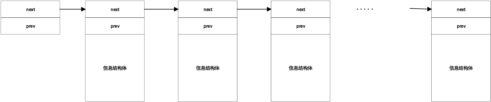
<figcaption><p>图 8‑13 单向链表</p></figcaption>
</figure>

<figure>
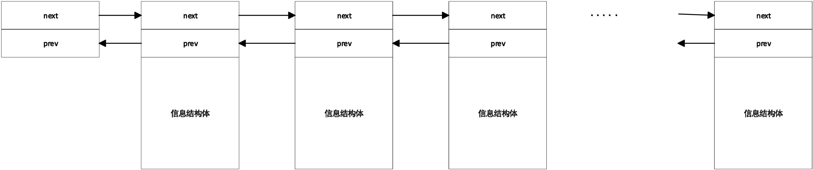
<figcaption><p>图 8‑14 双向链表</p></figcaption>
</figure>

<figure>
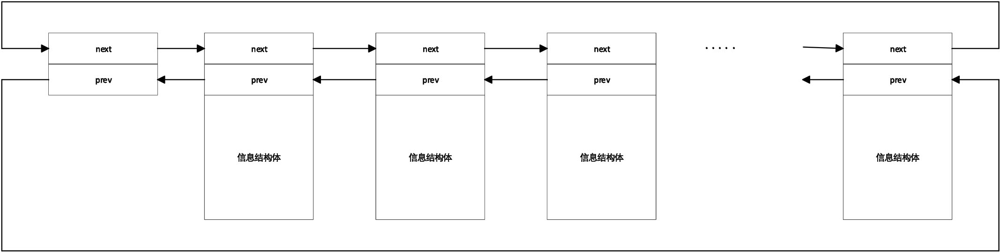
<figcaption><p>图 8‑15 循环链表</p></figcaption>
</figure>
</center>

#### Linux i/o管理

Linux使用名为static_vmlist的链表和vmlist指针对i/o设备使用的虚拟内存空间统一进行管理。static_vmlist节点由类型为static_vm的结构体构成，vmlist指针指向结构体vm_struct。vm_struct的定义为：

```
struct vm_struct {

  struct vm_struct *next; /* 形成链表 */

  void *addr;

  unsigned long size;

  unsigned long flags;

  struct page **pages;

  unsigned int nr_pages;

  phys_addr_t phys_addr;

  const void\*caller;

};
```

Static_vm的定义为：

```
struct static_vm {

  struct vm_struct vm; /* 链表 */

  truct list_head list; /* 多重链表, *nexp, *prev */

};
```

static_vmlist和vmlist的结构为：

<center>
<figure>
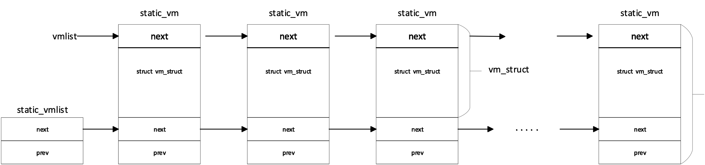
<figcaption><p>图 8‑16
i/o控制使用的static_vmlist链表和vmlist指针</p></figcaption>
</figure>
</center>

由于vm_struct的next域指向下一个vm_struct结构体，vmlist事实上指向了链表的第一个节点。

函数iotable_init()函数首先为由map_desc结构体指定的虚拟内存建立页表表项，然后利用map_desc提供的信息把上述虚拟地址对应的vm_struct结构体插入到static_vmlist和vmlist链表。map_desc结构体的定义为：

```
struct map_desc {

  unsigned long virtual;

  unsigned long pfn;

  unsigned long length;

  unsigned int type;

};
```

它提供了i/o设备所用虚拟内存的地址、所在页面、长度及内存类型信息。针对每一个输入的map_desc结构体，iotatble_init()首先从可用内存分配一块内存用以存储static_vm结构体，然后依据map_desc结构体的信息，初始化static_vm的各个域，最后把初始化后的static_vm结构体插入到static_vmlist链表，并更新struct_vm结构体中next域值，从而把struct_vm结构体加入到vmlist所指向的链表之中。

#### Linux资源管理

为了统一管理外设资源，Linux把各种外设划分为MEM、IO、REG、IRQ、DMA和BUS等各种不同类型的资源。系统通过结构体struct resource:

```
struct resource {

  resource_size_t start;

  resource_size_t end;

  const char *name;

  unsigned long flags;

  unsigned long desc;

  struct resource *parent, *sibling, *child;

};
```

描述资源。要使用某种资源，需要首先向系统申请该类资源。

cpu采用的外设控制方式有两种。一种方式为cpu采用独立的外设读写控制信号。外设占用的地址空间独立于内存占用的地址空间，两者所占地址空间可以相同。这种外设所占空间通常称为端口（port）。另一种方式为cpu采用同一组信号控制外设和内存的读写。外设与内存占用同一个地址空间，外设地址与内存地址不能相同。此类外设空间称为外设内存（iomem）。针对上述情况，Linux分别为外设内存和外设端口定义了类型为resource结构体的变量iomem_resource和ioport_resource。iomem_resource用以保存内存类外设信息，外设所占空间的起始地址为0x0，终止地址为0xFFFFFF。ioport_resource用以保存端口类外设信息，端口起始地址为0，终止地址为-1。

iomem_resource和ioport_resource的定义为：

```
struct resource iomem_resource = {

  .name = "PCI mem",

  .start = 0,

  .end = -1,

  .flags = IORESOURCE_MEM,

};

struct resource ioport_resource = {

  .name = "PCI IO",

  .start = 0,

  .end = IO_SPACE_LIMIT,

  .flags = IORESOURCE_IO,

};
```

iomem_resource和ioport_resource表示两类外设各自占用的总的地址空间。每个地址空间可以划分为多个子空间，分别分配给不同类型的外设。这些子空间还可以进一步划分，从而把设备进一步划分。通过合适地设置resource结构体中parent、sibling和child各个域的值，iomem_resource和ioport_resource中保存的外设形成一个树状结构，其中iomem_resource和ioport_resource为两棵树的根节点，如下图所示。

<center>
<figure>
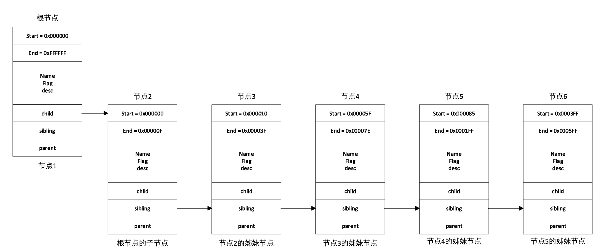
<figcaption><p>图 8‑17 iomem_resource的树状结构</p></figcaption>
</figure>
</center>

当外设向系统申请资源时，首先要指明从哪一个根节点申请资源，同时要指明申请的外设所占空间的起始和终止位置及其它描述资源的参数（resource结构体的各个域值）。依据要申请资源的外设所占空间位置，资源申请函数request_resource()选择该外设在树状结构中的位置。位置选择方式要确保树状结构中，从子节点到最后一个姊妹节点地址为由低到高变化。如果找不到这样的位置，说明该外设与其它外设有地址冲突，如果能够找到合适的位置，则把所申请的资源添加到资源的树状结构中。图
8‑18到图
8‑20给出了不同情况下外设申请资源后的树状结构，红色节点表示新申请外设在树状结构中所处位置。

<center>
<figure>

<figcaption><p>图 8‑18 为新设备分配资源前后的树状结构</p></figcaption>
</figure>

<figure>
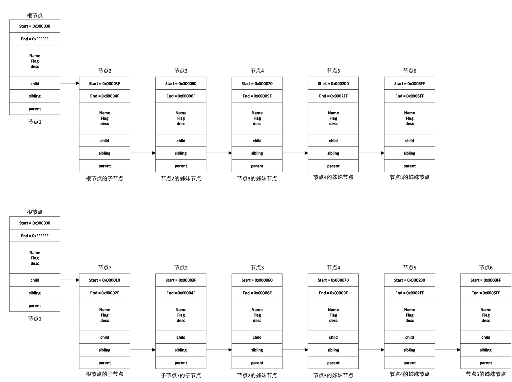
<figcaption><p>图 8‑19 新分配的资源成为根节点的子节点</p></figcaption>
</figure>

<figure>
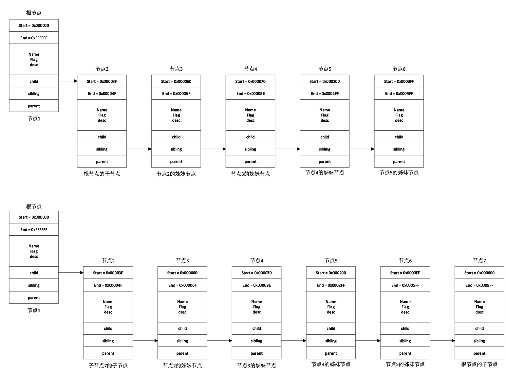
<figcaption><p>图 8‑20新分配的资源成为根节点的子节点，地址在最后</p></figcaption>
</figure>
</center>

资源分配函数代码为：

```
static struct resource * __request_resource(struct resource *root, struct resource *new)
{
        resource_size_t start = new->start;
        resource_size_t end = new->end;
        struct resource *tmp, **p;

        if (end < start)
            return root;
        if (start < root->start)
            return root;
        if (end > root->end)
            return root;
        p = &root->child;
        for (;;) {
            tmp = *p;
            if (!tmp || tmp->start > end) {
                new->sibling = tmp;
                *p = new;
                new->parent = root;
                return NULL;
            }
            p = &tmp->sibling;
            if (tmp->end < start)
                continue;
            return tmp;
    }
}

```

该函数定义在git/kernel/resource.c文件中。函数返回值为与之发生冲突的外设资源指针，若申请成功，返回值为空指针。此外，在resource.c文件中还定义了资源释放、资源查找等许多操作。

### 低端内存边界调整

当内存的物理地址空间接近或大于内核的虚拟地址空间时，就会用到高端内存(high
memory或highmem)和低端内存(low
memory或lowmem)的概念。所谓的高端内存就是指没有被固定页表覆盖的物理内存空间，低端内存是指被固定页表覆盖的、内核能够直接访问的物理内存空间。低端内存与高端内存边界的划分与硬件等因素有关。

由于固定页表无法覆盖高端内存，要访问高端内存，必须建立一个临时虚拟页表。Linux提供了多个访问高端内存的函数，如kmap_local_page()等。有兴趣的读者可以参考Linux
API参考手册。

函数adjust_lowmem_bounds()利用memblock、memblock_region等结构体及区域内存特征调整高端内存与低端内存的边界。首先，adjust_lowmem_bounds在可用内存中所有没有特殊要求的区域（即区域内存特征为MEMBLOCK_NONE的区域）找到最高地址对应的区域，把该区域的末端地址与vmalloc_min（对arm系统而言，vmalloc_min
= 0xF0000000
）二者中的较小的值与0xFFF00000按位与，获得高端内存与低端内存的分界线。在调整分界线后，adjust_lowmem_bounds()函数把该分界线值赋予全局变量arm_low_limit。

### 引导过程中内存分配器初始化

arm_memblock_init()函数用于arm架构，其作用是把引导过程中使用的内存标识为保留内存，从而避免在引导过程中覆盖这些内存。arm_memblock_init()定义在arch/arm/mm/init.c文件中，定义为：

```
void __init arm_memblock_init(const struct machine_desc *mdesc)
{
	memblock_reserve(__pa(KERNEL_START), KERNEL_END - KERNEL_START);
	arm_initrd_init();
	arm_mm_memblock_reserve();
	if (mdesc->reserve)
   	mdesc->reserve();
	early_init_fdt_reserve_self();
	early_init_fdt_scan_reserved_mem();
	dma_contiguous_reserve(arm_dma_limit);
	arm_memblock_steal_permitted = false;
	memblock_dump_all();
}

```

函数memblock_reserve()把内核占用空间标识为保留内存，即把内核占用的区域保存在结构体memblock的reserved域内。如果系统支持初始RAM盘引导，函数arm_initrd_init()把初始RAM盘（initrd）引导程序占用内存标识为保留内存。初始RAM盘引导程序占用内存空间由设备树指定。

armV7-m的异常处理中断向量地址可以在高端或低端，函数arm_mm_memblock_reserve()用于把中断向量占用空间标识为保留空间。

在引导过程和正常运行过程，都会使用设备树文件，函数early_init_fdt_reserve_self()把设备树文件占用的内存地址标识为保留内存。

在设备树根节点下，通常会包含一个"reserved-memory"节点。该节点定义系统保留的内存空间，如专用于某些外设的内存空。函数early_init_fdt_scan_reserved_mem()扫描设备树文件，把"reserved-memory"节点定义的所有内存标识为保留内存。

函数dma_contiguous_reserve()在一个称作CMA的区域（连续内存区域）内分配一块或多块合适的内存区域，供DMA使用。在成功分配DMA用内存后，把分配的内存标识为保留内存。CMA区域的地址可以通过设备树的“linux,cma-default”特性设置，也可以在配置文件.config设置，还可以通过内核命令”cma=”设置。

arm_memblock_init()函数在运行过程中可能会释放一些内存，因此，在arm_memblock_init()运行结束之后，setup_arch()再次调用adjust_lowmem_bounds()函数调整高端内存与低端内存的分界线。

### i/o地址转换函数选择

通常，i/o地址所占空间较小，使用常规的内存地址映射函数效率不高。为此，Linux提供了专门用于i/o地址映射的函数，以提高效率。大多数情况下，i/o地址映射函数只有在页面设置完成后才能正常工作。

early_ioremap_reset()函数用来设置after_paging_init标志。\_early_ioremap()函数在设置固定映射区域的页面页表表项时，利用该标志选择使用\_\_late_set_fixmap()还是\_\_early_set_fixmap()函数。对于arm系统，Linux选择\_\_late_set_fixmap()函数。该函数实际为\_\_set_fixma()函数，定义在arch/arm/mm/mmu.c文件中。函数\_\_set_fixma()通过调用用汇编语言编写的函数cpu_v7_set_pte_ext设置页表的表项pte。使用两级和三级地址转换的cpu_v7_set_pte_ext（）函数分别定义在arch/arm/mmu/proc-V7-2level.S和arch/arm/mmu/proc-V7-3level.S文件中。

### 页表初始化

函数paging_init()是内存初始化的主要函数，用于设置最终使用的页表。针对硬件是否有mmu的情况，Linux提供了mmu版和无mmu版的初始化函数。下面我们以mmu版的初始化函数为例介绍page_init()函数的工作过程。

从图6-9可以看出，一级页表（PGD）地址的高18位由页表基地址寄存器的高18位构成。页表地址的最低两位为0，其余的地址由虚拟地址中最高的12位构成。PGD页表地址中只有虚拟地址对应的12位是可变的，因此，PGD页表最多可包含4096个表项，每个表项为4个字节。二级页表地址中可变化的部分由虚拟地址的8位组成，这样，一级页表的每个表项可指向256个二级页表表项。最后的物理地址由PTE的20位和虚拟地址的低12位组成，二级页表中的每一个表项对应4096个内存单元，也就是说，每个pte可访问4096个内存单元。

<center>
<figure>
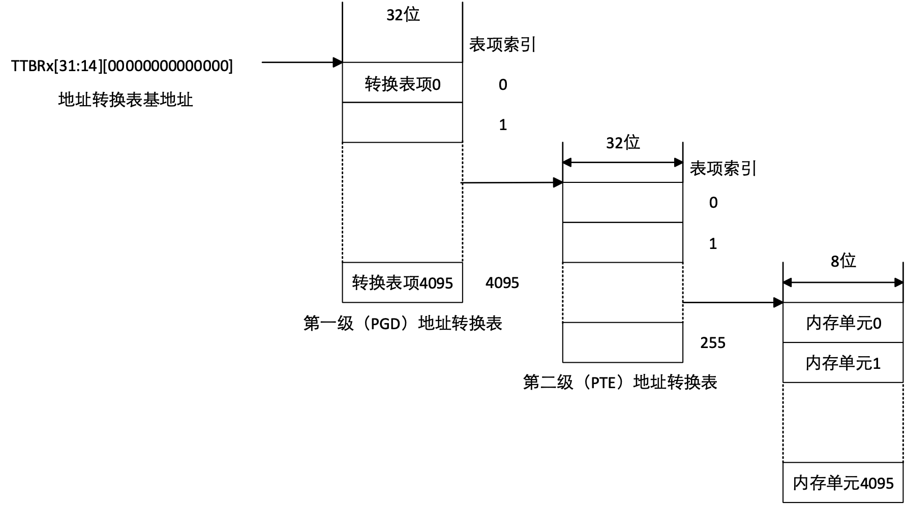
<figcaption><p>图 8‑21 两级页表结构</p></figcaption>
</figure>
</center>

Linux对内存属性的定义与ARM对内存属性的定义不尽相同，比如，Linux有内存是否为脏“dirty”及是否曾经被访问过这样的内存属性，而ARM并没有定义这样的属性。Linux要利用内存属性对内存进行管理，为此，Linux对ARM的内存页表进行了一些特殊处理，以模仿Linux的一些内存属性。ARM版Linux把PTE分为两类，一类用于储存Linux内存属性，即记录Linux访问内存的一些状态信息，另一类用于表示ARM使用的内存属性。内存管理模块利用Linux的内存访问状态设置供ARM使用的相应地址的内存属性。图
8‑22给出了ARM版Linux页表结构。

（再次介绍一下pte结构，参考arm页表表项结构）

<center>
<figure>
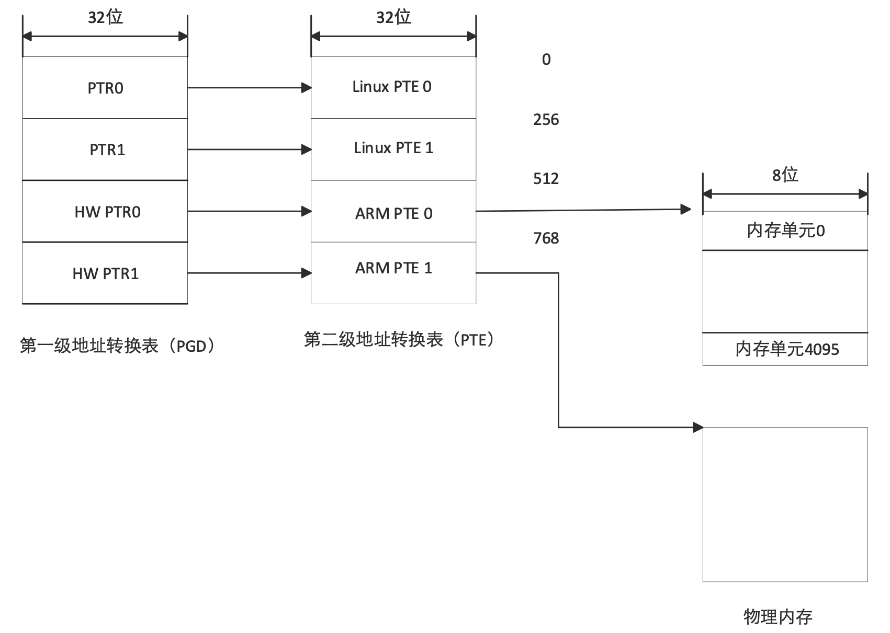
<figcaption><p>图 8‑22 ARM版Linux页表结构</p></figcaption>
</figure>
</center>

从上图可以看出，每个PGD表项包含两个指针PTR和HWPTR。每个指针各占4个字节，分别指向二级页表的256个Linux表项和256个ARM表项。整个PGD包含2048个表项，每个表项对应512个二级页表表项。

页面初始化函数定义在git/arch/arm/mm/mmu.c文件中，其定义为：

```
void __init paging_init(const struct machine_desc *mdesc)
{
	void *zero_page;
	prepare_page_table();
	map_lowmem();
	memblock_set_current_limit(arm_lowmem_limit);
	dma_contiguous_remap();
	early_fixmap_shutdown();
	devicemaps_init(mdesc);
	kmap_init();
	tcm_init();
	top_pmd = pmd_off_k(0xffff0000);
	zero_page = early_alloc(PAGE_SIZE);
	bootmem_init();
	empty_zero_page = virt_to_page(zero_page);
	 __flush_dcache_page(NULL, empty_zero_page);
}

```

#### 页表清零

页表初始化程序首先调用prepare_page_table()函数把一级页表清零，该函数的定义为：

```
static inline void prepare_page_table(void)
{
	unsigned long addr;
	phys_addr_t end;
	for (addr = 0; addr < MODULES_VADDR; addr += PMD_SIZE)
		pmd_clear(pmd_off_k(addr));
	for ( ; addr < PAGE_OFFSET; addr += PMD_SIZE)
		pmd_clear(pmd_off_k(addr));
	end = memblock.memory.regions[0].base + memblock.memory.regions[0].size;
	if (end >= arm_lowmem_limit)
		end = arm_lowmem_limit;
	for (addr = __phys_to_virt(end); addr < VMALLOC_START; addr += PMD_SIZE)
		pmd_clear(pmd_off_k(addr));
}
```

前面我们已经提到，由于ARM Linux采用两级地址转换，PGD、PMD、P4D和PUD页表为同一个页表，宏pmd_clear()把地址对应的PMD表项清零。宏pmd_off_k()的作用在上一节作过介绍，其作用是计算地址在PMD页表中的表项索引。函数中前两个for循环语句的作用是把用户空间对应的表项清零，后面语句的作用是把对应于第一个可用区域之外的低端内存与VMALLOC_START之间内存的PMD页表中的表项清零，之后把相应的TLB清零。图8‑23表示Linux内存空间分配情况。右边为虚拟内存空间，左边为对应的物理内存，黑色部分表示表项清零部分对应的虚拟内存。

<center>
<figure>
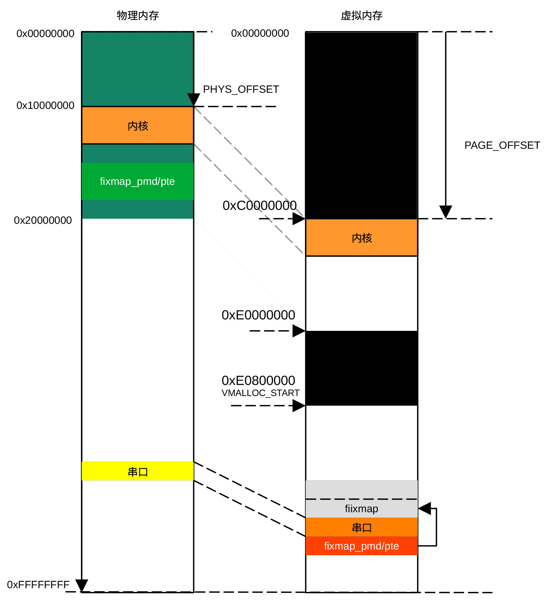
<figcaption><p>图 8‑23 对应于表项清零的内存模块</p></figcaption>
</figure>
</center>

#### 低端内存地址映射

前面已经提到，Linux把内存划分为低端内存和高端内存，低端内存为内核可以通过固定页表直接访问的内存。函数map_lowmem()为低端内存里所有可用内存块(memblock.memory)中没有特殊用处（MEMORY_NONE）的内存区域建立页表，其定义为：

```
static void __init map_lowmem(void)

{

  phys_addr_t kernel_x_start = round_down(__pa(KERNEL_START),SECTION_SIZE);

  phys_addr_t kernel_x_end = round_up(__pa(__init_end), SECTION_SIZE);

  phys_addr_t start, end;

  u64 i;

  for_each_mem_range(i, &start, &end) {

    struct map_desc map;

    if (end > arm_lowmem_limit)

      end = arm_lowmem_limit;

    if (start >= end)

      break;

    if (end < kernel_x_start) {

      map.pfn = __phys_to_pfn(start);

      map.virtual = __phys_to_virt(start);

      map.length = end - start;

      map.type = MT_MEMORY_RWX;

      create_mapping(&map);

    } else if (start >= kernel_x_end) {

        map.pfn = __phys_to_pfn(start);

        map.virtual = __phys_to_virt(start);

        map.length = end - start;

        map.type = MT_MEMORY_RW;

        create_mapping(&map);

    } else {

      if (start < kernel_x_start) {

        map.pfn = __phys_to_pfn(start);

        map.virtual = __phys_to_virt(start);

        map.length = kernel_x_start - start;

        map.type = MT_MEMORY_RW;

        create_mapping(&map);

      }

      map.pfn = __phys_to_pfn(kernel_x_start);

      map.virtual = __phys_to_virt(kernel_x_start);

      map.length = kernel_x_end - kernel_x_start;

      map.type = MT_MEMORY_RWX;

      create_mapping(&map);

      if (kernel_x_end \< end) {

        map.pfn = __phys_to_pfn(kernel_x_end);

        map.virtual = __phys_to_virt(kernel_x_end);

        map.length = end - kernel_x_end;

        map.type = MT_MEMORY_RW;

        create_mapping(&map);

      }

    }

  }

}
```

map_lowmem()函数在建立页表时，依据相对于内核模块的位置，分四种情况进行处理。当内存块的起始地址高于内核的末端地址时，为整个内存块建立页表表项，把该块内存标志位可读写内存（MT_MEMORY_RW）；当内存块的末端地址低于内核的首端地址时，为整个内存块建立页表表项，把该块内存标识为可读、可写与可执行区域（MT_MEMORY_RWX）；当可用内存模块与内核顶端部分重叠时，为该模块内高于内核末端部分的内存建立地址转换模块，把该部分内存标记为可读写内存（MT_MEMORY_RW）；当可用内存模块与内核首端部分重叠时，为该块内存中地址低于内核首端的内存建立页表表项，该部分内存标识为可读写内存。图66(#Ref151820386)显示了lowmem区域中设置了页表表项的区域。

<center>
<figure>
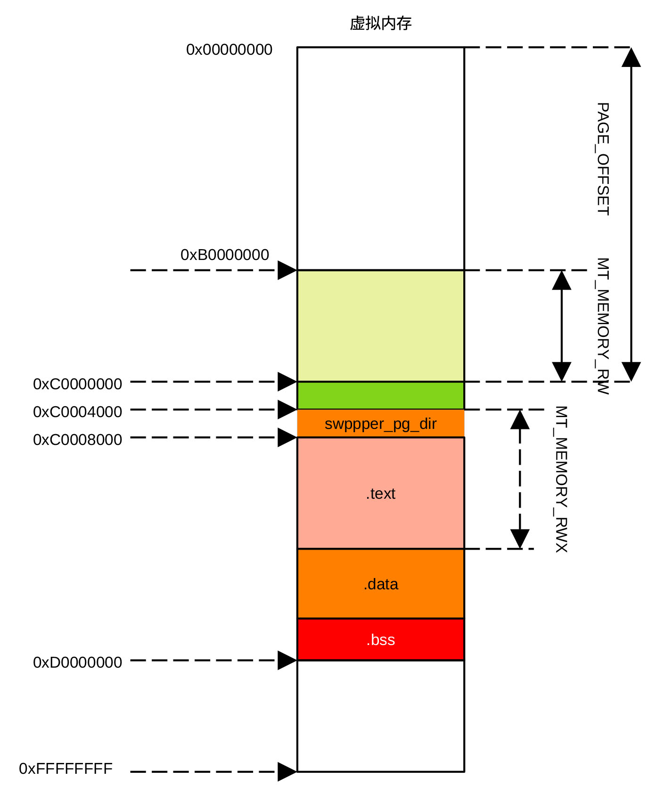
<figcaption><p>图 8‑24 lowmem区域页表表项对应的虚拟地址</p></figcaption>
</figure>
</center>

map_lowmem()函数利用宏定义for_each_mem_range()遍历memblock.memory中的所有区域。\_\_phys_to_pfn()宏计算虚拟地址的页码，宏*\_\_phys_to_virt()*把物理地址转换为虚拟地址，函数*create_mapping()*设置内存区域对应的PMD和PTE页表表项内容。

在设置了lowmem区域的页表内容后，page_init()函数调用memclock_set_current_limit()函数。该函数的作用就是简单地把memblock结构体的limit域设置为arm_low_limit。

#### DMA内存对应的页表表项初始化

前面已经介绍，在初始化内存分配器memblock过程中，通过调用dma_contiguous_reserve()函数，系统在CMA区域为DMA保留了一定的空间供DMA使用。这些区域的起始地址及大小保存在类型为结构体struct
dma_mmu_remap的数组中，其中base域保存DMA区块的起始地址，size域保存区块的大小。

dma_contiguous_remap()函数遍历所有保留的DMA区域，计算出各个DMA区域的页码、起始位置的虚拟地址以及区域大小，把这些信息存储在类型为struct
map_desc的结构体内，并把该结构体的type域置为MT_MEMORY_DMA_READY，之后在页表中为每个map_desc结构体建立相应的页表表项，然后把虚拟地址对应的vm_struct结构体插入到static_vmlist和vmlist链表当中。在遍历各个DMA区域的过程中，函数dma_contiguous_remap()把DMA区域对应的PMD和PTE表项内容清零。

```
map_desc结构体的定义为：

struct map_desc {

  unsigned long virtual;

  unsigned long pfn;

  unsigned long length;

  unsigned int type;

};
```

函数dma_contiguous_reserve()位于文件git/arch/arm/mm/dma-mapping,c中，定义为：

```
void __init dma_contiguous_remap(void)

{

  int i;

  for (i = 0; i < dma_mmu_remap_num; i++) {

    phys_addr_t start = dma_mmu_remap[i].base;

    phys_addr_t end = start + dma_mmu_remap[i].size;

    struct map_desc map;

    unsigned long addr;

    if (end > arm_lowmem_limit)

      end = arm_lowmem_limit;

    if (start >= end)

      continue;

    map.pfn = __phys_to_pfn(start);

    map.virtual = __phys_to_virt(start);

    map.length = end - start;

    map.type = MT_MEMORY_DMA_READY;

    for (addr = __phys_to_virt(start); addr < __phys_to_virt(end); addr += PMD_SIZE)

      pmd_clear(pmd_off_k(addr));

    flush_tlb_kernel_range(__phys_to_virt(start), __phys_to_virt(end));

    iotable_init(&map, 1); /* put dma memory into iotable */

  }

}
```

#### fixmap/kmap区域对应的页表表项初始化

前面我们讲过，在开始引导阶段，fixmap区域用作i/o或其它一些特殊操作。在开始初始化页表时，要把fixmap区域的用处改变为高端内存映射区域。函数early_fixmap_shutdown()的作用是重新为该区域建立地址映射。early_fixmap_shutdown()遍历fixmap区域各页在bm_pte数组存储的表项内容。如果相应的表项内容表示该页内存特性为L_PTE_MT_DEV_SHARED，则为该页内存建立页表表项，也就是说，kmap区域仅用于i/o操作。fixmap/kmap区域内存的地址转换方式示于图
8‑25。

<center>
<figure>
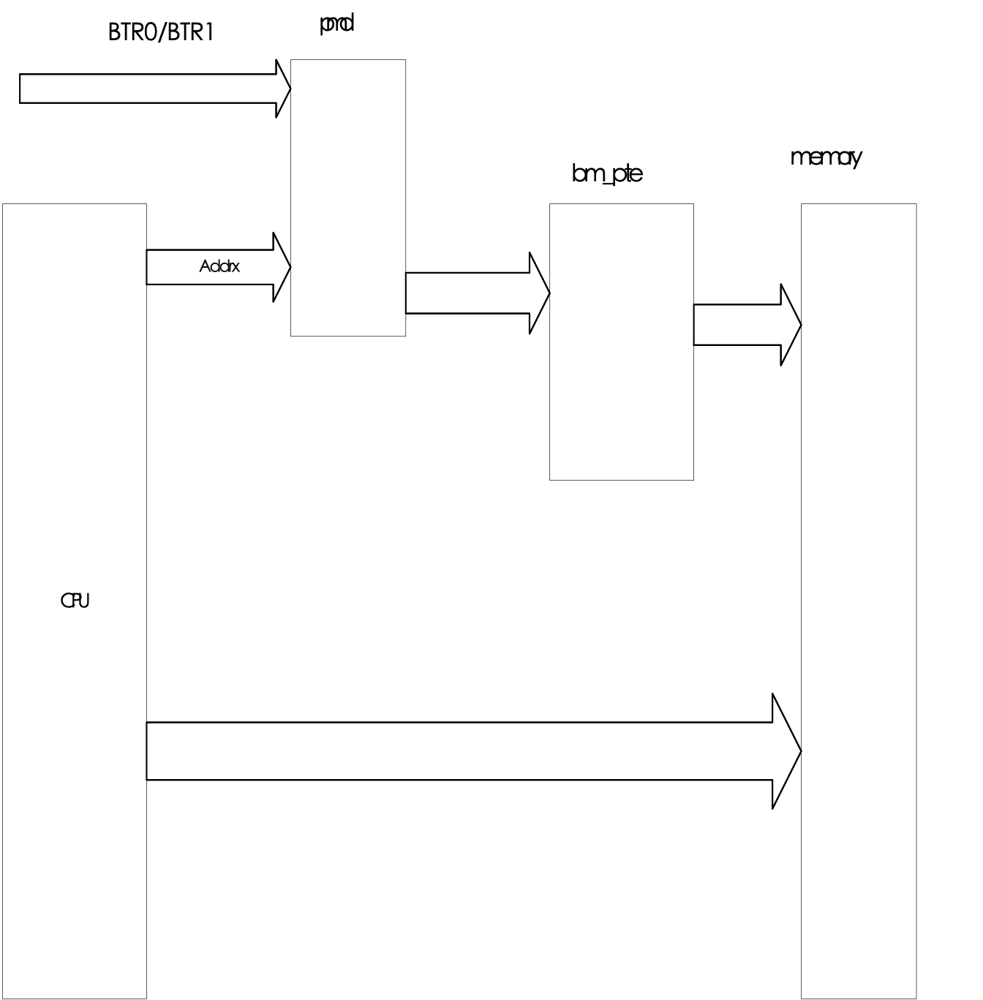
<figcaption><p>图 8‑25 固定映射区域地址转换</p></figcaption>
</figure>
</center>

函数early_fixmap_shutdown(void)定义在文件git/arch/arm/mm/mmu.c文件中，其定义为：

```
static void __init early_fixmap_shutdown(void)

{

int i;

unsigned long va = fix_to_virt(__end_of_permanent_fixed_addresses -
1);

pte_offset_fixmap = pte_offset_late_fixmap;

pmd_clear(fixmap_pmd(va));

local_flush_tlb_kernel_page(va);

for (i = 0; i < __end_of_permanent_fixed_addresses; i++) {

  pte_t *pte;

  struct map_desc map;

  map.virtual = fix_to_virt(i);

  pte = pte_offset_early_fixmap(pmd_off_k(map.virtual), map.virtual);

  if (pte_none(*pte) || (pte_val(*pte) & L_PTE_MT_MASK) != L_PTE_MT_DEV_SHARED)

    continue;

    map.pfn = pte_pfn(*pte);

    map.type = MT_DEVICE;

  map.length = PAGE_SIZE;

  create_mapping(&map);

  }

}
```

#### 初始化设备地址映射

函数devicemaps_init()初始化设备内存空间对应的页表表项内容。该函数首先调用函数early_alloc()，通过\_\_memblock_find_range_bottom_up()或\_\_memblock_find_range_bottom_down()，在所有节点中遍历低端内存中的可用内存区间（memblock.memory），查找大小满足要求的内存区域，并在其中分配内存。在分配内存过程中，不能使用内核所占用空间。

在成功获取内存后，devicemaps_init()函数调用early_trap_init()函数，把中断向量表、桩代码（stub）及用户辅助代码（kuser_helper）拷贝到该内存区域。大家经常会看到中断向量表的概念，对桩代码及用户辅助代码的概念比较陌生。下面简单地介绍一下桩代码和用户辅助代码。

Linux的一些子系统通常要支持多种工作方式或支持多种设备，要完成这样的工作，通常需要修改一些参数甚至一些代码，桩代码常驻内存，其作用就是修改参数或代码，以支持多种工作方式。常见的桩代码有efi引导桩代码、systemd桩代码、I2C桩代码等。

各种CPU实现的操作和功能不尽相同。为了给用户提供某些CPU没有实现、而实现它又需要内核帮助的功能，Linux提供了用户辅助代码。这些代码位于内核空间，其作用是实现用户所需的功能。用户空间的代码可以直接访问辅助代码所在区间。

在把中断向量表等拷贝到所分配的内存后，devicemaps_init()函数把介于VMALLOC_START和FIXADDR_TOP之间内存对应的页表表项清零。由于介于FIXADDR_TOP和FIXADDR_TOP-PAGE_SIZE之间的内存供early
fixmaps使用，要保留该段内存对应的页表表项。

如果Linux支持xip（execute in
place）运行方式，则需要为由常量MODULES_VADDR（物理地址为CONFIG_XIP_PHYS_ADDR）定义的虚拟内存段建立页表表项。如果系统使用缓存刷新区域，则为由虚拟地址FLUSH_BASE（物理地址为FLUSH_BASE_PHYS）确定的内存地址建立页表表项。

devicemaps_init()函数为虚拟地址为0xFFFF0000、大小为PAGE_SIZE的内存模块建立页表表项，该块区域为中断向量等所占区域。如果系统支持用户辅助代码功能，把该模块标志位MT_HIGH_VECTORS，否则，把该模块标志位MT_LOW_VECTORS。

如果arm中断向量地址位于低端（通过控制寄存器，可以选择中断地址位于0x00000000或0xFFFF0000），则为虚拟地址始于0x00000000、大小为2\*PAGE_SIZE的内存区域建立页表表项，并把该区域的内存标识为MT_LOW_VECTORS类。

Linux还为内核保留一页类型为MT_LOW_VECTORS的只读内存，其虚拟地址为0xFFFF0000 +
PAGE_SIZE。devicemaps_init()函数为该段内存建立页表表项，以便内核访问该段内存。

Linux还具备调用硬件自身提供的地址映射函数的功能，供硬件使用自身的i/o内存映射功能。如果硬件描述符(mdesc)表示硬件提供了自身的i/o空间映射函数，则devicemaps_init()调用硬件提供的i/o映射函数，初始化相应的页表表项。

我们知道，PCI总线占用一定数量的地址空间。地址始于PCI_IO_VIRT_BASE（0xFEE00000）、大小为2M字节的内存用于PCI
i/o地址空间。如果系统还没有保留PCI
i/o地址空间，设备地址映射函数在memblock.memory中寻找一块自由空间，为PCI
i/o地址空间建立一个静态VM结构体，把PCI
i/o地址保存在该结构体，并设置结构体的标志位及使用PCI
i/o空间的函数的入口地址，最后把该结构体保存到静态vm链表中。

Devicemaps_init()函数定义在文件git/arch/arm/mm/mmu.c中，其定义位：

```
static void __init devicemaps_init(const struct machine_desc *mdesc)

{

struct map_desc map;

unsigned long addr;

void *vectors;

vectors = early_alloc(PAGE_SIZE * 2);

early_trap_init(vectors);

for (addr = VMALLOC_START; addr < (FIXADDR_TOP & PMD_MASK); addr +=  PMD_SIZE)

  pmd_clear(pmd_off_k(addr));

#ifdef CONFIG_XIP_KERNEL

map.pfn = __phys_to_pfn(CONFIG_XIP_PHYS_ADDR & SECTION_MASK);

map.virtual = MODULES_VADDR;

map.length = ((unsigned long)_exiprom - map.virtual + ~SECTION_MASK) & SECTION_MASK;

map.type = MT_ROM;

create_mapping(&map);

#endif

#ifdef FLUSH_BASE

map.pfn = __phys_to_pfn(FLUSH_BASE_PHYS);

map.virtual = FLUSH_BASE;

map.length = SZ_1M;

map.type = MT_CACHECLEAN;

create_mapping(&map);

#endif

#ifdef FLUSH_BASE_MINICACHE

map.pfn = __phys_to_pfn(FLUSH_BASE_PHYS + SZ_1M);

map.virtual = FLUSH_BASE_MINICACHE;

map.length = SZ_1M;

map.type = MT_MINICLEAN;

create_mapping(&map);

#endif

map.pfn = __phys_to_pfn(virt_to_phys(vectors));

map.virtual = 0xffff0000;

map.length = PAGE_SIZE;

#ifdef CONFIG_KUSER_HELPERS

map.type = MT_HIGH_VECTORS;

#else

map.type = MT_LOW_VECTORS;

#endif

create_mapping(&map);

if (!vectors_high()) {

  map.virtual = 0;

  map.length = PAGE_SIZE * 2;

  map.type = MT_LOW_VECTORS;

  create_mapping(&map);

}

map.pfn += 1;

map.virtual = 0xffff0000 + PAGE_SIZE;

map.length = PAGE_SIZE;

map.type = MT_LOW_VECTORS;

create_mapping(&map);

if (mdesc->map_io)

  mdesc->map_io();

else

  debug_ll_io_init();

fill_pmd_gaps();

pci_reserve_io();

local_flush_tlb_all();

flush_cache_all();

early_abt_enable();

}
```

内核使用固定页表访问内存。当用户空间与内核空间的划分方式位3G/1G时，固定页表只能覆盖低端内存空间所占用的896M字节空间。要访问896M之外的高端内存空间，必须使用动态页表。从前面介绍的虚拟内存结构可以知道，有一块名位kmap的内存区域，Linux使用该区域进行动态内存地址转换。

page_init()调用kmap_init()函数初始化动态页表。如果系统支持高端内存，kmap_init()函数首先确定地址为PKMAP_BASE的内存在pmd页表中是否有相应的表项。如果没有，则先从可用内存空间分配一块内存，为起始地址为PKMAP_BASE的内存建立pte页表，然后用该pte表的地址更新pmd页表中对应于PKMAP_BASE的表项内容。这样，通过动态地修改pte表项的内容，就可把PKMAP_BASE之上的虚拟内存空间动态地映射到不同的物理空间。地址转换过程为：

<center>
<figure>
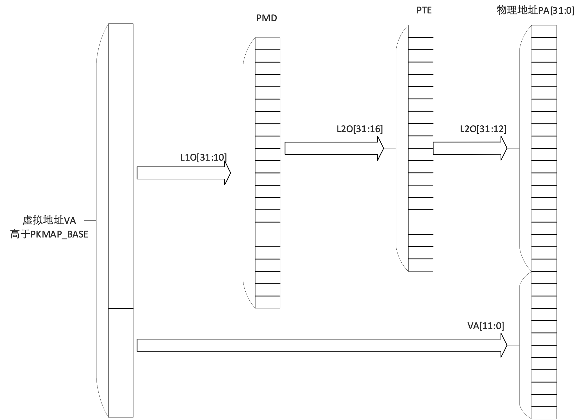
<figcaption><p>图 8‑26 动态地址映射</p></figcaption>
</figure>
</center>

动态页表的初始化函数定义为：

```
static void __init kmap_init(void)

{

#ifdef CONFIG_HIGHMEM

pkmap_page_table = early_pte_alloc(pmd_off_k(PKMAP_BASE), PKMAP_BASE, _PAGE_KERNEL_TABLE);

#endif

early_pte_alloc(pmd_off_k(FIXADDR_START), FIXADDR_START, _PAGE_KERNEL_TABLE);

}
```

#### 紧耦合内存初始化

在读写内存的过程中，Linux大量使用缓存。然而，当使用缓存时，Linux读写内存的时间会有所变化。在读内存时，若所需内容在缓存区时，读取时间会很短。当内容不在缓冲区时，首先要把内容从内存读入缓存区，然后再从缓冲区读入，需要的时间会很长。写入内存时的情况类似，也会依情况不同而有所变化。

在某些情况下，需要固定cpu读写内存的时间，比如中断处理和实时任务处理。从Arm5开始，Arm系列处理器内配置了紧耦合内存(TCM-Tightly
Coupled
Memory)。所谓的紧耦合内存就是一块不允许缓存的高速内存，对这一区域内存的读写都不经过缓存机制，而是直接对内存进行操作。

Arm紧耦合内存包含指令TCM（itcm）和数据（dtcm）两个紧耦合区域，这两个区域的物理地址可以通过TCM内部的控制寄存器设置。由于CPU通过MMU访问TCM区域，而访问TCM区域时MMU经常处于关闭状态，因此，TCM地址映射采用1:1映射，即映射前后的地址相同。Linux把ITCM和DTCM分别映射到0xFFFE0000-0x0xFFFE7FFF和0xFFFE8000-0xFFFEFFFF之间。

每个TCM区域可分为0-4个组，ITCM和DTCM的分组数目可以分别从arm
cp15的TCMTR寄存器\[2:0\]和\[18:16\]位获得。比较新的arm架构一般都把ITCM和DTCM分为两组，每一组都有自己的控制寄存器。这样可以把一组用于安全模式，而另一组用于普通用户模式。

TCM控制寄存器为cp15的c9
c1寄存器，用来设置TCM工作模式。TCM可以工作于安全模式或普通用户模式。只有当CPU工作于特权模式时才可以读取cp15
c9寄存器。当CPU工作在普通用户模式且不具备安全授权的情况下，读取该寄存器时会产生未定义异常中断。为了使系统在不具备TCM使用权的情况下仍能够启动，Linux使用挂接技术（hook），通过修改无定义异常中断处理程序，执行读取结果清零操作。处理完成后返回引导程序，从而继续引导过程。挂接结构体及TCM无定义异常处理程序的定义为：

```
#define TCM_REGION_READ_MASK 0xffff0fdf

#define TCM_REGION_READ_INSTR 0xee190f11

#define DEST_REG_SHIFT 12

#define DEST_REG_MASK 0xf

static int __init tcm_handler(struct pt_regs *regs, unsigned int
instr)

{

regs->uregs[(instr >> DEST_REG_SHIFT) & DEST_REG_MASK] = 0;

regs->ARM_pc += 4; /* ARM_pc = uregs[15] */

return 0;

}

static struct undef_hook tcm_hook __initdata = {

.instr_mask = TCM_REGION_READ_MASK,

.instr_val = TCM_REGION_READ_INSTR,

.cpsr_mask = MODE_MASK,

.cpsr_val = SVC_MODE,

.fn = tcm_handler

};
```

其中结构体regs用于系统调用时保存寄存器的值。

在Linux系统中，TCM主要用于FIQ处理、外部RAM自我刷新时的CPU空闲循环以及所有需要设置或重新配置外部内存控制器的操作。

页面初始化程序利用tcm_init()函数设置TCM内存，该函数定义在git/arch/arm/kernel/tcm.c。它首先判别arm版本是否低于arm5。若低于arm4，函数返回，若tcm格式兼容armv6，则读取TCMTR寄存器的内容，分别获取itcm和dtcm区的分组数目。

在获取itcm和dtcm的分组数目后，tcm_init()注册无定义异常中断挂接函数，把挂接函数加到无定义异常中断处理函数链表，以便arm能够处理tcm无定义异常中断。

通过读写cp15 c9
c2寄存器，可以修改TCM每一组内存对应的地址范围。tcm_init()函数通过调用setup_tcm_bank()函数，设置itcm和dtcm每一组内存地址。第一组itcm内存的起始地址设置为0xFFFE0000，第一组dtcm内存的起始地址设置为0xFFFE8000，第二组内存的起始地址的设置由实际使用TCM指令和数据的数量决定。

在设定每组内存对应的地址范围后，可以确定itcm和dtcm的起始地址和终止地址。函数request_resource()函数为itcm和dtcm从iomem_resource申请外设资源。函数iotable_init()为itcm和dtcm所用内存地址建立页表表项，然后把这些地址对应的vm_struct结构体插入到static_vmlist和vmlist链表。

tcm_init()函数最后的工作是把用于itcm和dtcm的指令和数据从内存段\_\_sdtcm_data、\_\_edtcm_data和\_\_dtcm_start分别拷贝到itcm和dtcm。

这里需要指出的是，大部分arm芯片并没有实现tcm功能。

#### 分配零页

在 Linux 内核中，零页（zero
page）是一个全局共享的、物理内容全为零的特殊内存页。它是内核为了提高系统效率而设计的内存分配方案。当使用
malloc 申请大块内存或者通过 mmap
创建匿名映射时，内核并不会立即分配内存。如果进程只是读取这块尚未写入的内存，内核会将该进程的虚拟地址全部指向同一个物理页面（零页）。一旦进程尝试修改该页，硬件会触发缺页异常（Page
Fault），这时内核才会分配一个物理页，拷贝零页内容到分配的物理内存，并更新页表指向新页。

Page_init()函数调用早期内存分配函数early_alloc()，分配一块大小为PAGE_SIZE（通常为4096）字节的内存并初始化其内容为0。

#### 初始化引导内存

Page_init()调用bootmem_init()函数初始化引导内存。系统采用的内存模型不同，bootmem_init()函数初始化内存的方式也不一样。

##### Linux内存管理模型

在进行内存分配、释放等各种内存操作时，Linux使用内存模型进行内存管理。Linux支持多种类型的内存模式，以适应具有不同特点的内存。目前，Linux支持平坦内存模型（flatmem）、不连续内存模型（discontigmem）、稀疏内存模型（sparsemem）和设备内存区等内存模型。下面简单介绍一下这些模型的基本概念。

1、平坦内存模型

平坦内存模型是最简单的内存管理模型，适用于均匀分布（no
numa）、连续或大部分连续的物理内存。平坦内存模型使用page结构体管理内存，通过mem_map的全局数组记录物理内存。该数组的每个单元保存一个page结构体。

2、不连续内存模型

不连续内存模型把内存看作由一序列不连续的节点（类似于NUMA节点）组成。每个节点为一个独立的内存管理子系统，利用pglist_data结构体进行维护。pglist_data_t包含一个pg_data_t的数组，用以记录属于该节点的物理内存。它还包含一个node_start_pfn域，记录属于该节点的第一个页码。每一个pglist_data_t包含一个等同于flatmem中mem_map的node_mem_map域。该域指向一个名为vmemmap的数组，用以保存page结构体。

3、稀疏内存模型

稀疏内存模型是最为灵活的内存模型，是Linux采用最为广泛的模型，也是唯一支持热插拔等高级功能的内存模型。它支持非易失内存器件的各类地址映射方式及大型系统地址映射初始化延迟。

稀疏内存模型把内存分为一到多个根（root），每个根包含多个段（section），每段包含多页。根的数目等于最大段地址除以每个根所含段数。当系统不支持SPARSEMEM_EXTREME方式时，内存只包含一个根，而当系统支持SPARSEMEM_EXTREME方式时，内存划分为多个根。对地址线为32位的arm处理器而言，物理地址、段和页的对应关系示图8‑27。

<center>
<figure>
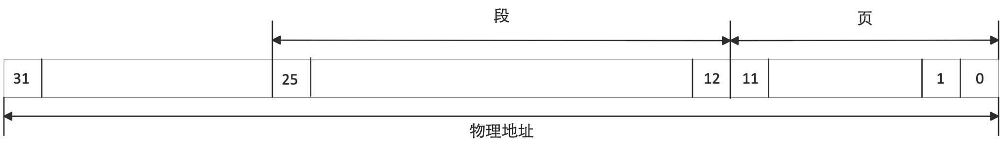
<figcaption><p>图 8‑27 段和页所占地址位</p></figcaption>
</figure>
</center>

段由一个结构体mem_section描述。该结构体有一个名为section_mem_map、类型为unsigned
long的字段。从逻辑上看，section_mem_map等同于一个指向多个页面的指针。section_mem_map各位的定义示于图8‑28。

<center>
<figure>
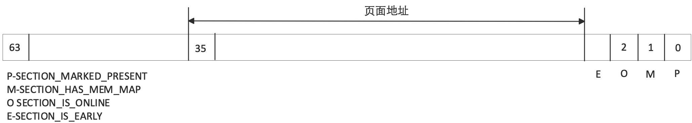
<figcaption><p>图 8‑28 section_mem_map格式</p></figcaption>
</figure>
</center>

位0用于段存在标识位。位1用于标识本段是否为有效内存，通过设置本位，可以阻止系统使用该段内存。位2用于标识本段内存是否在线，该标识主要用于热插拔。位3用于标识该段是否在引导阶段初始化，该标识位也用于热插拔，如果本段内存用于热插拔设备而该标识位为1，则当拔出热插拔设备后，仍需保存该段内存的内容。位4及其以上各位用于存储结点标号及页面地址。

mem_section结构体的定义为：

```
struct mem_section {

unsigned long section_mem_map;

struct mem_section_usage *usage;

#ifdef CONFIG_PAGE_EXTENSION

struct page_ext *page_ext;

unsigned long pad;

#endif

};
```

如果支持sparsemem_vmemmap模型，通过该该结构体，还可以把每一段划分为多个子段。

```
struct mem_section_usage {

#ifdef CONFIG_SPARSEMEM_VMEMMAP

DECLARE_BITMAP(subsection_map, SUBSECTIONS_PER_SECTION);

#endif

unsigned long pageblock_flags[0];

};
```

Linux定义了一个类型为struct
mem_section结构体的mem_section\[root\]\[id\]二维数组，数组的索引值分别为根与根所在段的段值，其中:

$$
root = \lfloor nr/N\rfloor
$$

$$
id = nr - root \times N
$$

*N*为每个根包含的段数，*nr*为段值。

当Linux不支持SPARSEMEM_EXTREME方式时，数组为静态数组，有NR_MEM_SECTIONS（系统包含的最大段数）个单元，每个单元包含一个mem_section结构体。当Liunx支持SPARSEMEM_EXTREME方式时，mem_section数组的每一行包含PAGE_SIZE（4096）个mem_section结构体，数组的内容动态地分配。

4、设备内存类型

设备内存基于类型sparse_mem_vmemmap，为非系统类型，用于管理设备驱动程序检测到的设备上的物理内存空间。这些内存不会被标识为在线状态。在进行生命周期管理时，不仅要引用（reference-即该内存被使用的次数）这些内存自身，同时还要引用与之对应的设备。

##### 引导内存初始化过程

引导内存初始化函数定义为：

```
void __init bootmem_init(void)

{

memblock_allow_resize();

find_limits(&min_low_pfn, &max_low_pfn, &max_pfn);

early_memtest((phys_addr_t)min_low_pfn << PAGE_SHIFT,
(phys_addr_t)max_low_pfn << PAGE_SHIFT);

sparse_init();

zone_sizes_init(min_low_pfn, max_low_pfn, max_pfn);

}
```

函数memblock_allow_size()设置标志位memblock_can_resize，允许系统修改memblock区域(region)大小。函数find_limit()计算memblock保存的可用内存最低地址、最高地址对应的页码以及目前实际可用最高地址对应的页码。函数early_memtest()使用一定模式的数据，逐区测试介于可用内存最低地址和实际可用内存最高地址之间的内存。sparse_init()初始化sparsemem内存模型，为使用sparsemem模型进行必要的准备。

zone_size_init()函数的作用是确定 ZONE_DMA、ZONE_NORMAL、ZONE_HIGHMEM 或
ZONE_DEVICE 的起始 PFN（页帧号）和大小，为每个 Zone 分配并初始化 struct
zone 结构体，在 NUMA 系统中，将这些 Zone 关联到对应的
pg_data_t（内存节点）上

##### 初始化sparsemem内存模型

sparse_init()函数的作用是为数组mem_section分配内存，初始化数组内容。函数sparse_init()定义在文件git/mm/sparse.c文件中，其定义为：

```
void __init sparse_init(void)

{

unsigned long pnum_end, pnum_begin, map_count = 1;

int nid_begin;

memblocks_present();

pnum_begin = first_present_section_nr();

nid_begin = sparse_early_nid(__nr_to_section(pnum_begin));

set_pageblock_order();

for_each_present_section_nr(pnum_begin + 1, pnum_end) {

int nid = sparse_early_nid(__nr_to_section(pnum_end));

if (nid == nid_begin) {

map_count++;

continue;

}

sparse_init_nid(nid_begin, pnum_begin, pnum_end, map_count);

nid_begin = nid;

pnum_begin = pnum_end;

map_count = 1;

}

sparse_init_nid(nid_begin, pnum_begin, pnum_end, map_count);

vmemmap_populate_print_last();

}
```

函数*memblocks_present()*调用*memory_present()*完成对所有内存页的sparsemem模型初始化。*memory_present()*首先通过*sparse_index_init()*为各个段分配内存，以存储mem_section结构体，然后把节点编号暂时保存到结构体的section_mem_map域中，供后面的函数使用。在使用该结点编号之后，函数*sparse_init_nid*
()会用页面地址覆盖结点编号所占区域。

为了便于查找，Linux还使用一个名为section_to_node_table的数组。该数组的索引为段值，数组内容为结点编号。通过该数组，利用段编号就可以获取对应的结点编号。memory_present()通过set_section_nid()函数把结点编号保存在数组section_to_node_table中。Memory_present()函数的定义为：

```
static void __init memory_present(int nid, unsigned long start,
unsigned long end)

{

unsigned long pfn;

start &= PAGE_SECTION_MASK;

mminit_validate_memmodel_limits(&start, &end);

for (pfn = start; pfn < end; pfn += PAGES_PER_SECTION) {

    unsigned long section = pfn_to_section_nr(pfn);

    struct mem_section *ms;

    sparse_index_init(section, nid);

    set_section_nid(section, nid);

    ms = __nr_to_section(section);

    if (!ms->section_mem_map) {

      ms->section_mem_map = sparse_encode_early_nid(nid) SECTION_IS_ONLINE;

      section_mark_present(ms);

    }

  }

}
```

这里需要指出的是，虽然memory_present()函数中的for循环变量为页面地址，*sparse_index_init()*在分配内存时，是以根为单位进行分配。若系统已经为当前段所在的根分配了内存，则*sparse_index_init()*不作任何操作。

在初始化mem_section数组后，
sparse_init()函数通过*first_present_section_nr()*查询第一个设置了存在标识的段的编号。函数*\_\_nr_to_section(nr)*用于获取某一内存段对应的mem_section结构体地址。函数*sparse_early_nid*()利用所获取的地址，通过读取mem_section结构体中section_mem_map字段值，获取结点编号。

Linux内存分配最小单位可以是页，也可以是页的倍数。变量pageblock_order决定linux内存分配的粒度，而函数*set_pageblock_order()*用以设置变量pageblock_order值。

函数*sparse_init_nid()*的作用是为各个结点的所有段分配内存，以保存段内各个页对应的struct
page结构体。在为各段分配了用于存储page结构体的内存后，*sparse_init_nid()*把该段内存的起始页面保存到section_mem_map的相应区段（见图
77(#Ref154328783)），并把该段标识为HAS_MEM_MAP 和
SECTION_IS_EARLY。初始化后sparsemem模型的结构为：

<center>
<figure>
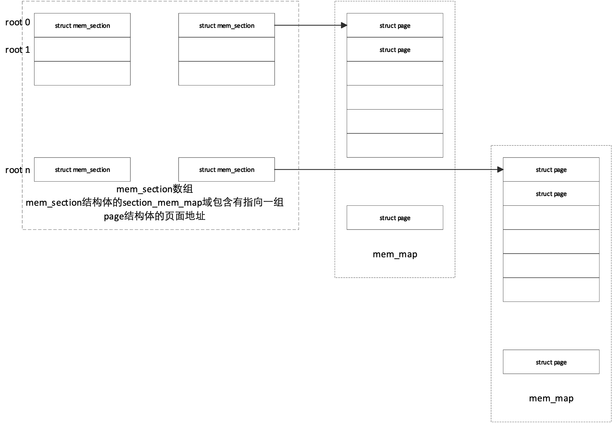
<figcaption><p>图 8‑29 sparsemem内存模型</p></figcaption>
</figure>
</center>

在完成最后一个段的设置之后，*sparse_init()*函数完成sparsemem模型的初始化任务。

### 标准资源申请

Linux把显示设备、并口等作为标准设备。在使用这些设备之前，首先要通过标准资源申请函数注册这些设备占用的资源。标准资源申请函数request_standard_resources()定义在文件git/arch/arm/kernel/setup.c中，其定义为：

```
static void __init request_standard_resources(const struct
machine_desc *mdesc)

{

phys_addr_t start, end, res_end;

struct resource *res;

u64 I;

kernel_code.start = virt_to_phys(_text);

kernel_code.end = virt_to_phys(__init_begin - 1);

kernel_data.start = virt_to_phys(_sdata);

kernel_data.end = virt_to_phys(_end - 1);

for_each_mem_range(i, &start, &end) {

  unsigned long boot_alias_start;

  res_end = end - 1;

  boot_alias_start = phys_to_idmap(start);

  if (arm_has_idmap_alias() && boot_alias_start != IDMAP_INVALID_ADDR) {

    res = memblock_alloc(sizeof(*res), SMP_CACHE_BYTES);

  if (!res)

    panic("%s: Failed to allocate %zu bytes\n",__func__, sizeof(*res));

  res->name = "System RAM (boot alias)";

  res->start = boot_alias_start;

  res->end = phys_to_idmap(res_end);

  res->flags = IORESOURCE_MEM | IORESOURCE_BUSY;

  request_resource(&iomem_resource, res);

}

res = memblock_alloc(sizeof(*res), SMP_CACHE_BYTES);

if (!res)

  panic("%s: Failed to allocate %zu bytes\n", __func__,sizeof(*res));

  res->name = "System RAM";

  res->start = start;

  res->end = res_end;

  res->flags = IORESOURCE_SYSTEM_RAM | IORESOURCE_BUSY;

  request_resource(&iomem_resource, res);

  if (kernel_code.start >= res->start && kernel_code.end <= res->end)

    request_resource(res, &kernel_code);

  if (kernel_data.start >= res->start && kernel_data.end <= res->end)

    request_resource(res, &kernel_data);

}

if (mdesc->video_start) {

  video_ram.start = mdesc->video_start;

  video_ram.end = mdesc->video_end;

  request_resource(&iomem_resource, &video_ram);

}

if (mdesc->reserve_lp0)

  request_resource(&ioport_resource, &lp0);

if (mdesc->reserve_lp1)

  request_resource(&ioport_resource, &lp1);

if (mdesc->reserve_lp2)

  request_resource(&ioport_resource, &lp2);

}
```

Linux把内核代码和数据占用的内存定义为系统内存资源，因此要为内核申请系统内存。在申请系统内存资源之前，首先通过*virt_to_phys()*把内核代码和数据所占的内存地址转换为物理地址。申请内存资源时，利用宏定义*for_each_mem_range()*遍历内核可用内存区域，为每一个内存区域分配一段内存，以便存储描述该段内存资源的resource结构体。最后把这些内存区域注册为根结点在*iomem_resource*的系统内存资源。当遍历到内核代码和数据所占内存区域时，向该段内存所在结点申请资源，并把内核所用资源状态标识为忙，把资源类型标识为系统内存。

有些芯片上配置了专用于引导的内存。如果芯片上具备这样的内存，Linux把这些内存注册为系统内存。

几乎所有运行Linux的系统都支持显示设备。Linux通过设备描述符获取显示内存的起始和结束地址，然后向iomem_resource结点注册存储器资源。

最后，如果系统支持并口，则系统向ioport_resource结点注册端口资源。

### 扁平设备树层次化

在介绍设备树结构的一章中已经说明，DTB文件是一个单一的线性结构文件，不便于设备查找。Linux在运行过程中不断地查找设备，为了便于遍历设备树，需要将存于内存的DTB文件转换为树状结构。setup_arch()函数调用unflatten_device_tree()把扁平设备树DTB文件转换为树状结构。unflatten_device_tree()函数定义在git/drivers/of/fdt.c文件中，其定义为：

```
void __init unflatten_device_tree(void)
{

__unflatten_device_tree(initial_boot_params, NULL, &of_root,
early_init_dt_alloc_memory_arch, false);

of_alias_scan(early_init_dt_alloc_memory_arch);

unittest_unflatten_overlay_base();

}
```

其中函数\_\_unflatten_device_tree()的作用是把扁平设备树转换为树状设备树，of_alias_scan()函数用于扫描设备树上的/chosen和/aliase节点，把这些节点下发现的所有属性存储在一个全局变量数组中，方便以后使用。函数unitest_unflatten_overlay_base()用来扫描用户自己提供的部分设备树，方便用户根据自己的需求对主设备树进行部分修改。

#### 设备树转换

完成把扁平设备树转换为树状设备树的函数为\_\_unflatten_device_tree()，函数定义在文件git/drivers/of/fdt.c文件中，该函数对根节点的所有子节点进行树状结构转换，去掉调试语句后的函数定义为：

```
void *__unflatten_device_tree(const void *blob, struct device_node
*dad,

struct device_node **mynodes, void *(*dt_alloc)(u64 size, u64
align), bool detached)
{

int size;

void *mem;

if (!blob) {

  return NULL;

}

if (fdt_check_header(blob)) {

  return NULL;

}

size = unflatten_dt_nodes(blob, NULL, dad, NULL);

if (size \< 0)

  return NULL;

size = ALIGN(size, 4);

mem = dt_alloc(size + 4, __alignof__(struct device_node));

if (!mem)

  return NULL;

memset(mem, 0, size);

*(__be32 *)(mem + size) = cpu_to_be32(0xdeadbeef);

unflatten_dt_nodes(blob, mem, dad, mynodes);

if (be32_to_cpup(mem + size) != 0xdeadbeef)

  be32_to_cpup(mem + size);

if (detached && mynodes) {

  of_node_set_flag(*mynodes, OF_DETACHED);

}

return mem;

}
```

在unflatten_device_tree()调用该函数时，blob指向扁平化DTB文件所在内存的首地址，其值为initial_boot_params。dad为节点的父节点，由于是对整个设备树进行转换，所以给父节点赋值NULL。dt_alloc指向用以分配内存的函数，这里使用分配函数early_init_dt_alloc_memory_arch()进行内存分配。mynodes保存of_root的地址，of_root指向层次化后设备树的根节点。层次化后设备树的各个节点由结构体device_node描述。device_node的定义为：

```
struct device_node {

const char *name;

phandle phandle;

const char *full_name;

struct fwnode_handle fwnode;

struct property *properties;

struct property \*deadprops; /* removed properties */

struct device_node *parent;

struct device_node *child;

struct device_node *sibling;

#if defined(CONFIG_OF_KOBJ)

struct kobject kobj;

#endif

unsigned long _flags;

void *data;

};
```

其中的property域构成一个链表，用于描述该节点的所有属性。kobj域为内核对象，是系统文件（sysfs）的基本构成单位。sysfs为用户提供设备的各种信息。

利用结构体中的parent、child和sibling指针可以把设备树组织为层次结构。

\_\_unflatten_device_tree()首先通过调用函数fdt_check_header()检查DTB文件的设备树魔术字、文件头大小、文件大小、文件版本、结构模块偏移量及字符串模块偏移量，以确定DTB文件是否合法。函数\_\_unflatten_device_tree()两次调用unflatten_dt_nodes()，第一次扫描节点个数，第二次进行具体的转换，unflatten_dt_nodes()的定义为：

```
 static int unflatten_dt_nodes(const void *blob, void *mem, struct device_node *dad, struct device_node **nodepp)
{

struct device_node *root;

int offset = 0, depth = 0, initial_depth = 0;

struct device_node *nps[FDT_MAX_DEPTH];

void *base = mem;

bool dryrun = !base;

if (nodepp)

*nodepp = NULL;

if (dad)

depth = initial_depth = 1;

root = dad;

nps[depth] = dad;

for (offset = 0; offset >= 0 && depth >= initial_depth; offset =
fdt_next_node(blob, offset, &depth)) {

if (WARN_ON_ONCE(depth >= FDT_MAX_DEPTH))

continue;

if (!IS_ENABLED(CONFIG_OF_KOBJ) && !of_fdt_device_is_available(blob,
offset))

continue;

if (!populate_node(blob, offset, &mem, nps[depth], &nps[depth+1],
dryrun))

return mem - base;

if (!dryrun && nodepp && !\*nodepp)

*nodepp = nps[depth+1];

if (!dryrun && !root)

root = nps[depth+1];

}

if (offset < 0 && offset != -FDT_ERR_NOTFOUND) {

pr_err("Error %d processing FDT\n", offset);

return -EINVAL;

}

if (!dryrun)

reverse_nodes(root);

return mem - base;

}
```

在首次调用unflatten_dt_nodes()时，mem的值为空，因此，dryrun值为true。unflatten_dt_nodes()函数对blob所有子节点进行扫描，通过函数of_fdt_device_is_available()确定设备树上的节点是否有效（即status属性为ok或okay的节点）。函数populate_node()的作用是计算把设备树上所有有效节点转换为树状结构需要的内存大小，这些内存用以保存所支持的节点的device_node结构体、property结构体及节点名称。

在确定所需内存大小后，函数\_\_unflatten_device_tree()按照所需大小，通过调用函数early_init_dt_alloc_memory_arch()分配内存，实际分配内存空间比所需空间多4个字节。把分配的内存清零后，在额外分配的4个字节处写入十六进制数0xDEADBEEF，用以标识层次化设备树的末尾。0xDEADBEEF被广泛用来标示数据为非法数据。

在完成这些准备工作后，\_\_unflatten_device_tree()再次调用unflatten_dt_nodes()。在本次调用时，把前面分配的内存地址及of_root的地址传递给函数unflatten_dt_nodes()。由于本次调用时mem地址不为空，dryrun值为false。本次运行时会执行首次调用时跳过的操作，主要是为device_node的各个字段赋值。除了为与设备树有关的字段如phandle和properities等赋值外，也要为parent、child及sibling等3个字段赋值，从而建立设备树的层次结构。

由于有些设备驱动程序利用设备树上节点的排列次序，在建立了层次化的设备树后，通过调用函数reverse_nodes()把层次化后设备树节点顺序颠倒。

层次化后的设备树结构为：

<center>
<figure>
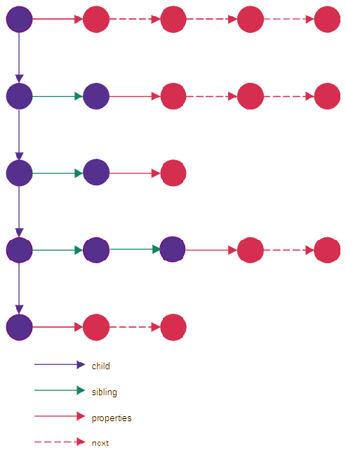
<figcaption><p>图 8‑30 层次化后的设备树</p></figcaption>
</figure>
</center>

上图中黑色的框代表节点，紫色的框代表节点属性，其中同一层的child和sibling具有同一个父节点。

#### 扫描别名节点

设备树上有一个名为/aliases及一个名为/chosen的节点，/aliases下的节点为设备树上的其它节点建立一个别名，通过该别名也可以访问与之对应的节点。/chosen节点则用来在引导过程中向系统传递一些参数。为了便于系统使用，unflatten_device_tree()通过调用函数of_alias_scan()扫描/aliase节点下的所有结点及/chosen下的参数，并把这些结点的所有属性存在一个全局表格当中，方便以后使用。函数of_alias_scan()的定义为：

```
void of_alias_scan(void * (*dt_alloc)(u64 size, u64 align))
{
	struct property *pp;
	of_aliases = of_find_node_by_path("/aliases"); 
	of_chosen = of_find_node_by_path("/chosen");
	if (of_chosen == NULL)
	of_chosen = of_find_node_by_path("/chosen@0");
	if (of_chosen) {
		const char *name = NULL;
		if (of_property_read_string(of_chosen, "stdout-path", &name))    
			of_property_read_string(of_chosen, "linux,stdout-path",&name);
		if (IS_ENABLED(CONFIG_PPC) && !name)
			of_property_read_string(of_aliases, "stdout", &name);
		if (name)
			of_stdout = of_find_node_opts_by_path(name, &of_stdout_options);    
	}
	if (!of_aliases)
		return;
	for_each_property_of_node(of_aliases, pp) {
		const char *start = pp->name;
		const char *end = start + strlen(start); 
		struct device_node *np;
		struct alias_prop *ap;
		int id, len;
		if (!strcmp(pp->name, "name") ||!strcmp(pp->name, "phandle") ||!strcmp(pp->name, 
    "linux,phandle"))
            		continue;
		np = of_find_node_by_path(pp->value);
		if (!np)
			continue;
		while (isdigit(*(end-1)) && end > start)
			end--;
		len = end - start;
		if (kstrtoint(end, 10, &id) < 0)
			continue;
		ap = dt_alloc(sizeof(*ap) + len + 1, __alignof__(*ap));
		if (!ap)
			continue;
		memset(ap, 0, sizeof(*ap) + len + 1);
		ap->alias = start;
		of_alias_add(ap, np, id, start, len);
	}
}
```

of_alias_scan()首先调用函数of_find_node_by_path("/aliases")在of_root指向的层次化设备树中查找指向结点/aliases的指针，并把返回的指针赋予全局变量of_aliases，然后通过调用函数of_find_node_by_path("/chosen")在层次化设备树上查找指向/chosen结点的指针，并把返回的指针值赋予全局变量of_chosen。这里，
of_aliases和of_chosen为指向类型为device_node结构体的全局指针。

在DTB文件中，/chosen节点也可以通过/chosen@0的方式定义，因此，若上面的函数调用没有找到/chosen节点，则通过of_find_node_by_path("/chosen@0")调用再一次查找/chosen节点。这里需要指出，在使用扁平设备树时，一般使用以fdt_开始的函数，而在使用层次化设备树时，采用以of_开头的函数。以of_开头的函数定义在git/drivers/of子目录下的文件中，而以fdt_开头的函数定义在git/scripts/dtc/libfdt子目录下的文件中。

在找到/chosen节点后，of_alias_scan()利用函数of_property_read_string()从of_chosen指向的节点查找并读取用以指定标准输出设备的stdout-path属性。如果没有找到则再查找并读取linux,
stdout-path属性值。如果还没有找到且系统支持CONFIG_PPC，则再从/aliases节点查找并读取stdout属性值。在读取stdout-path等属性值后，从该属性值获取stdout选项值，获取选项值的工作由of_find_node_opts_by_path()函数完成。由于选项可能包含节点路径的别名，因此获取选项值时，也要遍历of_aliases指向的节点及其子节点。

为了便于查询，Linux创建了一个名为aliases_lookup的链表。链表节点为结构体alias_prop，其定义为：

```
struct alias_prop {

struct list_head link;

const char *alias;

struct device_node *np;

int id;

char stem[];

};
```

结构体的link字段为链表节点指针，以指向链表的前一个与后一个节点。alias_prop结构体的alias字段指向别名节点的某一属性名称，np指向层次化设备树上对应于别名的节点，id为别名后属性名称的数字部分，stem为别名名称的字符部分。

/aliases节点属性包含属性名称及相应的属性值。属性名为某一节点的别名，属性值为该别名对应节点的绝对路径。of_alias_scan()函数遍历of_aliases节点的所有属性。由于aliases节点的属性值为别名所对应节点的绝对路径，利用/aliases节点属性的属性值pp-\>value，通过调用函数of_find_node_by_path(pp-\>value)可以获得别名所对应节点的节点指针。

在获取节点绝对路径后，把别名名称数字部分转化为id值，并分配内存以保存一个新的alias_prop节点，然后把指向别名名称的指针赋予结构体alias_prop的alias字段，最后通过调用函数of_alias_add()为结构体的其它域赋值，并把新的alias_prop结构体插入aliases_lookup链表当中。最终的链表结构示于下图。

<center>
<figure>
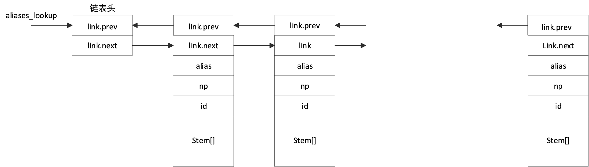
<figcaption><p>图 8‑31 aliases_lookup链表</p></figcaption>
</figure>
</center>

#### 设备树覆盖基的展开

设备树用于支持系统无法自动识别的设备，通常由操作系统开发者提供。有时用户希望提供部分自己的设备树文件，或者用自己的部分设备树节点取代原操作系统提供的设备树节点。设备树的覆盖提供了修改主设备树（操作系统提供的设备树）的功能。用户可以利用自己的设备树提供的overlay节点或通过/include/语句包含自己的dts文件，在主设备树导入内存后对设备树进行修改。系统是否选择支持设备树覆盖可通过编译配置开关CONFIG_OF_UNITTEST设置。

在扫描别名节点后，设备树层次化函数把编译时生成的位于\_\_dtb_overlay_base_begin和\_\_dtb_overlay_base_end之间的设备树覆盖基文件拷贝到一个缓存区，然后再次调用\_\_unflatten_device_tree()函数，把该缓存区的基设备树展开为层次结构，生成覆盖基设备树，存放到由overlay_base_root指定的位置，供引导后期进行设备树覆盖功能单元测试。

### 多核CPU的硬件设置

在把扁平设备树展开之后，基于框架的硬件设置函数setup_arch()开始进行与多核有关的硬件设置，主要包括cpu映射图设置和psci设备树初始化。如果系统为对称多核系统，还要进行多核cpu的初始化等。

#### 初始化cpu逻辑映射图

初始化cpu逻辑映射图的主要工作是从设备树读取各个cpu的物理编号（mpidr），然后建立一个表示cpu物理编号与逻辑编号对应的逻辑映射数组，数组名称为cpu_logical_map。对arm系统而言，mpidr的编码方式为：

<center>
<figure>

<figcaption><p>图 8‑32 arm mpidr编码格式</p></figcaption>
</figure>
</center>

逻辑关系数组的第一个位置存储引导cpu的物理编号，然后依照遍历设备树的次序，依次把发现的各个cpu节点的物理编号存入该数组后续位置。这样数组的索引值为cpu的逻辑编号，内容为与之对应的cpu的物理编号。初始化cpu逻辑关系图的函数定义在文件git/arch/arm/kernel/devtree.c文件中，定义为：

```
void __init arm_dt_init_cpu_maps(void)
{
	struct device_node *cpu, *cpus;
	int found_method = 0;
	u32 i, j, cpuidx = 1;
	u32 mpidr = is_smp() ? read_cpuid_mpidr() & MPIDR_HWID_BITMASK : 0;
	u32 tmp_map[NR_CPUS] = { [0 ... NR_CPUS-1] = MPIDR_INVALID };
	bool bootcpu_valid = false;
	cpus = of_find_node_by_path("/cpus");
	if (!cpus)
		return;
	for_each_of_cpu_node(cpu) {
		const __be32 *cell;
		int prop_bytes;
		u32 hwid;
		cell = of_get_property(cpu, "reg", &prop_bytes);
		if (!cell || prop_bytes < sizeof(*cell)) {
			pr_debug(" * %pOF missing reg property\n", cpu);
			of_node_put(cpu);
			return;
		}
		do {
			hwid = be32_to_cpu(*cell++);
			prop_bytes -= sizeof(*cell);
		} while (!hwid && prop_bytes > 0);
		if (prop_bytes || (hwid & ~MPIDR_HWID_BITMASK)) {
			of_node_put(cpu);
			return;
		}
		for (j = 0; j < cpuidx; j++)
			if (WARN(tmp_map[j] == hwid,
				 "Duplicate /cpu reg properties in the DT\n")) {
				of_node_put(cpu);
				return;
			}
		if (hwid == mpidr) {
			i = 0;
			bootcpu_valid = true;
		} else {
			i = cpuidx++;
		}
		if (WARN(cpuidx > nr_cpu_ids, "DT /cpu %u nodes greater than " "max cores %u, 
  capping them\n", cpuidx, nr_cpu_ids)) {
			cpuidx = nr_cpu_ids;
			of_node_put(cpu);
			break;
		}
		tmp_map[i] = hwid;
		if (!found_method)
			found_method = set_smp_ops_by_method(cpu);
	}
	if (!found_method)
		set_smp_ops_by_method(cpus);
	if (!bootcpu_valid) {
		pr_warn("DT missing boot CPU MPIDR[23:0], fall back to default cpu_logical_map\n");
		return;
	}
	for (i = 0; i < cpuidx; i++) {
		set_cpu_possible(i, true);
		cpu_logical_map(i) = tmp_map[i];
	}
}

```

我们已经知道，在把设备树展开后，设备树上的每个节点都用一个device_node结构体表示，因此函数中的cpu和cpus指针均指向device_node结构体。

arm_dt_init_cpu_maps()函数首先判别系统是否支持对称多核引导。系统有两种设置对称多核引导的方法，一种方法是通过配置开关CONFIG_SMP设置，另一种方法是通过配置开关CONFIG_SMP_ON_UP（UP-Unit
Processor）设置。第一种方法适用于硬件框架为对称多核系统，第二种方法适用于单核系统但希望使用支持对称多核操作系统的情况。如果系统支持对称多核引导，则从cp15
c0 c5寄存器读取mpidr（multiple processor id
register）值，如果不支持对称多核引导，则将mpidr置零。

在读取硬件mpidr值后，函数通过调用of_find_node_by_path(/)获得指向/cpus节点的指针，然后通过该指针遍历/cpus节点内的各个cpu节点，读取每个cpu节点的’reg”属性的值，即cpu节点的物理编号。读取cpu节点的物理编号后，函数要检查物理编号是否合法。当物理编号满足如下任何一个条件时，读取的属性值为非法：

- cpu节点没有包含reg属性。

- reg属性值所含字节数小于4。

- reg属性值的高8位不等于0。

- 同一个属性值出现在两个以上（含两个）cpu节点。

在验证属性值合法后，如果该属性值等于从硬件读取的mpidr值，则正在遍历的cpu为引导cpu，这时要把该cpu节点的物理标号写入逻辑关系表格的第一个位置。如果不等于mpidr的值，则按照cpu节点的遍历次序，从第二个位置开始，依次把从设备树中读取的物理编号值写入逻辑关系表格。

在遍历各个cpu的过程中，
函数arm_dt_init_cpu_maps()还调用set_smp_ops_by_method()，允许开发者为每个cpu设置自定义的对称多核cpu初始化程序，
其中包括smp_init_cpus()、smp_prepare_cpus()、
smp_secondary_init()、smp_boot_secondary()及用于热插拔的cpu_kill()、cpu_die()、cpu_can_disable()、cpu_disable()等函数。系统通过在设备树文件cpu节点中设置"enable-method"属性通知系统使用自备的初始化程序。

在建立cpu_logic_map数组的同时，函数arm_dt_init_cpu_maps()还为所有所发现的cpu建立屏蔽字_cpu_possible_mask，即如果在设备树上有第id个cpu节点，则_cpu_possible_mask的第id位置1，否则置0。

#### psci初始化

psci为Power State Coordination Interface的缩写。新一代ARM架构如ARM
v8-A提供了用于与操作系统接口的电源管理接口。Linux利用结构体：

```
struct psci_operations {

u32 (*get_version)(void);

int (*cpu_suspend)(u32 state, unsigned long entry_point);

int (*cpu_off)(u32 state);

int (*cpu_on)(unsigned long cpuid, unsigned long entry_point);

int (*migrate)(unsigned long cpuid);

int (*affinity_info)(unsigned long target_affinity, unsigned long lowest_affinity_level);

int (*migrate_info_type)(void);

};
```

定义操作系统与psci模块的接口。设备制造商可以按照该结构体中定义的各个函数格式定义自己的psci操作，或为Linux提供必要的信息，从而实现对Linux的支持。在能够使用psci提供的各种功能之前，Linux需要为psci_operations结构体中所支持的字段赋值。为结构体psci_operations赋值的函数在文件git/drivers/firmware/psci/psci.c中实现，而实现psci各种功能的函数也定义在同一文件里。

在进行基于硬件架构的初始化过程中，setup_arch()调用函数psci_dt_init()遍历层次化后的设备树，查找具有“arm,psci-1.0”属性的节点，具有该属性的节点支持psci功能。由设备商提供的psci设备驱动程序通过结构体of_device_id的data字段提供init_fn()函数的起始地址，用于初始化psci的功能模块。函数通过运行init_fn()，对所有支持psci功能的节点的psci模块进行相应的初始化。psci_dt_init()函数的定义为：

```
int __init psci_dt_init(void)
{
	struct device_node *np;
	const struct of_device_id *matched_np;
	psci_initcall_t init_fn;
	int ret;
	np = of_find_matching_node_and_match(NULL, psci_of_match, &matched_np);
	if (!np || !of_device_is_available(np))
		return -ENODEV;
	init_fn = (psci_initcall_t)matched_np->data;
	ret = init_fn(np);
	of_node_put(np);
	return ret;
}

```

其中of_find_matching_node_and_match()函数从根节点开始遍历设备树，查找属性为“arm,psci-1.0”的所有结点。of_device_is_available()函数检查匹配结点的status属性值是否为“ok”或“okay”。init_fn函数由设备制造商提供。

#### 对称多核CPU PSCI功能初始化

如果系统支持对称多核CPU引导方式，则需要初始化对称多核CPU及对称多核psci功能所需的各种功能模块。在上一节我们已经说明，psci各种功能模块的函数地址由结构体psci_operations提供，而对称多核CPU引导所需的功能模块的函数地址则由结构体：

```
struct smp_operations {

#ifdef CONFIG_SMP

void (*smp_init_cpus)(void);

void (*smp_prepare_cpus)(unsigned int max_cpus);

void (*smp_secondary_init)(unsigned int cpu);

int (*smp_boot_secondary)(unsigned int cpu, struct task_struct *idle);

#ifdef CONFIG_HOTPLUG_CPU

int (*cpu_kill)(unsigned int cpu);

void (*cpu_die)(unsigned int cpu);

bool (*cpu_can_disable)(unsigned int cpu);

int (*cpu_disable)(unsigned int cpu);

#endif

#endif

};
```

提供。对于支持热插拔的系统，多核CPU还需要cpu_kill()、cpu_die()及cpu_disable()等额外功能。

为了使用多核对称cpu提供的功能，Linux首先需要把各个函数的地址赋予类型为结构体smp_operations的静态变量smp_ops的相应字段。在设置对称多核cpu之前，setup_arch()函数首先检查机器描述符mdesc是否提供了对称多核cpu初始化程序smp_init。如果机器描述符提供了初始化程序，则使用机器描述符提供的函数设置smp_ops的各个字段。如果没有提供，则通过函数smp_set_ops()、利用由psci_smp_ops或mdesc-\>smp提供的各个函数地址，设置smp_ops的各个字段。如果psci在线，优先使用在git/arc/arm/kernel/psci_smp.c中定义的psci_smp_ops各个函数地址。

在为smp_ops赋值后，setup_arch()调用函数smp_init_cpus()，函数的定义为：

```
void __init smp_init_cpus(void)

{

if (smp_ops.smp_init_cpus)

  smp_ops.smp_init_cpus();

}
```

该函数调用与平台相关的smp_init_cpus()初始化各个cpu核。对i.MX6
solo处理器而言，通过宏DT_MACHINE_START()静态定义了名为\_\_mach_desc_IMX6Q的机器描述符，并将其smp字段初始化为函数imx_smp_init_cpus()的地址（定义在git/arch/arm/mach-imx/mach-imx6q.c）。也就是说，系统通过mdesc提供对称多核cpu初始化程序。宏DT_MACHINE_START展开的最终结果为：

```
static const struct machine_desc __mach_desc_IMX6Q __used

__section(".init.arch.info") = {

.nr = ~0U, /* 或者是对应的板级 ID，在设备树（DT）模式下通常为 ~0U */

.name = "Freescale i.MX6 Quad/DualLite (Device Tree)",

.l2c_aux_val = 0,

.l2c_aux_mask = ~0,

.smp = &imx_smp_ops, /* smp_ops(imx_smp_ops) 宏展开后的指针 */

.map_io = imx6q_map_io,

.init_irq = imx6q_init_irq,

.init_machine = imx6q_init_machine,

.init_late = imx6q_init_late,

.dt_compat = imx6q_dt_compat,

};
```

函数imx_smp_init_cpus()，定义在git/arch/arm/mach-imx/platsmp.c，定义为：

```
static void __init imx_smp_init_cpus(void)
{
	unsigned long arch_type;
	int i, ncores;
	asm volatile(
		".align 4\n"
		"mrc p15, 0, %0, c0, c0, 0\n"
		: "=r" (arch_type)
	);
	/* MIDR[15:4] defines ARCH type */
	__mxc_arch_type = (arch_type >> 4) & 0xfff;
	if (arm_is_ca7()) {
		unsigned long val;
		/* CA7 core number, [25:24] of CP15 L2CTLR */
		asm volatile("mrc p15, 1, %0, c9, c0, 2" : "=r" (val));
		ncores = ((val >> 24) & 0x3) + 1;
	} else {
		ncores = scu_get_core_count(scu_base);
	}

	for (i = ncores; i < NR_CPUS; i++)
		set_cpu_possible(i, false);
}

```

其主要工作包括：

- 通过汇编指令 mrc 读取 CP15 协处理器的
  MIDR寄存器，识别处理器架构。\[15:4\] 位定义了 CPU 的型号。

- 获取CPU核芯数量。如果是 Cortex-A7 (如 i.MX7D)，读取 L2CTLR
  寄存器。如果是其他架构 (如 i.MX6Q/DL, Cortex-A9)，通过读取
  SCU寄存器来获取CPU核芯个数。

- 更新内核的 CPU 位图cpu_possible_mask 。

#### 对称多核mpidr哈希表初始化

哈希表是数据结构的基本概念，在计算机领域应用非常广泛，是一种能够通过较少关键字实现存储和查询较大表格、从而实现节省内存的技术。在生成哈希表或查询哈希表时，首先利用哈希函数把关键字转换为索引值，然后利用索引值查找关键字对应的数值。

在实际应用过程中，由于关键字的覆盖范围远大于哈希表的大小，在利用哈希函数计算索引值时，不同的关键字可能转换为同一个索引值，出现所谓的冲突现象。解决这一问题的方法有多种，比如利用链表把所有对应于同一索引值的关键字及与之对应的量存储起来，当发生冲突时，通过关键字查询该链表。

Linux使用一个名为mpidr_hash的哈希表。该哈希表存储cpu休眠前的状态，供系统在进入休眠状态或唤醒系统时使用。函数MPIDR_LEVEL_BITS()的作用就是初始化该哈希表的一些基本参数。

从前面的介绍可知，ARM
mpidr编码分为aff0、aff1、aff2三个段。之所以分为三段，主要是方便线程调度时依据不同的偏好程度选择cpu。可以把aff0定义为线程编号，aff1定义为cpu编号，aff2定义为族（cluster）编号，也可以把aff0定义为cpu编号，aff1定义为族编号，aff2置零。Linux使用第一种方案。在进行进程调度时，通过匹配aff0、aff1和aff2的方案，可以设置进程选择CPU核芯的优先级别，比如把某一进程与特定的核绑定。

Linux利用mpidr的值作为关键字，生成和查询哈希表。索引值由名为compute_mpidr_hash的哈希函数、通过各个cpu的mpidr值移位及或运算生成。哈希函数是一个宏定义，利用汇编语言编写，
定义在git/arch/arm/kernel/sleep.S文件里。函数输入为rs0、rs1、rs2及aff0、aff1、aff2，其中rs0、rs1、rs2分别为aff0、aff1和aff2的右移位数，而aff0、aff1和aff2为cpu的mpidr各个段的值。该宏定义所实现的功能为：

*`index = aff0 > > rs0|aff1 > > rs1|aff2 > > rs2`*

这里需要指出的是利用这样的哈希函数不会出现冲突现象，虽然这样生成的哈希表不是最小的哈希表。

在初始化哈希表时，rs0、rs1、rs2由函数smp_build_mpidr_hash()依据所有cpu的mpidr值设定。smp_build_mpidr_hash()函数的定义为：

```
static void __init smp_build_mpidr_hash(void)
{
	u32 i, affinity;
	u32 fs[3], bits[3], ls, mask = 0;
	for_each_possible_cpu(i)									
		mask |= (cpu_logical_map(i) ^ cpu_logical_map(0));
	for (i = 0; i < 3; i++) {
		affinity = MPIDR_AFFINITY_LEVEL(mask, i);
		ls = fls(affinity);
		fs[i] = affinity ? ffs(affinity) - 1 : 0;
		bits[i] = ls - fs[i];
	}
	mpidr_hash.shift_aff[0] = fs[0];
	mpidr_hash.shift_aff[1] = MPIDR_LEVEL_BITS + fs[1] - bits[0];
	mpidr_hash.shift_aff[2] = 2*MPIDR_LEVEL_BITS + fs[2] - (bits[1] + bits[0]);
	mpidr_hash.mask = mask;
	mpidr_hash.bits = bits[2] + bits[1] + bits[0];
	if (mpidr_hash_size() > 4 * num_possible_cpus())
		pr_warn("Large number of MPIDR hash buckets detected\n");
	sync_cache_w(&mpidr_hash);
}

```

该函数首先遍历各个cpu。通过与引导用cpu中mpidr的异或运算，确定各个cpu中mpidr所有发生反转的位，把结果存储到变量mask，然后通过或运算把所有cpu的结果组合在一起。这样，mask中值位1的位表示该位在至少一个cpu上发生了反转，即该位的值不等于引导cpu上mpidr中该位的值。最终的mask值用作确定生成索引值的屏蔽字。

由于mask中值为0的位表示所有cpu上mpidr该位的值没有发生变化，可以认为该位对生成哈希表的索引值没有贡献。通过利用这样的屏蔽字，可以使哈希函数在生成索引值时不受没有发生反转的位的影响，从而减少哈希表占用空间。

为了使aff0、aff1和aff2的lsb位均始于位0，在确定了所有cpu的mpidr发生反转的位的位置后，宏定义MPIDR_AFFINITY_LEVEL(mask,
i)把mask中对应于aff0、aff1和aff2的各个段的lsb位移位到位0。

Linux通过右移，抛掉始于lsb的、且相临各位均为0的部分。这样做的目的是进一步缩短查询时所用关键字的长度，从而减少哈希表占用空间。aff0、aff1和aff2所需抛掉的位数分别存储在结构体mpidr_hash的shift_aff\[0\]、shift_aff\[1\]和shift_aff\[2\]中，而发生反转的位的个数则存储到mpidr_hash的bit字段。计算索引值需要的mask屏蔽字存储在mpidr_hash的mask字段。

在确定计算哈希表索引值所需右移的位数时，使用的fs\[0\]表示aff0中第一个发生反转的位的位置，fs\[1\]表示aff1中第一个发生反转的位的位置，fs\[2\]表示aff2中第一个发生反转的位的位置。由于arm中mpidr的编码格式，fs\[1\]和fs\[2\]分别需要额外移动MPIDR_LEVEL_BITS和2\*
MPIDR_LEVEL_BITS位，其中MPIDR_LEVEL_BITS值等于8。

### hyp模式检查

我们知道，arm架构cpu有多种模式，为用户提供不同的硬件访问权限。cpu工作模式主要有用户模式（user
mode）、系统模式（system mode）、管理模式（supervisor
mode）、异常模式（abort mode）、FIQ模式、IRQ模式、虚拟机模式（hyp
mode）、监视模式（monitor
mode）。从安全性方面划分，cpu可以工作于安全（secure
state）及非安全（non-secure
state）两种状态。当cpu工作于非安全状态时，cpu有pl0、pl1和pl2三个优先级别，而只有虚拟机模式才具有pl2优先级别。当cpu工作于安全状态时，cpu具有pl0和pl1两个优先级别。虚拟机模式与安全模式依赖于硬件扩充。当cpu配备有虚拟机硬件扩充时，系统支持虚拟机模式，而当cpu配备加密硬件扩充时，系统支持安全模式。

在启动阶段，cpu通常工作于管理模式或虚拟机模式。如果系统为非对称多核系统，setup_arch()函数调用虚拟机检查函数hyp_mode_check()，检查启动模式设置是否合理。该函数只用于具有虚拟硬件扩充的cpu，定义在git/arch/arm/kernel/setup.c文件里。函数定义为：

```
void __init hyp_mode_check(void)
{
#ifdef CONFIG_ARM_VIRT_EXT
	sync_boot_mode();
	if (is_hyp_mode_available()) {
		pr_info("CPU: All CPU(s) started in HYP mode.\n");
		pr_info("CPU: Virtualization extensions available.\n");
	} else if (is_hyp_mode_mismatched()) {
		pr_warn("started in wrong/inconsistent modes (primary CPU mode 0x%x)\n",
		__boot_cpu_mode & MODE_MASK);
		pr_warn("CPU: This may indicate a broken bootloader or firmware.\n");
	} else
		pr_info("CPU: All CPU(s) started in SVC mode.\n");
#endif
}

```

hyp_mode_check函数通过读取变量\_\_boot_cpu_mode的值获取引导模式，其中函数sync_boot_mode()先刷新缓存，然后读取变量\_\_boot_cpu_mode的值。函数is_hyp_mode_available()检查\_\_boot_cpu_mode模式部分的值是否等于HYP_MODE，而函数is_hyp_mode_mismatched
()则检查\_\_boot_cpu_mode模式是否为hyp模式且其余的各个cpu也设置为同样模式（各个cpu必须设置为相同模式）。通过检查这两个部分的值确定hyp模式是否合适。\_\_boot_cpu_mode的值在U-BOOT阶段由函数\_\_hyp_stub_install
通过函数store_primary_cpu_mode设置。这两个函数定义在git/linux/arch/arm/kernel/hyp-stub.S文件里。从[8.1.12](#Ref156323377)可知，\_\_hyp_stub_install()函数在head.S文件中调用。

### 保留用于记录内核崩溃信息的内存

Linux提供了内核崩溃数据抓取及服务工具kdump和kexec等。当内核发生崩溃时，抓取工具会收集数据并生成文件。正式发行的Linux一般会包含该类工具。如果没有包含在发行文件中，用户可以利用包管理工具自行下载安装。

在启动kdump或kexec服务之前，需要为其保留内存，所需内存可以在u-boot代码的设备树文件中的/chosen/bootargs节点或其它相应的文件中利用cmdline设置。利用cmdline设置抓取工具所需内存有三种格式，分别为crashkernel
= size,\[high\|low\]，crashkernel = size\[@offset\] 和crashkernel =
ramsize-range:size\[,...\]\[@offset\]，如crashkernel=192M,high，crashkernel=192M@16M、crashkernel=512M-2G:64M,2G-:128M。

解析配置kdump命令的程序为：

```
static void __init reserve_crashkernel(void)

{

unsigned long long crash_size, crash_base;

unsigned long long total_mem;

int ret;

total_mem = get_total_mem();

ret = parse_crashkernel(boot_command_line, total_mem, &crash_size, &crash_base);

if (ret)

  return;

if (crash_base <= 0) {

  unsigned long long crash_max = idmap_to_phys((u32)~0);

  unsigned long long lowmem_max = __pa(high_memory - 1) + 1;

  if (crash_max > lowmem_max)

    crash_max = lowmem_max;

  crash_base = memblock_find_in_range(CRASH_ALIGN, crash_max, crash_size, CRASH_ALIGN);

  if (!crash_base) {

    pr_err("crashkernel reservation failed - No suitable area found.\n");

  return;

}

} else {

  unsigned long long start;

  start = memblock_find_in_range(crash_base, crash_base + crash_size,
  crash_size, SECTION_SIZE);

  if (start != crash_base) {

    pr_err("crashkernel reservation failed - memory is in use.\n");

    return;

  }

}

ret = memblock_reserve(crash_base, crash_size);

if (ret \< 0) {

pr_warn("crashkernel reservation failed - memory is in use (0x%lx)\n", (unsigned long)crash_base);

return;

}

crashk_res.start = crash_base;

crashk_res.end = crash_base + crash_size - 1;

insert_resource(&iomem_resource, &crashk_res);

if (arm_has_idmap_alias()) {

  static struct resource crashk_boot_res = {

    .name = "Crash kernel (boot alias)",

    .flags = IORESOURCE_BUSY \| IORESOURCE_MEM,

  };

  crashk_boot_res.start = phys_to_idmap(crash_base);

  crashk_boot_res.end = crashk_boot_res.start + crash_size - 1;

  insert_resource(&iomem_resource, &crashk_boot_res);

}

}
```

其中函数parse_crashkernel()查找boot_command_line是否包含“crashkernl”字符串。如包含“crashkernl”字符串，则按照前面给出的三种格式解析“crashkernel=”及其后面的字符串，从而确定指定内存的大小及地址偏移量，并通过crash_size及crash_base返回解析后得到的内存大小及偏移地址。total_mem为可供kdump使用的内存大小。

在得到crash_size及crash_base值后，reserve_crashkernel()依据crash_base是否为0把不同的参数传递给函数memblock_find_in_range()，在可用内存中选择一块合适的内存。通过调用函数memblock_reserve()为kdump保留内存，之后把保留的内存注册在iomem_resource资源中。

有些arm系统有用于id映射的专用硬件扩充。当系统具有id映射扩充硬件时，系统需要把该信息通过crashk_boot_re结构体通知kexec等。

### 基于机器描述符的初始化

在完成大部分基于架构的硬件设置后，如果机器描述符提供了通用中断服务程序、vga终端驱动程序或初期初始化程序，则基于架构的硬件程序执行这些初始化程序或把程序起始地址赋予相应的变量。