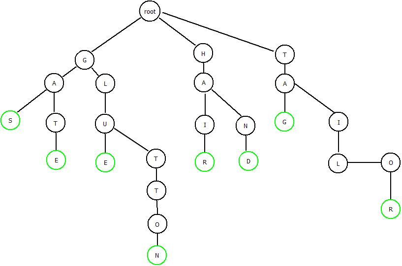
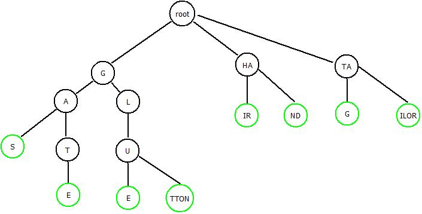

## 基数树简介

虽然逐渐被Xarray取代，基数树（Radix
Tree）在Linux系统中仍然被广泛采用。基数树是一种压缩的字典树，其特点是所需内存少，但插入和删除比较复杂。为了更好地理解基数树，下面我们先简单介绍字典树的基本概念。

字典树（Trie，又称前缀树或单词查找树）是一种专门用于高效检索字符串的树形数据存储结构。其核心思想是字符串的公共前缀在树的同一条分叉上，这样可以减少字符串的查询时间，从而达到“空间换时间”的效果。
字典树的根节点通常为空，每个节点代表一个字符。在内存中，节点按字符顺序排列。从根节点到某一节点的路径组合起来即为该节点对应的字符串。字典树的节点通常含有一个布尔标志（如
isEndOfWord），用于表示当前路径是否构成一个完整的单词。字典树的分叉数量取决于字符集大小。例如，处理小写英文字母时，每个节点最多有
26 个子节点。

字典树主要用于关键字查询，自动补全（根据输入前缀实时推荐相应词汇），拼写检查，IP
路由查找，及词频统计等。

图18‑1为一典型的字典树结构,图中绿色表示从根节点到绿色节点为一个完整的字符串。

<figure>

<figcaption>
图 18‑1字典树结构
</figcaption>
</figure>

字典树的主要操作包括插入、查询前缀匹配等，其操作效率仅取决于字符串的长度
L，而与词库中的单词总量无关。

基数树是空间压缩的字典树。字典树的每个节点只能有一个字符，而基数树的一个节点可以包含1到2^r个字符（r ≥ 1）。当一个节点只有一个孩子时，可以把父节点与子节点合并。把所有只有一个子节点的父节点与其子节点合并后形成的树称作基数树。图
18‑2所示为一棵基数树，其中绿色表示一个序列的结束。

<figure>

<figcaption>
图 18‑2 基数树结构
</figcaption>
</figure>

与字典树相比，基数树路径更短，存储空间更小。由于查询时，一些步骤可能会处理多个字符，因此查询效率更高，但查询、插入和删除的实现更加复杂。在Linux系统中，基数树主要用于：

- 页高速缓存

> 内核使用基数树来管理每个文件的内存页。键是页在文件中的偏移量，值是指向物理页描述符
> page结构体
> 的指针。这使得内核能根据文件偏移快速定位到内存中的数据页，避免昂贵的磁盘
> I/O。

- ID 分配器

> IDR 机制利用基数树将整数 ID（如进程
> PID、文件描述符、设备次设备号）映射到相应的内核数据结构指针。IDA
> 则是更轻量级的位图分配器，用于高效管理空闲 ID 资源。

- 内存管理中的标记

> 基数树节点支持特殊的标记功能（如
> Dirty、Writeback）。这允许内核在不遍历整棵树的情况下，快速找到所有脏页或正在写回的页面，极大提升了刷新数据的效率。
