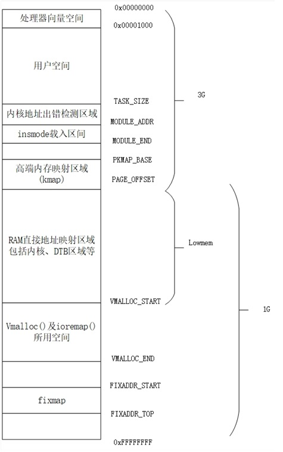

## 基本概念

### Linux内存管理的基本概念

Linux支持大量不同结构的系统，这些系统可能为单核结构，也可能为多核结构。对单核系统而言，所有内存均可能位于CPU附近，CPU访问内存时间相同，也有可能只有一部分内存位于CPU附近，其余内存位于外设附近，便于DMA操作，这样，CPU访问内存所需时间就有可能不同。对多核系统而言，内存可能有多组，有些组仅供单个内核使用，另外一些组供各个内核共同使用，还一些组距离外设比较近，以便DMA访问。由于各组内存与不同内核的距离不同，每个内核访问同一组内存所需时间也不同。

为了描述内存访问时间的不一致性，Linux提出了非均匀内存访问（None-Uniform-Memory-Access，即NUMA）的概念，用以描述计算机的内存结构。只要各个CPU访问不同区域内存所需时间不同，这种内存结构就为NUMA结构。

为因应模块化需求，内存通常是以条（BANK）为单位进行安装。同一内核访问同一条内存的时间相同。Linux系统把一条内存定义为一个NUMA节点（node），用struct
pglist_data结构体表示。通过typedef，该结构体定义为pg_data_t类型。pglist_data结构体定义在git/include/linux/mmzone.h文件里，主要包含节点标号、节点包含的区域(见下节)列表、区域个数（nr_zones）、指向所有节点各个区域的链表指针（node_zonelist\[\]）、节点起始物理地址的地址页码（node_start_pfn）、节点空间覆盖的页数（node_spanned_pages）、节点实际占用内存页数（node_present_pages）、区域列表等信息。

依据内存的特点，Linux把每一条内存分为多个不同类型的区域（ZONE），分别为ZONE_DMA，ZONE_DMA32，ZONE_NORMAL，ZONE_HIGHMEM，ZONE_MOVEABLE和ZONE_DEVICE，利用struct
zone_struct表示。ZONE_DMA和ZONE_DMA32类区域比较适用DMA操作，ZONE_NORMAL类为内核可以访问的常规内存区域。位于ZONE_HIGHMEM区域的内存没有被固定的页表覆盖，要访问该内存区域，内核必须使用临时页表。ZONE_MOVABLE类内存与常规内存类似，不同之处是同一个虚拟地址可以映射到不同的物理地址。ZONE_DEVICE类内存表示外设自带内存，比如GPU的内存。

操作系统通常以页（page，4096个字节）为单位进行内存关联，Linux也不例外。每一页物理内存对应一个结构体struct
page，称作物理页面描述符，用以描述该页物理内存的特征，如物理内存页的用途，当前物理内存页面是否可回收等等。不同的内存管理模型，page结构体的存储位置不尽相同，如flatmem（平坦内存）模型利用mem_map数组保存物理内存对应的page结构体。详情见\[8.2.15.8.1\](#linux内存管理模型)。

### Linux虚拟内存划分

为了方便管理，Linux把虚拟内存分为内核空间和用户空间，每个空间都有固定的用处。下图给出了Linux在3G/1G用户/内核划分情况下虚拟内存布局。

<figure>

<figcaption>
图 8‑1 Linux虚拟内存布局
</figcaption>
</figure>

vmalloc区域用于动态内存分配，供函数vmalloc()为用户动态分配内存。fixmap区域在引导初期供i/o使用或用于一些特殊操作。kmap区域用于高端内存到内核空间转换的页表，其中pkmap部分用作高端内存到内核空间的永久页表。insmode区域用作系统引导后载入内核模块的空间。
