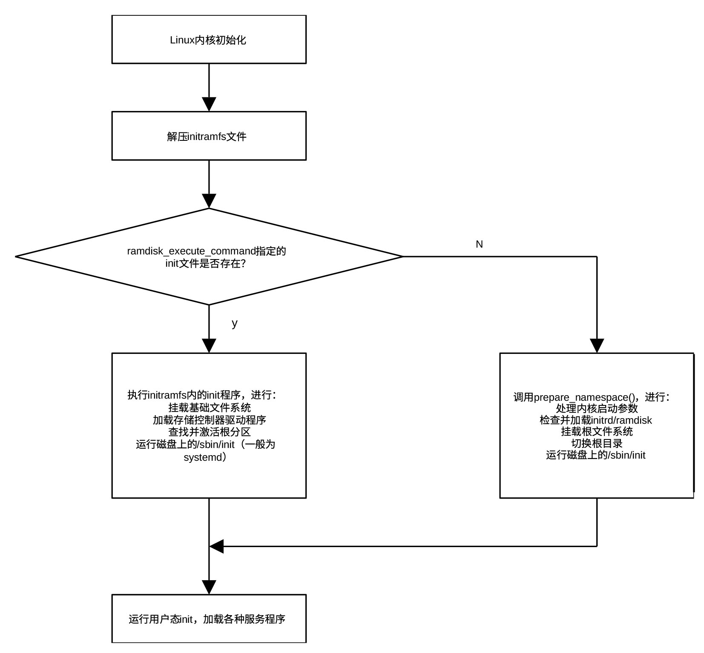

## 外设及子系统初始化

do_initcalls()函数执行位于\_\_initcall0_start和\_\_initcall_end所有的初始化任务，包括核心子系统初始化、架构有关的某些初始化、外设初始化及驱动程序调用、文件系统初始化等一系列重要任务。函数位于git/init/main.c，其定义为：

```
static void __init do_initcalls(void)
{
	int level;
	size_t len = strlen(saved_command_line) + 1;
	char *command_line;
	command_line = kzalloc(len, GFP_KERNEL);
	if (!command_line)
		panic("%s: Failed to allocate %zu bytes\n", __func__, len);
	for (level = 0; level < ARRAY_SIZE(initcall_levels) - 1; level++) {
		strcpy(command_line, saved_command_line);
		do_initcall_level(level, command_line);
	}
	kfree(command_line);
}
```


该函数从level0开始，通过循环调用do_initcall_level()逐级执行函数地址位于相应级别段内的各个初始化函数。在执行每一级的初始化函数之前，先把保存在saved_command_line内的命令行参数复制到command_line。很多内核子系统和驱动程序允许通过启动参数进行配置。在
do_initcall_level 执行过程中，内核会解析命令行，提取属于当前 Level
中那些模块的参数。内核的解析函数（如
parse_args）通常会直接修改传入的字符串（例如把空格替换成 \0
以便拆分字符串）。因为字符串会被修改，所以在进入下一个 Level之前，必须用
strcpy 把原始的 saved_command_line
重新覆盖回去，确保下一层的模块看到的也是完整的参数。

函数do_initcall_level()位于git/init/main.c，其定义为：

```
static void __init do_initcall_level(int level, char *command_line)
{
	initcall_entry_t *fn;
	parse_args(initcall_level_names[level],  command_line, __start___param,
	   __stop___param - __start___param,  level, level, NULL, ignore_unknown_bootoption);
	trace_initcall_level(initcall_level_names[level]);
	for (fn = initcall_levels[level]; fn < initcall_levels[level+1]; fn++)
		do_one_initcall(initcall_from_entry(fn));
} 
```

在执行每一级初始化之前，函数先调用
parse_args定向解析参数，其中initcall_level_names\[level\]
包含当前正在初始化的级别名称（操作名称或子系统名称），方便定位是哪个模块在解析参数。其定义为：

```
static const char *initcall_level_names[] __initdata = {
	"pure",
	"core",
	"postcore",
	"arch",
	"subsys",
	"fs",
	"device",
	"late",
};
```

command_line包含待解析的原始命令行参数字符串（如 console=ttyS0
quiet）。该函数会原地修改这个字符串，用 \0 替换空格或等号来拆分键值对。

\_\_start\_\_\_param 和 \_\_stop\_\_\_param 是由
链接器自动生成的两个符号，它们定义了内核镜像中存放所有内核参数描述符的内存区域边界。在内核源码中，当使用
module_param()、core_param() 或 early_param()
等宏定义一个参数时，编译器会利用
\_\_attribute\_\_((section("\_\_param")))
属性，把这些参数的元数据统一放进位于\_\_start\_\_\_param 和
\_\_stop\_\_\_param的段中。

\_\_stop\_\_\_param - \_\_start\_\_\_param 为params
数组中元素的个数。level用于参数解析的层级过滤，parse_args
只会解析当前层级的参数。这确保了在特定的初始化阶段，只有该阶段感兴趣的参数会被处理。ignore_unknown_bootoption为回调函数，从函数名可以看出，parse_args()忽略未知参数。

通过parse_args()，do_initcall_level()专门去查找那些属于当前层级的内核参数（即通过
module_param 或 \_\_setup 定义的参数）。通过传入
command_line，它能确保用户在启动时输入的配置（如
console=ttyS0）被应用到即将启动的子系统上。

通过for 循环，do_initcall_level()从当前层级的起始地址遍历到下一个 level
的起始地址，保证遍历到包含在当前层级的所有初始化函数。

initcall_levels\[level\]
是一个指针数组，每个单元指向\_\_initcall_start和\_\_initcall_end中的一个位置，该位置所在的内存保存某一级第一个初始化函数的地址。数组定义位于git/init/main.c，为：

```
static initcall_entry_t *initcall_levels[] __initdata = {
	__initcall0_start,
	__initcall1_start,
	__initcall2_start,
	__initcall3_start,
	__initcall4_start,
	__initcall5_start,
	__initcall6_start,
	__initcall7_start,
	__initcall_end,
};
```

循环体内的do_one_initcall函数正式执行初始化函数。这是真正执行初始化的地方。它会调用
fn 指向的函数。

利用trace_initcall_level()，do_initcall_level()还允许内核调试工具（如
ftrace 或
bootgraph.pl）记录每一层初始化的开始时间，从而生成直观的启动耗时图。

在知道函数如何遍历每一级的初始化函数后，下面介绍如何执行每一个初始化函数，即do_one_initcall()是如何工作的。

do_one_initcall()函数位于git/init/main.c，其定义为：

```
int __init_or_module do_one_initcall(initcall_t fn)
{
	int count = preempt_count();
	char msgbuf[64];
	int ret;
	if (initcall_blacklisted(fn))
		return -EPERM;
	do_trace_initcall_start(fn);
	ret = fn();
	do_trace_initcall_finish(fn, ret);
	msgbuf[0] = 0;
	if (preempt_count() != count) {
		sprintf(msgbuf, "preemption imbalance ");
		preempt_count_set(count);
	}
	if (irqs_disabled()) {
		strlcat(msgbuf, "disabled interrupts ", sizeof(msgbuf));
		local_irq_enable();
	}
	WARN(msgbuf[0], "initcall %pS returned with %s\n", fn, msgbuf);
	add_latent_entropy();
	return ret;
}
```

在执行前，先检查该函数是否在用户的“黑名单”中（通过启动参数
initcall_blacklist=
指定），这在调试导致系统崩溃的驱动时非常有用。如果不在黑名单上，则启动初始化函数跟踪，调用初始化函数进行初始化，最后关闭初始化函数跟踪，从而可以获得初始化占用时间。

内核记录执行前的抢占计数值。如果函数执行完后 preempt_count
变了（比如调用了 preempt_disable 却忘了
enable），内核会强行重置它并报错。否则，系统可能会出现永久无法抢占的情况，导致死机。

如果一个初始化函数执行完后关闭了 CPU 中断且没打开，内核会强制调用
local_irq_enable()
重新开启，并发出警告。如果中断一直关闭，内核将无法响应时钟和外设，系统会直接卡死。

每执行完一个初始化函数，函数都会调用add_latent_entropy()，利用该函数的执行时间、随机性等信息为系统的熵池贡献一点不确定性，帮助生成更随机的随机数。

do_basic_setup()
是内核从“初始化自身”到“初始化世界”的分水岭。它执行完后，内核就已经准备好去寻找磁盘上的
/sbin/init 并把控制权交给用户了。

执行完一序列初始化函数后，
kernel_init_freeable()开始运行kunit_run_all_tests()，测试内核单元的所有测试用例。测试框架（KUnit
）是 Linux 内核专用的轻量级单元测试框架。受到 JUnit、Python 的 unittest
和 GoogleTest
的启发，内核单元测试框架允许开发者在内核空间内直接编写并运行针对内核函数（如文件系统、驱动、内存管理等）的白盒测试。

测试代码作为内核的一部分运行，可以访问内核内部非公开（未通过
EXPORT_SYMBOL 导出）的函数和符号。通过 kunit_tool 和 UML (User Mode
Linux)，可以将内核编译为一个普通的 Linux
可执行文件在主机上快速运行，通常几秒钟即可完成数十个测试。可以作为内建函数在内核启动时自动执行，也可以作为内核模块在加载时触发运行。测试结果以
KTAP (Kernel Test Anything Protocol)
格式输出，方便机器解析和自动化集成。

单元测试框架基于测试套件（kunit_suite）、测试用例（kunit_case）、测试上下文对象（kunit）三个结构体。测试套件是内核单元测试框架的组织单元，代表一组具有某些共同特征的测试用例。它将一组相关的测试用例（Test
Cases）打包在一起，并定义了它们的公共行为。测试套件包含一组测试用例、测试用例初始化函数和测试用例清理函数。测试用例定义了测试函数及其测试名称，测试用户通过它定义自己的测试函数及测试名称。测试上下文对象记录正在运行的测试，由单元测试框架自行管理，测试用户可以通过它准备私有数据及进行环境检查。下面的例子展示如何定义一个测试套件，其中my_test_case_1()为测试函数。

```
/* 1. 定义具体测试用例 */
static void my_test_case_1(struct kunit *test) {
    KUNIT_EXPECT_EQ(test, 1 + 1, 2); 		// 断言辅助宏，预期1+1=2
}
/* 2. 组装成用例数组 */
static struct kunit_case my_test_cases[] = {
    KUNIT_CASE(my_test_case_1),		//.run_case = my_test_case_1，.name = “my_test_case_1”
    {} 							// 必须以空结构体结尾
};
/* 3. 定义测试套件 */
static struct kunit_suite my_test_suite = {
    .name = "my_subsystem_test_suite",
   .test_cases = my_test_cases,
};
/* 4. 注册套件 */
kunit_test_suite(my_test_suite);
```

kunit_run_all_tests()是 Linux
内核内核单元测试框架中的核心初始化函数。它首先通过函数kunit_print_tap_header()打印符合
TAP (Test Anything Protocol) 标准的首部信息。这使得自动化测试工具（如
Python 脚本）可以轻松解析内核通过串口输出的测试结果。

kunit_run_all_tests()接着遍历\_\_kunit_suites_start 与
\_\_kunit_suites_end之间的测试套件，在循环体内通过函数\_\_kunit_test_suites_init()对每一个测试套件进行测试。测试过程包括：

- 通过函数kunit_init_suite()初始化（例如准备资源、设置状态）

> 为测试套件创建 Debugfs 接口，在/sys/kernel/debug/kunit/
> 目录下为每个套件创建一个文件夹，通过这些文件，用户可以在系统运行时查看测试结果，或者触发测试的重新运行。

- 通过函数kunit_run_tests()真正开始跑这个套件里的所有测试用例，并记录结果

> 主要步骤有：

- 通过函数kunit_print_subtest_start向内核日志（dmesg）或控制台输出符合
  KTAP 协议的头部信息

> 内容通常包含测试套件的名字和计划执行的用例数量。

- 通过宏kunit_suite_for_each_test_case遍历一个测试套件里的所有测试用例

> 在循环体内，通过函数kunit_run_case_catch_errors()依次触发测试套件的init()函数、测试用例的run_case函数及测试套件的exit()函数。它不是直接调用run_test测试函数，而是将其包装在一个“异常捕获”的环境中。

- 打印套件的总结信息

> 告知整个套件的最终结果（通过/失败）。

在链接时，所有通过 kunit_test_suite()
宏定义的测试套件指针，都会被放在\_\_kunit_suites_start 与
\_\_kunit_suites_end之间的独立 ELF 段中。

在测试完内核单元的所有测试用例后，kernel_init_freeable()调用console_on_rootfs()为初始化进程（PID
1，即 init）建立标准输入、输出和错误输出（stdin, stdout,
stderr）。console_on_rootfs()工作包括：

- 通过filp_open("/dev/console", O_RDWR, 0)打开控制台设备

> 这个设备是一个虚拟设备，它会根据内核启动参数（如
> console=ttyS0）自动指向真实的终端（串口或显示器）。

- 错误处理

> 如果打开失败，说明内核无法找到基础的交互设备，会打印一条警告。这通常意味着
> rootfs 里缺少必要的设备节点，或者驱动没加载。

- 通过三次调用init_dup()占用由filp_open() 函数在内核内存中创建的唯一的
  struct file 实例

> 第一次占用文件描述符 0 ，用于stdin，第二次占用文件描述符 1
> ，用于stdout，第三次占用文件描述符 2
> 用于stderr，也就是说对应/dev/console的这个struct
> file实例占用三个文件描述符。这个struct
> file实例将存在于整个内核的生命周期。

在 Linux
中，由于每个用户态进程都是PID1的后代，所有一个用户态进程默认拥有三个文件描述符：

- 0表示从 /dev/console 读输入(stdin)。

- 1表示向 /dev/console 写输出(stdout)。

- 2表示向 /dev/console 写错误日志(stderr)。

到目前为止，初始化工作基本完成。接下来kernel_init_freeable()要通过函数init_eaccess()解析全局变量ramdisk_execute_command指定的文件（包含路径）是否存在于内存，以确定是否有早期用户空间
init（ramdisk）脚本。

ramdisk_execute_command 是Linux
内核中的一个全局变量，它保存了内核在挂载初始 RAM
磁盘（initrd/initramfs）后第一个要运行的用户态程序的路径。在内核完成基础初始化并解压了
initramfs 到 rootfs
后，它需要启动一个进程来接管后续工作（如加载驱动、挂载真正的根分区）。这个变量存储的就是该程序的路径，默认值通常为
"/init"，可以通过内核启动参数 rdinit= 进行修改。例如，在启动参数中加入
rdinit=/bin/sh，内核就会直接启动一个 Shell 而不是运行默认的初始化脚本。

如果 ramdisk_execute_command 指向的文件存在，内核就通过 run_init_process
运行它。如果这个程序运行失败或文件不存在，内核才会去尝试运行通过 init=
指定的程序，或者尝试默认的 /sbin/init、/etc/init 等路径。

在 Linux 内核启动流程中，/init
文件（initramfs，已经由bootloader在bootloader运行期间导入内存）是初始内存文件系统的灵魂。它是内核挂载内存文件系统后运行的第一个用户态程序（PID
1）。/init 为脚本文件，通常是用 Shell 编写，它需要完成以下任务：

- 挂载基础文件系统，包括 /proc、/sys、/dev 等必要虚拟文件系统。

- 扫描硬件并加载存储控制器（如 SATA, NVMe, RAID）或网络设备的驱动模块。

> 没有它，内核可能连硬盘都找不到。

- 读取内核命令行中的 root=UUID=...，找到真正的根磁盘分区。

- 如果硬盘加密了，/init 会负责弹出密码输入框并激活分区。

- 一旦真正的磁盘分区挂载好了，它会把当前系统切入到磁盘，并把 PID 1
  转交给磁盘上的 /sbin/init。

从内核启动到用户态init的切换过程可用图 30‑2表示。

<center>
<figure>

<figcaption><p>图 30‑2 从内核引导到用户态init的切换过程</p></figcaption>
</figure>
</center>

如果 ramdisk_execute_command
指向的文件不存在，则清空该变量，调用prepare_namespace()，准备并挂载根文件系统（rootfs）。这是内核完成自检后，转向执行用户态程序（如
init 或 systemd）的关键一步。

该函数是 Linux
内核启动过程中非常核心的一部分，位于git/init/do_mounts.c。其定义为：

```
void __init prepare_namespace(void)
{
	if (root_delay) {
		printk(KERN_INFO "Waiting %d sec before mounting root device...\n",  root_delay);
		ssleep(root_delay);
	}
	wait_for_device_probe();
	md_run_setup();
	if (saved_root_name[0]) {
		root_device_name = saved_root_name;
		if (!strncmp(root_device_name, "mtd", 3) ||  !strncmp(root_device_name, "ubi", 3)) {
			mount_block_root(root_device_name, root_mountflags);
			goto out;
		}
		ROOT_DEV = name_to_dev_t(root_device_name);
		if (strncmp(root_device_name, "/dev/", 5) == 0)
			root_device_name += 5;
	}
	if (initrd_load())
		goto out;
	if ((ROOT_DEV == 0) && root_wait) {
		printk(KERN_INFO "Waiting for root device %s...\n", saved_root_name);
		while (driver_probe_done() != 0 || (ROOT_DEV = name_to_dev_t(saved_root_name)) == 0)
			msleep(5);
		async_synchronize_full();
	}
	mount_root();
out:
	devtmpfs_mount();
	init_mount(".", "/", NULL, MS_MOVE, NULL);
	init_chroot(".");
}
```

该函数的主要工作包括：

- 如果启动参数设置了 root_delay，内核会先睡几秒。

> 这通常用于给 USB 或火线硬盘等慢速设备留出驱动枚举的时间；

- 通过函数wait_for_device_prob()e等待设备探测，确保内核已经尝试加载并初始化了所有已知的硬件驱动；

- 如果 root 文件系统在 Linux software RAID 上，比如/dev/md0，尝试把 md
  阵列组装并启动起来。

- 解析内核启动参数 root= 指定的根设备（保存在saved_root_name）

<!-- -->

- 如果是嵌入式系统里常见的MTD（闪存）或 UBI
  设备，根文件系统不是普通磁盘分区，不走常规 /dev/sdaX
  这套流程，直接通过函数<u>mount_block_root()</u>挂载并跳到out，跳过普通加载流程

- 将设备名称（如
  /dev/sda1）通过函数name_to_dev_t()转换为内核内部的设备号，并通过将字符串指针向后移动
  5 个字节的<u>方法</u>去除设备名称字符串开头的 /dev/ 前缀

<!-- -->

- 尝试加载内存磁盘（Initrd/Initramfs）

> 如果成功加载了 initrd，跳过普通加载流程直接跳到 out。

- 如果还没找到根设备且开启了 rootwait
  参数，内核会进入死循环，直到目标设备出现

> 这解决了异步扫描（如 NVMe 或 USB 3.0）时设备发现较慢的问题；

- 通过函数mount_root()将由启动参数root=指定的根设备挂载到当前目录（新的根目录）

- 将 devtmpfs 文件系统挂载到新根文件系统的 /dev
  目录下（在根设备上已存在的/dev目录）

- 利用init_mount()把“当前目录挂载树”移动成真正的 /

> 这里的 "." 指当前目录，也就是前面mount_root()选择的新根所在位置。

- 利用函数init_chroot(".")将当前进程的根目录切换到新挂载的点

> 从此内核正式进入“用户世界”。

一句话总结就是：if
(init_eaccess(..)){…}块的作用就是检测内存启动脚本是否失效，如果失效，则立刻转头去准备挂载磁盘分区。

最后，kernel_init_freeable()通过调用integrity_load_keys()加载 IMA 的
X.509 证书和EVM 的X.509证书。

IMA
负责在文件执行或打开前校验其完整性（通过签名或哈希）。这个函数把预设在内核里的信任名单加载到内核的密钥环中，这样系统以后才能用这些公钥来验证二进制文件或库是否被篡改过。

EVM 负责保护文件的扩展属性（xattrs），比如文件权限、所有者以及 IMA
的签名本身。它确保攻击者不能通过修改元数据（比如把只读文件改成可写）来绕过安全检查。

到kernel_init_freeable()运行结束为止，初始化工作基本结束，所有标记为\_\_init的内存（位于\_\_init_begin和\_\_init_end之间）都不再有用，函数kernel_init()将陆续释放这些内存。

