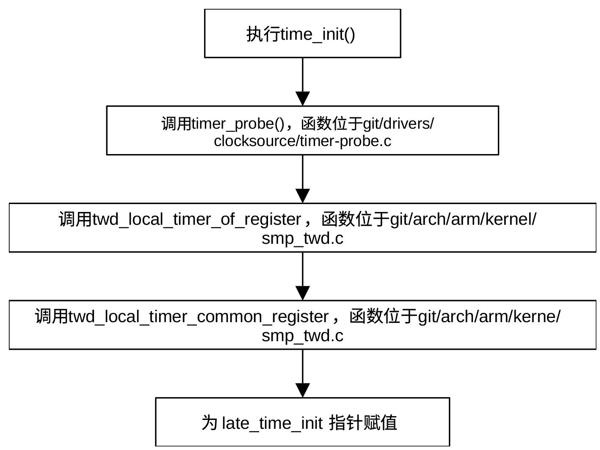

## 定时器初始化收尾

有些高精度定时器依赖于特定硬件或依靠ACPI子系统去发现它。late_time_init()执行高精度定时器或其他依赖特定硬件的后期时间初始化。late_time_init本身是一个函数指针，它由前面的代码或ACPI子系统赋值。

对arm cortex-A9架构，通过TIMER_OF_DECLARE(arm_twd_a9,
"arm,cortex-a9-twd-timer",
twd_local_timer_of_register)声明看门狗定时器twd（Timer
Watchdog）。定时器兼容“arm,cortex-a9-twd-timer”，初始化函数为twd_local_timer_of_register。

链接脚本git/include/asm-generic/vmlinux.lds.h定义了一个类型为of_device_id、位于\_\_timer_of_table和\_\_timer_of_table_end之间的特殊段。链接时，GCC把字符串"arm,cortex-a9-twd-timer"放在位于\_\_timer_of_table和\_\_timer_of_table_end之间的某个of_device_id结构体的compatible字段，把函数twd_local_timer_of_register的地址放在同一个结构体的data字段。在执行timer_init()之前，通过函数调用将函数twd_timer_setup的地址赋予函数指针late_time_init
。当执行late_time_init()时，实际执行的是函数twd_timer_setup()。对ARM
Cortex-A9处理器而言，late_time_init指针的赋值流程为：

<center>
<figure>

<figcaption><p>图 25‑1 late_time_init赋值流程</p></figcaption>
</figure>
</center>

twd_timer_setup()函数是本地定时器（各CPU私有定时器）初始化函数。其主要功能是为当前
CPU 注册一个时钟事件设备，用作本地调度时钟（时钟节拍）。在 Linux
时间子系统里有时钟源和时钟事件两个核心概念。时钟源提供类似于计数器的当前时间，时钟事件负责产生中断，用于调度节拍、高精度定时器和无周期节拍模式。函数位于git/arch/arm/kernel/smp_twd.c，其定义为：

```
static void twd_timer_setup(void)
{
	struct clock_event_device *clk = raw_cpu_ptr(twd_evt);
	int cpu = smp_processor_id();
	if (per_cpu(percpu_setup_called, cpu)) {
		writel_relaxed(0, twd_base + TWD_TIMER_CONTROL);
		clockevents_register_device(clk);
		enable_percpu_irq(clk->irq, 0);
		return;
	}
	per_cpu(percpu_setup_called, cpu) = true;
	twd_calibrate_rate();
	writel_relaxed(0, twd_base + TWD_TIMER_CONTROL);
	clk->name = "local_timer";
	clk->features = twd_features;
	clk->rating = 350;
	clk->set_state_shutdown = twd_shutdown;
	clk->set_state_periodic = twd_set_periodic;
	clk->set_state_oneshot = twd_set_oneshot;
	clk->tick_resume = twd_shutdown;
	clk->set_next_event = twd_set_next_event;
	clk->irq = twd_ppi;
	clk->cpumask = cpumask_of(cpu);
	clockevents_config_and_register(clk, twd_timer_rate, 0xf, 0xffffffff);
	enable_percpu_irq(clk->irq, 0);
}
```

该函数是 ARM Cortex-A9 TWD
驱动的核心初始化逻辑。它反映了每个核芯私有（Per-CPU）
硬件初始化的典型模式。

通过函数raw_cpu_ptr()，函数获取当前CPU的clock_event_device结构体，该结构体记录时钟事件设备的元数据。当前CPU的标号是通过函数smp_processor_id()获取的。

由于存在热插拔和多核启动等情况，当
CPU核芯第一次上线时，需要进行完整的配置（如频率校准）。如果 CPU
因为省电或其他原因关闭后又重新开启（热插拔），它会再次进入此函数。此时不需要重新校准频率，只需简单重置寄存器并重新使能中断即可。为此，函数首先检查当前CPU的私有变量percpu_setup_called，判断当前CPU是否首次初始化其twd。

如果之前已初始化了其twd，则通过函数writel_relaxed()
关闭定时器，然后利用函数clockevents_register_device()重新注册
clockevent，把这个定时器再挂回内核时间系统，最后通过函数enable_percpu_irq()开启本地中断。

如果是首次初始化该定时器，首先将定时器的状态通过全局变量percpu_setup_called标识为已初始化，然后通过函数twd_calibrate_rate()校准定时器频率。TWD
是硬件计数器，内核在极早期并不一定确切知道计数器的频率。这个函数会利用一个已知的参考时钟（通常是全局定时器）来实测当前核芯的
TWD 频率。测量结果存入 twd_timer_rate，作为后续
clockevents_config_and_register ()的参数。

在初始化 clock_event_device
结构体之前，函数先通过writel_relaxed()关闭计数器，防止初始化过程中误触发，然后配置时钟事件设备的各项参数及包括实现关闭、周期模式、单词触发、重新开始及设置下一次事件等功能的关键函数指针
。函数twd_set_next_event()用来设置多久后触发下一次中断。

TWD 使用的是 PPI（Private Peripheral Interrupt，通常中断号是
29），这意味着虽然每个核芯的中断号相同，但它们在硬件物理线路上是各自独立的。

代码clk-\>cpumask = cpumask_of(cpu)的作用是使该定时器只属于当前 CPU。

函数clockevents_config_and_register()根据传入的 twd_timer_rate
自动计算将纳秒转换为时钟周期的乘数 (mult) 和位移值
(shift)，确立定时器能设置的最短和最长超时时间，并将该本地定时器注册到内核的时钟事件框架中，使其能够处理诸如周期性时钟节拍或高精度定时器的任务。其中最后两个参数分别为定时器的最小和最大时间间隔。

函数在最后通过enable_percpu_irq()开启本地时钟中断。
