## 嵌入式系统硬件与操作系统接口

### i.Mx6 Solo/DualLite处理器

i.Mx6 Solo/DualLite内核采用单核或双核Arm V7处理器。围绕该内核，
NXP扩充了加密/解密、GPU2D、GPU3D、VPU、USB控制器、MMC/eMMC接口、DDR
控制器、LVDS控制器、HDMI控制器、MIPI DSI/CSI、SPDF/EASI、用以支持NOR
Flash/NAND
Flash的EIM及GPMI接口、以太网接口、EPDC控制器、CAN总线控制器、通用中断控制器等大量多媒体模块，还提供了I2C、SPI等接口。该处理器支持NOR
flash、NAND flash、OneNAND
flash、SD/MMC、eMMC、串口（I2C/SPI)NOR
flash/EEPROM、USB等各种引导设备，可以实现对引导程序的真伪辨识及解密，是一款功能非常强大的多媒体处理应用芯片。

处理器的引导程序位于处理器的片上ROM。该引导程序具有如下特点：

- 支持多种引导设备

- 支持基于USB OTG的串行下装

- 能够读取引导设备提供的器件配置数据并对系统上的各个模块进行配置

- 可以使用引导设备提供的插件

- 高可信度的数字签名及加密

- 从低功耗模式唤醒

- 唤醒其它中央处理器

引导程序利用引导模式寄存器及eFUSE的设置确定引导设备。在开发期间，可以利用GPIO覆盖eFUSE的值，便于系统开发与调试。

利用ROM程序，还可以制作引导设备，如把镜像程序通过USB写入RAM，然后把镜像程序写到引导设备上。

ROM引导程序程序提供了eFUSE、串口及内部三种引导模式。eFUSE利用片上保险丝的状态确定引导设备。串口引导利用USB
OTG设备引导操作系统。eFUSE引导与内部引导的区别是内部引导模式可以通过GPIO覆盖。当eFUSE引导或内部引导失败后，系统自动转为串口引导。

复位期间，系统锁存引导模式管脚的值。复位后，存于片上ROM的程序开始运行。在进行一些必要的配置后，依据eFUSE、GPIO及引导模式的值，确定引导设备，然后从引导介质的固定区域读取一定数量的数据。这些数据中包含镜像向量表，通过它可以确定器件配置数据、引导数据结构及应用程序和数据地址。片上引导程序利用这些数据配置外设及内存，把U-BOOT程序读入内存，然后通过U-BOOT把操作系统读入内存。

### 片上引导程序

系统上电之后，复位电路使CPU处于已知状态，这时CPU的程序指针指向某一个固定位置。该地址为片上引导程序的首地址，通常为一条跳转指令，当然也可以为正常的片上引导程序的首地址。该引导程序的主要功能是简单地初始化系统硬件，如DDR，设置CPU的工作模式，然后从特定的存储介质上把存于初始引导区域的引导数据及U-BOOT引导程序导入内存并开始运行u-boot引导程序。下面以NXP公司的i.MX6
DualLite/solo多媒体CPU芯片为例简单地介绍片上引导程序。

上电复位后，i.MX6
DualLite/solo读取管脚BOOT_MODE0和管脚BOOT_MODE1的值，存于内部寄存器BOOT_MODE的\[1:0\]位。BOOT_MODE\[1:0\]，特定eFUSE的值及复位后一些GPIO管脚的值决定系统的引导方式及引导流程。片上ROM支持SD/MMC、NOR闪存、NAND闪存、OneNAND闪存，
SPI/I2C闪存及EEROM等器件引导。i.MX6 DualLite/solo片上ROM具有如下特点：

- 支持通过USB OTG的串行程序下装

- 能够读取器件配置参数（DCD）及运行短小的插入程序（plugin）

- 能够进行数字签名认证及加密引导

- 唤醒处于低功耗模式的系统

- 唤醒第二个CPU

片上ROM也支持把程序下载到内存并运行该程序。

配置参数读取和小程序插入功能是片上引导程序的两个非常重要的特点，利用它们可以优化硬件参数设置，配置DDR内存，以便u-boot使用DDR内存进行程序引导。

i.MX6 soso/DualLite支持三种引导模式：

- eFUSE引导模式

- 串行下装模式

- 内部引导模式

eFUSE引导模式与内部引导模式的唯一区别是eFUSE模式无法通过GPIO管脚改写引导过程硬件参数设置，而内部引导模式的硬件参数可以通过GPIO管脚的值进行改写。

串行下装模式允许用户通过USB
OTG插口把程序下装到内存或非易失性存储介质。i.MX6 solo 和i.MX6
DualLite的片上引导程序流程示于下图。

<figure>
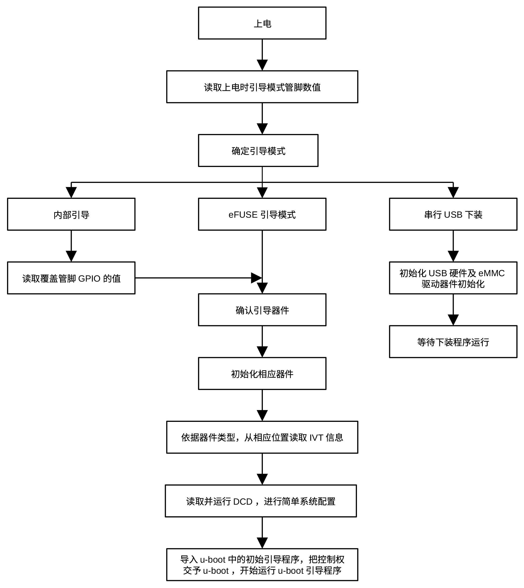
<figcaption>
图 4‑3 片上引导程序流程
</figcaption>
</figure>

若内部引导或eFUSE引导过程失败，片上引导程序自动跳转到串行USB下装模式，允许系统通过串行模式启动系统。

### 镜像引导程序结构

所谓的镜像程序是存储在引导设备上的可执行程序。镜像程序的存储必须符合特定格式，否则，片上引导程序和U-BOOT无法知道程序各个部分在存储介质上的存储位置，也无法确定程序在内存中的存储地址和程序的运行入口。对i.MX6
solo/dualLite处理器而言，镜像程序由下面四部分组成：

- 镜像程序向量表

- DCD

- 引导数据

- 应用代码和数据

其中镜像程序向量表存储在引导设备上的固定位置，由一组指针组成，片上引导程序利用这些指针确定程序其它部分在引导设备上的存储位置。DCD数据是一组片上ROM程序能够识别的数据，用来配置IC芯片。引导数据表格中存储有镜像程序的位置、大小及是否使用引导插件的标志，这三个部分通称为初始导入区。片上ROM在进行初始化后，首先要把这一部分读入内存。应用代码和数据部分包含U-BOOT代码和数据。

### 镜像程序向量表（IVT）

片上ROM引导程序在进行了必要的硬件初始化及确定了引导介质后，首先要把初始引导区域的数据读入片上RAM，然后解析镜像程序向量表。依据解析结果把初始引导区域的数据从片上RAM拷贝到目标地址，并把剩余的镜像程序读入目标地址。对i.MX6系列处理器而言，IVT在不同引导介质上的存储位置为：

表 1 IVT在不同介质的存储位置

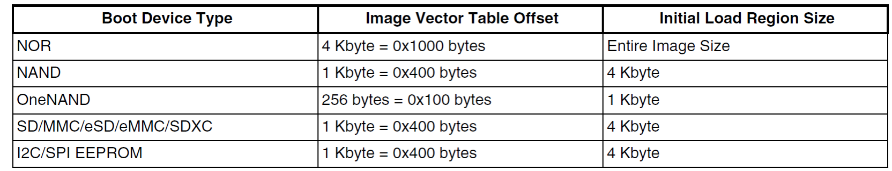

IVT必须存储于引导设备的固定位置，这是片上引导程序的唯一要求。

IVT由表头、入口地址、保留区1、DCD指针、引导数据指针、自指针、命令序列文件指针、保留区2等八个部分组成（见下图）。

表 2 IVT格式

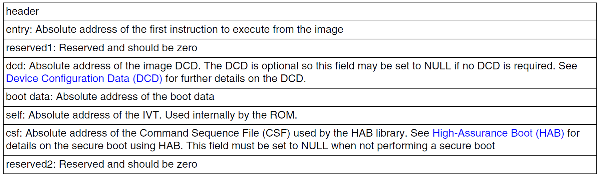

每个部分均占用4个字节。下面分别介绍各个部分的结构及其用处。

表头位于IVT的开始，用以描述IVT的大小、版本，其格式为：

表 3 表头格式

其中Tag的值为0xD1，表示该结构为IVT，占用一个字节，Length占用两个字节，
采用大端格式，
表示包含表头的IVT本身的长度。Version占用一个字节，取值0x41，0x42或0x43，该值标示程序入口类型，可以是应用程序的首地址，也可以是复位向量地址。

Entry表示本镜像程序的入口，即应用程序的首地址，或复位向量地址。

Dcd指针指向器件配置数据，长度4个字节。器件配置数值用以初始化必要的外设，如DDR控制器及DDR。

Boot
data是指向引导数据的指针，表示导入内存后引导数据结构的绝对地址。引导数据的结构为：

表 4 引导数据结构

上表中的起始地址为该镜像程序导入内存的绝对目标地址，长度为镜像程序的大小，用字节表示。插件用于配置IC，不使用插件配置芯片时，该区域为空。

Self表示IVT的绝对地址，供片上ROM引导程序使用。

csf指向在加密引导时使用的命令序列文件对应的内存地址。

U-BOOT引导程序存储在引导设备与导入内存后的关系如下图所示：

<figure>
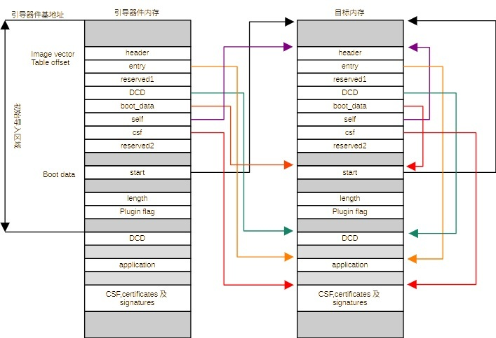
<figcaption>
图 4‑4 U-BOOT镜像引导程序结构
</figcaption>
</figure>

i.MX6 DualLite/solo 芯片器件配置(DCD)

通常，开机之后，计算机内部寄存器的默认值不是系统运行的最佳值，有些外设甚至只有在配置之后才可以使用。这就需要用户根据实际情况配置一些寄存器，以满足系统需求，例如，
i.MX 系列应用处理器提供了EIM接口，但其默认值是为NOR
闪存设置的，开机以后，可以立即使用NOR类型的闪存，但速度都不高，再比如，该系列芯片提供了EMMC模块，用以驱动DDR，但需要用户配置一些寄存器，才能够使用所选的DDR内存。i.MX6
芯片的片上引导程序提供了从引导器件读取器件配置数据的功能，用户只要按照程序所要求的格式，
在外部引导程序中相应的位置提供正确的数据，就可以对器件进行简单配置。

DCD包含了器件配置信息，片上ROM依据存于引导设备上的程序向量表（Image
Vector Table—IVT）确定DCD数据位置。DCD数据的存储格式为：

表 5 DCD数据的存储格式

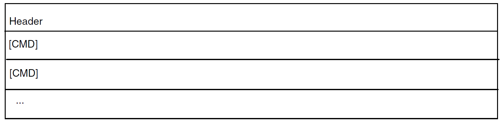

DCD数据结构头为4个字节，其结构为：

表 6 DCD数据头结构

Tag长度为一个字节，其值恒为0xD2，Length
占用两个字节，采用大端模式，表示含头结构在内的DCD数据的长度， Version
占用一个字节，值为0x41。

CMD部分是用来配置器件的命令，共有4种，包括写命令、数据测试命令、无操作（NOP）命令和解锁(unlock)命令。

写命令的格式为：

表 7 写命令格式

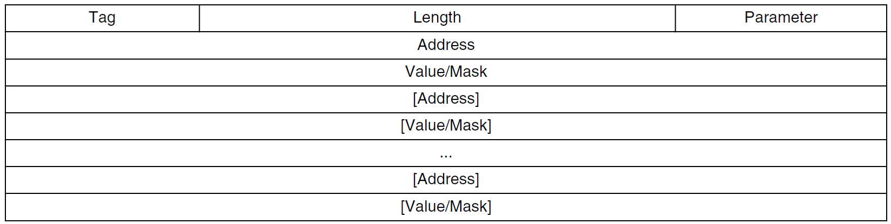

其中Address指明写命令的目标地址，Value/Mask指明目标地址要写入的数据或要屏蔽的位。命令头由三部分组成，Tag占用一个字节，恒等于0xCC，
表示写命令。Length占用两个字节，表示包含头部分的写命令的字节数，采用大端模式。Parameter
占用一个字节， 其格式为：

表 8 Parameter 格式

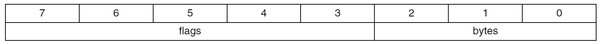

Bytes域表示该命令地址的字节数， 可以为1、2
或者4。flags域控制写命令的执行， 位3为屏蔽位，
位4为置位位。这两位所定义的操作如下表所示：

表 9 写命令格式

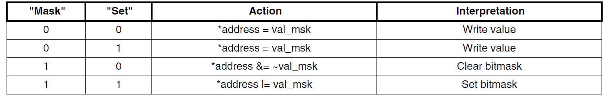

其中00和01代表写操作，10和11代表复位和置位操作。

数据测试命令用以测试指定地址处的数据，命令格式为：

表 10 测试命令格式

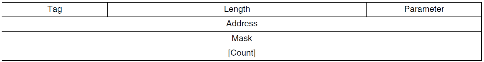

Address为要测试数据的地址，Mask为测试屏蔽位，用以屏蔽不需要测试的数据位，Count为测试次数。该命令不断测试指定地址上的数据，直到满足由Mask指定的测试条件或达到由Count指定的次数为止。当Count为0时，该命令相当于一条无操作命令。

该命令的命令头包含三个部分。Tag的值恒等于0xCF，占用一个字节，表示数据检查命令。Length占用两个字节，
表示含命令头的数据测试命令长度，格式为大端。Parameter占用一个字节，格式为：

表 11 数据测试命令头

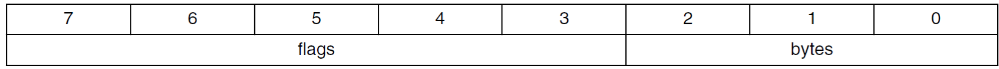

位3为屏蔽位标识， 位4为置位标识，其含义如下表所示：

表 12 数据测试操作

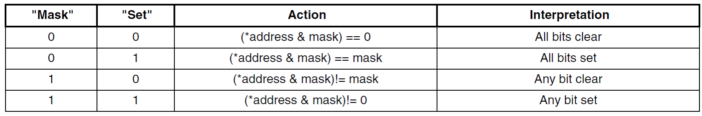

NOP命令的长度为四个字节， 其格式为：

表 13 NOP命令格式

Tag的值等于0xC0，长度为一个字节。Length的值等于4，
占用两个字节。最后一个字节没有定义，可以忽略。

Unlock命令用于阻止片上程序在退出时锁死特定引擎，其格式为:

表 14 Unlock命令格式

Tag的值为0xB2，占用一个字节。Eng指定在退出时维持工作的引擎。Value指定退出时该引擎需要的量。这条命令主要用于引导加密。