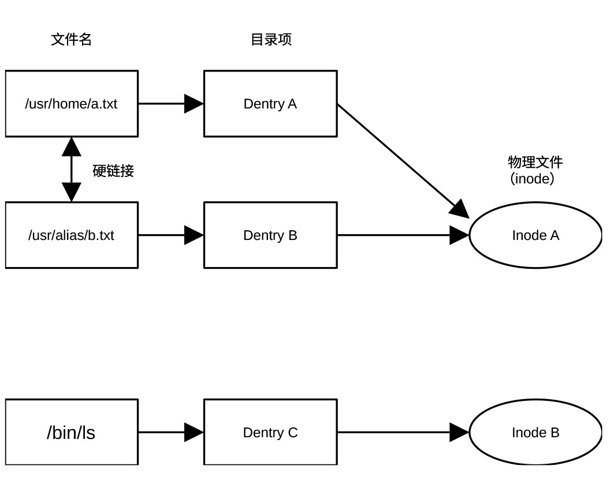

## 建立文件系统缓存

在 Linux
中，文件系统不仅仅是存储数据的方式，更是操作系统的管理核心，其核心逻辑为一切皆文件。虚拟文件系统（VFS）是
Linux 最精妙的设计，它是一个抽象层，位于用户程序和具体文件系统（如
ext4、NTFS、NFS）之间。

无论底层的硬盘格式是什么，用户使用的命令（如 ls、cp）都是一样的。VFS
负责把这些通用指令翻译成底层能听懂的语言。

Linux
把文件拆分为索引节点（Inode）和数据块（Block）两部分存储。索引节点存储文件的元数据（权限、所有者、大小、创建时间、以及数据块在磁盘上的物理位置），数据块存储文件的实际内容。每个文件都有唯一的
Inode 号。

目录项（Dentry）记录文件名与索引节点号的对应关系，是文件名与文件之间的桥梁。这就是为什么同一个文件可以有多个文件名（硬链接）。

根据用途不同，常见的 Linux 文件系统类型有以下几种：

- Ext4

> 稳定、兼容性极佳，是大多数 Linux 发行版的默认选择。

- XFS

> 高性能，擅长处理超大文件和高并发 I/O，常用于企业级服务器。

- Btrfs

> 支持快照和数据压缩，常用于 Fedora 等系统。

- F2FS

> 专为闪存（SSD、SD 卡、手机存储）优化，提升读写寿命。

在 Linux
中，接入一个新硬盘需要执行挂载操作，将硬件分区关联到现有的某个文件夹（挂载点）上，然后通过访问该文件夹来读取硬盘内容。

函数vfs_caches_init()为文件系统相关的关键数据结构建立 slab
缓存，并初始化路径解析与文件对象管理所需的基础设施。函数位于git/fs/dcache.c，定义为：

```
void __init vfs_caches_init(void)
{
	names_cachep = kmem_cache_create_usercopy("names_cache", PATH_MAX, 0,
		SLAB_HWCACHE_ALIGN|SLAB_PANIC, 0, PATH_MAX, NULL);
	dcache_init();
	inode_init();
	files_init();
	files_maxfiles_init();
	mnt_init();
	bdev_cache_init();
	chrdev_init();
}
```

vfs_caches_init()函数调用dcache_init()建立目录项（dentry）缓存体系，初始化路径解析性能的核心基础设施。目录项是构成文件路径名的组件，如路径/home/user/a.txt由/、home、user和a.txt四个目录项构成。所有路径解析本质上就是查找一连串目录项。文件名（含路径）、目录项和物理文件（以inode代表）之间的关系可用图
27‑2表示。
<center>
<figure>

<figcaption><p>图 27‑2
文件名、目录项及索引节点（物理文件）之间的关系</p></figcaption>
</figure>
</center>
dcache_init()利用KMEM_CACHE_USERCOPY() 创建dentry_cache
缓冲池。它限定了当内核向用户空间复制数据时，struct dentry 结构体中只有
d_iname
字段所在的内存区域是安全允许的，其余字段禁止直接复制到用户态。在分配缓冲池后，利用函数
alloc_large_system_hash()初始化目录项哈希表dentry_hashtable，以便能够利用父目录项和名字快速查找子目录项。

vfs_caches_init()函数调用inode_init() 建立索引节点的 slab
缓存和哈希表，从而支撑整个文件元数据（权限/大小/时间等）的管理。inode
结构体保存文件的元数据，用以具体描述文件，典型内容包括文件大小、权限（rwx）、uid/gid、时间戳、数据块位置及文件类型（普通文件
/ 目录 / 设备）。

函数inode_init()利用kmem_cache_create()创建索引节点slab缓存，为inode
结构体建立对象池，避免频繁的内存分配释放。此外，还通过函数alloc_large_system_hash()初始化索引节点哈希表，以便快速查找。

vfs_caches_init()函数调用files_init()，初始化file结构体的
slab缓存及与文件描述符相关的全局参数，从而支撑
打开/读/写等系统调用。前面我们介绍的dcache_init()是解决路径名问题，inode_init()是解决文件实体问题，而files_init()
是解决打开文件实例（open
之后的对象）如何管理的问题。在内核启动流程中，files_init()负责建立处理已打开文件的核心机制。

文件管理中使用三个非常重要的结构体，分别是file_struct结构体（文件表）、fdtable结构体（文件描述符表）和file结构体（文件对象）。这三个结构体层层递进，共同构成了
Linux
内核中进程如何管理已打开文件的完整视图。file结构体记录一次打开的状态（调用一次open），包括文件偏移量
(f_pos)、打开模式 (f_flags)、指向索引节点的的指针
(f_path)。即使两个进程打开同一个物理文件，它们也会各自拥有一个独立的file结构体。files_struct管理一个进程打开的所有文件。它被包含在进程控制块
task_struct 中，主要包括指向 fdtable
结构体的指针、文件描述符位图、以及一个小型的预分配数组（用于优化，避免小规模打开文件时频繁分配内存）。fdtable
结构体的核心内容是一个索引表指针，指针指向文件对象指针数组。数组的每个单元是一个指向file结构体的指针，文件描述符FD对应数组的下标。如FD=0时，从指针数组的第0个位置获取指向file结构体的指针，从而获得所需的file结构体，实现对与open操作相应的文件的操作。

三者的逻辑关系可用下图表示

进程 (task_struct)

└── files_struct (管理容器)

├── fdtab (指向当前活跃的 fdtable)

└── fdtable (描述符表)

└── fd\[\] (通过二级指针\*\*fd定义的)

├── \[0\] ----\> struct file (标准输入)

├── \[1\] ----\> struct file (标准输出)

└── \[N\] ----\> struct file (打开的文件)

└── f_inode ----\> VFS Inode

函数files_init() 通过 kmem_cache_create 创建 file结构体Slab
缓存，用于高效分配和回收file 结构体。每当调用 open()
打开一个文件时，内核就会从这个缓存池中分出一块内存来记录该次打开的状态（如读写位置
f_pos、打开模式 f_flags 等）。

files_init()
还会根据系统的物理内存大小，计算出一个合理的系统级最大打开文件数。系统预留一部分内存给文件对象，确保在高负载下不会因为文件打开过多而撑爆内存。

总之，files_init() 初始化 struct file 的 slab 缓存及全局文件对象限制，为
open/close 等系统调用提供基础，是 VFS 中文件打开实例管理的核心。

函数
files_maxfiles_init()是一个专门负责设定系统级资源上限的计算函数。它的核心任务是基于当前系统的内存总量，计算系统最多允许打开的文件数量。

函数mnt_init()的作用是初始化挂载机制，搭建挂载树架子。它主要完成创建挂载命名空间的根节点（挂载树的根部）、分配挂载缓存区、设置挂载哈希表的表头、注册并挂载虚拟文件系统以及建立
VFS 目录层次结构的起点。

mnt_init()首先通过函数kmem_cache_create()在内核缓存区创建一个名为mnt-cache的SLAB/SLUB
内存缓存池。每次挂载一个分区或设备，内核都要创建一个 struct mount
实例。使用专用缓存池可以极大地提高频繁分配和释放挂载结构体时的内存管理效率。

接着，mnt_init()通过函数alloc_large_system_hash()创建名为Mount-cache的挂载哈希表，用于快速查询mount结构体。结构体mount是虚拟文件系统（VFS）层的核心数据结构，用于描述一个已挂载的文件系统实例及其在全局挂载树中的位置。根据父挂载点和目录项，内核利用它能快速判断某个路径（如
/home）是否是一个独立的挂载点，以便快速查找对应的子挂载。

mnt_init()通过函数alloc_large_system_hash()在内核缓存区创建命名Mountpoint-cache的挂载点哈希表，用于管理和快速查找内核中所有的挂载点。与挂载哈希表不同，挂载哈希表用于通过“父挂载点指针 +
挂载目录项”作为键值，查找对应的 struct mount
实例，用于路径解析，而挂载点哈希表专门用于管理具体的物理挂载点，即用于挂载文件的目录项
。通过对挂载点dentry
指针的散列，可以进行挂载、卸载，以及追踪一个目录被挂载次数等操作。

mnt_init()调用函数kernfs_init() 、通过函数kmem_cache_create()为 kernfs
这种虚拟文件系统框架搭建运行环境，创建名为 kernfs_node_cache的 SLAB
缓存池，存储kernfs_node 结构体。在 Linux 中，/sys
下的每一个目录、每一个属性文件（如
/sys/class/net/eth0/address），在内核内存中都对应一个kernfs_node结构体。

mnt_init()
最核心的工作由函数sysfs_init()和init_rootfs()完成。基于kernfs_init()
创建的SLAB 缓存池。sysfs_init()创建 sysfs（设备模型文件系统，通常挂在
/sys）根节点并向文件系统注册sysfs，sysfs是内核向用户空间展示硬件设备树的窗口。init_rootfs()初始化临时文件系统
（tmpfs），作为系统初始化时的根文件系统（rootfs）。它决定了内核在启动时，用来临时存放和运行
initramfs（或 initrd）的内存盘到底是一个效率低下的旧架构，还是高性能的
tmpfs。

在Linux虚拟文件系统里，/sys/fs是文件系统的配置与监控接口，为很多文件系统、挂载与相关内核接口的统一入口。这些接口通常按功能分为不同的组，分别存于/sys/fs/cgroup、/sys/fs/ext4、/sys/fs/f2fs、/sys/fs/bpf等子目录。mnt_init()利用
kobject_create_and_add() 创建名为 fs 的 kobject（对应目录/sys/fs，作为
sysfs 中 fs 分类的总入口/父节点），给文件系统管理类 sysfs
接口预留一个总目录。

函数mnt_init()调用shmem_init()的目的是初始化共享内存（Shared Memory-
shmem）文件系统（tmpfs/shmem）。Linux提供了两个shmem_init()版本，通过编译开关CONFIG_SHMEM选择。当启用了CONFIG_SHMEM，内核使用功能完备的共享内存系统，否则使用极度精简的替代方案（Tiny
Shmem）。

对标准版而言，函数shmem_init()用于初始化共享内存文件系统（tmpfs/shmem）。它首先建立共享内存专用
inode slab缓存池，随后将 shmem_fs_type 注册为文件系统类型 tmpfs，再通过
kern_mount() 在内核内部挂载一个私有 tmpfs 实例
shm_mnt，供共享内存、匿名文件、memfd
等机制使用。若启用透明大页，还会为该超级块配置大页策略。

在 Linux内核中，通过一种特殊的虚拟文件系统共享内存，实现进程间的通信（IPC）。简单来说，共享内存机制的核心作用是让不同的进程能够访问同一块物理内存区域，从而实现超高速的数据交换。
共享内存是内核内部的实现机制，负责管理这些内存页。tmpfs是共享内存的用户界面。当挂载一个tmpfs（比如常见的 /dev/shm）时，实际上是在使用共享内存机制来存储文件。

在普通的进程通信（如管道或套接字）中，数据往往需要在内核和用户空间之间多次复制。共享内存的优势在于它直接将同一块物理内存映射到多个进程的虚拟地址空间中，进程读写共享内存就像读写自己的内存一样快，无需任何内核介入或数据拷贝。

最后，函数mnt_init()调用init_mount_tree()创建一个临时根目录。init_mount_tree()是内核启动阶段负责构建系统第一棵挂载树的关键函数，其核心任务是创造系统的根视图。它调用vfs_kern_mount()挂载一个特殊的内置根文件系统（rootfs），这是内核逻辑上的第一个文件系统。然后为这个根文件系统分配系统中第一个mount结构体实例，该实例是整棵挂载树的树根。之后，init_mount_tree()创建初始命名空间init_user_ns，将刚才创建的第一个mount结构体关联到这个命名空间中。所有后续启动的进程（如 init进程）默认都会继承这个空间。最后绑定当前进程的根目录，将当前内核线程（通常是PID 1 的前身）的 fs-\>root（根目录）和
fs-\>pwd（当前工作目录）都指向这个根文件系统的根目录项。

从此开始，内核才真正有了路径的概念，可以开始解析“ / ”了。

在 Linux 内核启动流程中，紧随mnt_init()之后调用的 bdev_cache_init()
是块设备管理层的关键初始化步骤。它的核心作用是利用kmem_cache_create()为内核中的block_device结构体创建名为bdev_cache的slab内存缓存池、利用register_filesystem()注册伪文件系统bdev_fs、利用<u>kern_mount()</u>挂载该文件系统、并保存该文件系统的超级块（super block）指针。

系统中每个磁盘分区、逻辑卷（LVM）或回环设备（loop device）在内核中都由一个block_device结构体实例表示。通过建立专门的缓存池，内核可以更高效地申请和回收这些结构体。

在 Linux的万物皆文件设计中，每一个块设备都需要关联到一个索引节点才能进行统一管理。挂载这个隐藏的bdev 文件系统后，每当打开一个设备文件（如/dev/sda），内核实际上是在这个隐藏的文件系统里分配了一个索引节点，并将其与块设备结构体绑定。

在 Linux 虚拟文件系统以及传统的磁盘文件系统（如 ext4, xfs等）中，超级块是整个文件系统的大脑和总指挥部。它是专门用来记录整个文件系统的元数据和全局配置信息的核心数据结构。在内核源码中，VFS层的超级块被定义为 struct
super_block。它主要包含磁盘块的大小、总的磁盘块数量和总的 inode数量、当前空闲的磁盘块数量和空闲的 inode数量、文件系统是否正常卸载的标志（Clean/Dirty
Mark）、用来校验这个分区到底是什么文件系统的魔术数、卷标和UUID（通用唯一识别码）、挂载标志（如只读、读写、异步等）及指向一个struct super_operations 结构体的操作函数集指针（s_op）。struct super_operations里面包含了该文件系统具体的操作函数指针（如如何分配一个inode、如何写回超级块、如何释放内存等）。

超级块的作用是帮助快速查找索引节点。当内核需要把内存里的脏数据刷回磁盘时，它需要遍历所有块设备。有了这个全局的超级块指针，内核就能快速找到该文件系统下所有的索引节点（即所有的块设备），并触发回写逻辑。

vfs_caches_init()函数的最后工作是初始化字符设备的映射结构。Linux不仅支持块设备，也支持字符设备，chrdev_init()就是用于初始化字符设备核心映射结构 cdev_map。它通过 kobj_map_init()建立设备号（major/minor）到字符设备对象（cdev）的查找框架，使 VFS在打开字符设备节点时，能够根据 inode-\>i_rdev
找到对应驱动的操作函数（file_operations）。

字符设备通常是流式访问（按字节流的顺序依次读取），不需要缓存，所以不需要一套复杂的伪文件系统来管理。它只需要一个简单的cdev_map映射表，告诉内核，当访问
/dev/tty时，该调用哪个驱动函数。其中映射表是一个全局的散列表，其作用类似于一个查号台，设备号（包含主设备号
Major 和次设备号
Minor）作为键（Key）值，对应的字符设备对象（cdev结构体）作为哈希表的值（Value）。

