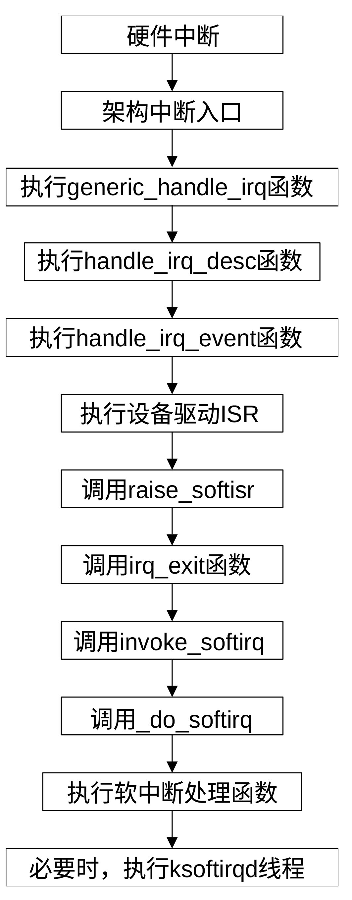

## 建立软中断框架

在 Linux 内核中，软中断 (Softirq)
是实现下半部处理的核心机制。它主要用于处理那些对实时性有要求、但不像硬中断那样极其紧急的任务。软中断允许内核将非关键操作推迟到中断开启的状态下执行，从而提高吞吐量。软中断是一种为了平衡中断响应速度和任务处理开销而设计的下半部中断机制。

当硬件中断（如网卡收包）发生时，内核会进入硬中断（上半部中断）。由于硬中断会关闭
CPU
响应，如果处理时间过长，会导致系统丢包或卡顿。为了避免这样的事情发生，硬中断只做最紧迫的事（如读取寄存器、清除状态、触发软中断）。如果处理耗时较长、非原子性的逻辑（如协议栈解析、定时器回调），Linux会把任务延迟到软中断执行。

软中断的类型在编译时由 enum 静态定义，不支持动态注册，目前内核定义了 10
种类型的软中断。同一类型的软中断可以在多个 CPU
上同时运行。这意味着软中断处理函数必须是可重入的，且需要考虑锁机制。一个
CPU 正在执行软中断时，不会被另一个软中断抢占，但可以被硬中断打断。

软中断一般会在硬中断退出时调用
invoke_softirq()执行，这是最常见的触发点。如果软中断处理时间过长，为了不阻塞进程，内核会唤醒
ksoftirqd 并在后台处理。调用 local_bh_enable()
时，软中断也会执行内核代码（如网络驱动）。

Linux定义的软中断主要包括：

```text
编号 名称               描述

0    HI_SOFTIRQ         高优先级 Tasklet

1    TIMER_SOFTIRQ      定时器

2    NET_TX_SOFTIRQ     网络数据包发送

3    NET_RX_SOFTIRQ     网络数据包接收（压力通常最大）

4    BLOCK_SOFTIRQ      块设备（磁盘）I/O

7    SCHED_SOFTIRQ      调度器负载均衡

9    RCU_SOFTIRQ RCU    回调处理
```

硬件通过调用 raise_softirq()
将特定位设为“待处理”状态。运行irq_exit()时，中断仍处于关闭状态。
当发现有待处理的工作时，irq_exit()会调用invoke_softirq() ，并最终调用
\_\_do_softirq() 。\_\_do_softirq() 会
开启硬中断，以便CPU能够再次响应新的硬中断。\_\_do_softirq()执行软中断处理函数
。处理完后再次关中断，然后返回irq_exit()
剩余流程，清理状态。irq_exit()完成之后，再做一些简单的准备工作，最后执行中断返回指令，完成硬中断处理。

同一类型的软中断可以同时在多个 CPU
上运行，因此，软中断处理程序必须是可重入的，且需要使用锁（如自旋锁）保护共享数据。软中断运行在原子上下文中，严禁睡眠、阻塞或调用可能引起调度的函数。软中断的优先级高于普通进程，但低于硬中断。

在 Linux 内核中，softirq_init() 是初始化
软中断子系统的关键函数。函数定义在文件git/kernel/softirq.c中，其定义为：

```
void __init softirq_init(void)
{
	int cpu;

	for_each_possible_cpu(cpu) {
		per_cpu(tasklet_vec, cpu).tail = &per_cpu(tasklet_vec, cpu).head;
		per_cpu(tasklet_hi_vec, cpu).tail = &per_cpu(tasklet_hi_vec, cpu).head;
	}
	open_softirq(TASKLET_SOFTIRQ, tasklet_action);
	open_softirq(HI_SOFTIRQ, tasklet_hi_action);
}
```

softirq_init() 的核心任务是初始化用于管理软中断和 Tasklet
的Per-CPU数据结构，并注册基本的软中断处理程序。 它会遍历所有可能的
CPU，并把每个 CPU 的 tasklet_vec（普通优先级 Tasklet）和
tasklet_hi_vec（高优先级
Tasklet）链表置为空（即表头与表尾相同）。通过调用 open_softirq()
，把tasklet_action函数注册为TASKLET_SOFTIRQ软中断的处理函数，把tasklet_hi_action函数注册为HI_SOFTIRQ软中断的处理函数。

软中断可以在多个 CPU
上并行运行（即使是相同类型的软中断），因此编写软中断处理程序时需要严格的加锁机制。

软中断通常在硬中断返回时，在内核线程 ksoftirqd
中、或在显式检查未处理软中断的特定调用点处执行。它们运行在原子上下文中，这意味着处理程序不能休眠或调用阻塞函数。图
21‑2显示了一个包含了软中断的中断处理流程，其中经历了通用中断处理、硬中断处理和软中断处理等各个阶段。

<center>
<figure>

<figcaption><p>图 21‑2 软中断处理过程</p></figcaption>
</figure>
</center>
