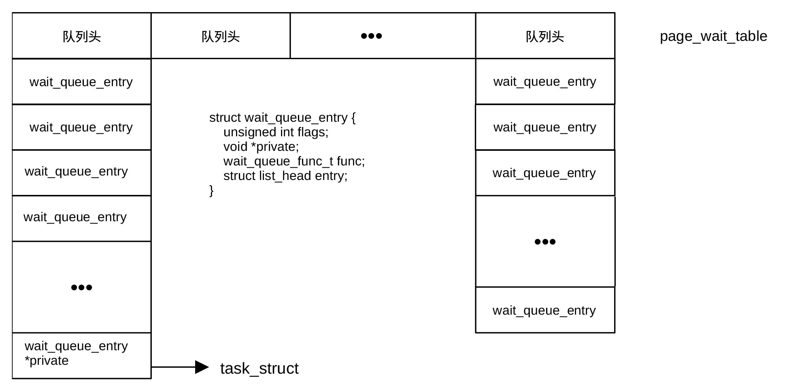

## 建立页面缓存机制

页面缓存区（Page Cache）是 Linux
内核管理的一种内存区域，旨在通过将常用的磁盘数据缓存到
RAM中，来大幅提升系统的 I/O 性能。

页面缓存以页为单位管理内存，通常一页的大小为
4KB。当应用程序读取文件时，内核先检查数据是否已在页面缓存区域中。如果已经在缓存区，直接从内存返回数据，无需访问磁盘。如果不在，内核触发磁盘
I/O 将数据读入页面缓存区，再返回给应用程序。

写数据时，数据首先写入页面缓存区，该页被标记为
脏页。内核会周期性或在内存不足时，由后台线程将脏页异步刷入磁盘。这种机制极大地降低了写入延迟。

页面等待与回写机制能显著减少慢速磁盘访问次数，提升响应速度。该机制支持
预读机制，预测并提前加载后续数据。这种机制的缺陷是在断电等极端情况下，尚未刷盘的脏页可能会丢失，维护大量缓存也会消耗系统内存。

函数pagecache_init()的功能是初始化页等待哈希表，建立回写机制。函数位于git/mm/filemap.c，其定义为：

```
void __init pagecache_init(void)
{
	int i;
	for (i = 0; i < PAGE_WAIT_TABLE_SIZE; i++)
		init_waitqueue_head(&page_wait_table[i]);
	page_writeback_init();
}
```

该函数的功能是初始化页面缓存并发竞争和写回机制，主要负责初始化页等待哈希表（page_wait_table）数组和写回机制。页等待哈希表是一个全局数组变量，用于存储各个等待队列的队头。函数通过for循环语句把数组的每个单元初始化为队列的队头。等待页面队列示于图
27‑2，图中的每一列对应一个物理内存页，其中wait_queue_entry的private字段指向等待相应页的进程描述符task_struct。

<center>
<figure>

<figcaption><p>图 27‑3 页面等待队列</p></figcaption>
</figure>
</center>

在 Linux
中，可能有数百万个内存页。当多个进程争抢同一个页（例如等待某个页从磁盘加载完成，或者等待某个页解锁）时，内核需要让这些进程进入睡眠。如果是每个页包含一个等待队列，page
结构体会变得非常巨大，浪费内存。如果是全局只有一个等待队列，当一个页被唤醒时，所有等待不同页的进程都会被唤醒（惊群效应），性能极差。为此，内核使用一个固定大小的哈希表
page_wait_table。通过对
page结构体的地址进行散列，将等待不同页的进程分散到哈希表不同的桶里，平衡了内存消耗与唤醒效率。

函数page_writeback_init()主要处理的是全局回写域（writeback
domain，类型为wb_domain结构体）和CPU
热插拔逻辑。它首先通过函数wb_domain_init()初始化全局回写域<u>global_wb_domain</u>。回写域负责统计系统范围内的脏页。它通过定时器追踪脏页的生命周期，是脏页节流（Dirty
Throttling）的基础。内核通过它来计算开始往磁盘刷数据的脏页达比，从而平衡内存消耗和
I/O 性能。

函数还用通过cpuhp_setup_state()注册 CPU
热插拔的回调函数。CPU上线和下线调用同一个函数，名为page_writeback_cpu_online。为了调试方便，函数在上线调用时称作"mm/writeback:online"，在下线调用时称作"mm/writeback:dead"。内核为了性能，会在每个
CPU 上维护一些脏页统计的计数器。当 CPU
状态改变时，必须初始化或迁移这些计数器，否则会导致全局脏页统计不准，进而影响回写决策。当系统中有一个新的
CPU核芯上线或离线时，必须调用函数page_writeback_cpu_online()。


