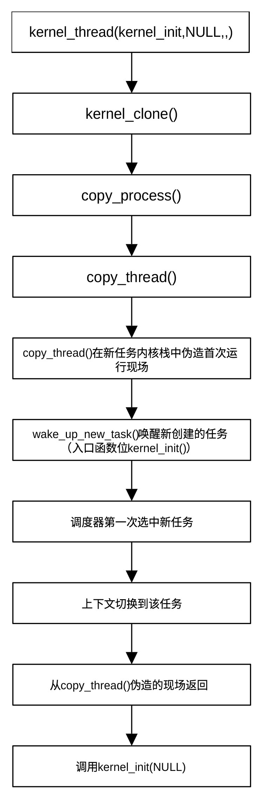

## 开启多任务运行机制

引导过程运行到此，初始化任务基本完成，系统准备进入多任务模式。从函数名称arch_call_rest_init()可以看出，虽然其主要功能是调用rest_init()，但函数名中包含前缀arch，且函数为弱函数，允许架构开发者在进入多任务循环的最后关头插入必要的指令。虽然大部分架构只是简单地调用
rest_init()，但有些 CPU
架构在进入多任务模式前，可能需要一些特殊的硬件收尾工作（如清理特定的架构寄存器）。到目前为止，只有s390架构有一些额外操作，其它架构均直接调用rest_init()。

函数arch_call_rest_init() 位于git/init/main.c，其定义为：

```
void __init __weak arch_call_rest_init(void)
{
	rest_init();
}
```

该函数非常简单，直接调用rest_init()。下面我们将详细介绍rest_init()的工作过程。

rest_init()函数同样位于git/init/main.c，其定义为：

```
noinline void __ref rest_init(void)
{
	struct task_struct *tsk;
	int pid;
	rcu_scheduler_starting();
	pid = kernel_thread(kernel_init, NULL, CLONE_FS);
	rcu_read_lock();
	tsk = find_task_by_pid_ns(pid, &init_pid_ns);
	set_cpus_allowed_ptr(tsk, cpumask_of(smp_processor_id()));
	rcu_read_unlock();
	numa_default_policy();
	pid = kernel_thread(kthreadd, NULL, CLONE_FS | CLONE_FILES);
	rcu_read_lock();
	kthreadd_task = find_task_by_pid_ns(pid, &init_pid_ns);
	rcu_read_unlock();
	system_state = SYSTEM_SCHEDULING;
	complete(&kthreadd_done);
	schedule_preempt_disabled();
	cpu_startup_entry(CPUHP_ONLINE);
}
```

该函数标志着 Linux
内核从一段正在初始化的代码正式转变为一个能够运行任务的操作系统。

它是内核启动序列的终点，也是多任务调度模式的起点。

函数reset_init()首先调用rcu_scheduler_starting()，正式把RCU
调度器状态标记为已经开始运行，即将变量rcu_scheduler_activ值设置为RCU_SCHEDULER_RUNNING。之后函数通过kernel_thread()创建
Linux
系统的1号内核线程kernel_init()（事实上是特殊进程，有自己的PID，启动方式为kernel_init(NULL)），并把该进程放入任务队列等待任务调度器调度执行。这是内核创建的第一个真正意义上的进程。它最终会从内核态切换到用户态，并在用户空间启动第一个进程，即用户态init进程（如systemd、SysVinit）。init进程会负责启动整个操作系统的各种服务。

在创建 Linux 系统的1号内核线程后，函数先锁定RCU锁，然后通过
find_task_by_pid_ns()在初始 PID
命名空间（init_pid_ns）中查找编号为1号进程的任务，并返回其
task_struct。因为此时多核同步机制还没完全准备好搬运进程，函数通过set_cpus_allowed_ptr
将 1 号进程的任务锁定在启动 CPU上，操作完成后释放RCU同步锁。

函数的下一步工作是通过numa_default_policy()把NUMA分配策略设置为默认策略。之后，函数再一次调用kernel_thread()创建2号内核线程（特殊进程）kthreadd，并在初始
PID
命名空间中查找编号为2号进程的任务。2号线程管理所有的内核线程，以后内核中所有的异步任务（如磁盘
IO 处理、内存回收等）都是由它负责生成。

创建两个内核线程后，将system_state设置为SYSTEM_SCHEDULING，表示正式进入任务调度阶段，并通过函数complete()表示kthreadd线程已准备就绪，其它依赖该线程的进程或线程不需再等待。

随着 1 号和 2 号进程就绪，系统状态变更为
SYSTEM_SCHEDULING，意味着调度器正式接管系统，任务可以正常切换和休眠了。

到此为止，reset_init()已完成了在内核启动流程start_kernel()中的使命，将要进入0
号进程的归宿，即idle 循环。它会进入一个永不退出的循环
cpu_startup_entry。当系统有活干时，它被切走。当全系统都没活干时，它就让
CPU
进入低功耗状态（停机等待）。函数cpu_startup_entry()位于git/kernel/sched/idle.c，其定义为：

```
void cpu_startup_entry(enum cpuhp_state state) 
{
	arch_cpu_idle_prepare();
	cpuhp_online_idle(state);
	while (1)
		do_idle();
}
```

该函数做三件事，分别是：

- 做架构相关的 idle 准备

- 把当前 CPU 标记为 online / idle 可运行状态

- 进入永不返回的 idle 死循环

对arm系统而言，架构相关的 idle 准备工作就是打开本地 FIQ 。

do_idle()函数在while(1)的死循环中，是 Linux idle task
的主循环核心。do_idle() 的本质就是当 CPU
在没有可运行任务时，进入空闲态等待，一旦发现需要调度，就退出 idle
并切回调度器。do_idle()位于git/kernel/sched/idle.c，它的核心职责是让 CPU
尽可能省电地休息，并随时等待被唤醒去执行新任务。其工作可大致分为如下几个阶段：

- 进入空闲状态准备

> 利用\_\_current_set_polling()设置当前 CPU 的轮询标志位，告诉其他
> CPU：“我正在省电状态或轮询状态，如果你有新任务给我，直接设置我的
> need_resched 标志即可”通过tick_nohz_idle_enter()进入内核的 NO_HZ
> 空闲模式。如果没有定时器任务，内核会尝试关闭周期性时钟中断，以达到极佳的省电效果。

- 主循环

> 只要不需要调度，就一直休眠，这是空闲的主循环。只要没有新任务到来，CPU
> 就保持在空闲状态。内存读屏障确保读取的抢占标志位是最新的。关闭中断（local_irq_disable）是为了防止竞态条件，确保在检查
> CPU 是否离线以及进入低功耗模式的过程中，不会被突发的中断打断。

- 热插拔检查（CPU 离线处理）

> 如果系统正在执行 CPU 热拔出，检测到当前 CPU
> 已经被下线，则停止时钟、报告状态，并调用架构相关的代码
> arch_cpu_idle_dead() ，让该 CPU 彻底进入彻底休眠状态，不再参与调度。

- 选择休眠方式

> 这是最关键的低功耗选择分支：有轮询模式（cpu_idle_poll()）和深度休眠（cpuidle_idle_call()）两种模式。

- 被唤醒，退出空闲状态

> 当新任务到达（比如另一个 CPU 发送了核间中断
> IPI，或者硬件时钟中断触发），CPU 被唤醒。

- 交出控制权

> 调用调度器主入口schedule_idle()，把当前进程（PID
> 0）切走，换上刚刚就绪的、真正的用户态或内核态任务。

rest_init() 创建了两个进程。1 号进程处理用户事物，2
号进程处理内核事物。原有的启动流化身为 Idle 进程，专门在没事干的时候让
CPU 休息。

前面我们提到，rest_init()调用kernel_thread()创建了1号进程和2号进程，为了让读者了解Linux创建进程的机制，下面简单概括kernel_thread()函数工作流程。函数位于git/kernel/fork.c，定义为：

```
pid_t kernel_thread(int (*fn)(void *), void *arg, unsigned long flags)
{
	struct kernel_clone_args args = {
		.flags		= ((lower_32_bits(flags) | CLONE_VM |
				    CLONE_UNTRACED) & ~CSIGNAL),
		.exit_signal	= (lower_32_bits(flags) & CSIGNAL),
		.stack		= (unsigned long)fn,
		.stack_size	= (unsigned long)arg,
	};
	return kernel_clone(&args);
}
```

从定义看出，函数本身非常简单，它只是简单地给创建任务、进程、线程时的统一参数包赋值，然后调用kernel_clone()克隆调用它的进程。fn是线程的入口函数（回调函数），\*arg为传递给入口函数
fn
的参数，flags控制新线程的克隆行为。flags类型为kernel_clone_args结构体，它包含许多字段，用以定义克隆的进程。字段flags是主要字段，决定新任务和当前任务共享内容以及创建方式。常见的方式有：

- CLONE_VM（共享地址空间）

- CLONE_FS（共享 fs 信息）

- CLONE_FILES（共享文件表）

- CLONE_SIGHAND（共享信号处理器）

- CLONE_THREAD（属于同一个线程组）

- CLONE_PARENT_SETTID

- CLONE_CHILD_SETTID

- CLONE_CHILD_CLEARTID

- CLONE_VFORK

- CLONE_NEWNS / CLONE_NEWPID 等 namespace 相关 flag

普通进程通常不带这些共享标志。

flags = SIGCHLD表示：

- 子任务有独立 mm

- 独立文件表

- 独立信号处理

- 退出时给父进程发 SIGCHLD

这样的进程就是“新进程”。

exit_signal指定子任务退出时要发送给父任务的信号，stack指定
新任务要使用的栈顶地址，stack_size指定栈的大小（bytes）。

kernel_clone() 才是 Linux
内核里创建新进程/线程的核心入口。它根据克隆参数复制当前任务，创建一个新的
task，并在必要时处理 ptrace、pid、vfork
等逻辑，最后唤醒新任务运行。该函数位于git/kernel/fork.c，其主要任务包括：

- 检查参数是否合法

- 决定是否上报 ptrace 事件

- 调用 copy_process() 真正复制进程

- 把进程/线程创建过程中产生的一些不确定性掺进内核随机熵池

- 通知监控工具：一个新进程/线程已经创建完成

- 获取新任务的 pid

- 处理 parent_tid / pidfd 等返回值

- 如果创建的是
  vfork类子进程，通过函数init_completion()准备任务完成同步机制（清除一个标志位，并把进程本身放入简单等待队列，等待新任务完成）

- 通过函数wake_up_new_task()唤醒新任务运行

- 如果是
  vfork，等待子进程释放共享环境（vfork()创建子进程时，子进程完成之前父进程会被阻塞）

copy_process()的功能就是复制当前任务的核心执行环境，构造一个新的
task_struct，并按照克隆标志决定哪些资源共享、哪些独立，最后把它挂入进程或线程体系中，但暂时还不唤醒运行。该函数很长，位于git/kernel/fork.c，其主要工作是：

- 检查 clone 组合是否合法

- 复制一个新的 task_struct 外壳

- 初始化新任务在调度、RCU、锁、统计、控制组、审计等内核子系统中的基础状态

- 把新任务交给sched_fork()完成任务调度基础的初始化

- 按 clone 标志复制/共享各种资源，主要包括

<!-- -->

- 地址空间（通过copy_mm()）

- 文件表（通过copy_files()）

- 文件系统信息（通过copy_fs()）

- 信号处理器（通过copy_sighand()）

- 命名空间（通过copy_namespaces()）

- 调度信息（通过sched_fork()）

- pid（通过alloc_pid()）

- 内核栈、线程上下文（通过copy_thread()，主要解决新建
  task在第一次被调度时开始执行地址）

<!-- -->

- 分配 PID、建立线程组/进程组关系

- 把新任务正式挂进内核任务体系

- 返回新任务

到此为止，任务调度器已完全就位，新创立的、对应kernel_init的任务已进入任务队列并被唤醒，等待任务调度器在适当时候选中它执行。从reset_init()创建1号进程到kernel_init()开始运行，可以用图
30‑1表示。

<center>
<figure>

<figcaption><p>图 30‑1 1号进程的创建及运行流程</p></figcaption>
</figure>
</center>

伪造首次运行环境及从从伪造现场返回是为了使首次任务切换符合Linux任务切换模式。1号进程运行之后，系统后续真正“开机完成”的工作就由kernel_init继续接手。

