## 引导Linux内核

真正启动Linux的是bootm、bootd、bootefi、bootelf、bootz、bootvx、bootp、nfs、rarpboot、tftpboot等命令。其中bootm用于从内存启动应用程序镜像，bootd用于默认启动，bootefi用于从内存启动efi格式的镜像程序，bootelf用于从内存启动elf格式的镜像程序，bootz用于启动zImage格式的镜像程序，Bootvx用于启动VxWork操作系统，其余的用于通过网络方式启动Linux。从bootcmd脚本中可以看出，在bootm命令运行之前，U-BOOT先把扁平设备树文件及tee文件载入内存。下面以bootm命令为例说明U-BOOT通过SD卡引导Linux的过程。

要使U-BOOT能够引导Linux，它必须知道Linux内核在存储介质上的存储格式，在介绍do_tootm函数的引导过程之前，先介绍一下Linux所支持的内核文件格式。

### linux镜像文件格式

在谈到Linux内核格式时，经常听到的是vmlinux, vmlinuz,
zImage，bzImage，uImage，FIT。vmlinux格式是静态链接的可执行内核文件，为二进制文件，可调入内存直接运行，多用于调试内核程序。vmlinuz是vmlinux的压缩文件，经解压后可直接运行。U-BOOT不使用vmlinux和vmlinuz文件。

zImage和uImage是所谓的legacy（传统格式）格式，是目前U-BOOT在Linux中大量采用的格式。zImage可以自我解压，由魔术字、解压程序和vmLinux的压缩数据组成。zImage文件的格式为：

<center>
<figure>
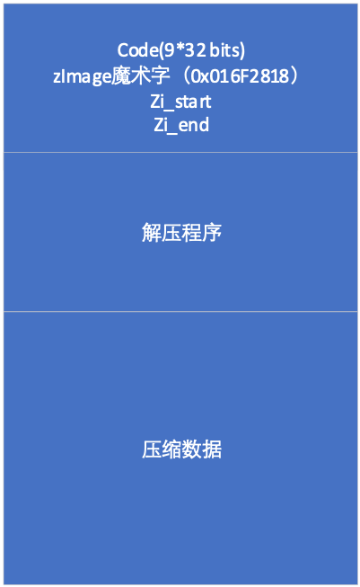
<figcaption><p>图 5‑13 zImage文件格式</p></figcaption>
</figure>
</center>

其中code占36个字节， 魔术字占4个字节，用以标识zImage，对arm
Linux而言，魔术字为0x016F2818，zi_start是zImage的开始地址，zi_end是zImage的结束地址。

一、 单镜像uImage镜像文件格式

利用mkimage把zImage进行U-BOOT封装就形成了uImage。uImage是U-BOOT可以直接导入内存的内核镜像文件，其格式为：

<center>
<figure>
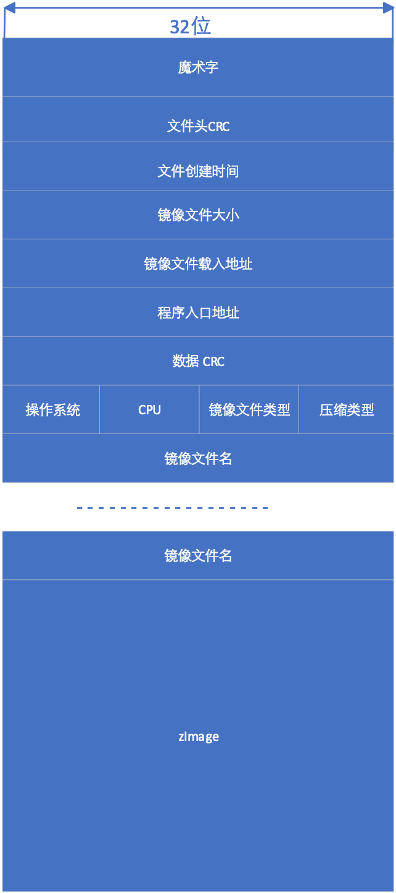
<figcaption><p>图 5‑14 uImage 文件格式</p></figcaption>
</figure>
</center>

文件头包括魔术字、文件头CRC、文件创建时间、镜像文件大小、镜像文件载入地址、程序入口地址、数据(zImage)CRC、操作系统类型标识、CPU类型标识、镜像文件类型、压缩方式及镜像文件名。

魔术字为0x27051956，用于区分uImage格式和FIT格式，文件头CRC是文件的校验码，创建时间为该镜像文件的创建时间，镜像文件大小为zImage字节数，镜像文件载入地址为该镜像文件载入内存时的相对地址，程序入口点为第一条指令的相对地址，数据CRC为zImage的校验码。

操作系统标识用于表示对应的操作系统类型，比如Linux，VxWorks，NetBSD，FreeBSD等，当前的U-BOOT支持28种操作系统或固件。

CPU用于表示该镜像文件所对应的CPU类型，目前支持ARM、power
PC、x86等26种CPU。

镜像文件类型标示该文件的类型，主要有standalone、kernel、Firmware、tee、script、ramdisk、multi等40种类型。

压缩方式标示zImage采用的压缩方式，目前支持无压缩、gzip、bzip2、lzma、lzo和lz4等6种方式。

镜像文件名为该镜像文件的名称，文件名最长不超过32个字符。

二、多镜像uImage文件格式

当镜像文件类型为05(multi)时，该镜像文件可包含多个不同的镜像程序，下图所示的uImage文件包含有内核文件、RAMDISK文件和设备树文件。

<center>
<figure>
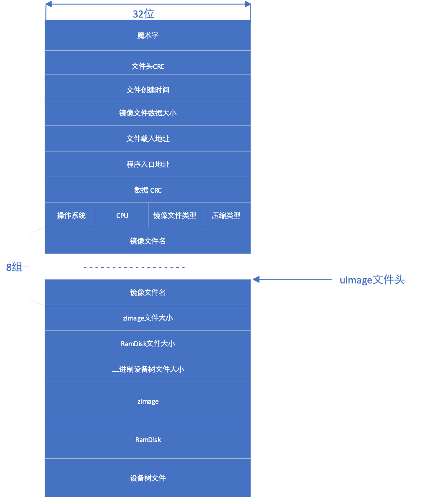
<figcaption><p>图 5‑15 多镜像程序文件结构</p></figcaption>
</figure>
</center>

三、扁平镜像树镜像文件结构

FIT是Flattened Image
Tree的缩写。与设备树结构相同，FIT程序镜像文件来自于描述镜像文件的树形结构文件。树形结构文件可以利用与设备树相同的文本语言进行描述，通过镜像文件里的配置语句确定镜像文件各个部分的使用方法。描述镜像文件结构的文件以its为后缀，
以“/dts-v1/；”开头。树形结构由节点构成，树的顶端是根节点，
以“/”表示。根节点包含镜像文件（images）和配置节点（configurations），以及description和#address-cells属性。description用于说明该镜像程序，#address-cell用于表示该节点地址所用单元（32位）数。U-BOOT利用节点地址访问扁平化后镜像程序的节点内容。Images节点和configurations节点可以有多个子节点，利用地址可以访问各个子节点。

images节点的各个子节点可以是uImage格式的文件，也可以是扁平化设备树文件或RamDisk文件，每个子节点可以包含description、data、type、arch、os、compression、load、entry和hash属性。description用于描述该子节点，data标示该子节点所用二进制文件，type表示该二进制文件的类型，arch说明该二进制适用的处理器结构，os表示操作系统类型，commpression表示该二进制文件使用的压缩方法，load表示二进制文件的载入地址，entry表示程序的入口，hash表示文件采用的校验方法。

configurations可包含多个子节点及default属性，用以定义不同程序镜像的使用方法，如在下面的结构文件中，默认配置使用config@1配置，而config@1的配置规定内核使用kernel@1节点定义的内核，设备树使用节点fdt@1定义的扁平设备树。

```
  /dts-v1/;

    / {

      description = "Marcus FIT test";

      #address-cells = <1>;

      images {

        kernel@1 {

          description = "My default kenel";

          data = /incbin/("./zImage");

          type = "kernel";

          arch = "arm";

          os = "linux";

          compression = "none";

          load = <0x83800000>;

          entry = <0x83800000>;

          hash@1 {

            algo = "md5";

          };

        };

        kernel@2 {

          description = "Rescue image";

          data = /incbin/("./zImage");

          type = "kernel";

          arch = "arm";

          os = "linux";

          compression = "none";

          load = <0x83800000>;

          entry = <0x83800000>;

          hash@1 {

            algo = "crc32";

          };

        };

        fdt@1 {

          description = "FDT for my cool board";

          data = /incbin/("./devicetree.dtb");

          type = "flat_dt";

          arch = "arm";

          compression = "none";

          hash@1 {

            algo = "crc32";

          };

        };

      };

      configurations {

        default = "config@1";

        config@1 {

          description = "Default configuration";

          kernel = "kernel@1";

          fdt = "fdt@1";

        };

        config@2 {

          description = "Rescue configuration";

          kernel = "kernel@2";

          fdt = "fdt@1";

        };

      };

    };
```

根节点可以包含images、configurations子节点。images节点目前支持的属性包括data、data-position、data-offset、data-size、timestamp、description、arch、type、os、compression、entry和load等属性，data属性一般用以标明镜像程序或数据的存储位置。configuration节点支持kernel、ramdisk、fdt、loadble、derfault、setup、fpga、firmware和standalone等属性。此外，fit还支持加密用的hash/signature/key签名节点。key节点可以包含hash、algo、value、u-boot-ignore、signature、required和key-name-hint等属性，cipher节点可以包含cipher和algo属性，cipher和hash节点通常为images子节点的子节点。这些节点用于辨识用户真伪，各个节点的含义从其英文名称便可知晓。

U-BOOT不能够直接使用.its文件，需要利用mkimage把.its文件扁平化成以.itb为后缀的二进制文件，下图给出了利用mkimage扁平化镜像程序树的输入和输出文件。

<center>
<figure>
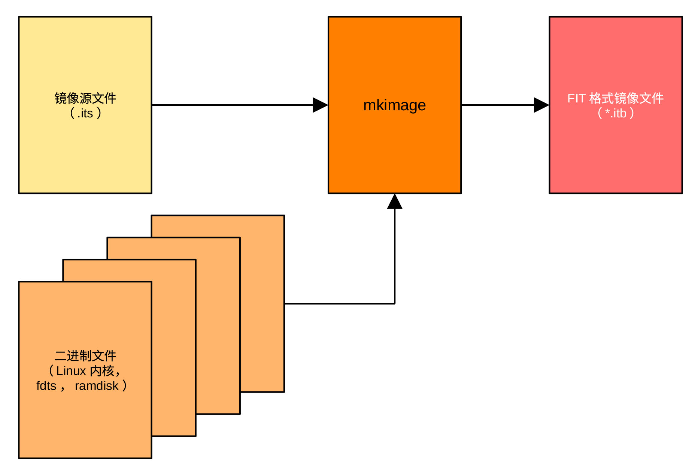
<figcaption><p>图 5‑16 itb文件生成过程</p></figcaption>
</figure>
</center>

下图为最终生成的itb文件头结构。与设备树类似，镜像树结构通过嵌入式结构把镜像树节点的子节点名字嵌入到其父节点，而把保存在字符串的该子节点的属性值及其在字符串块中保存的位置嵌入在该子节点内，程序通过保存位置在字符串块中查找节点属性的值。FIT通过这样的方式表示镜像树结构，详细的语法和结构可以参考设备树规范(Devicetree
Specification)文件。

<center>
<figure>
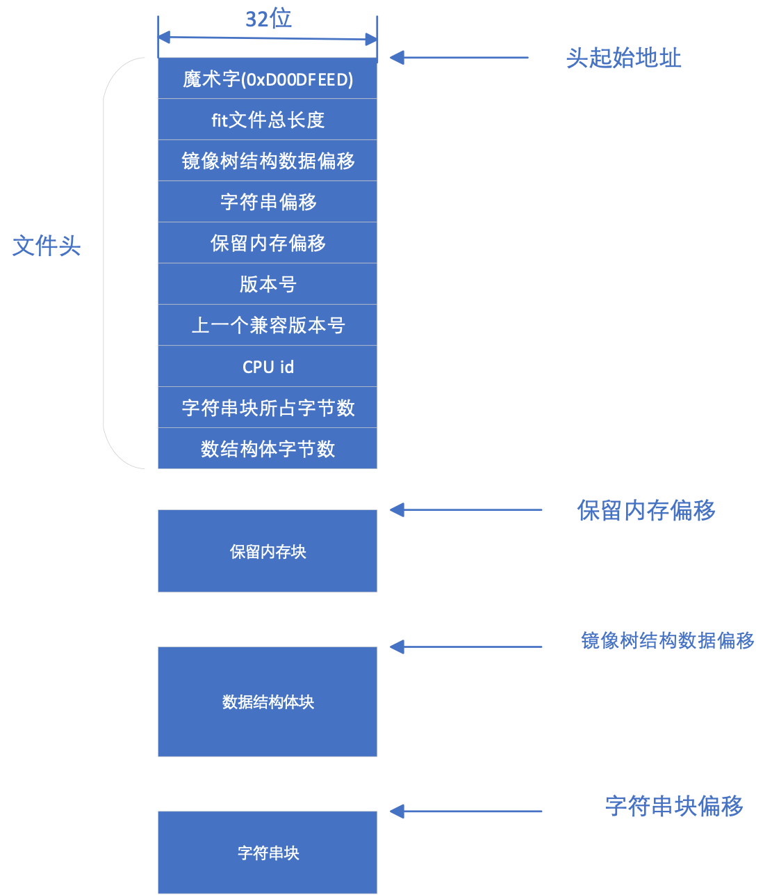
<figcaption><p>图 5‑17 fit文件结构</p></figcaption>
</figure>
</center>

### 通过bootm命令引导Linux程序

在介绍了镜像程序的文件结构之后，接着介绍U-BOOT利用do_bootm引导Linux内核的流程。

do_bootm首先检查令牌中有无包含bootm子命令。如果包含有bootm子命令，则执行bootm的子命令，完成bootm的引导过程。bootm子命令仅完成部分、而非完整的bootm引导过程。子命令包括start、loados、ramdisk、fdt、cmdline、bdt、prep和go八个子命令，其输入顺序必须是上面所列的子命令的顺序。在输入子命令时，不要求输入所有的子命令。bootm命令的格式为bootm
addr arg1
arg2，其中addr是内核在内存存放的地址，通常为uImage的地址，arg1为initrd的地址，arg2为fdt(设备树)地址，如果启动过程不需要initrd，则用“-”代替arg1。在前面介绍的bootcmd脚本中，bootm命令为：bootm
\${tee_addr} – {fdt_addr}，即，bootm 0x20000000 –
0x18000000，也就是从地址0x20000000引导程序，不需要initrd，设备树存在0x18000000处。

如果bootm没有跟随子命令，则需要执行完整的bootm引导过程。在检查完是否有bootm子命令后，如果在编译时选择支持HAB（高可靠引导），则要验证uImage的真伪，如果同时选择支持optee（加密引导），则还要验证zImage的真伪。最后，调用do_bootm_states函数，依次执行BOOTM_STATE_START
、BOOTM_STATE_FINDOS、BOOTM_STATE_FINDOTHER、BOOTM_STATE_LOADOS、BOOTM_STATE_OS_PREP
、
BOOTM_STATE_OS_FAKE_GO、BOOTM_STATE_OS_GO等各条子命令，完成不同的任务。如果采用ramdisk文件系统，则在LOADOS子命令之后执行BOOTM_STAT_RAMDISK，
如果CPU是PPC或MIPS类CPU，则要执行OS_CMDLINE子命令。对imx6
Linux，所需要执行的子命令包括BOOTM_STATE_START
、BOOTM_STATE_FINDOS、BOOTM_STATE_FINDOTHER、BOOTM_STATE_LOADOS等。每一条子命令都对应一个相应的函数，而BOOTM_STATE_OS_PREP
、
BOOTM_STATE_OS_FAKE_GO、BOOTM_STATE_OS_GO与操作系统有关，它们的执行由与操作系统相应的boot_fn()及boot_selected_os()函数完成。

do_bootm()函数的执行过程如下图所示：

<center>
<figure>
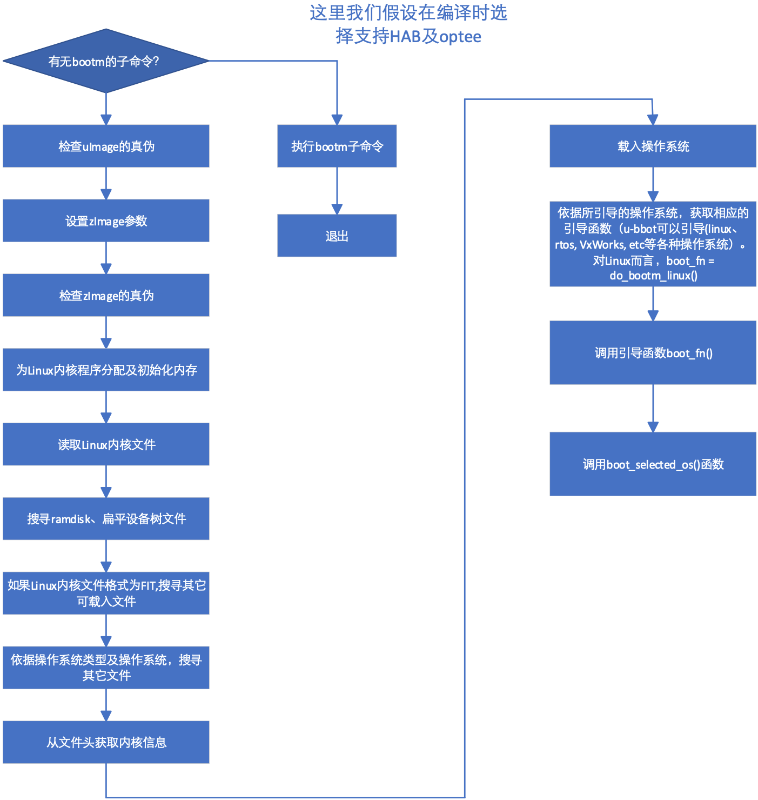
<figcaption><p>图 5‑18 do_bootm()函数流程</p></figcaption>
</figure>
</center>

下面详细介绍各个模块的功能。

1、验证uImage的真伪

对imx6solo/dualLite处理器而言，U-BOOT利用imx6solo/DualLite片上HAB模块中的CAAM加速模块及在IVT上提供的csf数据对uImage进行签名验证及解密操作。uImage的载入地址为U-BOOT环境变量中的tee_addr值。

2、设置zImage参数

从zImage文件头中获取zImage的开始和结束地址。zImage的头由U-BOOT的环境变量loadaddr（zImage的载入地址）指定。

3、验证zImage的真伪

U-BOOT利用imx6solo/DualLite片上HAB模块中的CAAM加速模块及在IVT上提供的csf数据对zImage进行签名验证及解密操作。这里需要指出的是它只对传统镜像文件进行真伪验证，FIT镜像文件指定了自身采用的真伪验证算法。

4、调用do_bootm_states依次进行如下工作：

- 把bootm_header结构成员初始化为0，如果通过设置CONFIG_LMB限制了Linux使用的最低内存，则为LMB分配及初始化内存；

- 在镜像文件中查找内核程序，其流程为：
  
<center>
<figure>
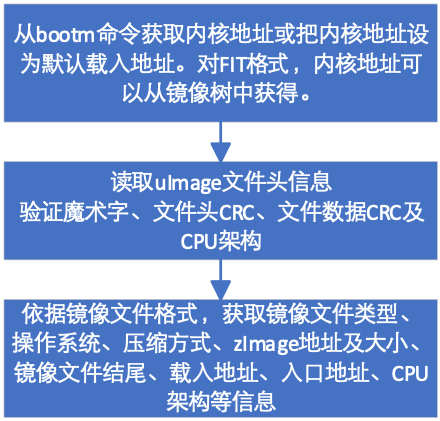
<figcaption><p>图 5‑19 bootm_find_od()函数流程</p></figcaption>
</figure>
</center>

- 查找RamDisk、FDT或其它可加载的镜像程序，下图为支持FIT镜像程序格式时查找RamDisk程序的流程图。当镜像程序格式为传统格式时，查找RamDisk程序的流程要简单许多。此外，若选择支持raw
  initRd，还可以通过bootm命令，利用:分隔符提供initRd程序地址。initRd是bootloader
  导入的Linux文件系统，存储在RAM内，供引导程序引导Linux操作系统用。

<center>
<figure>
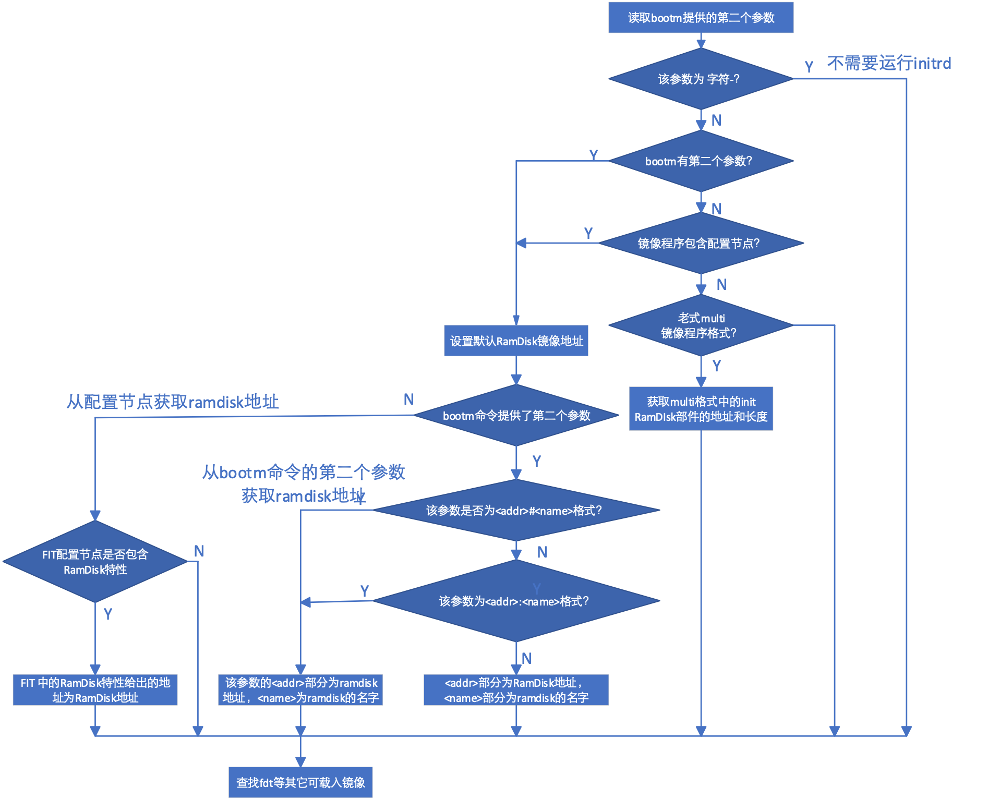
<figcaption><p>图 5‑20 bootm_find_other()函数流程</p></figcaption>
</figure>
</center>

- 把uImage数据解压，解压流程为：

<center>
<figure>
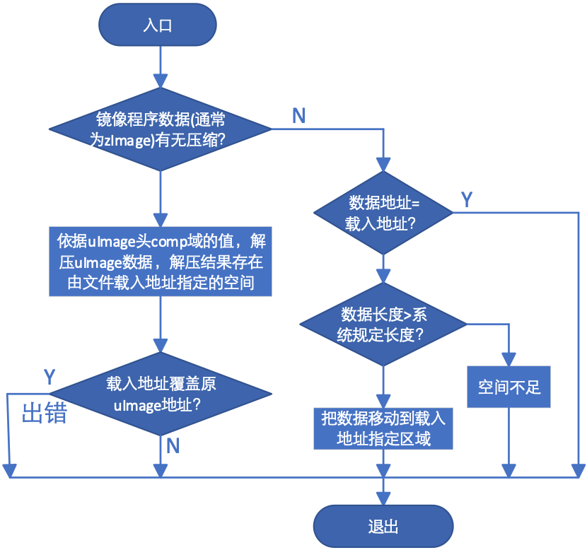
<figcaption><p>图 5‑21 bootm_load_os()函数流程</p></figcaption>
</figure>
</center>

- 依据uImage头中os域（操作系统）的值，通过调用bootm_os_get_boot_func()函数，利用函数指针数组boot_os\[\]获取相应的引导函数指针。当os域的值等于IH_OS_U_BOOT时，引导函数指针指向do_bootm_standalone()函数。当系统不需要运行操作系统时，可以将os的值设为IH_OS_U_BOOT，通过u_boot直接把固件引入内存并执行之。do_bootm_standalone函数的流程为：

<center>
<figure>
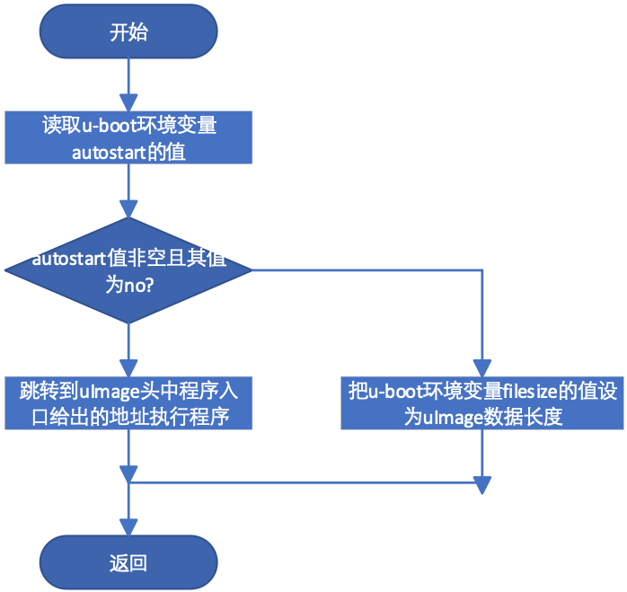
<figcaption><p>图 5‑22 do_bootm_standalone()函数流程</p></figcaption>
</figure>
</center>

当os的值为IH_OS_LINUX时，也就是当os指明uImage数据部分为Linux操作系统时，引导函数指针为do_bootm_linux()函数。最后，do_bootm_states()调用boot_selected_os()函数，通过do_bootm_linux()调用Linux引导函数。对Linux而言，os值应当设置为IH_OS_LINUX。

do_bootm_linux()函数的执行流程为：

<center>
<figure>
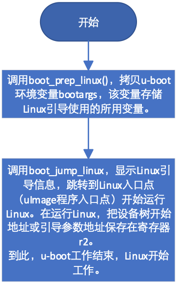
<figcaption><p>图 5‑23 do_bootm_linux()函数流程</p></figcaption>
</figure>
</center>

os值不同，引导的操作系统类型不同。do\_\_bootm_linux()函数在完成引导工作后跳转到entry指定的地址，U-BOOT结束其使命，系统开始由Linux控制。

### spl引导

上面介绍了U-BOOT
proper引导方式，而当CPU片上RAM容量小时，可以采用spl引导方式。片上ROM先把spl拷贝到内存，在spl把系统及DRAM初始化后，由spl把U-BOOT程序导入内存，然后由U-BOOT引导Linux或其它类型的操作系统。从图5-3可知，spl引导方式和proper引导方式最后都跳转到board_init_r()函数。虽然两种方式都调用同样名称的函数，但函数内容并不相同，spl调用的函数定义在git/common/spl/spl.c文件中。若编译时选择支持SPL方式，则使用spl.c文件中的board_init_r()函数。该函数的主要工作是初始化，导入spl镜像文件，然后调用操作系统引导程序。其工作流程为：

<center>
<figure>
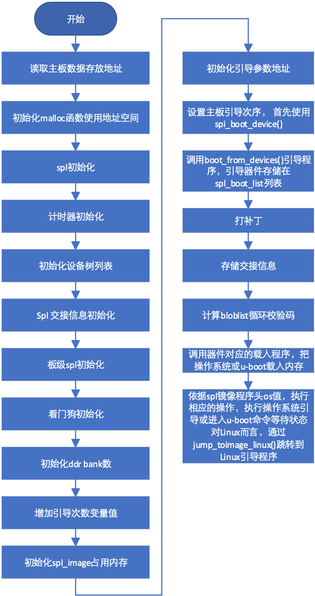
<figcaption><p>图 5‑24 利用spl引导程序流程</p></figcaption>
</figure>
</center>

下面我们将详细介绍各个部分的工作过程及功能。

board_init_r()函数首先清空spl_boot_list列表，该列表用于存储可用引导设备的驱动程序地址。spl_set_bd()函数读取主板参数的存储地址，该存储地址一般由链接程序设定。如果设置了编译开关CONFIG_SYS_SPL_MALLOC_START，则调用mem_malloc_init()设置malloc函数使用的内存起始地址和大小，并将gd-\>flags的GD_FLG_FULL_MALLOC_INIT位置位，表示malloc所用内存已初始化。

CONFIG_SYS_SPL_MALLOC_START 是 U-BOOT
引导加载程序中的一个宏定义，用于指定 SPL阶段中堆的起始地址。
在嵌入式系统启动的早期阶段，片上内存通常非常有限，为了在 SPL
阶段支持动态内存分配（使用 malloc()
函数），需要手动划分出一块内存区域作为堆。该宏明确了 SPL
堆内存基地址的物理位置。

如果gd-\>flags的GD_FLG_SPL_INIT位显示spl还没有初始化，则调用spl_init()函数进行spl必须的一些初始化工作，其流程为：

<center>
<figure>
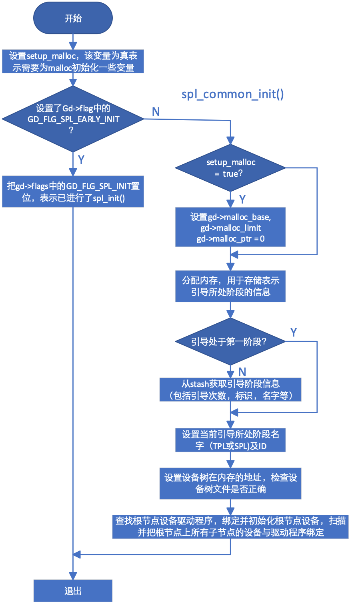
<figcaption><p>图 5‑25 spl_init流程</p></figcaption>
</figure>
</center>

bloblist_init()用于检查CONFIG_BLOBLIST_ADDR处有无bloblist存在，若没有，则新创建一个。bloblist用于存储二进制信息，比如c结构。

setup_spl_handoff()函数用于检查bloblist中是否存在交接(handoff)信息。用户可以通过结构体spl_handoff生成自己的交接清单，向操作系统传递内存布局、重置状态、网卡的MAC地址等信息。

如果在配置编译开关时选择支持板级初始化，用户可以编写自己的spl_board_init()函数，对自己的系统进行特定的初始化操作。

board_init_r()还要初始化看门狗、dram
bank大小，为spl_image结构分配内存并置0。spl_image记录spl引导时必需的信息，结构为：

  struct spl_image_info {

    const char *name;

    u8 os;

    uintptr_t load_addr;

    uintptr_t entry_point;

    void *fdt_addr;

    u32 boot_device;

    u32 size;

    u32 flags;

    void *arg;

    ulong dcrc_data;

    ulong dcrc_length;

    ulong dcrc;

    uint64_t rbindex;

  };

这些信息大部分来自于镜像文件的文件头，.arg = CONFIG_SYS_SPL_ARG_ADDR，由系统设定，而.boot_device设置为无。

board_boot_order()把spl_boot_list的第一项设置为spl_boot_device()函数的地址。board_boot_order()为弱函数，用户可以通过同名函数将其覆盖。对imx6处理器而言，spl_boot_device()函数首先读取引导模式寄存器的值，然后依据引导模式，返回引导器件类型。boot_from_devices()依据spl_boot_list列表次序，依次从.u_boot_list_2_spl_image_loader_1内存段查找与spl_boot_list列表中引导器件匹配的spl_image_loader结构体。该结构包含代表引导器件的代码、器件名称及适用该器件的U-BOOT载入程序地址和程序入口地址。在找到匹配的结构体后，通过spl_load_image()函数调用引导器件对应的载入程序load_image()，尝试把U-BOOT程序载入内存。如果载入失败，重新查找下一个结构体，直到成功或尝试了spl_boot_list中的所有器件。.u_boot_list_2_spl_image_loader_1在链接时建立。

在成功地把镜像文件载入内存后，依据镜像文件头中os域的值，通过不同的函数，跳转到不同的程序入口地址，比如，当系统支持optee时(os值为IH_OS_OPTEE)，
通过spl_optee_enty()函数将系统控制权交于optee，而当os域的值为IH_OS_LINUX时，通过jump_to_image_linux()函数把系统控制权交于Linux引导函数，开始引导Linux。

spl_load_image()在载入镜像文件时，需要器件提供的读入程序。对imx6
mmc器件而言，其读入程序定义在git/common/spl/spl_mmc.c文件中，函数名为spl_mmc_load_image。利用宏定义SPL_LOAD_IMAGE_METHOD("MMC2",
0, BOOT_DEVICE_MMC2,
spl_mmc_load_image)把函数spl_mmc_load_image的地址赋予load_image函数指针。当U-BOOT支持设备树时，load_image()把U-BOOT-dtb.imx载入内存，而当U-BOOT不支持设备树时，load_image()把U-BOOT.imx载入内存。下面我们以spl_mmc_load_image()为例说明spl载入镜像程序的过程。

真正完成程序载入的是函数spl_mmc_load(
)，spl_mmc_load_image()只是依据编译开关选择，为函数spl_mmc_load()选择不同的输入参数。

spl_mmc_load()首先检查指定的mmc器件是否已经初始化。如果没有初始化（mmc为NULL），则通过函数spl_mmc_find_device()获取引导器件的设备ID，依据U-BOOT是否支持设备驱动模型(Driver
Model)，分别调用mmc_init_device()和mmc_initialize()初始化mmc期间。如果已经初始化，则跳过mmc初始化，直接与插入mmc的卡片进行握手。

这里需要指出的是，若用于描述该mmc器件的结构体mmc指明可以提前对该器件初始化，则可以在mmc_init_device()函数中调用mmc_start_init()函数启动mmc初始化过程，采用异步方式初始化该器件。

完成mmc初始化之后，spl_mmc_load()调用mmc_init()，读取卡片标识（CID）和卡片特定数据（CSD），协商传输频率和总线宽度（1-bit,
4-bit 或 8-bit）。

协商成功之后，spl_mmc_load()利用spl_boot_mode()获取该引导器件支持的引导模式。当使用mmc器件是，spl支持三种引导模式，分别为MMCSD_MODE_FS、MMCSD_MODE_EMMCBOOT和MMCSD_MODE_RAW。spl_boot_mode()为弱函数，用户可以编写自己的spl_boot_mode()函数覆盖原函数。

如果启动模式为eMMC 引导分区 (MMCSD_MODE_EMMCBOOT)，则处理 eMMC 特有的
boot0 或 boot1 分区切换，如果MMC驱动程序是
精简版（MMC_TINY），使用简单切换，否则使用标准块设备分区选择。

如果启动模式为原始扇区读取 (MMCSD_MODE_RAW)，优先尝试 OS。这时，如果
spl_start_u-boot() 返回假，尝试直接加载 Linux 内核（Falcon
Mode）。如果spl_start_u-boot()返回值为真，表示系统要加载U-BOOT（加载proper），函数会根据配置，通过不同的函数从指定分区（USE_PARTITION）或绝对扇区地址（USE_SECTOR）读取u-boot程序。

如果系统支持双引导（CONFIG_DUAL_BOOTLOADER
），通过spl_mmc_get_u-boot_raw_sector()函数确定U-BOOT主程序在 MMC
原始扇区中具体起始位置。

如果引导模式为文件系统读取 (MMCSD_MODE_FS)，则会调用
spl_mmc_do_fs_boot。这通常涉及解析 FAT 或 EXT4 文件系统并根据文件名（如
U-BOOT.img）加载。

下图给出了spl_mmc_load_image()把U-BOOT导入内存的流程图。

<center>
<figure>
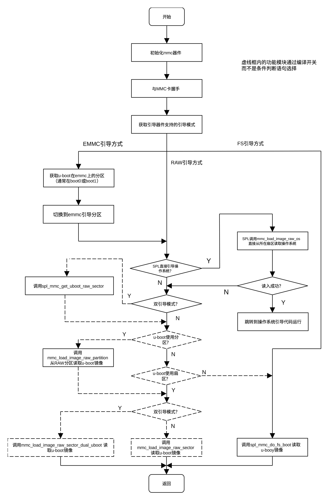
<figcaption><p>图 5‑26 spl导入U-BOOT流程图</p></figcaption>
</figure>
</center>

当spl用于直接引导os时，利用mmc_load_image_raw_os()函数把Linux镜像读入内存，该函数的工作流程为：

<center>
<figure>
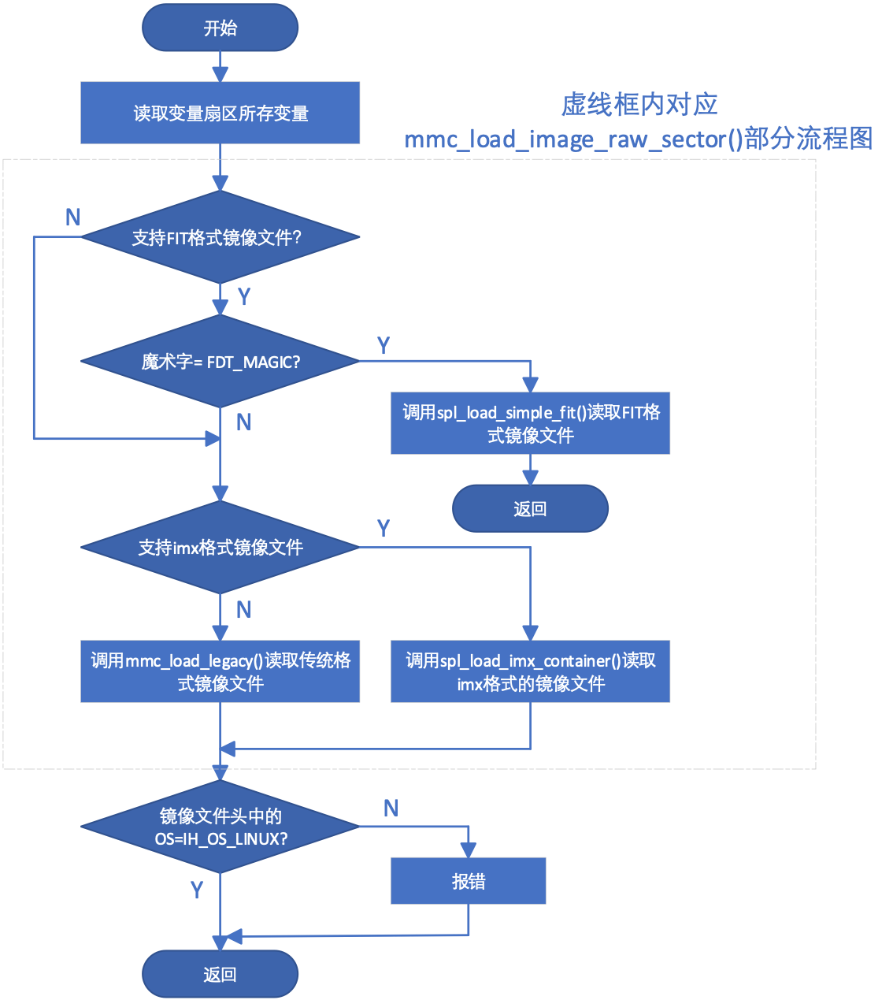
<figcaption><p>图 5‑27 mmc_load_image_raw_os函数流程</p></figcaption>
</figure>
</center>

下面我们以spl_load_simple_fit()函数为例说明spl读入操作系统的流程。

spl_load_simple_fit()有四个参数，分别为指定镜像程序信息的spl_image_info结构体，用于指定设备的spl_load_info结构体，指向所要读取设备扇区的指针及指向设备上镜像文件头的指针。该函数把文件头指针指向的文件头读入spl_image_info结构体内，spl_image_info结构体在上面已经作了介绍，它记录了镜像文件头中的大部分信息，以方便镜像文件的载入及运行。spl_load_info结构体包含必要的引导器件信息，其定义为：

    struct spl_load_info {

      void *dev;

      void *priv;

      int bl_len;

      const char *filename;

      ulong (*read)(struct spl_load_info *load, ulong sector, ulong count, void *buf);

    };

其中dev代表引导器件，priv指向该器件的私有数据，bl_len为该器件读写单位（块）大小。read为指向该器件读函数的函数指针，一般由该器件的驱动程序提供。

spl_load_simple_fit()首先获取fit文件的大小，然后计算所需缓存区地址，并利用驱动程序提供的读函数把整个fit镜像程序读入缓存区。把镜像文件读入缓存区后，查找镜像树上的images节点。找到images节点后，
如果系统支持双引导模式，则在configurations节点查找rbindex属性。如果找到，则把rbindex在镜像文件的偏移量（地址）赋予spl_image结构体的rbindex域。如果系统支持FPGA，spl_load_simple_fit()在images节点中查找fpga子节点，并把fpga节点对应的镜像程序写入FPGA。如果不支持FPGA或fit文件中没有fpga节点，则在镜像程序树上configuration节点查找firmware属性，如果没有找到，则在configuration节点查找kernel属性，如果还没有找到，则在cinfiguration节点查找loadable属性。如果最终没有找到，则操作失败，如果找到，则调用spl_load_fit_image()函数把对应的镜像文件载入或在内存找到相应的位置（如果已经载入），然后把数据解压。其工作流程为：

<center>
<figure>
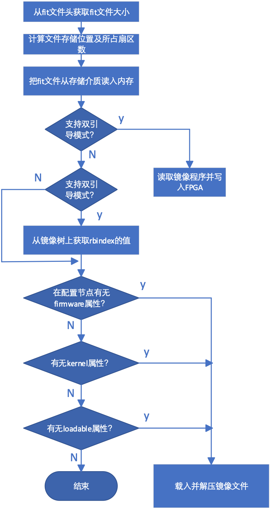
<figcaption><p>图 5‑28 spl_load_simple_fit()函数流程</p></figcaption>
</figure>
</center>

对于Linux系统，在把镜像文件读入内存后，jump_to_image_linux()依据镜像文件头entry域的值，确定程序的入口地址，然后做一些必要的清理工作，最后通过image_entry()函数把machid及spl_image-\>arg传递给操作系统并从entry地址开始执行Linux引导程序。至此，spl结束其使命，导入的镜像程序开始控制系统。
