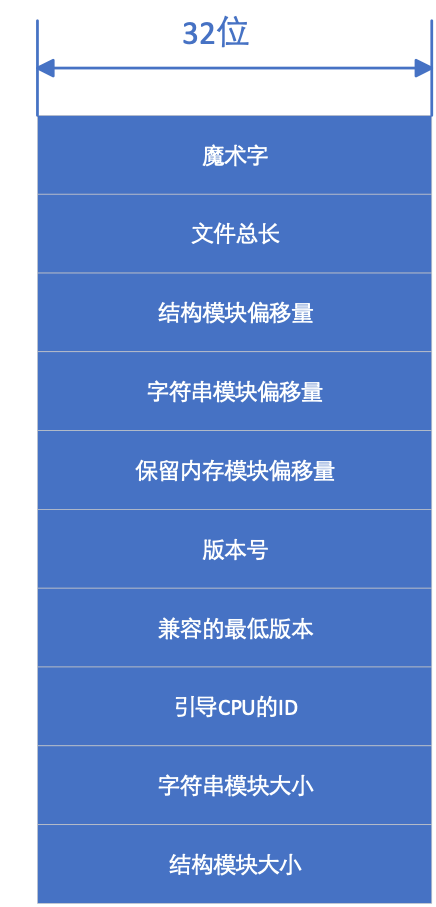
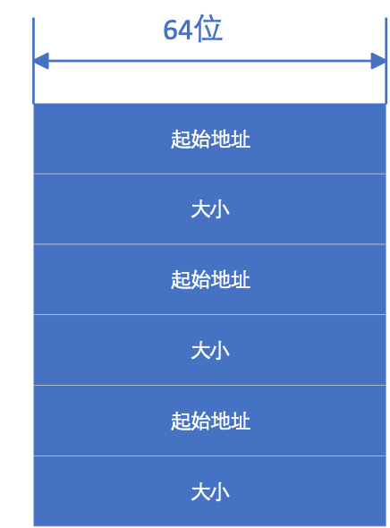
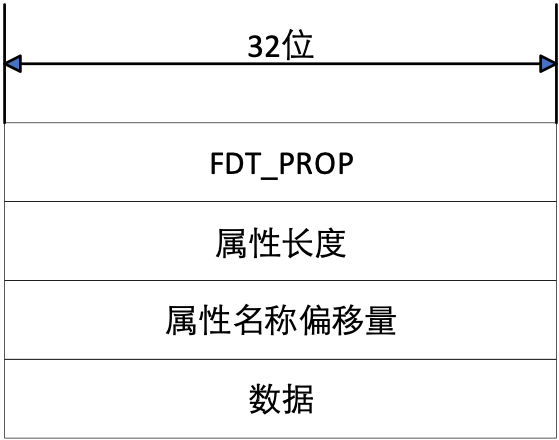
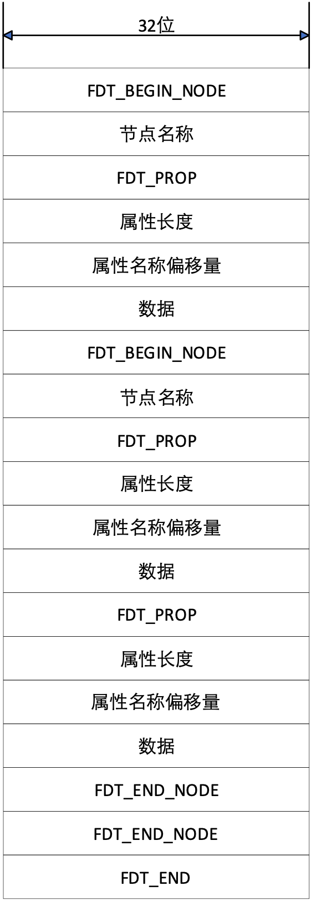

## 扁平化设备树（DTB）格式

设备树本身是文本格式，系统不方便使用，需要利用设备树编译程序dtc将文本文件（dts）转换成二进制文件(dtb)，也就是将dts文件扁平化成所谓的blob文件。在引导过程中，引导程序把blob文件和内核镜像程序文件导入不同区域。设备驱动程序通过访问blob文件确定系统所支持的设备以及该设备的结构和参数，从而能够对设备进行正确的初始化。

DTB文件是一个单一的线性结构文件，由文件头及三个模块构成。三个模块分别为内存保留模块，数据结构模块和字符串模块。内存保留模块用以记录保留的物理内存，为用户提供了指定保留内存空间的手段，以禁止用户程序使用保留内存。结构模块用以记录实际的设备树结构，通过遍历结构模块，程序可以访问设备树的所有节点。字符串模块记录设备树中使用的所有属性的名称，这些名称串接在一起，结构模块通过偏移字符串模块的偏移量访问某一具体属性。

### DTB文件头

DTB文件的文件头由40个字节构成，每4个字节构成文件头的一个单元，具体结构示于下图：

<figure>

<figcaption>
图 3‑2 DTB文件头
</figcaption>
</figure>

魔术字用来标识DTB文件，其值恒为0xD00DFEED，采用大端方式存储。文件总长表示包含文件头在内的DTB文件总长，用字节数表示。结构模块偏移量是结构模块开始位置距离文件头起始位置的字节数，字符串模块偏移量是字符串模块起始位置偏移文件头起始位置的字节数，保留内存模块偏移量是保留内存模块开始位置偏移文件头起始位置的字节数。

版本号表示当前使用的设备树规范版本号，当前版本号为17。兼容的最低版本号为16，低于16的版本不再与当前版本兼容。

引导CPU
ID值指定使用设备树上哪一个CPU节点引导系统，该值等于用于引导系统的CPU节点的reg属性值。

字符串模块大小和结构模块大小用来分别表示字符串模块和结构模块的大小，单位为字节。

### 保留内存模块

该模块内保存了一系列保留内存列表，在设备树上的所有memory-reserved节点都应当包含在保留内存列表中。保留内存模块列表由\<内存地址
内存区块大小\>数组对构成，地址和大小均为64位的无符号整数。下图为具有3个内存保留区域的保留内存模块格式。

<figure>

<figcaption>
图 3‑3 保留内存模块格式
</figcaption>
</figure>

### 结构模块格式

结构模块用以描述设备树本身的结构及其内容，由一系列始于令牌的片段组成。令牌后面可以跟随参数，形式由令牌类型决定。令牌与结构模块首端的距离以字节计算，该偏移量必须是4的倍数。如果令牌起始地址不是4的倍数，则以0填充。

构成结构模块的有FDT_BEGIN_NODE（0x00000001）、FDT_END_NODE（0x00000002）、FDT_PROP（0x00000003）、FDT_NOP（0x00000004）、FDT_END（0x00000009）等五种令牌，每个令牌占用32位。

FDT_BEGIN_NODE标志节点的开始，其后跟随以字符串形式表示的节点名称。如果节点名称后面有节点地址，则在节点名称之后是节点地址。在FDT_BEGIN_NODE之后可以跟随除FDT_END_NODE之外的任何令牌，也就是说，FDT_BEGIN_NODE之后还可以有FDT_BEGIN_NODE，这样就可以通过一个新的FDT_BEGIN_NODE令牌开始一个子节点的描述。DTB文件通过这样的嵌套表示树状的设备树。

FDT_END_NODE标志一个节点描述的结束，FDT_END_NODE令牌后面没有参数，紧随其后的是下一个令牌。

FDT_PROP令牌用于描述一个节点属性，其后跟随两个32位字长的参数，第一个32位数表示FDT_PROP所描述的属性的长度，即数据部分的长度，以字节数表示，第二个32位的参数表示属性名称在字符串模块的偏移量，利用该偏移量，可以在字符串模块找到属性名称。属性值以字节串方式跟随在第二个参数后面，下面给出了属性在内存的存储格式。

<figure>

<figcaption>
图 3‑4 FDT_PROP在DTB的存储格式
</figcaption>
</figure>

FDT_NOP令牌不起作用，可以忽略。

FDT_END令牌标志结构模块的结束，结构模块只能有一个FDT_END令牌，而且必须在结构模块的最后。下图给出了结构模块在内存中的结构。

<figure>

<figcaption>
图 3‑5 结构模块在DTB中的存储格式
</figcaption>
</figure>

Linux采用如下结构体描述FDT_BEGIN_NODE和FDT_PROP。

    struct fdt_node_header {

        fdt32_t tag;

        char name[0];

    };

    struct fdt_property {

        fdt32_t tag;

        fdt32_t len;

        fdt32_t nameoff;

        char data[0];

    };

### 字符串模块

设备树上属性的名称是以空字符结尾的字符串，所有这些以空字符结尾的字符串简单地串接在一起构成字符串模块。存储每个字符串的起始地址必须是4的倍数。
