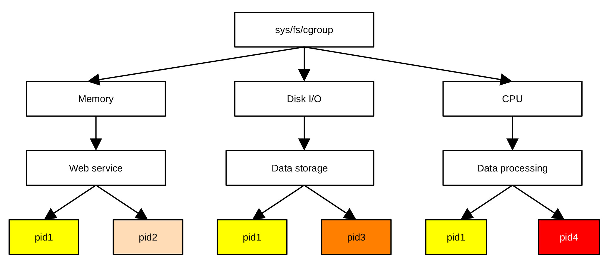
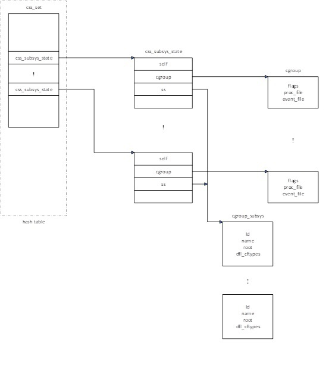

## 控制组早期初始化

控制组（cgroup-controller
group）是Linux中一个比较重要的概念，Linux利用控制组进行资源管理。通过控制组，系统管理员可以设定各个进程使用资源的上限，为不同的进程分配不同的资源使用优先级。控制组资源管理的基本思路就是把资源（如中央处理器，内存，磁盘，外设等）按类别分成多个组，每个组按功能又可以分成多个组。这样依次可以分成更小的单元，从而形成一个树状结构，这个树状结构与下面讲到的控制组文件系统的目录结构一一对应。系统管理员可以把某一进程分配到特定的控制组文件系统组里，从而允许进程使用该组定义的资源。可以把一个进程分配到多个组里，以便进程使用不同的资源，图
7‑2所示为依据第一版cgroup标准实施的一个控制组树状结构示例。

<center>
<figure>

<figcaption><p>图 7‑2 cgroup结构及与进程的关系</p></figcaption>
</figure>
</center>

cgroup资源管理机制定义了三个基本概念，分别为控制组（cgroup）、控制组文件系统（cgroupfs）和子系统（sub-system）。子系统利用控制组和控制组文件系统提供的信息实现对系统资源的管理和调度，我们将以第二版cgroup标准为例介绍控制组资源管理中用到的一些基本概念。

控制组是一组进程或线程的集合，这一组进程使用由同一组控制组文件系统定义的上限或参数。在Linux系统中，控制组以树状结构进行组织，其树状结构与控制组文件系统的树状结构完全一致。系统管理员通过在/sys/fs/cgroup下的子目录里建立、删除及重新命名子目录，可以改变控制组的树状结构。

每个控制组可以是进程的集合，也可以是线程的集合，还可以是多个下一级cgroup的集合。在第一版cgroup标准里，资源管理可以细分到线程，一个线程与其所在的进程可以在不同的cgroup里。这虽然提供了一定的灵活性，但所造成的不便远大于所提供的好处。第二版cgroup标准限定只有不包含进程的控制组才能够利用控制文件控制其子控制组资源的使用，即一个控制组要么完全由下一级控制组组成，要么完全由进程组成，而不能由进程和控制组混合组成，这样的结果就是进程只能位于控制组树状结构的叶子上。

第二版cgroup标准的这些规定虽然降低了管理过程的复杂度，但也失去了某些情况下把管理细分到线程所提供的优势，为此，linux又引进了线程化子树概念。所谓的线程化子树就是控制组树上的一支树杈，其上的节点既可以包含子控制组，也可以包含线程，或二者的组合。线程化子树的根节点为距该树枝最近的，只包含子控制组的节点。在第二版cgroup标准中，把只包含子控制组的节点和只包含进程的节点划归为资源域类（domain），把线程化子树的根节点归为线程化域类（threaded
domain），而把线程化子树上的其它节点归为线程化控制组类。

子系统sub-system也称作资源管理器，是Linux内核模块，用来改变进程的行为，如限定控制组的CPU使用时间，允许控制组占用的内存数量，统计控制组内进程的CPU占用时间，冻结或恢复进程的运行。资源管理器利用控制组的分类功能、以特定方式处理一组任务。通常，每种资源有一个独立的资源控制器。在第一版控制组标准中，每种资源控制器都有自己独立的树状结构，用户需要在资源管理器的树状结构中对单个资源进行调度，为进程使用该资源设置上限。在第二版控制组标准里，控制组与各个资源管理器使用统一的树状结构，这样，用户在控制组文件系统上就可以实现对资源的调度。

ubuntu
Linux定义了18个子系统，即18个资源管理器。下面列出部分经常使用的子系统。

- blkin

> 用以设置块设备的使用上限。

- cpu

> 控制对cpu的使用。

- cpuacct

> 该子系统自动生成控制组中任务使用资源的报告。

- cpuset

> cpu子集，从中为控制组中的特定任务分配cpu及内存结点。

- devices

> 控制器件的使用。

- freezer

> 暂停或恢复控制组中任务的执行。

- memory

> 为控制组中的任务设置内存使用上限，自动生成内存使用统计报告。

- net_cls

> 标示网络数据来源，以便网络控制器知道数据来自哪一个控制组。

- net_prio

> 为网络数据动态设置优先级。

- ns

> 命名空间，通过命名空间对资源进行调度，不同的命名空间，资源调度策略可以完全不同。

cgroupfs为Linux伪文件系统，是linux管理模块的对外接口，系统管理员可以把该文件系统挂载到指定位置。在第一版控制组标准中，各个资源控制器都有其独立的伪文件系统，系统允许把不同资源控制器对应的文件系统挂载到不同位置，而第二版控制组标准要求所有资源控制器使用同一个伪文件系统。对于新版的Linux操作系统，systemd会在引导阶段把该文件系统挂载到/sys/fs/cgroup上，在后续的介绍中，我们会默认该文件系统挂载在/sys/fs/cgroup上。cgroup目录下的每个目录对应控制组树状结构的一个节点。采用第一版控制组标准的资源管理系统，每一个资源管理器在cgroups目录下都有一个相应的子目录，而采用第二版cgroup标准的资源管理系统，其下的子目录不必要一定对应一种资源，而是包含cgroup.controllers和cgroup.subtree_control两个文件，通过这两个文件实现对资源的管理。但在目前的实现中，由于部分资源控制器还不支持第二版控制组标准，为了与第一版控制组标准兼容，sys/fs/cgroup目录里的各个子目录仍然与资源控制器一一对应。利用控制组伪文件系统，管理员可以创建或删除控制组结构树上节点，设定进程的资源使用上限和优先级别，了解各个进程或线程使用资源的状况，实现对进程使用资源的控制。

系统管理员可以在每个子目录下创建新的子目录，从而在控制组结构树上生成一个新的控制组节点，当然也可以从中删除一个目录，因而从树状结构中删除一个控制组节点。每个子目录下可以包含核心控制文件、资源控制文件及资料文件等多种类型的文件。资料文件为只读文件，由系统生成，供系统管理员了解系统资源的使用状况。核心控制文件和资源控制文件为可读写文件，由系统管理员创建或修改，系统利用这些文件对该资源控制器所控制的资源进行调度。用于控制资源使用的文件作用于其子目录对应的进程。

在每个子目录下可以包含核心控制文件和资源控制文件。核心控制文件作用于控制组结构，文件以cgroup命名，文件后缀表示文件的类型，比较重要的文件有cgroup.proc，
cgroup.type，cgroup.thread，cgroup.subtree_control等。cgroup.proc记录该文件所在子目录对应的cgroup包含的所有进程。读该文件可显示当前控制组包含的所有进程，把pid写入该文件即把进程pid划入当前目录对应的控制组。可以通过如下所示方式操作该文件：

- 创建cg1控制组

> \#mkdir /sys/fs/cgroup/cpu/cg1

- 把当前进程划入cg1控制组

> \#echo \$\$ \> /sys/fs/cgroup/cpu/cg1/cgroup.proc

- 显示控制组包含的进程

> \#cat /sys/fs/cgroup/cpu/cg1/cgroup.proc

cgroup.type为该子目录对应的控制组的类型，控制组的类型可以为资源域（domain）、线程化域（threaded
domain）、线程化控制组（threaded）或非法域（invalid
domain）。前三种类型为在介绍控制组概念时提到的控制组类型，最后一种类型为过渡类型，用于创建线程化子树过程中的临时类型，表示该控制组还处于非法状态。处于非法状态的控制组不能包含进程，也不能进行资源控制，只有把其转换为合法类型才可以包含进程。使用非法域的目的是为了以后能够扩充线程化控制组概念。

可以通过如下命令设置或改变控制组类型：

- 把cg1控制组定义为线程化控制组

> \#echo threaded \> /sys/fs/cgroup/cpu/cg1/cgroup.type

- 把cg1控制组定义为资源域类控制组

> \#echo domain \> /sys/fs/cgroup/cpu/cg1/cgroup.type

- 把cg1定义为线程化控制组

> \#echo threaded domain \> /sys/fs/cgroup/cpu/cg1/cgroup.type

cgroup.threads文件记录文件所对应的控制组包含的所有线程标识代码tid。把线程归于一个控制组的方法是把线程标识代码写入相应的cgroup.threads文件，从文件中把一个线程的标识码删除就会把线程从控制组移出。

cgroup.controllers文件为只读文件，该文件罗列所在控制组使用的资源控制器，这些控制器必须来自于其父控制组。

cgroup.subtree_control记录控制组真正启用的资源控制器，所含控制器是cgroup.controller的子集，即控制组只能从其cgroup.controllers文件罗列的控制器中启用资源控制器。下例给出了利用文件cgroup.sub_control启用和禁用资源控制器的方法。

- 创建一个新的控制组

> \#mkdir /sys/fs/cgroup/mycgroup

- 在该控制组添加pids，cpu和memory资源控制器

> \#echo ‘+pids +cpu +memory’\>
> /sys/fs/cgroup/mycgroup/cgroup.subtree_control

- 在mycgroup控制组禁用pids控制器

> \#echo ‘-pids’ \> /sys/fs/cgroup/mycgroup/cgroup.subtree_control

除去上面介绍的核心控制文件外，每个控制组还包含cgroup.events，cgroup.max.descendants，cgroup.max.depth，cgroup.stat，cgroup.freeze，cgroup.kill，cgroup.pressure及irq.pressure等核心控制文件，有兴趣的读者可以参考相应的Linux的cgroup用户手册。

除根目录cgroup外，每个子目录里还包含用于各种资源控制的资源控制接口文件。接口文件的命名格式一般为资源.参数，如用于调节cpu时钟周期分配的资源控制器cpu所用的控制接口文件有cpu.stat，cpu.weight.nice，cpu.max，cpu.max.burst，cpu.pressure，cpu.idle等九个控制文件，用于内存资源管理的接口文件有memory.current，memory.min，memory.low，memory.high，memory.max，memory.reclaim，memory.oom.group等二十一个控制文件。这些文件有些用来显示内存使用过程数据统计，大部分用来设定控制组使用内存的限定参数。一般情况下，一个文件设置一个参数，如：

\#echo “2M” \> /sys/fs/cgroup/mycgroup/memory.min

为mycgroup控制组设置最小内存保障限制，当控制组使用内存小于2M
字节时，在何种情况下都不会释放内存。

不同的资源控制器所用的控制参数不同，控制接口文件的个数也不相同，详细情况可以参考cgroup用户手册。

在实现cgroup资源管理机制的代码中，利用了struct cgroup、struct
cgroup_root、struct cgroup_subsys、struct
cgroup_subsys_state等不同的数据结构。cgroup结构体用于描述控制组的树状结构，结构树上的每个节点对应一个cgroup结构体，控制组内的所有进程或线程使用同样的资源及配置参数。结构体cgroup定义在文件git/include/linux/cgroup-defs.h文件里，主要包括描述与节点自身关联的各子控制系统状态，控制组所在树的根节点，节点所在层级，树的最大深度，节点包含的各种类型的孩子个数，启用的资源控制器及控制资源控制器启用和禁用的掩码，指向各种控制器状态的指针数组，与节点对应的系统文件节点，与节点关联的所有子系统状态链表等。

描述根节点的数据结构为struct
cgroup_root，定义在文件git/include/linux/cgroup-defs.h中，主要包含对应根节点的、利用结构体struct
kernfs_root描述的伪文件系统的根节点kf_root、控制子系统启用或禁用的子系统掩码subsys_mask、定义根节点自身struct
cgroup结构体的cgrp、保存各种资源管理器根节点的链表（适用于第一版cgroup标准）等。

用于定义不同类型资源调度子系统的结构体struct
cgroup_subsys定义在文件git/include/linux
/cgroup-defs.h里，主要包括控制资源的各种控制函数、资源控制器的根节点root、资源名称name、系统默认启用的子系统标志位implicit_on_dfl、控制组是否为线程化控制组的标志位threaded、管理资源的控制文件类型列表cfts及默认控制文件类型dfl_cfts等不同的字段。

struct
cgroup_subsys_state描述与控制组关联的各个子系统状态。与控制树各个节点关联的子系统状态结构体形成一棵与控制组树状结构完全对应的子系统状态树，每个子系统状态树节点对应控制树上的一个节点，资源控制器主要利用该数据结构进行资源调节。子系统状态结构体主要包括指向与之对应的控制组的指针、指向资源调度子系统的指针、状态树节点的父节点、姊妹节点链表及孩子节点链表等。

cgroup_init_early()函数的作用是创建一个默认的cgroup根节点，初始化根节点的根节点链表，设置初始化任务中的cgroup任务，即把init_css_set的地址赋予初始化任务init_task的cgroup指针。初始化任务由init_css_set定义，init_css_set的定义为：

```
struct css_set init_css_set = {

.refcount = REFCOUNT_INIT(1),

.dom_cset = &init_css_set,

.tasks = LIST_HEAD_INIT(init_css_set.tasks),

.mg_tasks = LIST_HEAD_INIT(init_css_set.mg_tasks),

.dying_tasks = LIST_HEAD_INIT(init_css_set.dying_tasks),

.task_iters = LIST_HEAD_INIT(init_css_set.task_iters),

.threaded_csets = LIST_HEAD_INIT(init_css_set.threaded_csets),

.cgrp_links = LIST_HEAD_INIT(init_css_set.cgrp_links),

.mg_preload_node = LIST_HEAD_INIT(init_css_set.mg_preload_node),

.mg_node = LIST_HEAD_INIT(init_css_set.mg_node),

.dfl_cgrp = &cgrp_dfl_root.cgrp,

};
```

其作用是为处于不同处理阶段的任务链表设置表头，处于不同处理阶段的任务会放在不同的链表。

结构体css_set为资源管理过程所需数据的集合，包含各个子系统状态的集合，与之关联的控制组，各种任务链表等。如果节点为资源域或线程化的资源域，该结构体还包括利用该资源域的所有节点列表。此外，为了能够把一个进程或线程从一个控制组迁移到另一个控制组，该结构体还记录迁移时的源节点和目的节点的信息。使用该结构体的目的不是为了资源管理本身，而是为了节省系统运行过程中任务结构体的存储空间，加速进程的复刻和退出（fork()/exit()）速度。当一个任务需要复刻或退出时，只需简单地把该结构体的refcount域加一或减一，然后一个简单的链表项插入或删除，不需要创建或拷贝大量的数据。Linux的各个任务通过自己的css_set访问子系统状态及各个控制组对应的cgroup结构体数据。

除了创建默认的控制组根节点外，cgroup_init_early()函数还检查子系统是否合法，为Linux支持的子系统命名及编号。如果子系统要求早期初始化（由结构体cgroup_subsys的early_init标志位决定），则调用子系统初始化程序初始化对应的子系统。

早期初始化子系统的主要工作是设置描述子系统的数据结构体（struct
cgroup_subsys）中的各个域的值，主要包括把子系统状态标号置为0，设置子系统控制组文件链表头，把结构体中根域的值置为默认的控制组根节点，为子系统创建子系统状态结构体(struct
cgroup_subsys_state)并把该结构体的标识号置为1，最后，把所创建的子系统状态结构体记录到子系统状态集中。

css_set、cgroup_subsys_state和cgroup三种结构体共同解决了哪个进程属于哪个控制组，并受哪些子系统限制的问题。cgroup代表内核中的一个
cgroup 目录。它负责把
CPU、内存等资源控制器组织成树状结构。cgroup_subsys_state是状态载体，它是具体某个子系统在某个
cgroup 节点上的资源限制状况，每个 cgroup 节点都有一组 css
指针。css_set是进程（task_struct）与 cgroup
之间的桥梁。一个进程会同时属于多个不同子系统的
cgroup，为了性能，内核不让每个进程直接指向多个 cgroup，而是指向一个
css_set。如果两个进程所属的各子系统控制组完全一样，它们就共享同一个
css_set。它们之间的关系示于图
7‑3，其中css_set包含一个cgroup_subsys_state指针数组，指针数组中的每一个指针指向一个cgroup_subsys_state结构体，cgroup_subsys_state中的指针cgroup指向一个cgroup结构体。

<center>
<figure>

<figcaption><p>图 7‑3 cgroup中几种结构体的关系</p></figcaption>
</figure>
</center>

目前，Linux最多支持13个子系统，定义在include/linux/cgruop_subsys.h中，包括cpuset、cpu、cpuacct、io、memory、devices、freezer、net_cls、perf_event、net_prio、hugetlb、pids、rdma、debug等，具体支持哪些子系统，由Linux系统开发人员或程序编译人员在编译过程中通过编译开关选择。