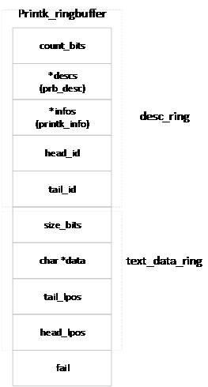
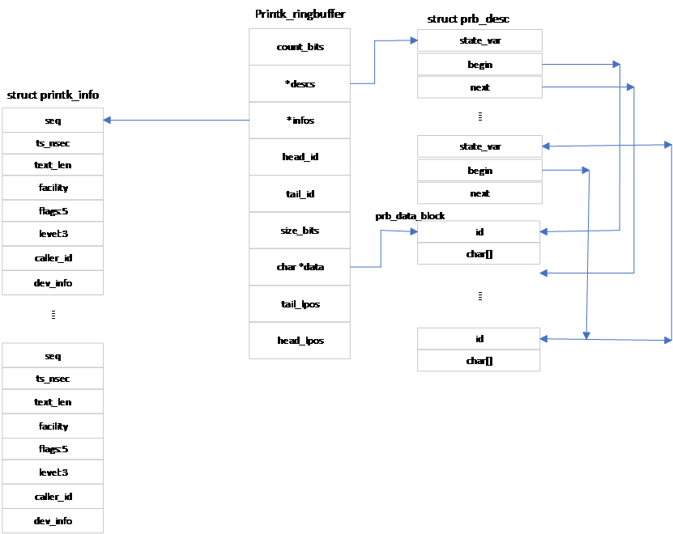
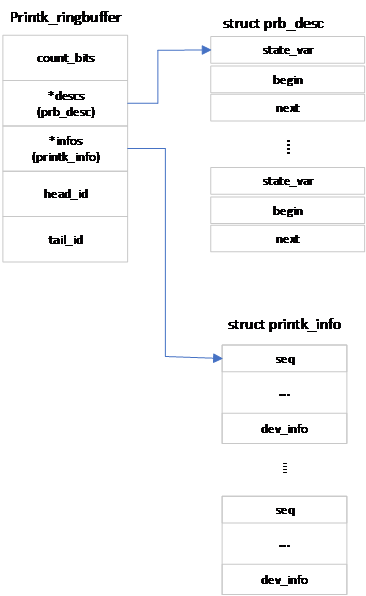

## 日志缓存区设置

在引导阶段，系统还没有完成初始化，也没有载入驱动程序，无法通过驱动程序进行信息列表。在引导阶段需要报告引导进程，打印出错信息，提供调试结果。为此，Linux内核提供了printk函数，以进行简单的信息列表功能，显示引导阶段的各种信息。

Linux在引导阶段使用循环队列存储待显示信息。内核提供了队列移动、读出、写入、空间分配等各种功能，供printk()函数使用。下面简单地介绍循环队列的结构及各种操作，以了解日志缓冲区初始化过程。

### 环形队列

Linux内核使用定义为：

```
struct printk_ringbuffer {
	struct prb_desc_ring	desc_ring;
	struct prb_data_ring	text_data_ring;
	atomic_long_t		fail;
};
```

的结构体描述供printk函数使用的环形列表，它定义了环形队列的头部结构。结构体desc_ring定义了描述环形队列，用于描述数据。结构体
text_data_ring为数据环形队列，用于存储待打印数据。fail表示读写错误次数。

环形队列可用图 14‑1表示：
<center>
<figure>

<figcaption><p>图 14‑1环形队列头部结构</p></figcaption>
</figure>
</center>

整个环形队列可用图 14‑2表示。

<center>
<figure>

<figcaption><p>图 14‑2环形队列整体结构</p></figcaption>
</figure>
</center>

#### 描述环形队列

描述环形队列的元素类型为：

```
struct prb_desc_ring {
	unsigned int			count_bits;
	struct prb_desc		*descs;
	struct printk_info		*infos;
	atomic_long_t		head_id;
	atomic_long_t		tail_id; 
};
```

其中count_bits用于定义descs数组的大小，即访问descs数组元素索引值的位数。descs数组的大小为：DESC_COUNT = 2<sup>count_bits</sup>。descs为类型为struct prb_desc的数组，Linux以环形队列方式访问该数组。数组的每个元素对应一个数据，指明数据的起始位置、终止位置及数据的状态。infos数组用于存储数据的其它信息。它的元素与descs的元素一一对应，相同索引值对应的元素描述同一个数据。head_id表示最新写入descs数组的逻辑索引值。tail_id是最早写入descs数组的逻辑索引值。

descs数组的类型为：

    struct prb_desc {

        atomic_long_t state_var;

        struct prb_data_blk_lpos text_blk_lpos;

    };

其中state_var的高两位为状态位，用于该desc数组的状态。状态可取值为desc_resuable，desc_reserved，desc_commited和desc_finialized，分别代表空间空闲、空间已经被某个写入程序占用、写入程序已在空间写入数据但数据还不可用。数据内容可供读出程序读取。

数据状态的定义为：

```
enum desc_state {
	desc_miss		=  -1,		/* ID mismatch (pseudo state) */
	desc_reserved	= 0x0,		/* reserved, in use by writer */
	desc_committed	= 0x1,		/* committed by writer, could get reopened */
	desc_finalized	= 0x2,		/* committed, no further modification allowed */
	desc_reusable	= 0x3,		/* free, not yet used by any writer */
};
```

其中desc_miss没有保存在变量state_var，它只是表示一种在描述环形列表中找不到对应描述的一种状态。

state_var的其它位代表该描述的逻辑标号，标号的范围远大于环形列表的大小。逻辑标号经descs数组大小取模后即为该模块的索引值，即`index = ((state_var <<2)>>2)%DESC_COUNT`。逻辑标号也同时保存在与之相对应的数据的最开始。

text_blk_lpos的类型为：

```
struct prb_data_blk_lpos {

    unsigned long begin;

    unsigned long next;

};
```

begin表示该模块对应的数据的起始位置。next表示下一个数据的起始位置。通过begin和next就可以确定该模块所描述的数据的位置和大小。

infos是用来描述与与之相应的数据的其它信息，其定义为：

```
struct printk_info {
	u64	seq;				/* sequence number */
	u64	ts_nsec;			/* timestamp in nanoseconds */
	u16	text_len;			/* length of text message */
	u8	facility;			/* syslog facility */
	u8	flags:5;			/* internal record flags */
	u8	level:3;			/* syslog level */
	u32	caller_id;			/* thread id or processor id */
	struct dev_printk_info	dev_info;
};
```

其中最主要的字段是序列号seq及日志级别level。序列号用于访问该环形列表，用户可以利用日志级别选择要显示的内容。

在第一次使用时，infos列表中索引值为0的元素的序列号为0，其余的各个元素的序列号与其索引值相同。由于该序列为环形序列，其中的各个元素均会被重复多次使用。当再次使用一个元素时，其序列号都要在现有序列号的基础上加DESC_COUNT。

描述环形队列可用下图表示。

<center>
<figure>

<figcaption><p>图 14‑3描述环形队列</p></figcaption>
</figure>
</center>

#### 数据环形队列

数据环形队列用于保存待显示信息。队列中元素的类型为：

```
struct prb_data_ring {

    unsigned int size_bits;

    char *data;

    atomic_long_t head_lpos;

    atomic_long_t tail_lpos;

};
```

size_bits表示访问该队列元素的索引值所占位数。队列数组data为字符数组，大小为DATA_SIZE =2<sup>size_bits</sup>，保存实际数据。该数组同样作为环形队列使用，索引值为:

data_index = lpos%DATA_SIZE

lpos为数据的逻辑地址，地址范围远大于DATA_SIZE。

### 环形队列操作

Linux提供了用于操作环形队列的各种函数。函数prb_init(struct
printk_ringbuffer \*rb, char \*text_buf, unsigned int textbits, struct
prb_desc \*descs, unsigned int descbits, struct printk_info
\*infos)用于初始化环形队列rb，其中text_buf、descs、infos为提供给环形队列的外部缓冲区，分别用作数据环形队列、descs数组和infos数组，descbits为descs数组索引值占用的位数，textbits为数据队列中data数组索引值占用的位数。该函数使用指针text_buf、descs和infos初始化rb的相应字段，并用descbits设置descs和infos环形队列的初始值，用textbits设置环形数据队列的初始值。

在建立环形队列之后，就可以对环形队列进行读写操作。在写入已有的环形队列rb之前，首先要定义一个类型为：

```
struct printk_record {

    struct printk_info *info;

    char *text_buf;

    unsigned int text_buf_size;

}
```

的变量r，并利用函数prb_rec_init_wr(&r, len)把其中的text_buf_size设置为所需缓冲区的大小len。函数prb_rec_init_wr()的定义为：

```
void prb_rec_init_wr(struct printk_record *r, unsigned int text_buf_size)
{
	r->info = NULL;
	r->text_buf = NULL;
	r->text_buf_size = text_buf_size;
}
```

由上述代码可见，该函数的作用是指定写缓存区的大小，即初始化类型为struct
printk_record变量r的text_buf_size字段。

在初始化变量r后，通过调用函数prb_reserve(struct prb_reserved_entry \*e,
struct printk_ringbuffer \*rb, struct printk_record \*r)在环形队列rb中为调用程序创建环形描述队列和环形数据队列保留空间，并把所创建的模块描述队列元素中的infos指针和数据元素中的data指针分别赋予变量r的info字段和text_buf字段。函数prb_reserve()把所创建的环形队列的其它数据，保存在类型为struct
prb_reserved_entry的变量e中。其中包括指向该环形队列的指针rb、创建的描述队列的逻辑标号id、以及数据占用的内存空间大小等。在完成上述工作后，通过把数据写入变量r的缓存区域就可以实现对环形队列的写操作。

内核还提供了函数add_to_rb(struct printk_ringbuffer \*rb, struct
printk_record \*r)。该函数通过调用函数prb_rec_init_wr()、prb_reserve()等，创建描述元素和数据元素，并把由变量r.info和r.text_buf指向的各种数据拷贝到由prb_reserve()在环形队列中保留的相应空间，然后调用函数prb_final_commit()将数据的状态转换为数据可读，最后返回数据占用的空间大小。

在读取一个环形队列时，同样需要首先定义一个类型为struct
printk_record的变量。与写入操作不同的是在读入前，首先需要分配两个缓存区，分别用于保存环形队列中数据队列和描述队列的数据。在读环形队列之前，需要用这两个缓存区的地址及数据的大小初始化变量环形队列r。初始化变量的函数为：

```
void prb_rec_init_rd(struct printk_record *r, struct printk_info *info, char *text_buf, unsigned int text_buf_size)
{
	r->info = info;
	r->text_buf = text_buf;
	r->text_buf_size = text_buf_size;
}
```

指针info指向用于保存描述队列数据的缓存区。text_buf指向用于保存数据队列数据的缓存区。text_buf_size为数据队列缓存区的大小。

在初始化变量r后，通过读取变量r中不同指针指向的地址的内容，就可以实现环形队列数据和info信息的读取。

Linux内核还提供了显示内容更新、为额外的cpu增加日志缓存区、环形队列内容合法性检查、环形队列读取、数据状态读取、逻辑索引值和逻辑位置（id与lpos）与数组下标的转换等函数。这些函数定义在文件git/kernel/printk/printk_ringbuffer.h与git/kernel/printk/printk_ringbuffer.c文件中。需要的读者可以阅读其中的代码。

### 数据的状态切换

在前面我们提到，desc数组状态描述中的state_var的最高两位保存了数据队列相应元素的状态。可以通过函数desc_read()读取队列元素的state_var状态值，队列元素由逻辑索引指定。当在描述环形队列中找不到与逻辑索引相应的队列元素时，函数返回desc_miss状态。

数据的实际状态有desc_reusable、desc_reserved、desc_commited和desc_finialized等4种。在初始化时，所有的数据状态均为desc_resuable。写程序通过调用函数prb_reserve()函数，在环形队列中保留内存空间。描述队列从head_id+1开始查找可用空间。当head_id与tail_id之间的距离达到数组大小后，prb_reserve()函数会移动环形队列的尾端位置，释放原尾端占用的空间。当程序在描述队列成功保留空间后，会释放相应的数据元素在数据队列占用的空间。在数据队列中保留空间由函数data_alloc()完成。该函数从数据队列的begin_lpos开始，查找可用空间。在保留数据空间后，data_alloc()把与之相应的描述队列元素作废，并移动tail_lpos，保证整个数据数组内容有效。在成功保留内存空间后，数据队列中相应元素状态会从desc_resuable切换为desc_reserved。prb_reserve()只能从状态为desc_resuable的模块保留内存。在保留内存空间后，写程序可以开始向环形队列写入数据。数据写入结束后，通过调用函数prb_commit()函数把数据中相应元素状态切换为desc_comitted。如果确定数据写入结束，可以调用函数prb_final_commit()函数直接把状态从desc_reserved转换为desc_final。

数据状态的切换规则为：desc_reusable只能切换为desc_reserved，desc_reserved可以切换为desc_committed或desc_final，desc_comitted只能切换为desc_final，而desc_final只能切换为desc_resuable，也就是说，保留空间只能从状态为desc_resuable的队列元素中选择。要写入环形队列之前，必须先保留内存。只有状态为desc_final的元素才能够被作废。

### 日志缓存区的初始化

函数printk使用两类环形队列，一类为动态环形队列，另一类为动态环形队列。在引导初期，printk使用动态队列，在使用的时候动态地建立。静态队列在引导后期及引导完成后使用，通过宏定义_DEFINE_PRINTKRB(name,
descbits, avgtextbits,
text_buf)声明及定义。宏定义中name为环形队列名称，descbits为描述队列元素索引值的位数，avgtextbits为数据队列元素索引值的位数，text_buf为提供给环形队列的外部缓冲区，供数据队列存储数据。

定义环形队列的宏定义为：

```
#define _DEFINE_PRINTKRB(name, descbits, avgtextbits, text_buf)			\
static struct prb_desc _##name##_descs[_DESCS_COUNT(descbits)] = {		\
	[_DESCS_COUNT(descbits) - 1] = {			\
		.state_var	= ATOMIC_INIT(DESC0_SV(descbits)),	\
		.text_blk_lpos	= FAILED_BLK_LPOS,				\
	},												\
};													\
static struct printk_info _##name##_infos[_DESCS_COUNT(descbits)] = {		\
	[0] = {											\
		.seq = -(u64)_DESCS_COUNT(descbits),		\
	},												\
	[_DESCS_COUNT(descbits) - 1] = {				\
		.seq = 0,									\
	},												\
};													\
static struct printk_ringbuffer name = {			\
	.desc_ring = {									\
		.count_bits	= descbits,						\
		.descs		= &_##name##_descs[0],			\
		.infos		= &_##name##_infos[0],				\
		.head_id		= ATOMIC_INIT(DESC0_ID(descbits)),		\
		.tail_id		= ATOMIC_INIT(DESC0_ID(descbits)),		\
	},												\
	.text_data_ring = {										\
		.size_bits	= (avgtextbits) + (descbits),					\
		.data		= text_buf,								\
		.head_lpos	= ATOMIC_LONG_INIT(BLK0_LPOS((avgtextbits) + (descbits))),	\
		.tail_lpos	= ATOMIC_LONG_INIT(BLK0_LPOS((avgtextbits) + (descbits))),	\
	},														\
	.fail			= ATOMIC_LONG_INIT(0),							\
}
```

该宏定义声明了名为name（name为使用者选择的字符串）的环形队列，同时声明了大小为2<sup>descbit</sup>的name_desc数组和name_infos数组作为描述环形队列的descs数组和infos数组。数据环形队列的data数据使用外部提供的text_buf。描述队列的head_id、tail_id及seq均设为默认值。数据环形队列的head_lpos及tail_lpos也设为默认值（默认值为0或-1）。

printk使用的环形队列为printk_rb_static，由`_DEFINE_PRINTKRB(printk_rb_static,
CONFIG_LOG_BUF_SHIFT - PRB_AVGBITS, PRB_AVGBITS,
&__log_buf[0])`定义。定义中的数据队列使用日志缓冲区\_\_log_buf，为一个全局数组变量。

宏定义_DEFINE_PRINTKRB()只是简单地对环形队列printk_rb_static进行初始化。在printk()函数使用该队列之前，还需要进行额外的设置。start_kernel()函数通过调用函数setup_log_buf(0)设置日志缓冲区。函数setup_log_buf(int
early)定义在文件git/include/linux/printk.h和git/kernel/printk/printk.c文件中，其定义为

```
void __init setup_log_buf(int early)
{
	struct printk_info *new_infos;
	unsigned int new_descs_count;
	struct prb_desc *new_descs;
	struct printk_info info;
	struct printk_record r;
	size_t new_descs_size;
	size_t new_infos_size;
	unsigned long flags;
	char *new_log_buf;
	unsigned int free;
	u64 seq;

	if (!early)
		set_percpu_data_ready();
	if (log_buf != __log_buf)
		return;
	if (!early && !new_log_buf_len)
		log_buf_add_cpu();
	if (!new_log_buf_len)
		return;
	new_descs_count = new_log_buf_len >> PRB_AVGBITS;
	if (new_descs_count == 0) {
		pr_err("new_log_buf_len: %lu too small\n", new_log_buf_len);
		return;
	}
	new_log_buf = memblock_alloc(new_log_buf_len, LOG_ALIGN);
	if (unlikely(!new_log_buf)) {
		pr_err("log_buf_len: %lu text bytes not available\n", new_log_buf_len);
		return;
	}
	new_descs_size = new_descs_count * sizeof(struct prb_desc);
	new_descs = memblock_alloc(new_descs_size, LOG_ALIGN);
	if (unlikely(!new_descs)) {
		pr_err("log_buf_len: %zu desc bytes not available\n", new_descs_size);
		goto err_free_log_buf;
	}
	new_infos_size = new_descs_count * sizeof(struct printk_info);
	new_infos = memblock_alloc(new_infos_size, LOG_ALIGN);
	if (unlikely(!new_infos)) {
		pr_err("log_buf_len: %zu info bytes not available\n", new_infos_size);
		goto err_free_descs;
	}
	prb_rec_init_rd(&r, &info, &setup_text_buf[0], sizeof(setup_text_buf));
	prb_init(&printk_rb_dynamic, new_log_buf, ilog2(new_log_buf_len),new_descs, ilog2(new_descs_count), new_infos);
	logbuf_lock_irqsave(flags);
	log_buf_len = new_log_buf_len;
	log_buf = new_log_buf;
	new_log_buf_len = 0;
	free = __LOG_BUF_LEN;
	prb_for_each_record(0, &printk_rb_static, seq, &r)
		free -= add_to_rb(&printk_rb_dynamic, &r);
	prb = &printk_rb_dynamic;
	logbuf_unlock_irqrestore(flags);
	if (seq != prb_next_seq(&printk_rb_static)) {
		pr_err("dropped %llu messages\n", prb_next_seq(&printk_rb_static) - seq);
	}

	pr_info("log_buf_len: %u bytes\n", log_buf_len);
	pr_info("early log buf free: %u(%u%%)\n", free, (free * 100) / __LOG_BUF_LEN);
	return;

err_free_descs:
	memblock_free(__pa(new_descs), new_descs_size);
err_free_log_buf:
	memblock_free(__pa(new_log_buf), new_log_buf_len);
}
```

printk()函数运行过程中需要获取console_lock锁。如果能够获得该锁，printk()调用控制台（console）驱动，把信息打印到控制台。如果无法获得console_lock锁，printk()把信息保存在\_\_log_buf缓存区。在写入\_\_log_buf缓存区之前，printk()需要获取logbuf_lock锁。在发生不可屏蔽中断情况下，printk()无法获得logbuf_lock锁。为了不丢失信息，在多cpu硬件架构系统中，Linux内核为各个CPU开辟一个供该CPU专用的缓冲区。当无法获取logbuf_lock锁时，cpu把信息写入自己专用的缓冲区内，之后由一个中断服务任务在适当的时候把缓冲区的数据写入printk使用的环形队列。函数set_percpu_data_ready(void)的作用就是通过调用函数printk_safe_init()为各个CPU设置专用缓冲区，并把函数\_\_printk_safe_flush()设置为把数据从专用缓冲区写入环形队列的中断服务任务，同时把cpu专用的标志\_\_printk_percpu_data_ready，表示该工作已就绪。\_\_printk_safe_flush()定义在文件/git/kernel/printk/printk_safe.c文件里。

由宏定义_DEFINE_PRINTKRB()定义的环形队列只能供一个CPU使用。当系统中有多个CPU时，需要为其它CPU分配同样数量的空间供printk()使用。函数setup_log_buf()首先通过new_log_buf_len()确定所有CPU所需日志缓冲区空间大小，然后利用前面介绍过的内存分配函数memblock_alloc()分别为日志缓冲区、描述数组descs和infos数组分配内存。

前面我们提到，对环形队列的读操作需要一个外部缓冲区。Linux内核定义了一个变量数组setup_text_buf\[LOG_LINE_MAX\]。setup_log_buf()函数利用该数组地址及数组大小，通过函数prb_rec_init_rd()初始化读缓冲区r。在完成这些工作后，setup_log_buf()利用前面分配的各种空间及相应的空间大小，创建名为printk_rb_dynamic的环形队列，供printk()在引导初期使用。

在建立printk_rb_dynamic环形队列后，setup_log_buf()函数利用函数add_to_rb()把数据从环形队列printk_rb_static拷贝到printk_rb_dynamic环形队列并计算出日志缓冲区总空闲区域大小。

在函数setup_log_buf()函数中，prb为定义在函数外面、类型为struct printk_ringbuffer的静态变量，其初始值为printk_rb_static的地址。函数setup_log_buf()通过赋值语句prb = &printk_rb_dynamic把printk()使用的环形队列切换到printk_rb_dynamic。因此我们说，在引导初期，内核使用动态环形队列显示系统信息。

