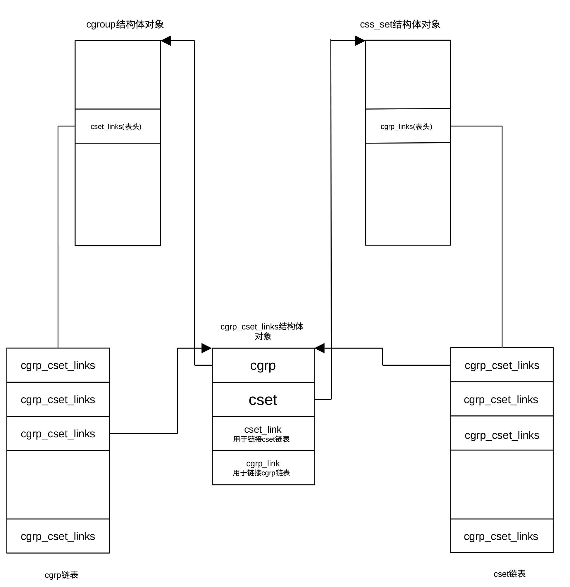

## 构造完整系统资源管控框架

在前面介绍控制组早期初始化时已详细介绍了控制组的概念及知识。在 Linux
内核启动流程中，控制组初始化被分成了早期（cgroup_init_early()）和晚期（cgroup_init()）两个阶段，它们的区别在于执行时机以及初始化的深度。早期初始化的目的是为了让一些关键子系统（如
cpuset）能尽早地与初始化进程（PID 0/1）关联起来。

cgroup_init()在启动流程的后期执行，此时内存管理、虚拟文件系统（VFS）等都已经就绪。它的主要任务是完成剩余子系统的初始化，挂载文件系统接口，注册
cgroup 文件系统，创建 /sys/fs/cgroup 挂载点，初始化完整的哈希表、初始化
/proc/cgroup 和 /proc/\[pid\]/cgroup
接口等。函数位于git/kernel/cgroup/cgroup.c，定义为：

```
int __init cgroup_init(void)
{
	struct cgroup_subsys *ss;
	int ssid;
	BUILD_BUG_ON(CGROUP_SUBSYS_COUNT > 16);
	BUG_ON(cgroup_init_cftypes(NULL, cgroup_base_files));
	BUG_ON(cgroup_init_cftypes(NULL, cgroup1_base_files));
	cgroup_rstat_boot();
	rcu_sync_enter_start(&cgroup_threadgroup_rwsem.rss);
	get_user_ns(init_cgroup_ns.user_ns);
	mutex_lock(&cgroup_mutex);
	hash_add(css_set_table, &init_css_set.hlist, css_set_hash(init_css_set.subsys));
	BUG_ON(cgroup_setup_root(&cgrp_dfl_root, 0));
	mutex_unlock(&cgroup_mutex);
	for_each_subsys(ss, ssid) {
		if (ss->early_init) {
			struct cgroup_subsys_state *css = init_css_set.subsys[ss->id];
			css->id = cgroup_idr_alloc(&ss->css_idr, css, 1, 2, GFP_KERNEL);
			BUG_ON(css->id < 0);
		} else {
			cgroup_init_subsys(ss, false);
		}
		list_add_tail(&init_css_set.e_cset_node[ssid], &cgrp_dfl_root.cgrp.e_csets[ssid]);
		if (cgroup_disable_mask & (1 << ssid)) {
			static_branch_disable(cgroup_subsys_enabled_key[ssid]);
			printk(KERN_INFO "Disabling %s control group subsystem\n", ss->name);
			continue;
		}
		if (cgroup1_ssid_disabled(ssid))
			printk(KERN_INFO "Disabling %s control group subsystem in v1 mounts\n", ss->name);
		cgrp_dfl_root.subsys_mask |= 1 << ss->id;
		WARN_ON(ss->implicit_on_dfl && !ss->threaded);
		if (ss->implicit_on_dfl)
			cgrp_dfl_implicit_ss_mask |= 1 << ss->id;
		else if (!ss->dfl_cftypes)
			cgrp_dfl_inhibit_ss_mask |= 1 << ss->id;
		if (ss->threaded)
			cgrp_dfl_threaded_ss_mask |= 1 << ss->id;
		if (ss->dfl_cftypes == ss->legacy_cftypes) {
			WARN_ON(cgroup_add_cftypes(ss, ss->dfl_cftypes));
		} else {
			WARN_ON(cgroup_add_dfl_cftypes(ss, ss->dfl_cftypes));
			WARN_ON(cgroup_add_legacy_cftypes(ss, ss->legacy_cftypes));
		}
		if (ss->bind)
			ss->bind(init_css_set.subsys[ssid]);
		mutex_lock(&cgroup_mutex);
		css_populate_dir(init_css_set.subsys[ssid]);
		mutex_unlock(&cgroup_mutex);
	}
	hash_del(&init_css_set.hlist);
	hash_add(css_set_table, &init_css_set.hlist,  css_set_hash(init_css_set.subsys));
	WARN_ON(sysfs_create_mount_point(fs_kobj, "cgroup"));
	WARN_ON(register_filesystem(&cgroup_fs_type));
	WARN_ON(register_filesystem(&cgroup2_fs_type));
	WARN_ON(!proc_create_single("cgroups", 0, NULL, proc_cgroupstats_show));
#ifdef CONFIG_CPUSETS
	WARN_ON(register_filesystem(&cpuset_fs_type));
#endif
	return 0;
}
```

Linux 内核中控制组子系统的初始化函数
cgroup_init()是系统引导阶段负责将控制组机制跑起来的核心逻辑。
简单来说，这段代码做了以下几件事：

- 基础环境搭建

<!-- -->

- 通过BUILD_BUG_ON 确保子系统数量没超过16个的限制

- 通过 cgroup_init_cftypes 注册控制组的核心控制文件（如 cgroup.procs
  等）

- 启动资源统计（rstat）机制，并初始化用于线程组同步的读写信号量

<!-- -->

- 初始化核心数据结构

<!-- -->

- 获取初始 cgroup 命名空间的权限

- 调用 cgroup_setup_root()设置控制组的默认根层级（v2 层级
  cgrp_dfl_root）

- 将初始控制组子系统状态集（init_css_set，包含系统启动时的所有进程状态）加入全局哈希表（css_set_table）

<!-- -->

- 遍历并激活各个子系统

<!-- -->

- 如果子系统已进行了早期，则为其分配 ID，否则调用 cgroup_init_subsys
  进行初始化

- 检查内核启动参数，如果用户指定禁用了某个子系统，则关闭其静态跳转并跳过

- 根据子系统的特性，决定它是挂载在 v1 还是
  v2（默认层级），并设置相应的掩码

- 将子系统特有的控制文件（cftypes）添加到文件系统中，这样用户才能在
  /sys/fs/cgroup 下看到各种调节开关

- 调用 ss-\>bind 将子系统绑定到初始进程集。

<!-- -->

- 呈现给用户空间

<!-- -->

- 在 sysfs 中创建 /sys/fs/cgroup 挂载点

- 正式向内核注册 cgroup (v1) 和 cgroup2 文件系统类型

- 创建 /proc/cgroups 文件，方便用户查看当前系统支持哪些子系统

该函数首先通过BUILD_BUG_ON(CGROUP_SUBSYS_COUNT \>
16)在编译阶段进行安全检查，确保子系统数量不超过16个。因为内核用一个16位的位图追踪启用的子系统控制器，如果激活的子系统超过16个，系统无法进行追踪。

函数利用cgroup_init_cftypes()初始化所有 cgroup
目录下那些不属于某个特定控制器的通用基础文件，包括cgroup.procs、cgroup.threads、cgroup.subtree_control、cgroup.controllers、notify_on_release等。通过cgroup_init_cftypes()初始化版本v1控制组专用基础文件，这些文件类型是cftype结构体。该结构体定义控制组子系统目录下应该创建的控制文件，以及它们的
read/write
回调函数。一句话，告诉控制组框架要创建什么文件、文件名是什么、权限是什么、读写时调用哪个函数。

cgroup_rstat_boot()的作用是初始化资源统计框架。它是控制组用来做统计聚合的底层设施，比如内存利用统计、cpu
使用情况聚合等。统计逐级向上汇总。可以把这个函数的功能理解启动统计系统。

rcu_sync_enter_start()让某些
控制组读路径从一开始就进入慢路径同步模式，避免以后频繁使用
synchronize_rcu() 带来的高延迟。synchronize_rcu()
对控制组来说延迟太高，所以宁可让读操作走慢路径。控制组是个
频繁被访问、频繁迁移任务、频繁修改层级
的系统，如果每次切换某些读写模式都要等一轮完整 RCU
宽限期，会拖慢初始化和运行。

get_user_ns()的作用是给初始控制组命名空间所属的用户命名空间（ user_ns
）增加引用计数。保证初始控制组命名空间（init_cgroup_ns）所依赖的用户命名空间不会被提前释放。这主要用于对象的生命周期管理（在Linux内核代码中，可以发现大量的get()、put()用于生命周期管理）。

在获取控制组互斥锁后，通过函数hash_add()把初始子系统状态集的哈希表地址（init_css_set.hlist）加入到名为css_set_table的哈希表里，桶对应的键值由函数css_set_hash()获得。

css_set_table是一个哈希表，用来存所有控制组子系统状态集（
css_set），作用是根据一组 css 集合的首地址快速查找已有的
控制组子系统状态集，这是进程加入控制组时的重要加速结构。css 是
cgroup_subsys_state的缩写，是记录控制组某个子系统在具体控制组节点上运行态的数据结构。css_set表示当前与一个进程（或一组任务）关联的所有控制器（子系统）状态集合。一个进程可以同时属于多个控制组，比如，一个进程属于某个
memory cgroup、又属于某个 cpu cgroup、同时还属于某个 pids
cgroup。这些控制器对应的 css 组合起来，就是一个 css_set。

初始控制组子系统状态集是系统启动时的一个全局初始集合，它表示系统最初所有任务所在的默认控制组状态集合。

函数cgroup_setup_root()创建控制组层级结构的默认根节点cgrp_dfl_root，节点类型为cgroup_root结构体。cgroup_root结构体存储着管理控制组层次结构的元数据，包含有控制组结构树名称、所代表的控制组、结构树标识ID、结构树上控制组数目、结构树所包含的子系统（用掩码表示）、以及与结构树对应的内核文件系统的根目录等，是控制组层级结构管理的核心。

从内核文件系统的视角看，cgroup_setup_root()就是把 cgroup 的根目录
/sys/fs/cgroup 对应的内核世界先搭起来，这个根 cgroup 是整个 cgroup v2
树的起点。cgroup_setup_root() 完成的工作主要包括：

- 初始化对应控制组的引用计数

> 用以判断在销毁根节点时，所有依赖它的资源是否都已正确释放。

- 初始化文件系统根目录 inode / kernfs 节点

> cgroup 的内核层次结构通过 kernfs 节点进行组织，并被动态映射为
> /sys/fs/cgroup 下的文件系统目录结构与相应的 VFS inode。

- 子系统重新绑定

> 依据传入的子系统掩码（ss_mask），将指定的控制器（如 CPU、IO
> 等）从原来的层级结构中移到这个新创建的根层级下。

- 将默认根节点（cgrp_dfl_root）加入到内核全局链表 cgroup_roots
  中，并增加全局计数器 cgroup_root_count

> 建立“进程-层级”映射 (link_css_set)。

- 遍历css_set_table中所有指针指向的 css_set

> 通过类型为cgrp_cset_link结构体的链表，建立默认根节点对应的控制组（cgrp_dfl_root的cgrp字段）与遍历到的css_set之间的双向映射。

在 Linux 内核中，cgrp_cset_link结构 是一个用于管理 cgroup 与 css_set
之间多对多（M:N）映射关系的关键连接结构。

在控制组架构中，一个
css_set可以关联到属于不同层级的多个控制组，一个控制组也可以关联到多个
css_set（因为其内部的不同任务可能属于其他层级的不同控制组）。

cgrp_cset_link
作为中间节点，将两者关联在一起，使得内核能够高效地从任一端遍历到另一端。

cgrp_cset_link结构体的定义为：

```
struct cgrp_cset_link {
    struct cgroup       *cgrp;
    struct css_set      *cset;
    struct list_head    cset_link;
    struct list_head    cgrp_link;
};
```

其中cgrp 和 cset指针指向实际关联的控制组对象和 CSS
集合对象。cset_link用于将cgrp_cset_link结构链入对应 cgroup结构体的
cset_links 列表中，这允许内核找出哪些 css_set
正在使用某个特定的控制组。cgrp_link用于将当前cgrp_cset_link结构链入对应
css_set 结构体的 cgrp_links 列表中，这允许内核为一个特定的 css_set
找出它在所有层级中所关联的控制组。
控制组、控制组子系统状态集间的映射关系示于图 28‑1。

<center>
<figure>

<figcaption><p>图
28‑1控制组、控制组子系统状态集（进程）、cgrp_cset_link之间关系</p></figcaption>
</figure>
</center>

函数for_each_subsys()用于遍历系统的所有控制组子系统（控制器），循环体内语句完成的工作已在上面作了比较详细的介绍，这里不再重复。

由于默认控制组子系统状态集在上面的循环体内得到更新，cgroup_init()利用hash_del()先从临时链表中把默认控制组子系统状态集删除，然后根据关联的子系统状态重新散列，将其放入全局哈希表
css_set_table中。

函数sysfs_create_mount_point()的作用是创建 sysfs 挂载点，在 /sys/fs/
目录下创建一个名为 cgroup 的目录。这是所有 cgroup 层级结构的“大本营”。

在创建挂载点后，通过函数register_filesystem()向 VFS 注册 cgroup
v1和cgroup v2两种格式的文件系统。只有注册后，用户空间才能执行 mount -t
cgroup... 或 mount -t cgroup2... 命令。

函数proc_create_single()创建 /proc/cgroups 文件，并向 procfs
子系统注册proc_cgroupstats_show()函数，以便在用户态执行 cat
/proc/cgroups 时，内核生成并显示数据。

最后，如果内核配置了 cpusets，则额外注册专门用于 CPU 和内存节点分配的
cpuset 文件系统。

