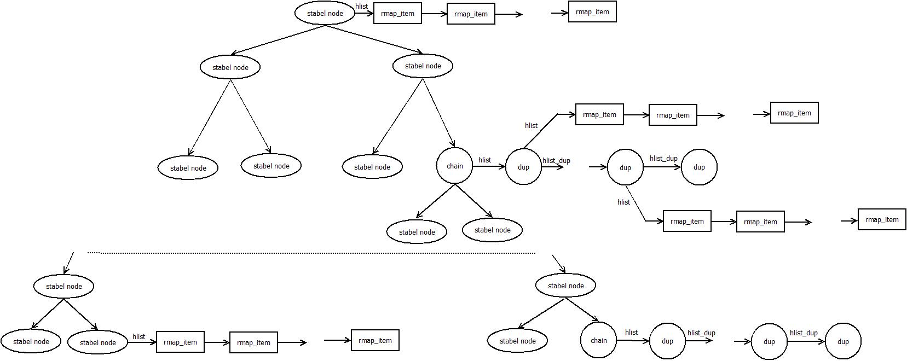

## 相同页合并

操作系统在运行过程中，有时需要复制内存的内容，比如在进程派生过程中，子进程通常会复制父进程的许多内容，这会大大降低内存的利用率。为了提高内存使用效率，
Linux在后台运行一个名为ksmd的守护进程，不断扫描已启用了ksm功能的匿名内存页的内容，比较该页与其它内存页的内容。当该页内容与其它页内容长期保持一致时，就会把两页内存合并，使所有使用这两页内存的进程共享一页内存。这个过程称作内核相同页合并（kernel
same page merging-ksm）。

Linux系统在进行相同页合并时，利用两种类型的树状结构，即稳定树（stable
node tree)和不稳定树（unstable node
tree）。稳定树通过stable_node结构体的node字段形成红黑二叉树。稳定树节点上的内存受写保护，这样可以保证稳定树节点对应的内存内容合法。ksmd在扫描过程中，首先检查内存页的内容是否与稳定树上某一节点对应的内存页内容相同。如果相同，则使用稳定树上节点对应的内存页，并释放当前占用的内存页。如果不同，通过检查内存页的校验码确定内存页的内容是否经常变动。如果该页内容长时间保持一致，系统检查不稳定树上是否有节点对应的内存页内容与该页相同。如果存在，把该页与稳定树上节点对应的内存页合并，并把节点从不稳定树移到稳定树。如果不存在，则在不稳定树上插入一个代表当前页的节点。由于稳定树上的内存页均为写保护页，当某一进程要对稳定树上的内存页进行写操作时，会发生写操作错误，从而触发系统进行写时拷贝操作（copy-on-write）。

稳定树通过红黑二叉树表示，由两类节点组成，一类为普通节点，一类为重复节点，均利用结构体stable_node表示。普通节点为稳定树上的一个单一节点，对应一块被共享的物理内存。为了保持红黑稳定二叉树的平衡，每个节点上字段rmap_hlist_len的最大值限制为ksm_max_page_sharing。当共享某个节点对应的内存的页面个数等于ksm_max_page_sharing时，就会生成一个称作chain的节点作为哈希表的开始节点。之后在稳定树上用chain节点替换当前节点，并把当前节点加入到由chain的hlist字段指向的哈希链表。这类链表由stable_node结构体的hlist_dup链接在一起，其上的所有节点对应同一物理内存页。除了chain节点外，该类链表的其余节点称作复制节点或dup节点。

普通节点与链表头节点（chain节点）通过stable_node结构体中的字段rmap_hlist_len区分，链表头的rmap_hlist_len字段值小于0。链表头与其它复制节点通过stable_node结构体中的head字段区分。复制节点的head字段值为STABLE_NODE_DUP_HEAD。

普通节点的hlist字段指向一个由rmap_item构成的哈希链表，而chain的hlist字段指向一个由dup节点构成的哈希链表。稳定树结构示于图15‑27。

<figure>

<figcaption>
 图 15‑27稳定树结构
</figcaption>
</figure>

相同页合并程序在git/mm/ksm.c文件中。

