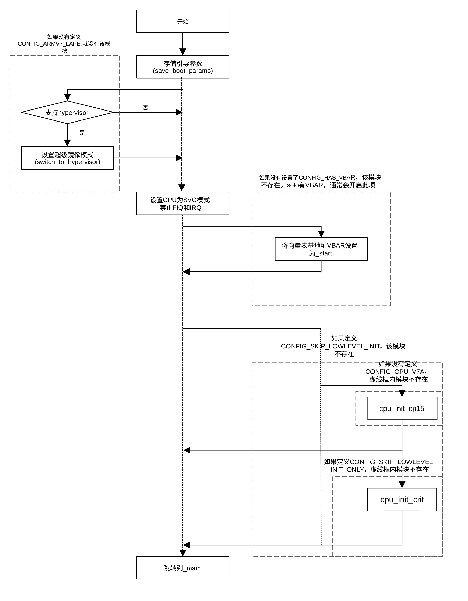

## 系统启动

在接收到系统控制权后，U-BOOT引导程序首先要进行意外向量的设置，对arm系统而言，这一部分程序的源代码采用arm汇编语言编写，存储在文件git/arch/arm/lib/vector.S。在该文件中首先定义了如下的中断向量表，编译为二进制代码后，由链接程序把该中断向量表插入到以_start开始的vectors段内。链接程序把该段代码放置在U-BOOT程序的入口处。

```
.macro ARM_VECTORS
b    reset
ldr    pc, _undefined_instruction
ldr    pc, _software_interrupt
ldr    pc, _prefetch_abort
ldr    pc, _data_abort
ldr    pc, _not_used
ldr    pc, _irq
ldr    pc, _fiq
.endm

.globl _start
    .section ".vectors", "ax"
_start:
    ARM_VECTORS
```

从这段代码可以看到，U-BOOT代码的第一条指令为跳转到reset的跳转指令，其余的中断向量均为ldr指令，用于把各个中断处理程序的首地址写入pc寄存器，以处理相应的中断事件。中断处理程序及其地址对应的标号均在vector.S中定义，这些代码都比较简单，限于篇幅，这里不作介绍，有兴趣的读者可以阅读vector.S代码。

这里需要指出的是，
若采用spl引导，中断向量定义为空，只有一条无条件跳转指令。中断向量的设置由spl程序完成。

reset标号在start.S中定义，所以程序跳转到start.S执行。对于i.MX6
solo/dual处理器，文件start.S位于git/arch/arm/cpu/armv7。

start.S的代码把cpu设置为SVC32模式，关闭IRQ和FIQ，修改CP15寄存器的内容，以便配置缓存、内存管理模块及内存页面查询表。start.S位于git/arch/arm/cpu/armv7。下图显示了start.S文件中初始化CPU的程序流程图。

<center>
<figure>

<figcaption><p>图 5‑4 初始化流程图</p></figcaption>
</figure>
</center>

Start.S文件中的最开始的几行代码为：

    .globl reset

    .globl save_boot_params_ret

    .type save_boot_params_ret,%function

    reset:

    b save_boot_params

    save_boot_params_ret:

    mrs r0, cpsr

    and r1, r0, #0x1f @ mask mode bits

    teq r1, #0x1a @ test for HYP mode

    bicne r0, r0, #0x1f @ clear all mode bits

    orrne r0, r0, #0x13 @ set SVC mode

    orr r0, r0, #0xc0 @ disable FIQ and IRQ

    msr cpsr,r0

    bl cpu_init_cp15

    bl cpu_init_crit

    bl _main

    ENTRY(save_boot_params)

    b save_boot_params_ret @ back to my caller

    ENDPROC(save_boot_params)

    .weak save_boot_params

reset 标号处同样为一条无条件跳转指令，该指令跳转到save_boot_params
子程序，调用引导参数存储程序。该子程序只是一条简单的跳转指令，跳回到调用程序处开始关闭中断。.weak
save_boot_params_ret的作用是允许用户自行定义save_boot_params_ret子程序。用户可以在board_init或其它文件中定义save_boot_params_ret函数，以覆盖在这里定义的默认save_boot_params_ret函数。为了减少代码空间，start.S文件使用了许多编译开关而不是条件语句对不同的配置或选择进行初始化。

若在配置文件中没有定义CONFIG_SKIP_LOWLEVEL_INIT和CONFIG_SKIP_LOWLEVEL_INIT_ONLY编译开关，则会调用lowlevel_init子程序。该子程序位于git/arch/arm/cpu/armv7/lowlevel_init.S，用以设置临时堆栈。采用SPL和非SPL方式时，堆栈地址不同。Lowlevel_init
调用位于同一文件的s_init子程序。
s_init子函数返回到调用lowevel_init的函数，为weak类函数，用户可以通过覆盖该函数进行适合用户的的初始化。