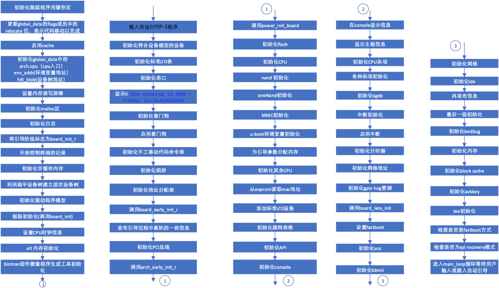

## 系统硬件初始化

ctr0.s的最后一条指令跳转使程序跳转到board_init_r()。board_init_r位于git/common/board_r.c，该进程跳转到initcall_run_list()。initcall_run_list通过for语句执行程序指针数组init_sequence_r中的所有程序。init_sequence_r数组定义了主要的系统硬件初始化操作，下图列出了主要初始化操作。

<figure>

<figcaption>
图 5‑10 init_sequence_r 功能模块
</figcaption>
</figure>

系统引导时并不是要调用上面的所有模块。依据引导模式、系统支持的硬件等，通过设置编译开关，选择要调用的模块对系统初始化。

