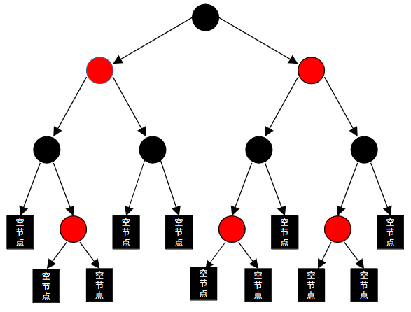

## 红黑树

红黑树 (Red-Black Tree) 是一种自平衡的二叉搜索树（见图
15‑10）。它通过在每个节点上增加一个表示“颜色”（红色或黑色）的存储位，并结合一系列强制性的约束规则，确保没有一条路径会比其他路径长出两倍，从而实现近似平衡。

<figure>

<figcaption>
图 15‑10 红黑树
</figcaption>
</figure>

红黑树必须严格遵守以下五个性质，否则就不是红黑树：

- 每个节点要么是红色，要么是黑色

- 根节点必须是黑色

- 所有的叶子节点（NIL 节点，即空节点）都是黑色

- 如果一个节点是红色的，则它的子节点必须是黑色的（即不能有两个连续的红节点）

- 从任一节点到其每个叶子的所有路径都包含相同数目的黑色节点。

红黑树在平衡性与调整代价之间取得了极佳的折中：

- 在平均和最坏情况下，查找、插入和删除操作的时间复杂度均为$`O(logn)`$

- 与严格平衡的 AVL 树
  相比，红黑树的旋转次数更少，因此在频繁插入和删除的场景下性能更优

当进行插入或删除导致性质被破坏时，红黑树通过以下手段恢复平衡：

- 改变节点的红黑状态

- 将节点向左旋转，使其右孩子变为父节点

- 将节点向右旋转，使其左孩子变为父节点

在 Linux
内核中，红黑树（rbtree）是一种至关重要的高性能自平衡二叉搜索树，广泛应用于内存管理、进程调度和
I/O
监控等核心模块。它针对内核环境进行了深度优化，与普通教科书中的实现有显著不同。

Linux 的 rbtree 实现（代码位于
lib/rbtree.c）追求极致的性能和内存利用率：

- 无间接层

> 不同于传统的“树包含数据”，Linux 采用“数据包含树节点”的设计。每个
> struct rb_node
> 直接嵌入在目标数据结构中，避免了额外的内存分配和指针跳转，极大地提升了
> CPU 缓存命中率。

- 位压缩技巧

> 为了节省空间，Linux
> 将节点的颜色信息压缩在父节点指针的低位中（由于指针是对齐的，低位通常为
> 0）。这种技巧使得每个节点在 64 位系统上能节省 8 字节的空间。

- 不提供搜索回调

> 内核不提供统一的比较函数。相反，用户需要根据特定的键值类型（如进程
> ID、内存地址）自行编写搜索和插入逻辑，这消除了函数调用的开销。

增强型红黑树 (Augmented
rbtree)支持在节点中存储累积信息（如子树的最大值），这对于实现区间树
(Interval Tree) 非常有用，例如用于管理 VMAs（虚拟内存区域）的重叠检测。

红黑树支撑了 Linux 内核中多个对时间敏感的关键任务：

- 完全公平调度器 (CFS)

> CFS 使用红黑树来管理所有可运行的进程。树的键值是进程的
> vruntime（虚拟运行时间）。调度器总是能以
> O(logn)的速度插入新进程，并快速定位最需要 CPU 的进程。

- 虚拟内存管理 (VMA)

> 内核使用红黑树追踪进程的每一个
> vm_area_struct（内存段）。当发生缺页异常时，内核通过红黑树在$`O(logn)`$时间内找到对应的内存区域。

- epoll 机制

> epoll
> 使用红黑树来管理用户监控的所有文件描述符（FD）。即使监控数万个连接，添加、删除或修改
> FD 的操作也始终保持在稳定的对数复杂度。

- 高精度定时器 (hrtimers)

> 所有挂起的定时器请求按过期时间排序存储在红黑树中，确保系统能精确且高效地处理大量定时任务。
