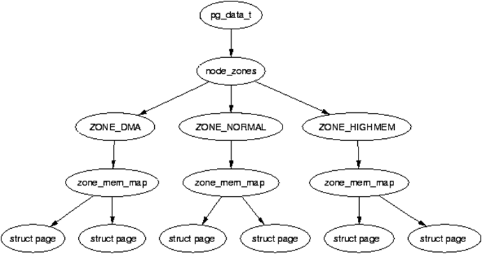

## 节点和区域

在第8章我们曾经介绍了节点（node）和区域（zone）的概念。对NUMA结构而言，内存由多个节点组成。每个节点可以划分为几个不同类型（见§8.8.1）的区域，各个区域又可以进一步划分为页。节点由结构体struct
pglist_data（pg_data_t）描述，区域由结构体struct
zone描述，页由结构体struct page描述。节点、区域和页的关系可用下图表示：

<center>
<figure>

<figcaption><p>图 11‑1 节点、区域与页的关系</p></figcaption>
</figure>
</center>

在§8.1.1中，我们简单介绍了描述节点的结构体pglist_data的主要域。通过该结构体中的node_zonelists\[0\]指针或node_zone，可以访问隶属于该节点的所有区域。下面我们简单介绍一些结构体struct
zone中比较重要的字段。结构体struct
zone中经常用到的字段包括zone_start_pfn、zone_end_pfn、node、\*zone_pgdata、\_watermark\[\]、spanned_pages、mannged_pages、present_pages、free_area\[\]等。zone_start_pfn和zone_end_pfn分别表示区域的起始与终止页面。node为区域所在节点的节点标号。\*zone_pgdata指向区域所在节点的pglist_data结构体。

\_watermark数组用来记录区域剩余内存情况。数组共有WMARK_MIN、WMARK_LOW和WMARK_HIGH三个单元。内存分配算法利用这三个量进行内存分配与释放。当可用内存页面(free
page)小于_watermark\[WMARK_LOW\]时，执行内存管理任务(kswapd)，查询可以释放的页面。当可用内存页面大于_watermark\[WMARK_HIGH\]时，内存管理任务进入休眠状态。系统要求可用内存页面不能够低于_watermark\[WMARK_LOW\]的值。

spanned_pages表示区域覆盖的页数。present_pages为区域内实际包含的内存，等于区域覆盖页数减去空隙（不存在的页）的所有页数。mannged_pages为buddy内存分配系统管理的页数，等于区域实际拥有的页数除去保留页数的页数。free_area为free_area结构体数组，包含区域内所有空闲内存。Linux按照内存分配单位，把自由空间划分为1页、2页、4页到2<sup>11</sup>页等不同分配单位的区域，如free_aera\[0\]的区域用于分配1页大小的内存，而free_area\[11\]则用于分配2<sup>11</sup>页大小的内存区域。

在系统引导之后，由于不断的分配与释放，物理内存会形成大量的地址不连续、尺寸很小的内存空间，即内存碎片化。有些应用场景会需要物理地址连续的内存空间，因此有必要把大量不连续的内存碎片整理成地址连续、空间较大的内存区域。把碎片化内存整理成地址连续的内存区域的过程叫内存规整（compaction）。这一过程需要用到页面迁移（migration），即把区域内页面物理地址从一个节点迁移到另一个节点。为此，struct
zone结构体定义了compact_init_migrate_pfn等与规整有关的变量。

为了记录各个节点的状态，Linux定义了node_states数组，保存有
N_POSSIBLE、N_ONLINE、N_NORMAL_MEMORY、N_HIGH_MEMORY、N_MEMORY、N_CPU、N_GENERIC_INITIATOR等7组掩码，掩码的每一位对应一个节点。如果数组中某个单元的某位为1，表示该位对应的节点处于该单元对应的状态。各组掩码的含义可以从名称中获知，如node_states\[N_ONLINE\]掩码表示在线的各个节点，node_states\[N_NORMAL_MEMORY\]表示包含NORMAL_MEMORY区的各个节点。具体含义可以从文件git/include/linux/nodemask.h中得知。

页是管理物理内存的基本单位，mmu通过页表访问物理内存。在虚拟地址空间，Linux的buddy内存管理系统通过page结构体（物理页描述符）实现对物理内存的管理。结构体page定义在文件git/include/linux/mm_types.h中。尽管内存页面大小相同，通常均为4096个字节，但不同的使用场景，page的定义不同。如在slob内存分配器中使用的page与在slab内存分配器中使用的page定义就不完全相同，而在buddy中使用的page又与slob和slab中使用的page定义不一样。这些差别是通过union（联合体）实现的。有关不同page的定义，会在后续章节陆续介绍。

为了避免多个CPU核芯在频繁申请和释放单个内存页（Order-0页）时去抢占全局的锁，内核会为每个CPU 核开辟本地缓存，这类内存通过结构体per_cpu_page（PCP）描述。

在内核启动早期动态内存分配器尚未就绪时，为了统一内存分配代码路径并为单页（Order-0）内存申请提供基础的数据结构支持，Linux定义了类型位PCP的boot_pageset临时缓冲区。内存管理与使用内存的CPU关系密切。结构体per_cpu_pageset的定义为：

```
struct per_cpu_pageset {
	struct per_cpu_pages pcp;
#ifdef CONFIG_NUMA
	s8 expire;
	u16 vm_numa_stat_diff[NR_VM_NUMA_STAT_ITEMS];
#endif
#ifdef CONFIG_SMP
	s8 stat_threshold;
	s8 vm_stat_diff[NR_VM_ZONE_STAT_ITEMS];
#endif
}

```

结构体per_cpu_pageset使用了per_cpu_pages结构体，per_cpu_pages结构体的定义为：

```
struct per_cpu_pages {
	int count;
	int high;
	int batch;
	struct list_head lists[MIGRATE_PCPTYPES];
};
```

变量count为CPU可以释放的内存页数。high用来设置批量释放门限，当可释放的内存页数大于该门限值时，才释放内存。batch为该cpu在进行内存管理时每次批量添加或释放的页面数。lists为链表头数组，链表用于保存cpu无需抢占锁、可直接使用的内存页(order-0)。依据内存页面的迁移类型，页面分别保存在不同的链表之中。从中可以看出，可直接使用的内存页均为迁移页，包含MIGRATE_UNMOVABLE、MIGRATE_MOVABLE和MIGRATE_RECLAIMABLE。（最新版Linux的pcp
list定义改为struct list_head
list\[MIGRATE_PCPTYPES\]\[NR_PCP_LISTS\]。升级为二维数组后，进一步引入了
NR_PCP_LISTS，不仅能够保存0级内存页，还能保存连续 2 个页、4 个页、8
个页的高阶空闲物理页，让多页小额分配也能享受无锁的极致速度）。

为了使内存管理程序能够正常工作，需要在引导阶段对结构体pglist_data、zone和page初始化。pglist_data在前面介绍的page_init()进程结束之后便开始进行初始化。这一章我们将介绍结构体zone和页面分配程序的初始化过程。
