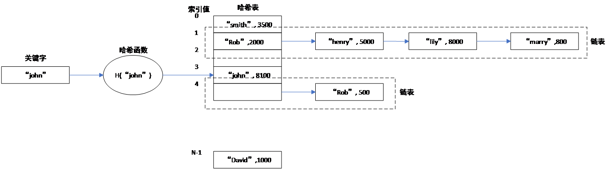
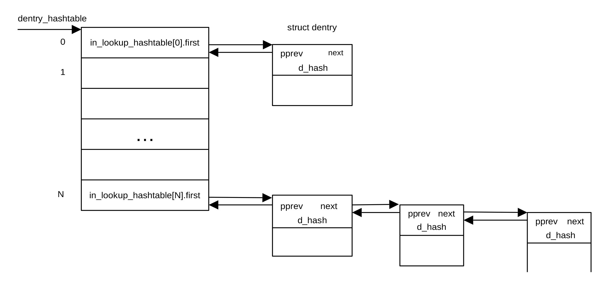

## 虚拟文件系统缓冲区初始化

### 虚拟文件系统简介

虚拟文件系统（VFS）是内核的一个软件层，用以向用户空间提供文件接口。对Linux而言，一切皆文件。Linux文件包括磁盘文件、管道（pipe）、套接字（socket）、I/O等。为了唯一辨识文件，Linux采用inode表示一个文件。inode存储文件的元数据，主要包括文件大小、器件ID、用户ID、组ID、文件读写模式及用户访问权限、存储位置、当前使用该inode对应文件的用户数目、文件保护标识符等信息。文件名和文件本身并没有存储在inode当中。Inode结构体的定义在文件/git/include/linux/fs.h文件中，其中包含大量便于各种文件操作及保证文件操作安全的字段。

用户空间的文件操作包含大量的路径查询。为了提高查询效率，Linux在内存开辟了一个名为Dentry
cache的dcache缓存区。缓存区每一项的内容是类型为struct
dentry的结构体，用以保存用户经常使用的路径。结构体dentry定义在文件git/include/linux/dcache.h。当用户需要进行文件操作时，Linux首先从dcache缓冲区查找对应路径或文件名的dentry。dentry包含一个指向inode的指针，用来表示该条目代表的文件。如果找不到相应的dentry，Linux就会通过其父节点逐级往上查找文件的inode。找到之后Linux会在dcache生成一个新的dentry，这样可以极大地提高路径查询速度。

### 哈希表

由于Linux文件系统所包含的文件数目可能非常庞大，不可能把所有的文件以dentry形式一次性地保存在缓冲区内。为此，Linux在dcache缓存区以哈希表的形式保存文件的dentry。缓存区查找文件名或路径名可以通过哈希函数在dcache中查找。

哈希表是一种使用非常广泛的数据结构，其特点是可以利用少量固定大小的存储单元保存大量个数未知的数组数据，且其查询时间基本固定。哈希表的基本单位为桶（bucket），每个桶保存有关键字以及关键字对应的值等内容。哈希表存在的一个问题是冲突，即不同的关键字映射到哈希表的同一个位置。有多种方法解决哈希表的冲突问题，一种方法为链表法。当采用链表法解决冲突问题时，桶中还包含一个指针，指向下一个桶。当发生冲突时，把冲突的关键字及其对应的值保存在下一个桶中。

在查询哈希表时，首先利用哈希函数把关键字映射为哈希表的索引值（index）。如果索引值对应的桶中的关键字与查询用的关键字相同，则得到查询结果。如果不同，则沿着链表查找下一个桶，直到找到相应的关键字或到链表结尾。如果在索引值对应的链表中找不到与查询用关键字相同的关键字，则查询失败。

在进行插入操作时，首先利用关键字和哈希函数生成哈希表索引值。如果该索引值对应的桶或链表中某个桶为空，则把关键字及其相应的值存入空桶中。如果找不到空的桶，则为关键字分配一个新的桶，并把关键字和其对应的值存入新桶，最后把新桶的地址保存在其前面的桶中。图
14‑4为采用链表桶时的哈希表结构。

<center>
<figure>

<figcaption><p> 图 14‑4哈希表结构</p></figcaption>
</figure>
</center>

从上图可以看出，哈希表事实上是一组链表，每个链表对应同一个哈希表索引值。

### 初始化文件系统缓存区

start_kernel()函数通过调用vfs_caches_init_early()进行文件系统所用缓冲区的初始化。vfs_caches_init_early()定义在文件git/fs/dcache.c文件里，定义为：

```
void __init vfs_caches_init_early(void)
{
	int i;

	for (i = 0; i < ARRAY_SIZE(in_lookup_hashtable); i++)
		INIT_HLIST_BL_HEAD(&in_lookup_hashtable[i]);
	dcache_init_early();
	inode_init_early();
}
```

该函数首先利用宏定义INIT_HLIST_BL_HEAD把哈希表桶in_lookup_hashtable（即链表头）的值设置为空。链表头的类型为结构体hlist_bl_head的指针，定义为:

```
struct hlist_bl_head {
struct hlist_bl_node *first;
};
```

只包含一个first指针字段，其类型为指向结构体：

```
struct hlist_bl_node {
struct hlist_bl_node *next, **pprev;
};
```

的指针。

哈希表桶的first字段指向dentry类链表的第一个，类型为struct
hlist_bl_node。Linux通过d_hash把在同一索引值处发生冲突的所有桶链接起来，形成哈希表在这一索引值处的链表。在哈希表建立时，如果对应某一索引值的桶含有内容，则相应的哈希表头的first指针指向该索引值对应的链表的首个dentry，即首个dentry的d_hash字段的首地址。

链表中d_hash字段的next和pprev指针分别指向下一个dentry和前一个dentry的d_hash字段的首地址。第一个元素的pprev指针指向链表头，即in_lookup_hashtable，图
14‑5给出了VFS采用的哈希表结构。

<center>
<figure>


<figcaption><p> 图 14‑5 VFS采用的哈希表结构</p></figcaption>
</figure>
</center>

在初始化哈希表头之后，函数vfs_caches_init_early()调用dcache_init_early()初始化dcache缓存区。dcache_init_early()函数定义在git/fs/decache.c文件中，定义为：

```
static void __init dcache_init_early(void)
{
	if (hashdist)
		return;
	dentry_hashtable = alloc_large_system_hash("Dentry cache",sizeof(struct hlist_bl_head), 
       dhash_entries,13,HASH_EARLY | HASH_ZERO,&d_hash_shift,NULL,0,0);
	d_hash_shift = 32 - d_hash_shift;
}
```

该函数首先测试全局变量hashdist的值，判别哈希表是否分散地分布在NUMA的各个节点。如果哈希表分散地分布在不同节点，则延迟哈希表初始化，函数dcache_init_early()退出。如果哈希表集中在一起，则调用函数alloc_large_system_hash()为Linux分配一个名为Dentry cache的缓存区。alloc_large_system_hash()函数的原型为：

```
void *__init alloc_large_system_hash(const char *tablename,
unsigned long bucketsize,
unsigned long numentries,
int scale,
int flags,
unsigned int *_hash_shift,
unsigned int *_hash_mask,
unsigned long low_limit,
unsigned long high_limit)
```

其中tablename指向缓存区的名称。bucketsize指明桶大小，以字节为单位。numentries为Dentry cache哈希表包含的个数，由全局变量dhash_entries指定。dhash_entries的默认值为0，可以由命令行参数“dhash_entries=”通过设备树初始化为其它值。目前很少有平台通过命令行指定dhash_entries的值，大部分均采用默认值。

函数alloc_large_system_hash()可以在初始化初期调用，也可以在后期调用。可以把分配的内存清零，也可以置为-1。初期和后期采用的内存分配算法不同。当flags设置标志位HASH_EARLY时，采用初期的块内存分配方法，否则采用常规的内存分配算法。如果在后期调用，函数会在内核的内存空间分配一块缓存区，用于dentry的缓存，起地址为dentry_cache。与哈希表不同，这一缓存区用于dentry的缓存，通常位于第一级（L1 cache）高速缓存区。哈希表的桶只包含与链表结构有关的指针的内容，其目的是确定dentry的存储位置。系统查询哈希表时首先从dentry缓存区查询，其空间更小，速度更快。

当flags设置标志位HASH_ZERO时，调用块内存分配函数分配内存并清零，否则，调用函数memblock_alloc_raw()分配内存并以-1填充。

scale决定内存页面大小。\_hash_shift为利用哈希函数生成索引值时右移位数。low_limit和high_limit指定哈希表的最大和最小空间。\_hash_mask为获取哈希表索引值使用的屏蔽位。

在初始化dcache缓存区后，vfs_caches_init_early()函数调用函数inode_init_early()为虚拟文件系统分配另一个称作inode-cache的缓存区，inode_init_early()定义在文件git/fs/inode.c中，定义为：

```
void __init inode_init_early(void)
{
	if (hashdist)
		return;
	inode_hashtable = alloc_large_system_hash("Inode-cache", sizeof(struct hlist_head),
     ihash_entries,14,HASH_EARLY|HASH_ZERO, &i_hash_shift, &i_hash_mask,0,0);
}
```

形式与初始化dcache时的调用基本相同。Inode-cache为查询inode时使用的哈希表，同样，该哈希表的桶只包含与链表结构有关的指针内容，用以确定inode的存储位置。
