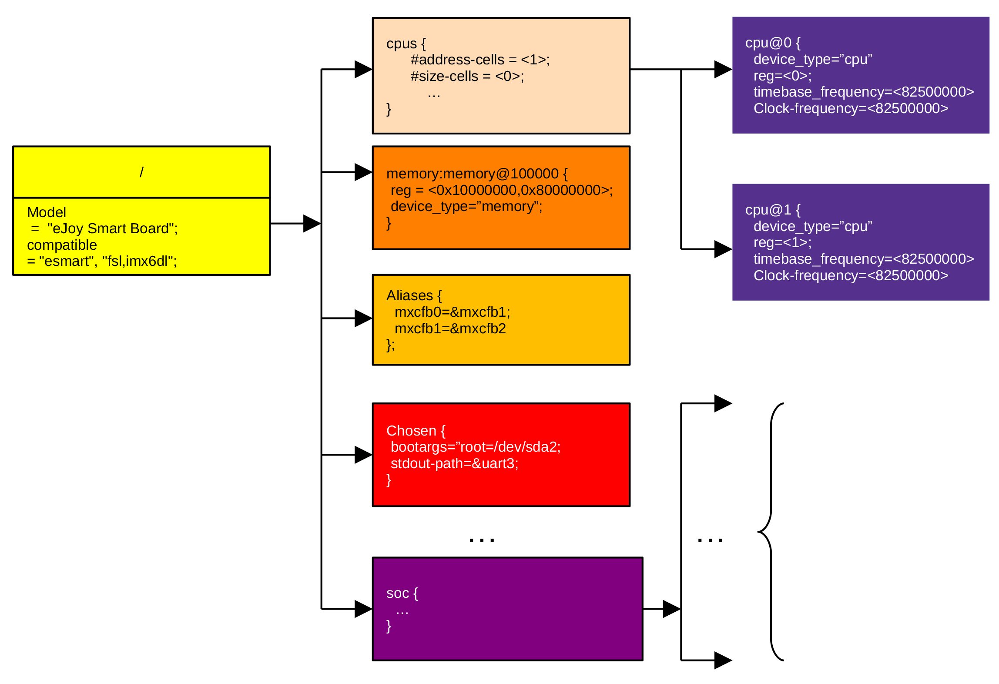

## 设备树结构

设备树利用文本语言，按照一定的语法规则描述构成系统的各种设备的关系及设备的特性。设备树由根节点、节点、子节点组成，节点由名字、句柄、地址和属性构成。

<figure>

<figcaption>
图 3‑1 设备树结构
</figcaption>
</figure>

设备树必须有且只能有一个根节点，根节点必须有且只能有一个cpus节点，根节点至少要有一个memory节点。cpus节点可以有多个cpu节点，以适应多内核CPU。
