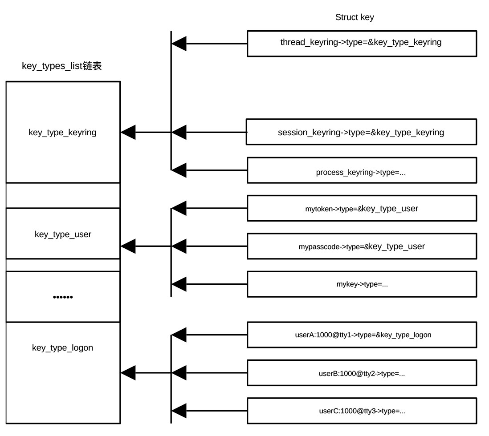

## 设立密钥管理保留区

密钥保留服务（Key Retention Service）是 Linux
内核中一套专门用来缓存和管理身份验证信息、加密密钥及令牌的机制。简单来说，它就是内核里的一个高级凭证管理器。

在没有这个服务之前，如果一个进程（比如 NFS
客户端）需要一个复杂的加密令牌，它可能每次操作都要去向用户态的守护进程要，或者自己找地方存，既慢又不安全。

密钥保留服务的出现，让内核可以把这些信息保留在内存中，供后续操作直接调取，避免了频繁跨界（内核态与用户态）沟通。

该服务将密钥组织成一种树状结构，主要包含三个核心概念：

- 密钥（Key）

> 具体的凭证内容（比如一段密码字符串）。

- 密钥环（Keyring）

> 一种特殊的密钥，主要用来组织和查找密钥，确定密钥的归属和作用域。

- 类型（Type）

> 定义了密钥能干什么（比如 user 类型存简单数据，logon
> 类型专门用于登录验证）。

在 Linux
系统中，密钥环的核心作用是作为一个安全的内核级容器，用以组织密钥。
可以把它类比为文件系统中的文件夹，密钥是存放数据的文件，而密钥环则是存放这些密钥的目录。

内核会自动为不同的应用场景准备好预定义的密钥环，包括：

- 线程密钥环（Thread Keyring）

> 只有当前线程能用的私有钥匙。

- 进程密钥环（Process Keyring）

> 整个进程的所有线程共享。

- 会话密钥环（Session Keyring）

> 登录系统后的整个会话共享。

- 用户密钥环（User Keyring）

> 同一个 UID 下的所有进程都能看见。

- 持久密钥环（Persistent Keyring）

> 跨登录会话持久存在，主要作用是维持后台任务运行。它解决了传统临时密钥环（如用户密钥环
> user-keyring）在用户注销或断开 SSH 后，其后台进程（如 cron
> 定时任务、systemd 用户服务）因失去密钥而导致任务失败的问题。

内核密钥主要用于磁盘加密、内核模块签名和网络共享。存储挂载分区时需要解密密钥，在加载驱动程序之前，内核会去密钥环里找公钥，验证这个驱动是不是合法的。系统保存的
Kerberos 令牌，使得访问网络文件夹时不用反复输入密码。

key_init()
的作用就是在任何文件挂载或驱动加载之前，把密钥保留服务的基础设施（内存池、查找表）建好。函数位于git/
security/keys/key.c，定义为：

```
void __init key_init(void)
{
	key_jar = kmem_cache_create("key_jar", sizeof(struct key),
		0, SLAB_HWCACHE_ALIGN|SLAB_PANIC, NULL);
	list_add_tail(&key_type_keyring.link, &key_types_list);
	list_add_tail(&key_type_dead.link, &key_types_list);
	list_add_tail(&key_type_user.link, &key_types_list);
	list_add_tail(&key_type_logon.link, &key_types_list);
	rb_link_node(&root_key_user.node, NULL, &key_user_tree.rb_node);
	rb_insert_color(&root_key_user.node, &key_user_tree);
}
```

key_init() 主要负责初始化 Linux
内核的密钥环（Keyring）子系统，即初始化密钥对象缓存、注册内置 key
类型，并建立全局 key 用户管理结构。

它首先调用 kmem_cache_create 为 struct key 结构体申请专门的 SLAB
内存池，所有
密钥、凭证等都会从这里分配。之后，通过函数list_add_tail()将keyring、dead、logon和user四种类型的密钥和密钥环加入到key_types_list双向链表，向内核注册内置密钥类型。key_types_list用于保存内核注册的各种密钥类型，其中key_type_keyring用于存放密钥环，key_type_dead存放已销毁的密钥（占位/回收用），key_type_user存放用户空间可见的普通密钥，key_type_logon存放登录认证用密钥（如
PAM/凭证）。

最后，函数初始化用于存放普通用户密钥的红黑树。由于红黑树为自平衡二叉树，普通用户查找密钥的时间基本相同。

密钥、密钥环与key_type_list的关系可以用图 27‑1表示。

<center>
<figure>

<figcaption><p>图 27‑1密钥、密钥环与key_type_list链表</p></figcaption>
</figure>
</center>

而内核内部通过 key-\>linked key list 、key-\>rings 、 key-\>serial
及index等来追踪密钥所属密钥环。
