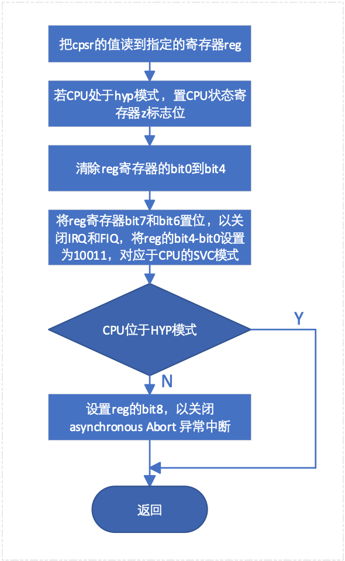
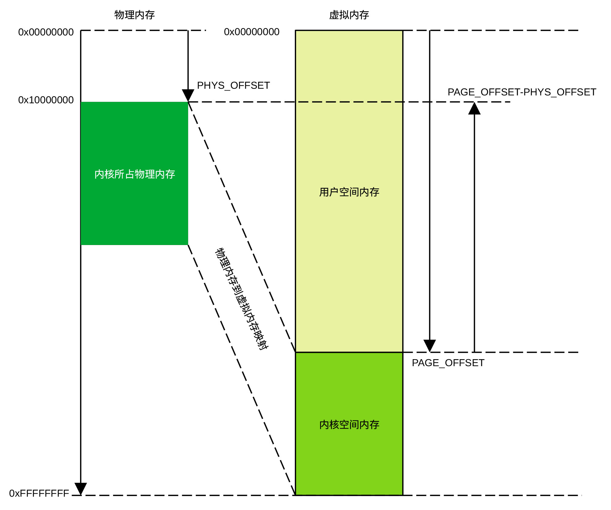
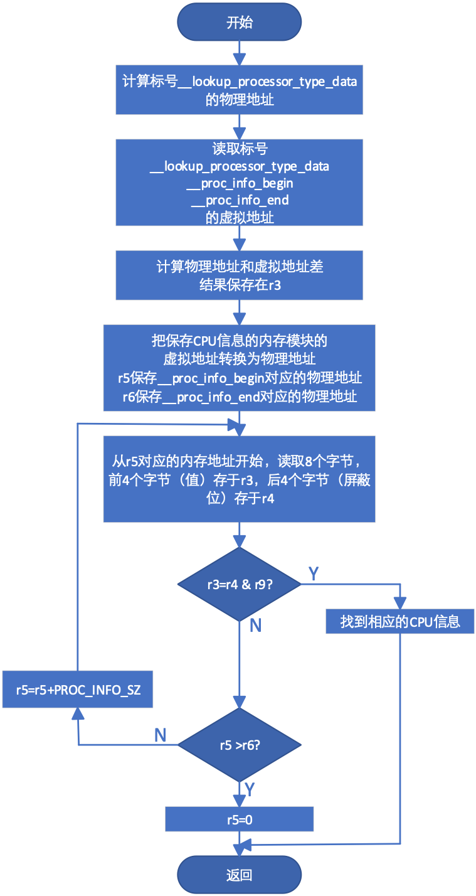

## 设置CPU模式

在head.S文件中有一条\_\_HEAD的宏，其作用是告诉链接程序把后续代码放在.head.text段，该段的初始地址就是Linux内核的程序入口地址，即内核程序要执行的第一条指令的地址。去掉与arm无关、为了支持Thumb（在contex-M运行的Linux内核工作于thumb状态）和BE8指令而定义的宏（当编译开关选择为支持arm时，这些宏的编译结果为空），以及为了支持40位地址空间（通过编译开关选择，事实上，arm-v7A支持40位地址，为了简洁，我们省略了该部分代码）而使用的代码后，该段程序可简化为：

    .arm

    __HEAD

    ENTRY(stext)

    safe_svcmode_maskall r9

    mrc p15, 0, r9, c0, c0 @ 获取cpu id

    bl __lookup_processor_type @ r5=procinfo r9=cpu id

    ovs r10, r5 @ invalid processor (r5=0)?

    beq __error_p

    adr r3, 2f

    ldmia r3, {r4, r8}

    sub r4, r3, r4 @ (PHYS_OFFSET - PAGE_OFFSET)

    add r8, r8, r4 @ PHYS_OFFSET

    bl __vet_atags

    #ifdef CONFIG_ARM_PATCH_PHYS_VIRT

    bl __fixup_pv_table

    #endif

    bl __create_page_tables

    ldr r13, =__mmap_switched @ address to jump to after mmu has been enabled

    badr lr, 1f @ return (PIC) address

    mov r8, r4 @ set TTBR1 to swapper_pg_dir

    ldr r12, [r10, #PROCINFO_INITFUNC]

    add r12, r12, r10

    ret r12

    1: b __enable_mmu

    ENDPROC(stext)

    .ltorg

    2: .long .

    .long PAGE_OFFSET

其中代码段：

    safe_svcmode_maskall r9

    mrc p15, 0, r9, c0, c0

    bl __lookup_processor_type

    movs r10, r5

    beq __error_p

的作用是确保CPU处于SVC模式，关闭所有中断，确定CPU类型。safe_svcmode_maskall为宏定义了一段设置CPU模式及屏蔽中断的宏，r9为传递给该宏的工作寄存器。这段代码的工作流程为：

<figure>

<figcaption>
图 6‑1 设置SVC模式及关中断流程
</figcaption>
</figure>

指令mrc p15, 0, r9, c0,
c0从协处理器读取寄存器C0的值，存放在寄存器r9中，协处理器的寄存器C0保存了CPU
id的值。

\_\_lookup_processor_type为用于查找cpu类型的子程序，该子程序使用了PAGE_OFFSET和PHYS_OFFSET两个常量。要了解这两个常量的含义，需要了解虚拟地址、物理地址、内核空间和用户空间（也称作内核态和用户态）的概念。下面我们简单地介绍这些概念的含义。

不同的CPU或系统设计，内存的起始地址和大小不同。Linux支持大量不同类别的CPU和系统，代码大部分都是用c语言编写。如果在编写这些代码时使用实际的内存地址，代码会非常复杂，程序的可扩展性很差。为此，Linux假定所有系统内存的起始地址均为0x00000000，结束地址为0xFFFFFFFF，这个假设的地址就是虚拟地址。当系统需要访问内存时，由内存管理模块把虚拟地址转换为实际的物理地址，也就是说，CPU的地址空间为虚拟地址空间，内存占用的地址空间为物理地址空间。

Linux把0x00000000-0xFFFFFFFF的虚拟内存地址划分为内核空间和用户空间，用户程序位于用户空间且只能访问用户空间，内核程序位于内核空间。Linux使用了四种内存划分方式，当编译开关为VMSPLIT_1G时，内核空间为0x40000000-0xFFFFFFFF，当编译开关为VMSPLIT_2G时，内核空间为0x80000000-0xFFFFFFFF，
当编译开关为VMSPLIT_3G_OPT时，内核空间为0xB0000000=0xFFFFFFFF，而当编译开关为VMSPLIT_3G时，内核空间为0xC0000000-0xFFFFFFFF。编译开关有多种设置方法，对arm而言，一种设置方法是在git/arch/arm/configs/\*\_defconfig文件中利用类似于CONFIG_VMSPLIT_1G=y的语句设置。

PHYS_OFFSET是内存在物理地址空间的起始地址，即内存的起始物理地址，PAGE_OFFSET是内核空间的起始虚拟地址。虚拟地址、物理地址、内核空间、用户空间、PHYS_OFFSET和PAGE_OFFSET之间的关系可以用下图表示。

<figure>

<figcaption>
图 6‑2 Linux地址空间
</figcaption>
</figure>

在介绍了虚拟地址和物理地址等基本概念后，接着介绍基于arm的Linux查找CPU类型的子程序。该子程序的代码为：

    __lookup_processor_type:

    adr r3, __lookup_processor_type_data

    ldmia r3, {r4 - r6}

    sub r3, r3, r4 @ get offset between virt&phys

    add r5, r5, r3 @ convert virt addresses to

    add r6, r6, r3 @ physical address space

    1: ldmia r5, {r3, r4} @ value, mask

    and r4, r4, r9 @ mask wanted bits

    teq r3, r4

    beq 2f

    add r5, r5, #PROC_INFO_SZ @ sizeof(proc_info_list)

    cmp r5, r6

    blo 1b

    mov r5, #0 @ unknown processor

    2: ret lr

    ENDPROC(__lookup_processor_type)

    .align 2

    .type __lookup_processor_type_data, %object

    __lookup_processor_type_data:

    .long .

    .long __proc_info_begin

    .long __proc_info_end

    .size __lookup_processor_type_data, . - __lookup_processor_type_data

程序执行后， r9存储CPU
id，r5存储指向cpu信息存储位置的物理地址。我们先看代码最后的汇报指令：

    __lookup_processor_type_data:

    .long .

    .long __proc_info_begin

    .long __proc_info_end

    .size __lookup_processor_type_data, . - __lookup_processor_type_data

    .long
.的作用是在标号\_\_lookup_processor_type_data地址处存储标号自己的虚拟地址，后面两条汇编指令的作用是把标号\_\_proc_info_begin和\_\_proc_info_end的地址保存在标号\_\_lookup_processor_type_data后面的两个内存单元。

在\_\_proc_info_begin和\_\_proc_info_end之间的内存区域保存了Linux支持的各种CPU的信息。其中标号\_\_proc_info_begin和\_\_proc_info_end在编译过程中生成，为虚拟地址。

CPU信息保存在虚拟地址\_\_proc_info_begin和\_\_proc_info_end之间，由于内存管理模块还没有开始工作，要访问CPU信息，首先必须把虚拟地址转换为物理地址。

子程序的第一条指令的作用是计算\_\_lookup_processor_type_data的物理地址（程序计数器值加偏移量\_\_lookup_processor_type_data），保存在r3寄存器，然后以r3为基地址，把标号地址\_\_lookup_processor_type_data
、\_\_proc_info_begin和\_\_proc_info_end分别读入寄存器r4、r5和r6中。

指令sub r3, r3,
r4计算标号\_\_lookup_processor_type_data物理地址和虚拟地址之间的差，利用该差值可以把虚拟地址转换为物理地址（见图
37(#Ref138052453)）。指令 add r5, r5, r3和add r6, r6,
r3分别把虚拟地址\_\_proc_info_begin和\_\_proc_info_end转换为物理地址。后续代码从内存读取CPU信息并与保存在r9的、从CPU协处理器(CP15)读取的CPU
id进行比较。若相同，则r5内容为CPU信息的物理地址，程序返回。如在\_\_proc_info_begin和\_\_proc_info_end之间的内存模块中找不到相应的CPU
id，则r5内容置0，程序返回。下图给出了查找CPU信息的子程序流程。

<figure>

<figcaption>
图 6‑3 CPU信息查找流程
</figcaption>
</figure>

在从CPU信息查找子程序返回后，程序接着计算物理地址和虚拟地址的差（PHYS_OFFSET-PAGE_OFFSET）及内存的起始物理地址，然后调用\_\_vet_atags子程序检查U-BOOT传递给Linux的参数是否合法。

U-BOOT传递给Linux的参数有两种形式。如果Linux支持设备树，则U-BOOT通过把扁平化设备树的首地址存于寄存器r2的方式传递参数给Linux，如果Linux不支持设备树，则U-BOOT通过把把参数列表地址存于寄存器r2的方式把参数传递给Linux。通常，U-BOOT把参数列表或DTB放在内存最开始的16kB内，U-BOOT解压程序或Linux程序均不能够覆盖这一段内存。

如果Linux支持设备树，则检查r2寄存器指向的内存单元的值是否为设备树魔术字。如果该单元的值等于魔术字，则r2指向的为合法的DTB文件，否则为非法文件。当系统采用小端表示方式时，魔术字为0xEDFE0DD0，当系统采用大端表示方式时，魔术字为0xD00DFEED。

如果Linux不支持设备树，则先检查r2寄存器指向的内存单元4个字节的值是否为0x0005（ATAG_CORE_SIZE）或0x0002（空ATAG_CORE）。若不是，则该地址存放的不是合法的atag列表，若是其中的任一个，则继续检查后续8个字节的值是否等于ATAG_CORE（0x54410001）。若等于，则寄存器r2存放的是合法的atag列表地址，若不等于，则r2存放的不是合法的atag列表地址。

当r2存放的不是合法的DTB地址或atag列表地址时，在返回调用程序之前，要把寄存器r2的值清零，通知调用程序地址非法。

子程序\_\_vet_atags的代码为：

    __vet_atags:

    tst r2, #0x3 @ aligned?

    bne 1f

    ldr r5, [r2, #0]

    #ifdef CONFIG_OF_FLATTREE

    ldr r6, =OF_DT_MAGIC @ is it a DTB?

    cmp r5, r6

    beq 2f

    #endif

    cmp r5, #ATAG_CORE_SIZE @ is first tag ATAG_CORE?

    cmpne r5, \#ATAG_CORE_SIZE_EMPTY

    bne 1f

    ldr r5, [r2, #4]

    ldr r6, =ATAG_CORE

    cmp r5, r6

    bne 1f

    2: ret lr @ atag/dtb pointer is ok

    1: mov r2, #0

    ret lr

    ENDPROC(__vet_atags)

这段代码结构比较简单，这里没有给出详细的流程图。
