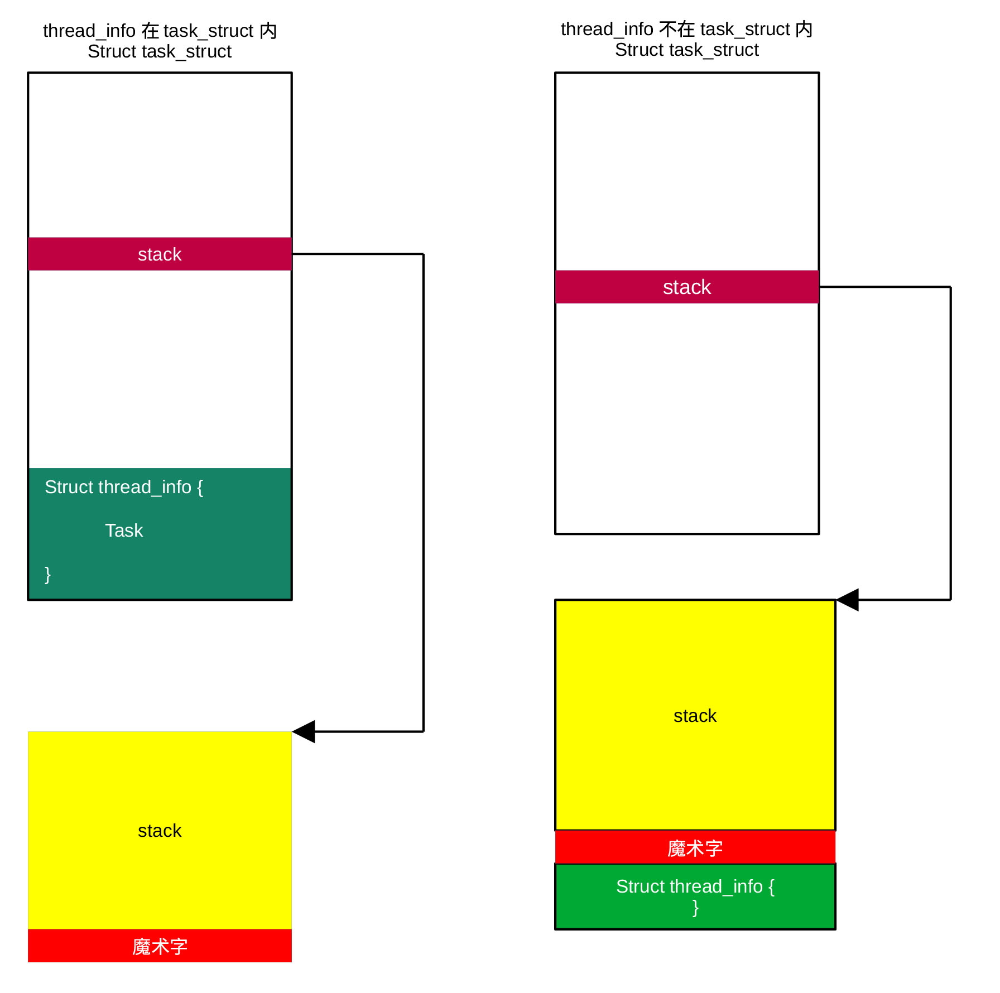

## 设置初始化任务堆栈结尾魔术字

Linux是以任务方式完成各种操作，各种任务用struct
task_struct结构体表示。Linux通过线程执行任务，每个任务对应一个线程。初始化任务为init_task，为struct
task_struct类型的一个全局变量。编译时，Linux发布人员利用编译开关CONFIG_THREAD_INFO_IN_TASK选择是否要把线程信息（struct
thread_info）保存在任务结构体中。如果选择把线程信息放在任务结构体内，堆栈末尾魔术字写在init_task的堆栈字段指针（stack）指向的位置。当线程信息保存在结构体外时，魔术字写在任务对应的线程信息结构体后的第一个位置。Linux以魔术字的方式标志堆栈的末尾。

设置初始化任务堆栈末尾的工作由函数：

```
void set_task_stack_end_magic(struct task_struct \*tsk)

{

unsigned long \*stackend;

stackend = end_of_stack(tsk);

*stackend = STACK_END_MAGIC; /* for overflow detection */

}
```

完成，该函数定义在kernel/fork.c文件中。当线程信息保存在任务结构体诗，end_of_stack返回任务结构体stack字段的值，而当线程信息保存在任务结构体外时，返回任务所对应线程信息后的第一个内存地址（见图7-1）。

每个任务结构体都包含一个指向任务堆栈的指针stack（通过unsigned
long定义），init_task任务结构体的stack指针指向init_stack，init_stack所在位置由编译程序设定。

set_task_stack_end_magic()就是在init_stack处写入STACK_END_MAGIC（0x57AC6E9D）。

<center>
<figure>

<figcaption><p>图 7‑1 初始化线程及初始化任务体</p></figcaption>
</figure>
</center>
