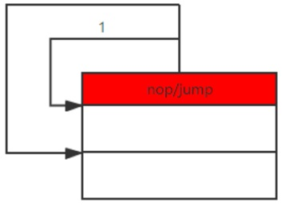

## 跳转标号修改

在所有的计算机程序中，跳转是必不可少的操作指令。然而，完成跳转操作通常需要多个机器周期。如果频繁使用跳转指令，尤其是使用条件跳转指令，势必影响程序的运行速度。在许多情况下，发生跳转和按顺序执行的概率差别很大。一些情况下，程序发生跳转的几率远大于顺序执行的几率，而另一些情况下顺序执行的几率远大于发生跳转的几率。跳转所需的周期大于顺序执行所需的周期。许多情况下，程序设计人员可以预先确定那一侧发生的概率较大。通过适当的设计，把运行几率较低的代码安排在发生跳转的一侧，而把运行几率高的代码安排在顺序执行的一侧。这样可以提高程序的运行速度，改善程序性能。GCC提供了likely(x)和unlikely(x)宏定义。当x等于0时，likely()和unlikely()都返回0，而当x不等于0时，likely()和unlikely()均返回1，二者的不同之处是likely()预期x的值不等于0，而unlikely()预期x的值等于0。likely(x)和unlikely(x)的定义分别为：

```
#define likely(x) __builtin_expect(!!(x), 1)

#define unlikely(x) __builtin_expect(!!(x), 0)
```

\_\_builtin_expect(x,y)为GCC编译器的内建函数，仍然返回值x，只是告诉编译器，x的值预期为y。

程序设计人员可以通过likely()和unlikely()告诉编译程序哪些代码执行的概率比较大，哪些代码执行的概率比较小。这样编译器就可以把执行概率大的代码(likely
code)放在顺序执行的一侧（快速路径），而把执行概率小的代码(unlikely
code)放在跳转的一侧（慢速路径）。使用方法为：

```
if (likely(x)) { //程序运行与if (x) 没有区别

    likely code //这些代码放在顺序执行一边

} else {

    unlikely code //这些代码放在跳转一边

}
```

或者

```
if (unlikely(x)) {

    unlikely code //这些代码放在跳转一边

}

else {

    likely code //这些代码放在顺序执行一边

}
```

如果在编译likely(x)和unlikely(x)之前，编译器可以确定x的值，这时条件跳转语句就变成了无条件跳转语句，编译器可以只生成要执行部分的代码。程序员可以自由选择使用likely或unlikely函数，二者的最终优化结果相同。这里需要指出的是，likely()和unlikely()不会对程序的逻辑关系产生影响，其唯一的目的就是帮助编译器优化程序。

另外一种情况是在编译阶段就可以确定是否需要跳转，比如是否需要打印调试信息。显然，编写两个版本分别支持打印和不打印调试信息不是一个明智的选择。程序需要同时支持打印和不打印两种选择。另外一个例子是网络功能，系统支持网络功能时运行一些代码，而不支持网络功能时则运行另外的一些代码。这时如果采用条件跳转，程序需要花费大量的周期进行判别。为此，Linux引入了通过静态关键字修补跳转标号的技术。

跳转标号修补技术的基本思路是在有可能需要跳转的地方放置一条NOP指令，其后为运行概率较大的代码。如果需要在某个地方跳转，引导程序把该NOP指令修改为实际跳转指令（如图
12‑1所示）。要修改的NOP的指令地址及跳转地址存储在某个跳转入口（jump_entry）结构体中。这类结构体放在内存的_start_jump_table和_stop_jump_table之间。\_start_jump_table和_stop_jump_table的位置以及各个跳转入口结构体由编译器依据程序生成。

<center>
<figure>


<figcaption><p>图 12‑1 跳转标号修改</p></figcaption>
</figure>
</center>

