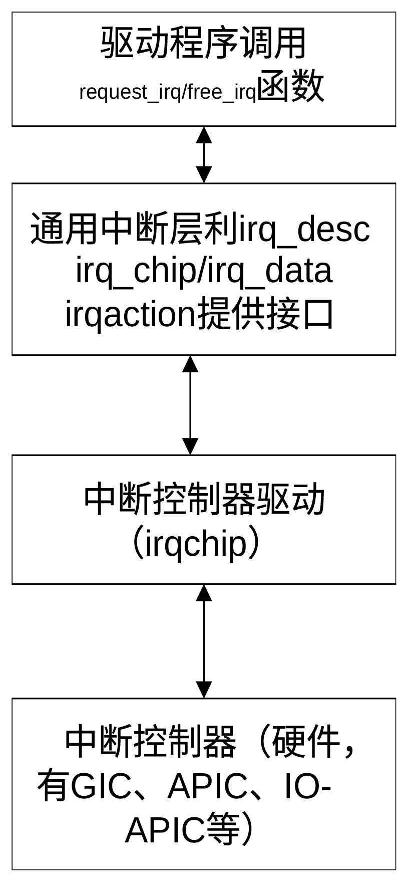
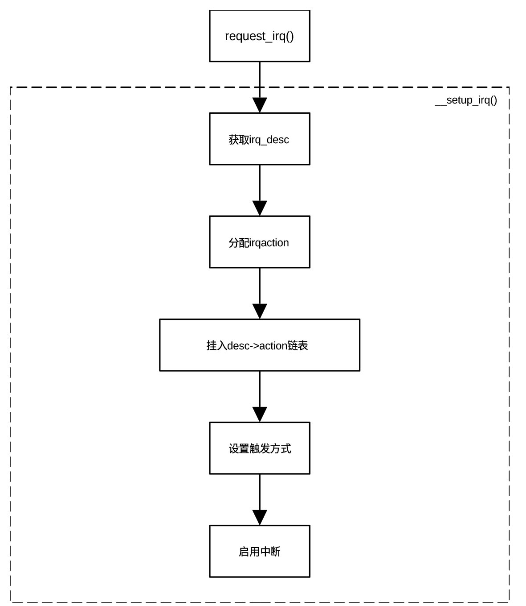

## 通用中断子系统

通用中断子系统（Generic IRQ Chip Framework）是 Linux
内核中一个非常核心的抽象层，旨在将底层中断控制器的硬件细节与上层的设备驱动程序隔离开来。
它是内核中用于统一管理各种硬件中断的核心框架，抽象了不同架构、不同中断控制器之间的差异，使得驱动开发者无需关心底层硬件细节。它的存在解决一个痛点，即不同
CPU 架构（如
x86、ARM、RISC-V）的中断控制器硬件差异巨大，如果每个驱动程序都要针对硬件写死中断逻辑，代码将无法维护。通过通用中断子系统，Linux内核提供了一套与硬件无关的接口。

通用中断子系统将中断处理分为如下三个抽象层：

``` text
层级        职责                              关键组件/函数

通用逻辑层  维护中断状态，提供统一接口给驱动     request_irq, disable_irq

流控层      处理不同电平触发方式                handle_edge_irq,
                                              handle_level_irq

硬件驱动层  直接操作硬件寄存器                  struct irq_chip
```

通用逻辑层（即高层驱动接口层）为驱动程序提供如
request_irq、free_irq、enable_irq() 和
disable_irq等的统一接口。驱动开发人员无需关心底层是哪种中断控制器。

流控层（即高层中断流处理层）处理不同类型中断的通用逻辑（如电平触发、边沿触发）。常用的处理函数包括
handle_level_irq、handle_edge_irq 和 handle_fasteoi_irq。

芯片级硬件封装层 （即底层）直接与硬件交互。通过 struct irq_chip
结构体封装底层的屏蔽（mask）、确认（ack）、使能（unmask）等硬件操作。

设备驱动、通用中断子系统、中断控制器驱动、中断控制器硬件之间的层级关系可用图
20‑1表示。

<center>
<figure>

<figcaption><p>图 20‑1
设备驱动程序与通用中断子系统各个模块间的关系</p></figcaption>
</figure>
</center>

其中设备驱动程序在初始化阶段（通常在xx_probe函数）调用request_irq，结束运行时调用free_irq释放所占用资源。中断控制器驱动程序需要注册中断服务子程序，负责执行具体操作。通用中断子系统由Linux内核提供。

设备驱动程序调用request_irq注册中断的方式为request_irq(irq, handler,
irq_type, name, dev)。函数的五个参数可以看作是向 Linux
内核提交的一份“中断服务申请表”。各个参数的意义为：

- irq

> 这是硬件中断号，通常是从设备树或平台数据中解析出来的，不能随便乱填。

- handler

> 中断处理函数指针，一旦硬件触发信号，内核就会立刻跳到这个函数里执行。

- irq_type

> 中断标志位。标明触发方式是电平触发还是边沿触发

- name

> 中断名称的字符串。在终端输入 cat /proc/interrupts
> 时，看到的那一排名字就是它。

- dev

> 传递给处理函数的私有数据指针（Cookie）。处理函数通常需要知道设备的寄存器地址、状态等，把设备结构体指针传进去，处理函数就能直接用。设备驱动程序员只需要掌握这个函数的使用方法就可以利用中断控制器。

也可以通过devm_request_irq()注册，其中device是指向产生中断的设备的device结构体，其余参数与request_irq()函数的参数相同。

request_irq的内部流程为：

<center>
<figure>

<figcaption><p>图 20‑2 中断内部流程</p></figcaption>
</figure>
</center>

当中断发生时，系统处理中断通常分为以下阶段：

- CPU进行硬件响应，暂停当前任务，进入架构相关的异常处理入口

- 调用通用子系统的desc-\>handle_irq()，执行流处理逻辑（如 ACK
  硬件、处理屏蔽等）

- 执行驱动注册的中断服务子程序进行具体处理

- 通过 request_threaded_irq()
  将耗时的处理逻辑推迟到内核线程中运行，以降低关中断时间，提高系统的实时性

系统处理流程可细化为：

- CPU进入异常向量，由架构相关代码接管

- 进入通用中断入口，调用handle_irq_desc(desc)

- 调用存储在中断描述符的高层中断事件处理函数（desc-\>handle_irq）

generic_handle_irq(unsigned int irq)-\> generic_handle_irq_desc(desc)-\>
desc-\>handle_irq(desc)

我们以 i.MX6Solo（ARM Cortex-A9 + GICv2）为例，完整梳理一条从硬件中断到
irq-gic.c
再回到通用中断处理的调用路径。当一个外设产生中断时，调用流程是：

- 外设产生中断

- GIC 硬件向CPU产生中断信号

- CPU 产生异常中断向量

- 执行中断向量irq_handler处理（入口位于git/arch/arm/kernel/entry-armv.S文件）并跳转到gic_handle_irq(位于git/arch/arm/kernel/irq-gic-v3.c文件内)

- gic_handle_irq()调用handle_domain_irq()，将硬件中断号转换为Linux使用的逻辑中断号

- 执行generic_handle_irq()，通过irq_to_desc()获取该中断对应的irq_dest结构体，如果必要，通过函数irq_desc_get_irq_data()获取中断控制器的私有数据

- generic_handle_irq()调用generic_handle_irq_desc()

- generic_handle_irq_desc(desc)执行对应中断的irq_desc结构体的handle_irq指向的函数。

> handle_irq指向流控层的中断处理程序，有handle_level_irq()、handle_edge_irq()和handle_fasteoi_irq()等七个处理函数供选择，分别用于电平触发、边沿触发等各种类型的中断。generic_handle_irq_desc是流控层和硬件架构层的分水岭。

- handle_irq_event()，真正调用驱动注册的中断处理函数（action-\>handler）

> 它是中断流控层 与 驱动层
> 的分界点。函数定义在git/kernel/irq/handle.c文件。

- 执行驱动注册的 handler()。

Linux
通用中断子系统本质上是一个将“硬件中断控制器”与“驱动处理函数”解耦的抽象层，通过
irq_desc + irq_chip + irq_domain
实现跨架构、可扩展、可共享、支持SMP的统一中断管理框架。

