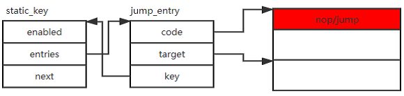

## 通过标号修改优化程序性能的基本原理

标号修改技术主要利用跳转入口及静态关键字static_key两个数据结构进行代码修补。这两个数据结构体定义在include/linux/jump_label.h文件里，分别为：

```
struct jump_entry {

    jump_label_t code;

    jump_label_t target;

    jump_label_t key;

};

struct static_key {

    atomic_t enabled;

    union {

        unsigned long type;

        struct jump_entry *entries;

        struct static_key_mod *next;

    };

};
```
其中jump_entry
的code字段存储需要修改的指令地址，target字段存储跳转指令的目标地址，key的最低两位清零后，为该跳转项对应的静态关键字结构体的地址。key的最低位b0为跳转位（branch），0表示跳转概率小(Linux的术语为unlikely)，1表示跳转概率大(Linux的术语为likely)。Static_key结构体包含两个字段。一个字段为enabled，另一个字段为unsigned
long类型，由三个字段公用。其中type位占用最低位b0，0表示该关键字初始化为false，1表示该关键字初始化为true。第二位b1用于区分该项存储的是jump_entry地址还是static_key_mod地址，0表示该项为jump_entry的地址，1表示该项为static_key_mod的地址。Type位用于编译时生成代码，enabled用于动态地切换跳转指令的跳转方向。

Jump_entry、static_key的各个域及程序代码间的关系示于图 12‑2。

<center>
<figure>


<figcaption> <p> 图 12‑2 static_key、jump_entry及程序代码 </p> </figcaption>
</figure>
</center>
 
在编译阶段，编译器依据下表，利用type位和branch位异或生成指令。

<center>
表 12-1 由type 和branch确定补丁指令
</center>

| type\branch | likely | unlikely |
|:-----------:|:------:|:--------:|
|    true     |  NOP   |   jump   |
|    false    |  jump  |   NOP    |


如果type与branch异或等于0，则生成NOP指令，如果type与branch异或等于1，则生成无条件跳转指令。

在编译阶段，利用type位和branch位只能生成NOP和无条件跳转指令，程序的执行顺序不会改变，也就是说，只会执行likely或unlikely之中的一个部分。如果需要动态地切换跳转方向，就需要利用enable域的值，在程序运行时打补丁。在进行程序修补时，利用静态关键字中的enabled字段和branch位的异或，依据表12-2确定补丁指令类型，进而生成合适的补丁指令。如果补丁指令类型为NOP，把静态关键字code域指向的内存指令修改为NOP指令，如果补丁指令类型为跳转指令，通过静态关键字的code字段(通常作为pc寄存器的值)和target字段的值，生成跳转指令，把生成的跳转指令写入code指向的内存，从而达到修补指令的目的。这样的修补工作通常在引导阶段进行。

<center>
表 12-2 由enabled和branch确定补丁指令
</center>

| enabled\branch | true(likely) | false(unlikely) |
|:--------------:|:------------:|:---------------:|
|      true      |     NOP      |      jump       |
|     false      |     jump     |       NOP       |


