## 页面交换与虚拟内存映射

Linux系统每个进程都有自己独有的虚拟内存空间，每个空间可用的虚拟内存空间不受物理内存大小的约束。当进程需要的内存空间超出物理内存空间大小时，操作系统会把物理内存中部分目前不使用的内容写入到外部存储器，这部分用于临时保存物理内存内容的外部存储空间称作交换分区。为了方便文件交换，Linux在虚拟内存空间保留一些缓存区，供磁盘文件交换使用。

由于Linux支持多进程运行，系统读入的文件或库函数可能会被多个进程使用。如果每次使用时都要从硬盘读取这些文件或库函数，势必会大大降低程序运行速度。因此，Linux还开辟一些用于保存共享数据的缓存区。

程序在运行过程中会大量使用临时数据。由于计算机硬件结构的特点，如果把这些数据放在一起，不仅可以提高内存利用率，便于内存管理，同时可以通过立即数寻址或直接寻址方式、而非间接方式寻址访问数据，从而减少地址运算量，提高程序运行速度。这就产生了所谓堆和栈的概念。每个进程都有独立的堆和栈，即用于保存临时数据的缓存区。

虽然用于磁盘文件交换的缓存区与进程堆栈有一些不同，但这两类缓存区有一个共同的特点，即无法通过虚拟地址直接访问内存，因此对这些缓存区的管理有许多共同之处。Linux采用同样的方法管理这两类缓存区，只是在映射方法上有所区别。

为了便于缓存区管理，Linux把虚拟内存划分为两种类型。一种用于存储程序使用的数据，这类虚拟内存区域称之为匿名内存（Anonymous
memory）。堆与栈均属于匿名内存。另一种内存用于与硬盘进行数据交换，这类内存称为文件备份内存（file
backed
memory）。备份内存用于存储读写磁盘文件、交换分区文件、库函数及程序本身。图
15‑11显示各种文件与虚拟地址的映射关系。

<figure>
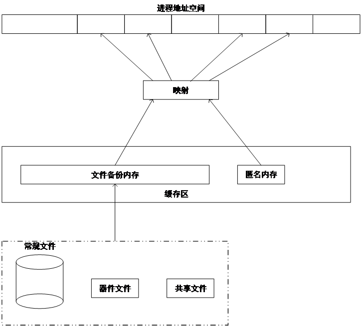
<figcaption>
 图 15‑11各种类型文件与虚拟内存的映射
</figcaption>
</figure>

Linux通过物理页面描述符page的mapping字段中的最低位区分匿名内存和文件备份内存。当最低位（PAGE_MAPPING_ANON位）置位时，表示当前页为匿名内存，此时，mapping指向一个名为anon_vma的结构体（见15.4.2）。当最低位为0时，代表当前页为文件备份内存，此时mapping指向地址空间结构体（struct
address_space）。

### 内存导出及页面释放

使用文件备份内存时，由于物理内存空间大小的限制，进程需要经常与磁盘文件（普通文件和交换分区文件）进行数据交换。高效的文件交换机制能够降低磁盘读写次数，改善程序运行效率。Linux通过维护三类共五个长度固定的lru（least-recent-usage
）链表进行页面交换。这五个lru链表分别为anon_active、anon_inactive、file_active、file_inactive及unevictable。其中anon_active和anon_inactive用于管理匿名内存的页面交换，file_active和file_inactive用于文件内存的交换，而unevictable保存了不能够导出到硬盘的页面，如当Linux采用ramfs文件系统时，该文件在整个系统运行期间就必须一直常驻内存。

当进程读取内存时，如果所读页面在活跃链表，系统会把该页提升到活跃链表的首端，并把其前面的页面依次向后移动一个位置。如果页面位于非活跃链表，系统页会把该页提升到活跃链表的首端，并把非活跃链表中位于该页前面的各个内存页相应地向后移动一个位置。如果发生读错误，表示所需内容不在内存，此时操作系统页面出错处理程序会把位于非活跃链表（xx_inactive）尾端的页面释放（见第15.6节），并从硬盘读取正确的页面。在首次读取页面时，会把新读取的页面保留在非活跃链表首端，而把非活跃链表中其余各页依次向后移动一个位置。为了简单明了，这里简化了lru的管理过程。在实际操作中，还会考虑其它因素，比如在把页面从非活跃链表提升到活跃链表时会考虑同一页面发生两次访问间距离等因素，以避免不断重复释放与读取同一页面。在进行页面回收时也会对这些链表进行操作。图
15‑12为几种常见的lru链表变化情况。

<figure>
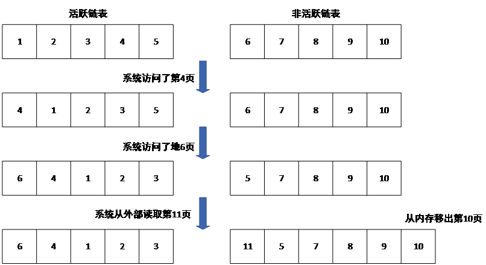
<figcaption>
 图 15‑12 访问页面时lru链表的变化
</figcaption>
</figure>

大部分lru链表及内存导出操作定义在文件git/mm/swap.c
里。链表的转换或移动由函数mark_page_accessed()完成。希望了解更多细节的读者可以参考该文件的内容。

### 虚拟地址与缓存区地址的映射

匿名内存和文件备份内存均存在于专用缓冲区。程序无法通过虚拟地址直接访问这类缓存区，需要通过映射把虚拟地址或文件位置映射到缓存区，从而能够从缓存区获取正确的数据。为了实现文件与匿名内存到缓存区的映射，Linux定义了四个结构体。它们的主要用途是管理进程的虚拟内存区间，并在线核发生页面置换或写时复制时，能够通过物理页面快速反向查找到所有引用它的虚拟内存区间。

这些结构体主要包括：

- mm_struct结构体（简称之为mm结构体）

> 地址空间描述符。每个进程只包含一个，主要包括指向该进程使用的缓存区、vma红黑树根节点、地址空间大小、总虚拟地址页数、进程使用的堆、栈、数据段、代码段、变量段、一个指向
> VMA
> 链表的指针、环境变量段及各种计数和水印等字段。vma红黑树由所有使用该mm_struct的vma结构体组成。

- vm_area_struct结构体（简称之为vma结构体）

> 虚拟区域描述符，用于描述进程使用的一段地址连续的虚拟内存空间。主要包含用于串接该进程所有缓存区的vm_next和vm_prev指针、虚拟地址开始地址、虚拟地址结束地址、用于挂接到mm_struct上vma红黑树的节点vm_rb、指向该缓存区隶属的mm_struct的指针、用于挂接到文件的
> address_space-\>i_mmap
> 区间树的rb节点、指向与该缓存区关联的anon_vma结构体的指针、用于由关联该vma与anon_vma结构体的所有avc组成的链表表头anon_vma_chain、用于指向该缓存区对应文件的vm_file指针（匿名内存时为空指针）等。

- anon_vma结构体（简称之为av结构体）

> 通过虚拟地址，利用页表，可以方便地找到页面对应的物理地址。由于页表是单向映射，通过物理地址找到页面对应的虚拟地址，即逆向映射，就非常困难。逆向映射的一个应用场景是在进行内存导出时，需通过逆向映射，找到物理页面对应的虚拟地址，修改虚拟地址在页表中对应的内容，使其指向页面在交换分区的位置。
>
> av结构体的作用是方便逆向查询。该结构体拥有6个字段，其中的root字段指向当前anom_vma树的根节点，parent指向派生(fork)当前进程的父进程对应的av。在进程派生多代以后，由于父/子进程的内存共享，子进程、孙子进程会形成复杂的内存独占/共享关系。为了方便关联，Linux通过树的形式组织这些进程的anon_vma结构体，所有的子孙
> anon_vma 都会通过 root 指针指向最初祖先的 anon_vma。
>
> degree字段表示子av个数，当degree\<2时，该结构体可以作为下一级子进程拥有的av结构体。
>
> rb_root字段是由avc结构体组成的红黑区间二叉树的根节点，本区间树链接了所有与当前av有关的vma。这棵树上挂载了所有与之相关的、映射了这片匿名内存区域的
> vma（具体是通过vma中的avc桥梁连接挂载的）。这棵树上挂接的是所有正在共享这片匿名物理内存的、来自不同进程（或线程）的vma。具体来说，它不仅包含当前进程的vma，还包含由它
> fork
> 出来的子进程、孙子进程等所有后代进程的vma，前提是这些后代进程还在和它共享这段内存。如果子进程发生了写时复制
> ，linux会把该子进程新分配的内存所对应的anon_vma挂接到自己的红黑区间二叉树上，开始管理自己的匿名内存页。

- anon_vma_chain结构体（简称之为avc结构体）

> avc的主要作用是通过把vma字段和anon_vma字段分别指向相关联的vma和av结构体，实现av和vma的关联。此外，该结构体还是以vma的anon_vma_chain字段为链表头的链表节点same_vma，以及以av的rb_root字段为根节点的红黑区间二叉树的节点rb。
>
> avc链表由avc的same_vma字段串接，表头为对应的vma结构体的anon_vma_chain字段，包含了所有与链表头所在的vma结构体关联的av结构体。红黑区间二叉树由字段rb串接，包含了所有与由anon_vma指定的结构体关联的vma结构体。
>
> 在 Linux 内存管理的逆向映射机制中，av和
> avc共同解决了如何通过一个匿名的物理页，找到所有映射了它的虚拟内存区域这一核心问题。av内部的红黑树记录了所有可能映射了相同物理页的
> vma。

图15‑13给出了由各种结构体的字段构成的结构体关系图，以便读者更直观地了解各种结构体的作用。

<figure>
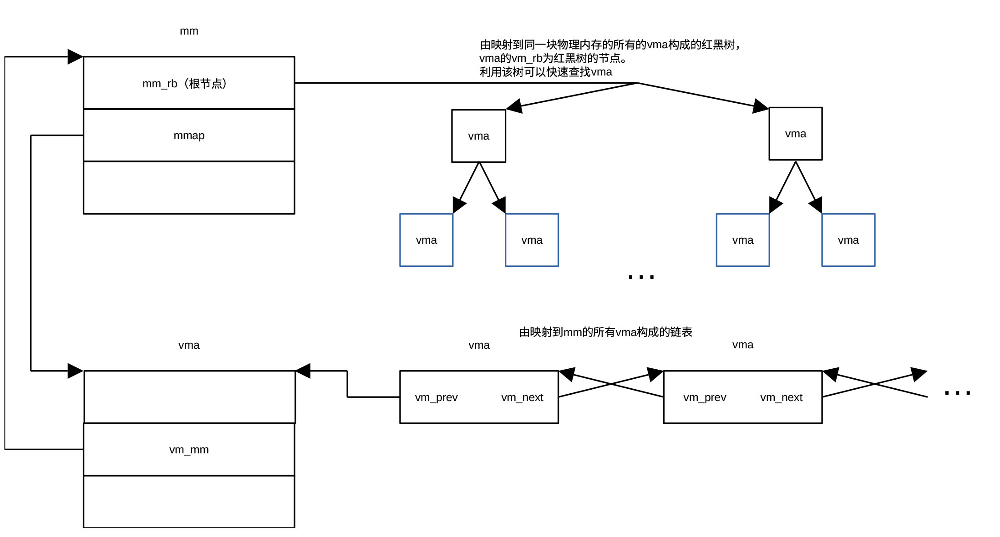
<figcaption>
 图 15‑13 mm结构体与vma结构体及由vma结构体构成的链表间的关系
</figcaption>
</figure>

由图15‑13可见，由mm结构体可以直接获得进程的第一个vma结构体。通过vma结构体可以获得进程占用的地址空间的许多参数。通过mm_struct结构体，还可以访问由所有vma组成的红黑二叉树，从而快速获取感兴趣的vma结构体。

<figure>
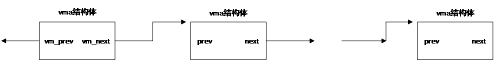
<figcaption>
图 15‑14 由进程的所有vma构成的链表
</figcaption>
</figure>

图15‑14所示为由进程的所有vma组成的链表，通过vma构成的链表，可以遍历进程的所有vma结构体。缺点是查询时间较长，适合需要遍历所有vma的场景。

<figure>
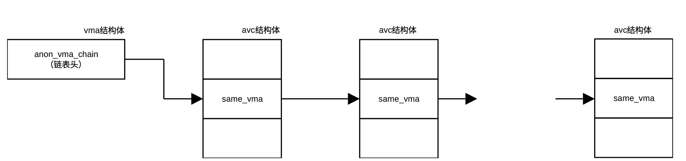
<figcaption>
 图 15‑15 由avc组成的对应同一vma的链表
</figcaption>
</figure>

当系统产生一个进程时，会生成一个avc结构体，并把该结构体与进程的vma结构体关联。当该进程派生一个子进程时，调用函数dup_mmap()克隆vma结构体（可参考文件git/kernel/fork.c文件中的kernel_clone()、fork_idle()、copy_process()、copy_mm()、dup_mm()、dup_mmap()）。在克隆父进程的vma结构体后，把父进程的页表项拷贝到子进程。也就是说，子进程不会占用新的物理内存。只有当子进程产生了新的数据需要写入vma对应的内存时才会为子进程分配新的内存。

在克隆了vma后，通过函数anon_vma_fork()调用anon_vma_clone()，遍历父进程的avc链表（表头为anon_vma_chain）。每遍历一个avc，子进程创建一个avc，并把把父进程相应的anon_vma结构体及通过克隆得到的子进程的vma赋予avc，然后把新的avc添加到以克隆的vma的anon_vma_chain为表头的链表及以av的rb_root为根节点的红黑区间二叉树当中，从而把父进程的anon_vma链克隆到子进程。这样做的目的就是为子进程的新
vma 建立 anon_vma 关系，使父子进程能够共享匿名页并支持 COW（Copy On
Write）与 rmap逆向映射。

图15‑15为以vma结构体中anon_vma_chain字段为表头的、由关联同一个vma结构体的所有avc结构体构成的链表。该链表通过same_vma串接在一起。图
15‑16为由av结构体的rb_root字段为根节点、由与根节点av关联的所有avc组成的红黑区间二叉树，该二叉树通过进程派生形成，树上的avc包含了所有与根节点关联的vma。图
15‑17为发生COW之前子进程的avc链表。

<figure>
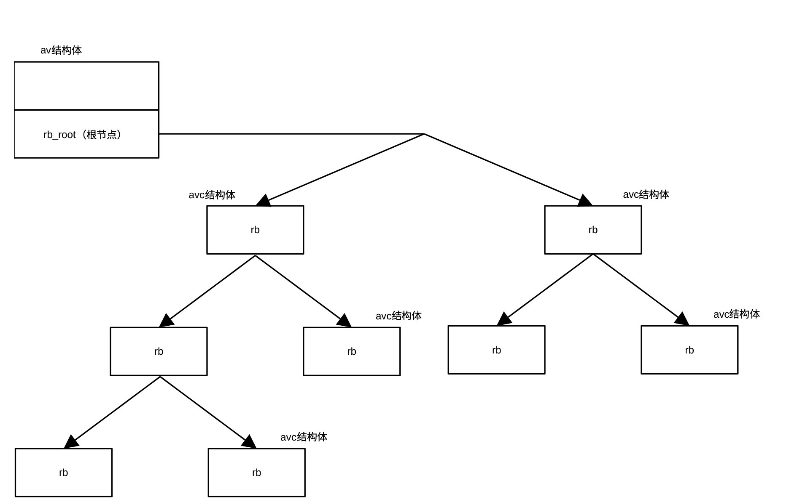
<figcaption>
 图 15‑16以av的rb_root为根节点的红黑区间二叉树
</figcaption>
</figure>

<figure>
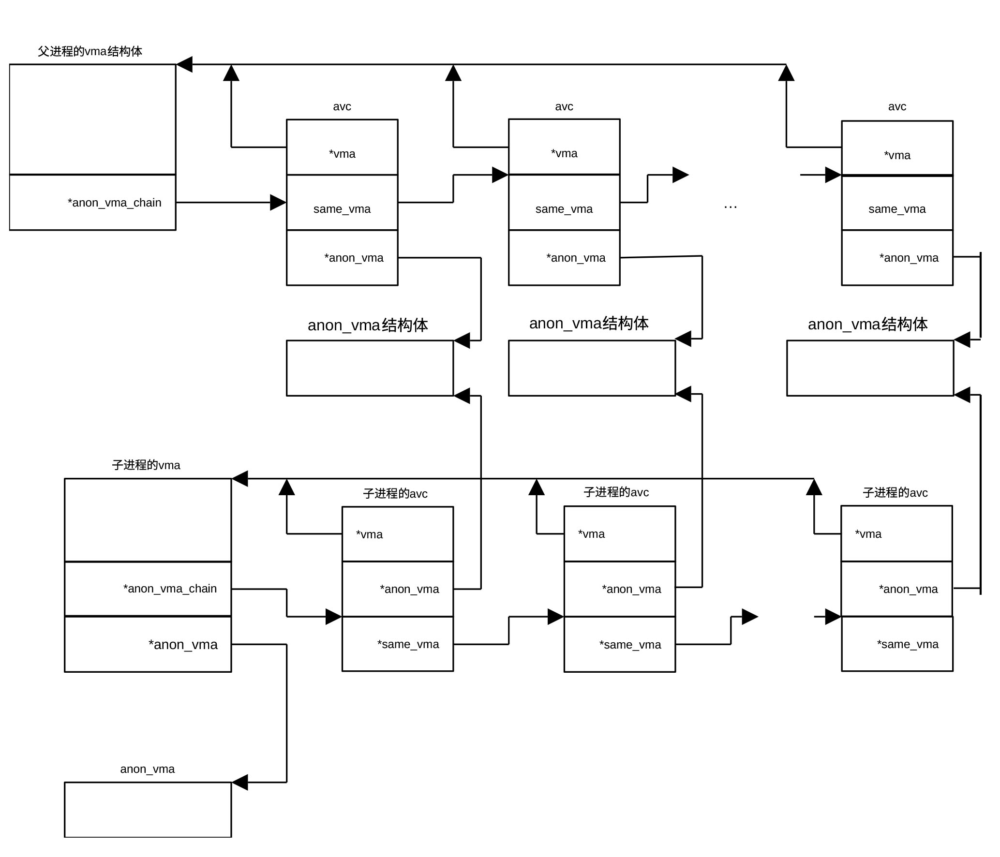
<figcaption>
图 15‑17派生子进程（还没有COW时）对anon_vma的管理
</figcaption>
</figure>

vma、avc和av的关系可形象地用图 15‑18表示，avc类似于开关阵列中的开关，用以实现vma和av的多对多关联。

<figure>
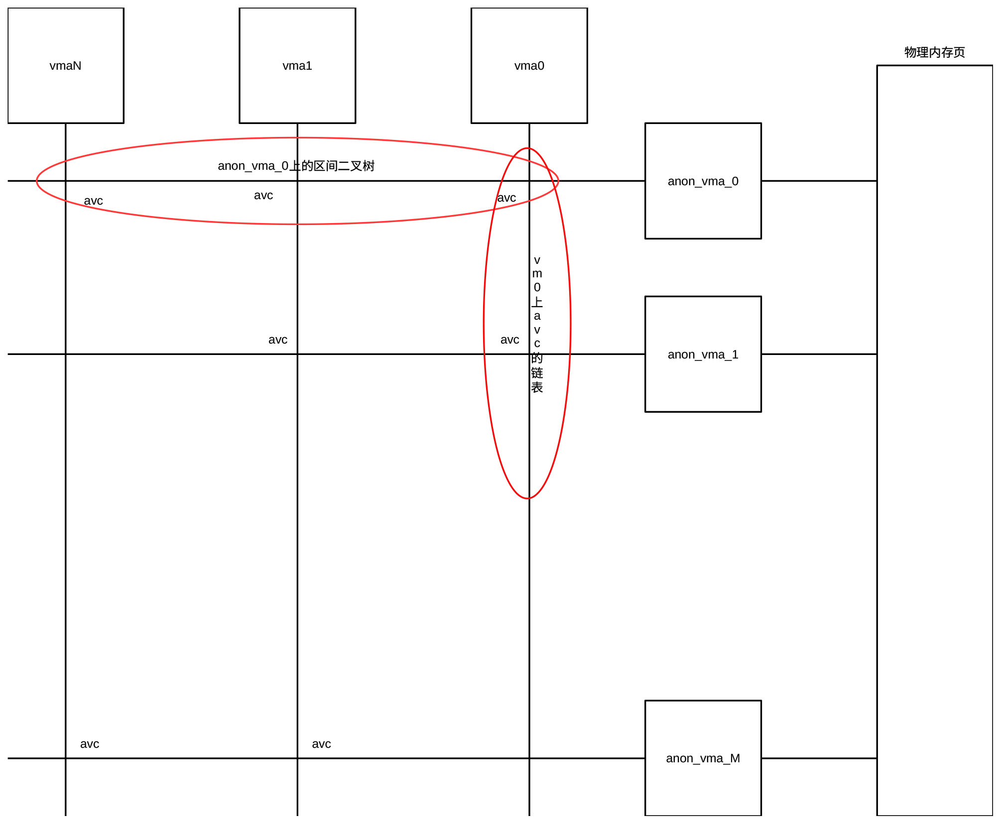
<figcaption>
图 15‑18 vma、av及avc的关系
</figcaption>
</figure>

查找映射到同一物理页的虚拟内存空间的函数主要封装在page_referenced_anon() 等逆映射核心函数中。其标准实现逻辑为：

- 通过物理页（page-\>mapping）获取对应的 anon_vma

> 每个匿名物理页的 page-\>mapping
> 指针并没有直接指向文件，而是指向了管理它的 anon_vma 结构体。

- 遍历 anon_vma 中红黑树的每一个avc

- 由avc获取一个映射到该物理页的vma。

通过遍历anon_vma中红黑树上的所有的avc，可以获取映射到同一物理页的所有虚拟内存空间。

除了用于内存映射外，在进行相同内容页面合并（kernel same-page
merging—KSM）时，以av的rb_root为根节点的红黑区间二叉树还用于扫描可以合并使用的、具有相同内容的页面。

### 匿名内存到缓存区的映射

匿名内存到缓存区的映射就是把指定内存设为缓存区，在进行参数的合规性检测后，主要任务就是初始化vma各个字段的值，使vma对应要映射的内存区域，并满足要求的属性。图15‑19所示为把指定内存设置为缓存区的流程图。

<figure>
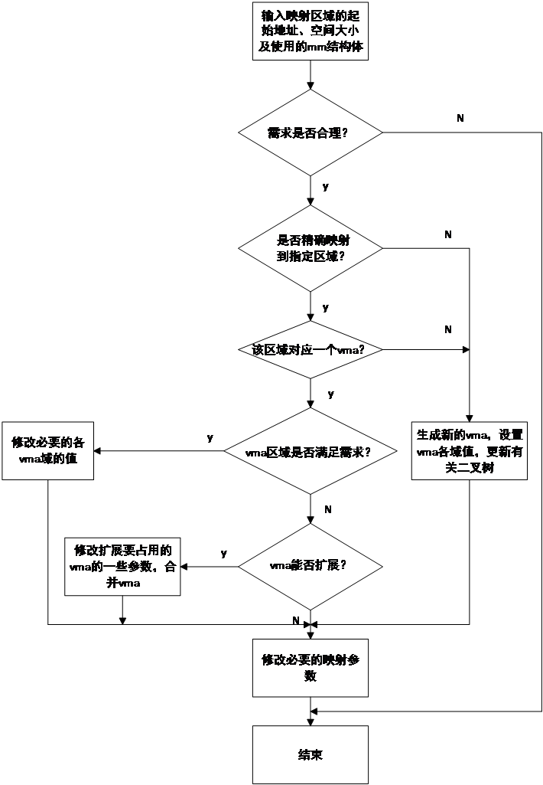
<figcaption>
 图 15‑19匿名内存映射过程
</figcaption>
</figure>

在映射过程中，可能会涉及到查找现有vma的过程，以确定指定区域的起始地址是否位于某个vma对应的虚拟内存空间。查找过程遍历进程使用的mm结构体的红黑二叉树（根由vm_rb字段指定）。用所指定区域的起始虚拟地址address与遍历到的每个vma中vm_start及vm_end进行比较。若vma-\>vm_start \<= address \< vma-\>vm_end，则说明vma对应的虚拟内存空间覆盖该起始地址。查找过程涉及到的各种结构体的关系示于图15‑20。

<figure>
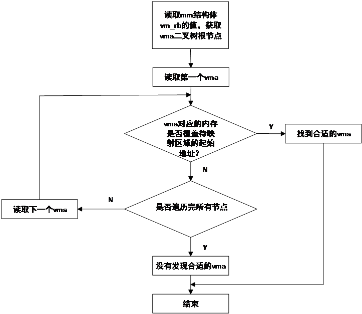
<figcaption>
 图 15‑20利用虚拟地址查找对应的vma
</figcaption>
</figure>

### 文件备份内存到缓存区的映射

文件备份内存用于把硬盘文件备份到内存指定区域。由于磁盘文件不像匿名内存那样本身就位于虚拟内存空间，需要把硬盘文件与虚拟内存通过一定的方式关联起来。起该作用的是叫做地址空间的结构体（struct
address_space），定义在git/include/linux/fs.h文件里。地址空间结构体与内核空间文件描述符（struct
file）及节点索引结构体（struct
inode）一起完成磁盘文件到虚拟内存空间的映射。

地址空间结构体用于定义可缓存及映射的对象。该结构体包括拥有该结构体的对象（inode或块式存储器）及缓存的页数等多个字段等，还包含了写页面、读页面、设置脏页标识、页面隔离及页面迁移等多达22个操作函数。其中用于确定映射关系的为i_mmap字段，该字段为指向缓存在缓存区的、由vma组成的红黑二叉树。二叉树上的vma节点通过vma结构体的二叉树节点shard.rb串接在一起。在进行备份文件映射时，通过调用函数_vma_link_file()把vma节点插入该二叉树，使文件与vma关联起来。利用该二叉树可以查询文件对应的vma并确定文件在备份内存的映射地址。图
15‑21所示为缓存的红黑区间二叉树。

地址空间结构体中另一个比较重要的字段是i_pages，该字段为一个可扩充数组（xArray），它包含了所有缓存的物理页描述符（5.15及之前的版本，新版xArray保存的是struct
folio类数据指针）。利用可扩充数组功能模块提供的各种函数，通过物理页面描述符中的index字段的值，可以直接对缓存的页面描述符进行读、写、标识位更新等操作。

<figure>
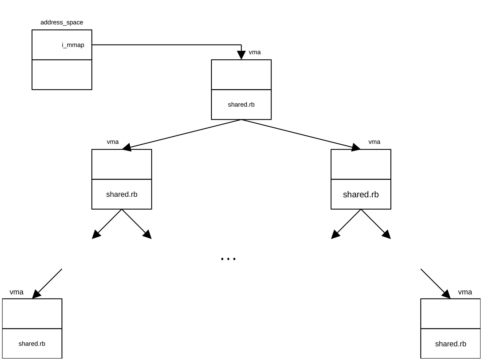
<figcaption>
 图 15‑21缓存的红黑区间二叉树
</figcaption>
</figure>

内核空间文件描述符用于描述系统已打开的文件，供用户通过fopen()等函数打开、读写和关闭文件等操作。该结构体包括的字段有文件路径结构体f_path、指向inode结构体的指针f_inode、指向地址空间结构体的指针f_mapping、通过f_op指定的文件打开（open）、关闭（close）、读（read）、写（write）、位置查询（llseek）、映射（mmap）、获取未映射区域（get_unmapped_area）等操作函数（也称作方法，有相应的c函数或系统调用）。用于缓存区映射的为f_mapping、f_inode、mmap()函数及get_unmapped_area()函数，其中mmap()函数负责把文件映射到vma，get_unmapped_area()函数用于获取没有映射的内存区域起始地址。

节点索引结构体存储文件的元数据，是Linux文件信息的主要载体。它记录了文件模式、用户身份标识（uid）、组标识（gid）、文件大小、文件类型、文件修改时间、文件最后访问时间、几个指向磁盘区块的指针以及管理用数据等大量信息，还提供了操作文件及节点索引结构体的方法。文件内容本身没有保存在inode。操作文件的方法利用文件描述符提供的方法，而操作节点索引结构体的方法主要有缓存区目录表查询、link()、unlink()、mknode()、rmnode()、mkdir()、rmdir()、setattr()等多种函数。节点索引结构体用于内存映射的字段为i_mapping，该字段为指向地址空间结构体的指针。各个结构体及红黑区间二叉树之间的关系示于图
15‑22。

<figure>
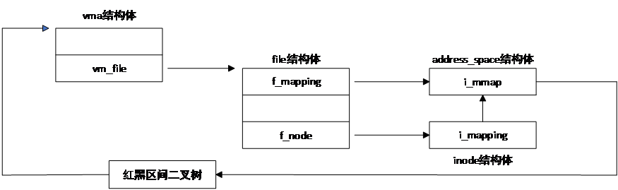
<figcaption>
 图 15‑22文件备份内存及磁盘文件映射关系
</figcaption>
</figure>

### 物理地址到虚拟内存地址的逆向映射

由于进程派生及内存共享，同一个物理页面可能被映射到不同的虚拟地址，图
15‑23为进程派生过程形成的同一页内存映射到3页不同虚拟内存的情况。派生进程时，派生的子进程的通过其VMA
的 anon_vma_chain 同时连接了父进程的
anon_vma（用于反向映射共享的旧页面）以及子进程在 fork 时新创建的专属
anon_vma（用于未来存储独占的新页面）。

<figure>
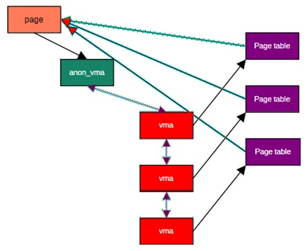
<figcaption>
 图15‑23物理内存页面与虚拟地址间的映射
</figcaption>
</figure>

通过前面的内容我们知道，利用虚拟地址，通过页表表项（pte），可以得到虚拟地址对应的物理内存页面号（pfn）及对应该物理页面的页面描述符。内存的逆向映射是指从物理页面描述符反向映射回虚拟地址。页表是单向映射表，即使一个物理页只映射到一个虚拟内存页，也无法通过物理页面描述符直接得到映射到该物理内存页的虚拟地址或对应该物理页面的页表项，况且一页物理内存可能映射到多页虚拟内存。这样的逆向映射在把内存的内容交换到交换分区或释放页面时一定会用到。

在版本2.4之前，Linx遍历每个进程的所有页表，从而找到所有映射到指定物理内存的页表，这项工作非常费时。为了解决逆向映射问题，Rik
Van
Riel首先提出逆向映射的概念，并提出通过增加数据结构实现逆向映射的方法。但Rik的方法并不理想，成本过高。为此，Dave
mcCracken提出了基于对象的逆映射。这种方法只适应于文件备份内存的逆向映射，mmap系统调用即采用这种方法。当映射为文件备份内存映射时，Dave通过把页面描述符（struct
page）的mapping指向地址空间实现逆向映射。当映射为匿名内存映射时，结构体page的mapping字段为空。为了解决匿名内存的逆向映射问题，Andrea
Arcaneli通过把mapping字段指向vma实现逆向映射。但事情并没有如此简单，当出现进程派生时，一个vma可能对应多个页表，同样，由于内存共享，一个物理地址就能对应多个虚拟地址，因此不能够简单的采用把mapping字段指向vma的方法实现匿名内存的逆向映射。为了解决这一问题，Andrea定义了av结构体和avc结构体。每个进程通过avc结构体把进程自己的av和vma关联起来，通过anon_vma_chain链表同时罗列了进程继承自父进程的共享匿名页以及自身专属的匿名页。详细情况我们在介绍av及avc结构体时已作了详细介绍。

### 匿名内存到虚拟内存的逆向映射

在进行匿名内存映射是，物理页面描述符的mapping字段指向对应的av结构体。在进行逆向映射时，系统通过mapping指针找到对应的av，然后通过av的rb_root字段，找到以rb_roo为根节点的红黑二叉树。遍历该二叉树的各个avc值，就可以找到物理地址描述符page映射的所有vma，从而就可以找到物理地址映射的所有虚拟内存页。通过page结构体的index字段，可以确定虚拟地址在vma所覆盖的虚拟地址空间的偏移量。各个结构体及二叉树之间的关系示于图15‑24。

<figure>
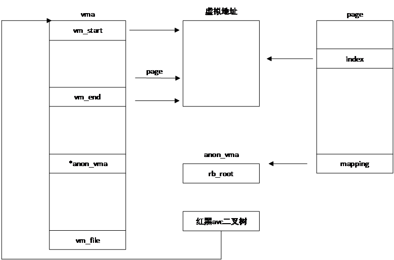
<figcaption>
 图 15‑24匿名内存逆向映射查询示意图
</figcaption>
</figure>

### 文件到内存的逆向映射

前面我们提到，Dave通过把物理地址描述符的mapping字段的值指向地址空间实现文件备份内存的逆向映射。系统利用物理页面描述符的mapping字段，找到对应的地址空间结构体，通过地址空间结构体的i_mmap指针，找到由所有vma组成的红黑区间二叉树，然后遍历二叉树上的各个vma，就可以找到物理页面映射的vma，利用vma的vm_file字段可以找到对应的文件。图
15‑25显示文件备份内存的逆向映射过程。

<figure>
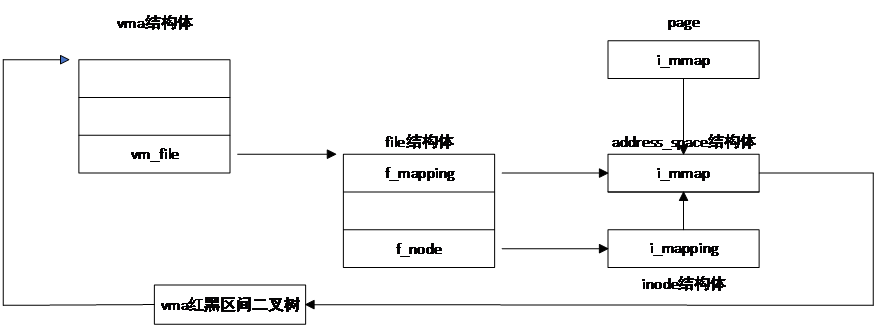
<figcaption>
图 15‑25文件备份内存的逆向映射
</figcaption>
</figure>

